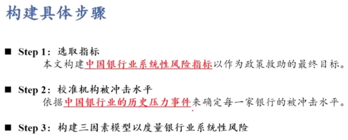

# 系统性风险模型和方法

系统性风险模型和方法划分为：

- [[传统网络模型]]；

- 风险传染的微观模型；

- [[复杂性视角]]；

- [[多层网络模型]]；

- [[博弈论]]；

- [[DSGE模型]]；

- [[存量流量一致模型]]

- [[事件分析法]]；

- 数理模型；

- [[计量实证方法]]；

- 关联性模型；

- [[压力测试]]；

  
  
  

研究方法相关的文献综述：

- [[方意_2016_宏观审慎政策有效性研究.md]]

  > 方意, 2016. 宏观审慎政策有效性研究[J]. 世界经济, 39(08): 25–49.

## [[传统网络模型]]

网络模型常常以压力测试等方法运用在资产负债表理论的建模与实证上。

- 包括：
  - [[方意_2016_系统性风险的传染渠道与度量研究——兼论宏观审慎政策实施.md]]划分为：
    - [[银行间资产负债网络模型]]；
  - [[方意_王晏如_et-al_2019_宏观审慎与货币政策双支柱框架研究——基于系统性风险视角.md]]按照空间维度划分为：
    - 网络联动关系（横向关联性）：
      - 网络模型：
        - 划分为：
          - 业务关联性；
            - 理论方面的研究：
              - [[外生网络模型]]；
              - [[内生网络模型]]；
            - 经验方面的研究：
              - [[研究网络结构]]
              - [[研究模拟测算空间维度系统性风险]]
          - [[金融市场关联性]]；

- 现状

  网络模型在中国的应用较晚

- 特点

  这类传统网络模型以银行间的直接关联为基础，在一定程度上能研究不利冲击下银行之间的风险传染过程。

- 缺点

  考虑的传染渠道过于单一，仅包含银行破产这一传染渠道。尽管银行破产传染渠道是一种重要的传染渠道，但并不是唯一的传染渠道，且在现实金融体系中并不多见。最近爆发的金融危机表明，金融体系的内部传染过程更多以金融资产降价抛售为条件，并不完全依赖于金融机构的破产。

- 考虑的外部冲击过于单一，仅能分析银行破产这一外生冲击;

  这一不足之处，在某种程度上是“致命”的。首先，在应用该模型时，关于哪一家银行破产作为冲击存在较大的主观性，为此一般均假设每家银行都有破产的可能性，并都作为一种冲击进行试验。其次，根据[[Upper_2011_Simulation methods to assess the danger of contagion in interbank markets.md]]的结论，银行危机的爆发很少以单家银行的破产作为开端，而往往来源于宏观经济等层面的不利冲击，且这些不利冲击对所有银行都会产生影响。

- 仅适合于银行破产冲击的模型并不太适合于中国。

  原因在于近些年来，中国很少有银行倒闭。与此同时，对于中国而言，房地产行业贷款违约、地方政府融资平台贷款违约等非常重要的现实冲击会对银行产生较大影响，能研究这些冲击对银行造成风险的网络模型非常具有吸引力，而这显然超出传统网络模型的能力范畴。

  - 于中国而言，重要因素并非银行倒闭，而是地方政府融资平台贷款违约的冲击
  - 改进缺点：
    - 研究这些冲击对银行造成风险的网络模型非常具有吸引力
    - 借鉴
      - [[Tressel_2010_Financial Contagion Through Bank Deleveraging - Stylized Facts and Simulations.md]]
        - 在传统网络模型中纳入去杠杆——降价抛售机制
        - 特点
          - 由于其利用了国家之间的双边传染数据，进而也不需要估测银行之间的双边敞口数据。
        - 不足
          - 但是该研究以不包含中国的国际银行体系为研究对象
          - 且并没有考虑单家银行之间的风险传染关系。
          - 研究的冲击也并不是当前对中国而言重要的现实冲击。

### [[方意_2016_系统性风险的传染渠道与度量研究——兼论宏观审慎政策实施.md]]

#### 银行间资产负债网络模型

银行间资产负债网络模型研究方向

- 包括：
  - 破产机制：
    - 包括：
      - [[银行间负债违约渠道]]；
      - [[Notes/银行间负债流动性挤兑渠道]]；
  - 去杠杆机制；
  - 结合破产机制、去杠杆机制；

##### [[破产机制]]

银行破产对银行体系的风险传染机制。

提及文献：

[@FangYi2016a]

[[方意_2016_系统性风险的传染渠道与度量研究——兼论宏观审慎政策实施.md]]

> 方意. (2016). 系统性风险的传染渠道与度量研究——兼论宏观审慎政策实施. 管理世界, _08_, 32-57,187.

##### [[银行间负债违约渠道]]

- 相关研究
  - 分析国外各国银行体系的系统性风险
    - Sheldon 和 Maurer（1998）、Furfine（ Wells（2004）、Upper 和 Worms（2004）、van Lelyveld 和 Liedorp（2004）、IMF（2009）
- 传统银行间资产负债网络考虑的传染渠道
  - 分析中国的系统性风险
    - 马君潞等（2007）、范小云等（2012）等；
      - 银行间同业拆借数据
    - 黄聪和贾彦东（2010）、 贾彦东（2011）；
      - 银行间支付结算数据
    - 宫晓琳和卞江（2010）、宫晓琳（2012）等
      - 资金流量表数据
  - 缺点
    - 上述研究往往得到的研究结论是传染损失较小，这与金融危机期间出现的银行倒闭风潮实际并不相符
      - （Upper，2011； Glasserman and Young，2015）
    - 只能研究单家金融机构破产导致的传染风险。实际上。系统性风险更多的来源于宏观经济冲击，而非单家机构破产冲击。
      - Upper，2011
    - 解决
      - Chan-Lau（2010）和 Tressel（2010）
        - 提出
          - 降价抛售成本渠道
            - 定义
              
              商业银行的风险传染不仅来源于银行资产端 （破产银行为其债务方银行），而且来源于银行负债 端。 原因在于其债权方（包括银行在内）提前抽回 债权，从而导致该银行的负债不足以支撑其资产规 模，从而商业银行必须卖出（或收回）资产。 当市场 流动性不足时，卖出资产的行为会导致资产价格损 失，此即为降价抛售成本渠道。
        - 特点
          - 引入了融资流动性风险
        - 不足
          - 降价抛售成本渠道考虑得不够完全
            - 原因
              
              根据降价抛售成本渠道可知，当市场流动性不足时，银行卖出资产会遭受损失，而无 论卖出资产源于何种原因。
              - Tressel(2010)
                - 工作
                  
                  通过引入法定杠杆率监管要求纳入了降价抛售成本渠道
                - 不足
                  
                  该研究只考虑了由于银行负债端流动性挤兑，而银行被动卖出资产遭受的降价抛售成本损失这样的传染渠道，却未能考虑在杠杆率不达标时，银行主动卖出资产遭受的降价抛售成本损失这样的传染渠道。根据 (方意, 2016) 模型的测算，银行主动卖出资产遭受的降价抛售成本损失这样的传染渠道比 被动卖出资产的降价抛售成本损失这样的传染渠道重要得多
          - 忽视银行破产会导致降价抛售成本
            
            传统网络模型和考虑融资流动性 网络模型，都忽视了银行破产也会导致降价抛售成本
          - 外生化银行破产对其债权方银行造成的损失
            
            事实上，损失完全可内生于模型。具体而言，这些研究都认为银行破产对其债权方造成的损失是债权方风险敞口与损失率的乘积，而损失率则被设置为一个外生参数。为了严谨起见，这类模型一般对损失率进行参数敏感性分析（Upper，2011）。然而，根据银行破产的条件可知，在不考虑破产成本的条件下，损失率完全可由商业银行的资产实际价值与负债名义价值计算而得（此时商业银行破产，从而权益值为0）。
            - （Upper，2011）
              - 特点
                
                损失率则被设置为一个外生参数。为了严谨起见，这类模型一般对损失率进行参数敏感性分析。

##### [[Notes/银行间负债流动性挤兑渠道]]

TODO 银行间负债流动性挤兑渠道

##### [[去杠杆机制]]

去杠杆机制指的是银行为达到杠杆率监管要求而卖出资产并导致损失的风险传染机制。

提及文献：

[[方意_2016_系统性风险的传染渠道与度量研究——兼论宏观审慎政策实施.md]]

> 方意. (2016). 系统性风险的传染渠道与度量研究——兼论宏观审慎政策实施. 管理世界, _08_, 32-57,187.

##### [[结合破产机制、去杠杆机制]]

[[方意_2016_系统性风险的传染渠道与度量研究——兼论宏观审慎政策实施.md]]

> 方意. (2016). 系统性风险的传染渠道与度量研究——兼论宏观审慎政策实施. 管理世界, _08_, 32-57,187.

- 构建
  - 包含银行破产机制和去杠杆机制的资产负债表直接关联网络模型
    - 研究
      - 四类银行特征、四个外生参数，以及如何影响四类传染渠道。

[[Marc_Augustin_et-al_2015_Vulnerable Banks.md]]

> MARC G R, AUGUSTIN L, DAVID T, 2015. Vulnerable Banks[J]. Journal of Financial Economics, 115(3): 471–485.

- 提及文献：[[方意_2016_系统性风险的传染渠道与度量研究——兼论宏观审慎政策实施.md]]

  > 方意. (2016). 系统性风险的传染渠道与度量研究——兼论宏观审慎政策实施. 管理世界, _08_, 32-57,187.

- 被借鉴模型
  - [[Duarte_Eisenbach_2013_Fire-Sale Spillovers and Systemic Risk.md]]
    - 测算美国金融体系系统性风险。
  - 方意：《房地产市场贷款冲击下的银行研究——基于持有共同资产间接关联视角》，《经济研究》，工作 论文，2015 年 a。
    ==文章在哪里？==
    - 中国金融体系系统性风险测算
- 引入杠杆率的来源
  - 考虑的是金融机构持有相同类型资产由于价格损失而导致的间接传染

##### 区别之于银行间资产负债网络模型

提及文献：[[方意_2016_系统性风险的传染渠道与度量研究——兼论宏观审慎政策实施.md]]

> 方意. (2016). 系统性风险的传染渠道与度量研究——兼论宏观审慎政策实施. 管理世界, _08_, 32-57,187.

### [[方意_王晏如_et-al_2019_宏观审慎与货币政策双支柱框架研究——基于系统性风险视角.md]]

> 方意, 王晏如, 黄丽灵, 等, 2019. 宏观审慎与货币政策双支柱框架研究——基于系统性风险视角[J]. 金融研究, (12): 106–124.

- 相关研究

  来自[[方意_王晏如_et-al_2019_宏观审慎与货币政策双支柱框架研究——基于系统性风险视角.md]]

  > 方意, 王晏如, 黄丽灵, 等, 2019. 宏观审慎与货币政策双支柱框架研究——基于系统性风险视角[J]. 金融研究, (12): 106–124.

  

以下详细展开。

#### 共振效应（纵向关联性、时间维度）

提及文献：

[[方意_王晏如_et-al_2019_宏观审慎与货币政策双支柱框架研究——基于系统性风险视角.md]]

> 方意, 王晏如, 黄丽灵, 等, 2019. 宏观审慎与货币政策双支柱框架研究——基于系统性风险视角[J]. 金融研究, (12): 106–124.

时间维度系统性风险落脚点是金融部门总体风险随时间的变化趋势。其往往立足于 宏观金融视角，以金融部门整体为研究对象，不考虑金融机构之间的差异性，关注金融部 门整体与实体经济之间的共振效应（纵向关联性）

- 基于实体驱动的共振效应

  - 传导机制

    实体经济波动 -> 金融部门波动

  - 模型

    - 信贷需求摩擦模型

      - 特点

        信贷需求摩擦模型主要关注借款者（包括住户部门和非金融企业部门等）的资产负 债表，通过潜在的金融契约隐性纳入金融部门。
        借款者向金融机构借款时一般需提供合 格抵押品。抵押品可大幅降低金融机构与借款人之间的信息不对称。 目前，信贷需求摩 擦的模型主要研究以下两类抵押品：以房地产为代表的耐用品以及资产负债表净值。

      - 相关研究

        - 机制

          借款者的抵押品价值越高，信息不对称程度越小，借款者的借款数量越高或这款成本越低。
          此外，在经济周期的作用下，抵押品价值会发生周期性波动。进而引起借款者资产负债表规模的周期性波动。

        - Kiyotaki and Moore(1997)

          - 信贷抵押约束机制模型（KM模型）
            - 研究
              - 房地产抵押品

        - Bernanke et al.1999

          - 金融加速器模型（BGG模型）
            - 研究
              - 资产负债表净值抵押品

- 金融部门驱动的共振效应

  - 传导机制

    金融部门波动 → 实体经济波动

  - 模型

    - 纳入信供给摩擦的模型

      - 特点

        纳入信供给摩擦的模型关注银行的资产负债表。金融机构的总资产 （以信贷资产为主）由银行的资本金和杠杆共同决定。

      - 作用机制

        在经济的上行周期，实体经济的产出Y增加，而产出的增加会提升金融机构的盈利能力，使得金融机构的资本金K增 加。金融机构的资本金越多，金融机构与储蓄者之间的信息不对称越弱，金融机构获得可 贷资金增加（存款），从而其开展更多的贷款业务，使得杠杆L升高。 因此，在资本金和 杠杆增加的共同作用下，金融机构的总资产A进一步膨胀，实体经济得到的资金支持也 进一步增加。实际上，这也是上行金融周期，杠杆机制促使系统性风险累积的作用原理。

        - …

      - [[Gertler_Kiyotaki_2015_Banking, Liquidity, and Bank Runs in an Infinite Horizon Economy.md]]

        > Gertler M, Kiyotaki N, 2015. Banking, Liquidity, and Bank Runs in an Infinite Horizon Economy[J]. American Economic Review, 105(7): 2011–2043. DOI:[10.1257/aer.20130665](https://doi.org/10.1257/aer.20130665).

        - 工作

          融合了金融加速器效应和 ＤＤ银行挤兑模型，给出了金融 机构部门与宏观经济之间在下行周期的共振机制。

        - 发现

          当宏观经济疲软时，产出和资产价格 的下降会降低金融机构的盈利能力，从而其资本金遭受损失。此时，储蓄者预期金融机构 偿付存款能力下降、信息不对称程度增强，会对金融机构进行挤兑，从而使得金融机构的 资产负债表快速收缩。信贷资产的萎缩会提高商业信贷的价格，使得实体经济进一步萧 条，加深金融机构资本金和资产价格的下降幅度。 随着金融机构资产负债表状况和资产 清算价格的不断恶化，金融机构的破产概率会随之上升，最终形成“宏观—金融”间的恶 性循环。

#### 网络联动关系（横向关联性、空间维度）

- 定义
  
  空间维度系统性风险落脚点是单家金融机构对金融部门总体的贡献或受总体风险的影响程度。
- 特点
  
  其往往立足于微观金融视角，考虑金融机构的业务运营、资产配置以及由此形 成的网络联动关系（横向关联性），尤其关注金融机构之间的个体差异（或者称为异质性）。

按照空间维度划分，其相关模型与方法

- 包括：
  - 网络模型；

    - 横向关联性划分为：

      - 金融机构之横向关联性之业务关联性；
    
        - 按照理论研究：
          - [[外生网络模型]]；
          - [[内生网络模型]]；
        - 按照经验研究：
          - 研究网络结构
          - 模拟测算空间维度系统性风险
            - 包括：
              - [[直接业务网络]]；
              - [[间接业务网络]]；

      - 有数据的理论与实证研究：
    
        - 包括：
          - [[基于复杂网络的压力测试]]；

      - 金融机构之横向关联性之金融市场关联性：

        - 包括：

          - [[尾部依赖模型]]；

          - [[DY溢出网络拓扑模型]]；
    
            

#### 金融机构之横向关联性之业务关联性

##### [[外生网络模型]]

- 研究发现
  - 网络结构对于研究金融网络传染非常重要
    
    网络结构对于研究金融网络传染非常重要，这种结构不仅体现为金融机构之间是否存在关联，更体现为金融机构之间关联程度的大小。
    - [[Allen_Gale_2000_Financial Contagion.md]]
      
      > Allen F, Gale D, 2000. Financial Contagion[J]. Journal of Political Economy, 108(1).

      
      - 特点：
        
        较早从理论角度考虑了网络结构应对冲击的稳健度。
        
      - 观点：
        
        关联性存在两种效应：
        
        - [[风险分担效应]]；
        - [[风险传染两种效应]]。
        
      - 意义：
        
        后续研究均在这两种效应的权衡中，探讨网络结构与冲击的相互作用关系。
      
    - [[Elliott_Golub_et-al_2014_Financial networks and contagion.md]]
      
      > Elliott M, Golub B, Jackson M O, 2014. Financial Networks and Contagion[J]. American Economic Review, 104(10): 3115–3153. DOI:[10.1257/aer.104.10.3115](https://doi.org/10.1257/aer.104.10.3115).
      
      - 观点
        
        金融网络关联度对金融网络传染性的影响具有非单调性，当关联程度较低和较高时，金融传染发生的可能性较小。
  - 冲击大小和性质对于金融网络传染非常重要
  
    - [[Acemoglu_Ozdaglar_et-al_2015_Systemic risk and stability in financial networks.md]]
      
      > Acemoglu D, Ozdaglar A, Tahbaz-Salehi A, 2015. Systemic risk and stability in financial networks[J]. Social ence Electronic Publishing, 105(2): 564-608(45).
      
      - 研究发现
        
        研究发现，在冲击较小的时候，关联机制以风险分担作用为主；在冲击较大的时候，关联机制以风险传染效应为主。

##### [[内生网络模型]]

经验研究

- [[研究网络结构]]
  
  - 研究发现
    
    大量金融网络结构的经验研究表明，金融网络在现实中多表现为无标度的特征或者称为中心——边缘结构。
    - 冲击作用点对于金融网络传染非常重要
      - [[(Boss et al,2004)]]、[[(Li and Schürhoff,2019)]]
        
        - 研究发现：
          
          这种结构具有稳健而脆弱的特点。
          对网络中任意节点施加一定程度上的负向冲击，网络更多表现为稳健的风险分担能力，但是当特定中心节点被摧毁（破产）时，则会引发整个金融网络的崩溃。
- [[模拟测算空间维度系统性风险]]

  - [[直接业务网络]]

    - [[Upper_2011_Simulation methods to assess the danger of contagion in interbank markets.md]]

      > Upper C, 2011. Simulation Methods to Assess the Danger of Contagion in Interbank Markets[J]. Journal of Financial Stability, 7(3): 111–125. DOI:[10.1016/j.jfs.2010.12.001](https://doi.org/10.1016/j.jfs.2010.12.001).

    - [[马君潞_范小云_et-al_2007_中国银行间市场双边传染的风险估测及其系统性特征分析.md]]

      > 马君潞, 范小云, 曹元涛, 2007. 中国银行间市场双边传染的风险估测及其系统性特征分析[J]. 经济研究, (01): 68-78+142.

    - [[范小云_王道平_et-al_2012_规模、关联性与中国系统重要性银行的衡量.md]]

      > 范小云, 王道平, 刘澜飚, 2012. 规模、关联性与中国系统重要性银行的衡量[J]. 金融研究, (11): 16–30.
  - [[间接业务网络]]

    - [[Marc_Augustin_et-al_2015_Vulnerable Banks.md]]

      > Marc G R, Augustin L, David T, 2015. Vulnerable Banks[J]. Journal of Financial Economics, 115(3): 471–485.

    - [[Duarte_Eisenbach_2013_Fire-Sale Spillovers and Systemic Risk.md]]

    - [[方意_2016_系统性风险的传染渠道与度量研究——兼论宏观审慎政策实施.md]]

      > 方意, 2016. 系统性风险的传染渠道与度量研究——兼论宏观审慎政策实施[J]. 管理世界, (08): 32-57,187.

    - [[方意_黄丽灵_2019_系统性风险、抛售博弈与宏观审慎政策.md]]

      > 方意, 黄丽灵, 2019. 系统性风险、抛售博弈与宏观审慎政策[J]. 经济研究, (09 vo 54): 41–55.

      - 定义
        - [[Marc_Augustin_et-al_2015_Vulnerable Banks.md]]
          
          > Marc G R, Augustin L, David T, 2015. Vulnerable Banks[J]. Journal of Financial Economics, 115(3): 471–485.
          
          - 该类模型详细模拟了系统性风险的传染过程，可用于研究系统性风险积累与实现的具体机理及影响系统性风险的各类因素。
      - 优点
        - 银行间资产负债网络模型可弥补尾部依赖模型无法刻画风险生成机理的缺点。
      - 分类
        - 根据银行业务对资产负债表的主要部分的影响的差异性
          - [[银行间资产负债直接关联网络模型]]
            
            - 特点：
              该模型主要围绕银行间资产、银行间负债与权益展开。该模型重点关注金融机构因互相借贷而形成的直接关联性。
            
            - [[马君潞_范小云_et-al_2007_中国银行间市场双边传染的风险估测及其系统性特征分析.md]]
            
              > 马君潞, 范小云, 曹元涛, 2007. 中国银行间市场双边传染的风险估测及其系统性特征分析[J]. 经济研究, (01): 68-78+142.
            
            - 范小云等2012
            
              > 范小云, 王道平, 刘澜飚, 2012. 规模、关联性与中国系统重要性银行的衡量[J]. 金融研究, (11): 16–30.
            
            - 方意2017
            
              > 方意, 2017. 中国银行业系统性风险研究——宏观审慎视角下的三个压力测试[J]. 经济理论与经济管理, (02): 48–66.
          - [[资产价格传染模型]]（[[间接关联网络模型]]）
            
            - 特点：
              金融机构资产的流动性以及由于金融机构持有相似的资产组合 而形成间接关联性 。
            
            - [[方意_郑子文_2016_系统性风险在银行间的传染路径研究——基于持有共同资产网络模型.md]]
              
              > 方意, 郑子文, 2016. 系统性风险在银行间的传染路径研究——基于持有共同资产网络模型[J]. 国际金融研究, (06): 61–72.
              
              - 优点：
                因为银行间直接关联导致系统性危机的可能性微乎其微。同时，间接关联诱发的风险传染才是导致金融危机的根本原因，所以相较于银行间资产负债直接关联模型，资产价格传染模型更贴合实际。
        
      - 缺点：
        学者在研究宏观审慎政策与系统性风险之间的关系时多为定性分析，即研究各类宏观审慎政策的作用机制

##### 有数据的理论与实证研究

- 工作
  
  给定一个外生网络，用实际双边敞口数据、或最大信息熵算法估测出双边敞口数据，基于序列违约、或虚拟违约算法，模拟金融机构遭受冲击在金融网络之间的传染。
  
- [[测度系统性风险指标]]
  
  大量学者还依据破产传染的直接关联机制和抛售传染的间接关联机制，利用实际数据来测算空间维度的系统性风险指标。
  
- 相关方法：

  - [[基于复杂网络的压力测试]]

##### [[基于复杂网络的压力测试]]

- 定义：
  压力测试是一系列用来评估一些极端但又可信的宏观经济冲击对金融体系脆弱性影响的技 术总称， 而宏观压力测试由于能模拟潜在金融危机 等极端事件对金融系统稳定性的影响， 引起了国际监管组织和各国监管当局的格外重视。
  
- 相关研究：

  - 相关研究：基于传统网络模型，纳入由监管杠杆率要求的去杠杆降价抛售机制，增加宏观审慎维度的压力测试的，压力测试网络模型。

    - [[方意_2017_中国银行业系统性风险研究——宏观审慎视角下的三个压力测试.md]]

      > 方意, 2017. 中国银行业系统性风险研究——宏观审慎视角下的三个压力测试[J]. 经济理论与经济管理, (02): 48–66.

      - 研究1：

        - 模型：
          - 基于传统网络模型，纳入去杠杆降价抛售机制，增加宏观审慎维度的压力测试，的压力测试网络模型
        - 研究：
          - 研究两类冲击：
            - 房地产贷款违约；
            - 地方政府融资平台贷款违约；
          - 利用银行倒闭冲击，量化论证的本网络模型相对于传统网络模型的优势。

      - 研究2
        - 研究：
          - 通过参数敏感性分析论证的网络模型中多个核心机制的相对重要性。
        - 结论：
          - 中国银行体系中单家银行的系统重要性指标与系统性脆弱性指标存在错配，这种错配使得中国金融体系较为稳健。
        
        
    
  - 相关研究：通过构建资产价格传染模型，用于测度银行体系系统性风险。
    
    - [[方意_黄丽灵_2019_系统性风险、抛售博弈与宏观审慎政策.md]]
      
      > 方意, 黄丽灵, 2019. 系统性风险、抛售博弈与宏观审慎政策[J]. 经济研究, (09 vo 54): 41–55.
  
- 压力测试之相关综述：
  
  - [[徐明东_刘晓星_2008_金融系统稳定性评估 -基于宏观压力测试方法的国际比较.md]]
    
    > 徐明东, 刘晓星, 2008. 金融系统稳定性评估:基于宏观压力测试方法的国际比较[J]. 国际金融研究, (02): 39–46.
  
- 压力测试之相关文献：
  - 综述类文章
    - [[Upper_2011_Simulation methods to assess the danger of contagion in interbank markets.md]]

      > Upper C, 2011. Simulation Methods to Assess the Danger of Contagion in Interbank Markets[J]. Journal of Financial Stability, 7(3): 111–125. DOI:[10.1016/j.jfs.2010.12.001](https://doi.org/10.1016/j.jfs.2010.12.001).

      对银行网络模型在各个主要国家的应用进行了深入 的文献综述

  - 利用银行间同业拆借数据
    
    [[范小云_王道平_et-al_2012_规模、关联性与中国系统重要性银行的衡量.md]]
    
    > 范小云, 王道平, 刘澜飚, 2012. 规模、关联性与中国系统重要性银行的衡量[J]. 金融研究, (11): 16–30.
    
    [[贾彦东_2011_金融机构的系统重要性分析——金融网络中的系统风险衡量与成本分担.md]]
    
    > 贾彦东, 2011. 金融机构的系统重要性分析——金融网络中的系统风险衡量与成本分担[J]. 金融研究, (10): 17–33.
    
    [[方意_2016_系统性风险的传染渠道与度量研究——兼论宏观审慎政策实施.md]]
    
    > 方意, 2016. 系统性风险的传染渠道与度量研究——兼论宏观审慎政策实施[J]. 管理世界, (08): 32-57,187.
    
  - 利用银行间支付结算数据
    
    [[范小云_王道平_et-al_2012_规模、关联性与中国系统重要性银行的衡量.md]]
    
    > 范小云, 王道平, 刘澜飚, 2012. 规模、关联性与中国系统重要性银行的衡量[J]. 金融研究, (11): 16–30.
    
    [[贾彦东_2011_金融机构的系统重要性分析——金融网络中的系统风险衡量与成本分担.md]]
    
    > 贾彦东, 2011. 金融机构的系统重要性分析——金融网络中的系统风险衡量与成本分担[J]. 金融研究, (10): 17–33.
    
    [[方意_2016_系统性风险的传染渠道与度量研究——兼论宏观审慎政策实施.md]]
    
    > 方意, 2016. 系统性风险的传染渠道与度量研究——兼论宏观审慎政策实施[J]. 管理世界, (08): 32-57,187.
    
  - 其他文章

    - [[Tressel_2010_Financial Contagion Through Bank Deleveraging - Stylized Facts and Simulations.md]]

      > Tressel T, 2010. Financial Contagion Through Bank Deleveraging: Stylized Facts and Simulations Applied to the Financial Crisis[J]. Social Ence Electronic Publishing, 10(236).

      - 摘要：金融危机凸显了各国之间各种金融传染渠道的重要性。本文首先介绍了危机期间国际银行业务的典型事实。然后，它基于银行资产负债表身份和去杠杆行为假设，描述了一个简单的金融传染模型。银行亏损或银行间同业拆借活动收缩可能会引发级联效应。由于对资产或银行负债的冲击，可能会发生全球范围内国际银行业务去杠杆化的情况。进行了简单的模拟，以说明该模型的使用以及传染渠道的相对重要性，依靠金融危机期间发达国家银行系统的银行损失来校准冲击。将模拟的结果与危机期间观察到的去杠杆化进行了比较，表明杠杆率是金融危机蔓延的主要决定因素。

      - 模型：改进的传统网络模型。
      - 研究：基于银行资产负债表身份和去杠杆行为假设，描述了一个简单的金融传染模型。银行亏损或银行间同业拆借活动收缩可能会引发级联效应。由于对资产或银行负债的冲击，可能会发生全球范围内国际银行业务去杠杆化的情况。
      - 创新：在传统网络模型中纳入去杠杆——降价抛售机制。

    - Glasserman, P., Young, H. P., Young, P., & Young, H. P. (2015). How likely is contagion in financial networks?Journal of Banking & Finance, 50, 383–399.

      - EN模型已用于开发金融网络的压力测试。这些压力测试的结果得出的结论是，通过金融内风险暴露网络的传染极小

- [[压力测试法相关模型]]

  - 压力测试法之雏形框架
    - [[Wilson_1998_Portfolio Credit Risk.md]]

      > Wilson T C, 1998. Portfolio Credit Risk[J]. : 12. .

    - [[(Boss, 2002)]]

      > Boss M, 2002. A macroeconomic credit risk model for stress testing the Austrian credit portfolio[J].

      将银行的贷款违约概率等风险指标转化为宏观综合指标，然后将此综合指标作为被解释变量，并选取宏观经济指标、银行财务指标作为解释变量进行多元线性回归，再通过对解释变量进行合理的压力情景假设，便能对银行风险进行合理的预测。

  - 后续[[改进压力测试法]]
    
    - [[华晓龙_2009_基于宏观压力测试方法的商业银行体系信用风险评估.md]]
      
      > 华晓龙, 2009. 基于宏观压力测试方法的商业银行体系信用风险评估[J]. 数量经济技术经济研究, (04 vo 26): 117–128.
      
      通过Logit模型对银行的信用风险按上述方法进行了压力测试。
      
    - 当前比较权威的宏观压力测试是由国际货币基金组织和世界银行联合开展的“金融部门评估规划”FSAP。
    
      - 相关文献：
    
        - [[Elsinger_Alfred_et-al_2006_Using Market Information for Banking System Risk Assessment.pdf.md]]
    
          > Elsinger H, Alfred L, Martin S, 2006. Using Market Information for Banking System Risk Assessment.pdf[J]. International Journal of Central Banking, 2: 137–165.
    
        - [[Elsinger_Alfred_et-al_2006_Using Market Information for Banking System Risk Assessment.pdf.md]]
    
          > Elsinger H, Alfred L, Martin S, 2006. Using Market Information for Banking System Risk Assessment.pdf[J]. International Journal of Central Banking, 2: 137–165.
    
          
    
    - 在FSAP基础上
      - 英格兰央行建立了TD压力测试系统：
        
        - [[Haldane_May_2011_Systemic risk in banking ecosystems.md]]
          
          > Haldane A G, May R M, 2011. Systemic Risk in Banking Ecosystems[J]. Nature, 469(7330): 351–355. DOI:[10.1038/nature09659](https://doi.org/10.1038/nature09659).
          
        - M. Haldane, S Hall, S Pezzini. A New Approach to Assessing Risks to Financial Stability  [Z]. Bank of England Financial Stability Paper, Na 2, 2007.
        
      - 奥地利央行建立了SRM压力测试系统
        
        - [[Elsinger_Alfred_et-al_2006_Using Market Information for Banking System Risk Assessment.pdf.md]]
          
          > Elsinger H, Alfred L, Martin S, 2006. Using Market Information for Banking System Risk Assessment.pdf[J]. International Journal of Central Banking, 2: 137–165.
          
          
    
    - IMF针对中国的评估
      - [[International Monetary Fund_2011_People's Republic of China - Financial System Stability Assessment.md]]
    
        > International Monetary Fund, 2011. People’s Republic of China: Financial System Stability Assessment[J]. Imf Staff Country Reports.

    
        - 缺点
          
          - 未考虑传染造成的间接损失
            
            只考虑资产面冲击导致的直接损失，对银行网络体系相互作用导致传染性损失几乎没有研究。事实上，由于其没有考虑银行之间的传染风险，不仅低估了不利宏观经济冲击导致的银行总风险。
          - 缺少宏观审慎维度的因素
            
            原因在于，宏观审慎银行体系整体的稳定为目标，其最核心的环节是考虑面临不利外生冲击下银行在银行关联的网络的互相传染，进而放大初始冲击。因此需要通过网络模型来考虑具有宏观审慎维度的系统性风险。
    
    - 历年中国人民银行的[[《中国金融稳定报告》]]

- [[压力测试法之缺点]]
  
  - 压力测试仅仅只考虑到宏观经济冲击对银行体系的直接影响，忽视了银行体系内部传染。
  
- TODO

#### [[金融机构之横向关联性之金融市场关联性]]

- [[尾部依赖模型]]
  - Adrian and Brunnermeier (2016)
  - Brownlees and Engle (2016)
  - Acharya et al.  (2017)
  - 唐文进和苏帆（2017)
  - 杨子晖等（2018)
  - 李政等（2019）
- [[DY溢出网络拓扑模型]]
  - Diebold and Yilmaz (2014)
  - 杨子晖和周颖刚（2018)
- 从不同的银行网络结构的抗毁能力分析稳定性

  - [[李守伟_何建敏_et-al_2011_基于复杂网络的银行同业拆借市场稳定性研究.md]]

    > 李守伟, 何建敏, 庄亚明, 等, 2011. 基于复杂网络的银行同业拆借市场稳定性研究[J]. 管理工程学报, 25(02): 195–199.
    
  - 研究
    
    从复杂⽹络视⻆，通过研究银⾏⽹络结构对随机性攻击和选择性攻击的承受能⼒来分析银⾏同业拆借市场的稳定性
    
    通过删除网络的节点和边，来分析网络的连通性，以此方法模拟银行倒闭，分析银行系统稳定性。
    
  - 结论
    
    银⾏⽹络对于随机性攻击具有较⾼的稳定性，对于选择性攻击具有较低的稳定性，并且两种攻击⽅式对银⾏⽹络影响的差异⼤⼩与阈值有关。
  
- [[李守伟_何建敏_2012_不同网络结构下银行间传染风险研究.md]]
  
  > 李守伟, 何建敏, 2012. 不同网络结构下银行间传染风险研究[J]. 管理工程学报, 26(4): 71–76.
  
  - 研究
  
    不同网络结构下银行间传染风险研究。通过构建银行间市场有向随机网络、小世界网络、无标度网络，探索不同网络结构中银行间传染风险特征及其差异。研究发现，小世界网络结构中造成的传染风险效应最大，无标度网络中最小。
  
  - 摘要
  
    基于复杂⽹络理论，研究了银⾏间市场随机⽹络、⼩世界⽹络和⽆标度⽹络中银⾏间传染⻛险特征及 其差异“ ⾸先构建了银⾏间市场有向随机⽹络、⼩世界⽹络和⽆标度⽹络，进⽽通过描述银⾏资产负债表建⽴了 银⾏间传染⻛险分析模型。最后，在银⾏分别为同质和异质下模拟分析了随机性冲击和选择性冲击下传染⻛险特征。研究结果表明: 随机性冲击与选择性冲击造成的传染⻛险效应与⽹络结构以及遭受冲击银⾏数⽬密切相关：在三种⽹络结构下， 冲击在⼩世界⽹络中造成的传染⻛险效应最⼤， 在⽆标度⽹络中最⼩。该研究结果意味着: 在此三种⽹络结构下， 银⾏间市场⽆标度⽹络⾯对冲击具有最⾼的稳定性。
  
  - 基于
  
    - [[Allen_Gale_2000_Financial Contagion.md]]的银行系统流动性分担
      
  
  - 研究
  
    - 分析随机性冲击和选择性冲击下传染的风险特征和稳定性
  
  - 工作
  
    - 设定银行间市场网络结构为随机网络、小世界网络、无标度网络，给出构建方法
  
  - 结论
  
    - 冲击在⼩世界⽹络中造成的传染⻛险效应最⼤， 在⽆标度⽹络中最⼩。该研究结果意味着: 在此三种⽹络结构下， 银⾏间市场⽆标度⽹络⾯对冲击具有最⾼的稳定性。

#### (Gai等, 2011)

> Gai P, Haldane A, Kapadia S, 2011. Complexity, Concentration and Contagion[J]. Journal of Monetary Economics, 58(5): 453–470. DOI:[10.1016/j.jmoneco.2011.05.005](https://doi.org/10.1016/j.jmoneco.2011.05.005).

- 研究
  - 研究银行同业拆借网络的复杂性和集中度如何放大脆弱性
- 工作
  - 构建银行间同业拆借网络模型
    - 冲击在⼩世界⽹络中造成的传染⻛险效应最⼤， 在⽆标度⽹络中最⼩。该研究结果意味着: 在此三种⽹络结构下， 银⾏间市场⽆标度⽹络⾯对冲击具有最⾼的稳定性。
- 结论
  - 银行间市场细分的网络模型突出了回购市场活动的作用。
  - 网络的复杂性和集中度对于确定财务传染至关重要。
  - 更严格的流动性监管和宏观审慎政策可能会提高系统的弹性。
  - 具有系统重要性的金融机构的流动性附加费似乎是可取的。

#### (张锋华等, 2013)

> 张锋华, 李红刚, 2013. 多主体模型下的银行网络流动性转移[J]. 内蒙古大学学报(自然科学版), 44(04): 431–434.

在有向有权随机网络的基础上构建了一个银行网络流动性动态配置的多主体模型，以模拟金融危机中银行网络流动性再分配过程。
发现银行网络流动性转移效率与流动性冲击的大小呈负相关，与网络结构均匀程度及连接度正相关。

- 摘要

  流动性危机是银⾏倒闭的重要原因，在⾦融危机形成和传染过程中起关键作⽤)。银⾏⽹络流动性动态配置正是流动性危机形成的微观基础。因此，银⾏⽹络间流动性动态配置对于研 究⾦融危机具有很强的现实意义。构建银⾏⽹络流动性转移的多主体模型可以模拟银⾏⽹络流动性再分配的过程，模拟结果表明银⾏⽹络结构、连接度都对⽹络流动性转移效率有重要影 响 。最后提出了基于这⼀模型给出了提⾼银⾏⽹络流动性转移效率的⻓效机制以及流动性危机的应急措施的政策建议。

- 创新
  - 认为在银⾏倒闭诸多原因中，流动性危机⽐资不抵债对银⾏的影响更⼤
  - 结合复杂网络理论与Eboli(2010)的流动性转移模型，构建了银行网络流动性动态配置的多主体模型。

  

- 构建
  - 构建了⼀个银⾏⽹络流动性转移模型，通过向银⾏⽹络施加流动性冲击来模拟⾦融危机中银⾏⽹络流动性再分配过程。

- 研究
  - 分析银⾏⽹络的流动性转移效率

- 结果
  - 模拟结果表明银行网络结构、连接度对网络流动性转移效率有重要影响。同等条件下：银行网络流动性转移效率与流动性冲击的大小呈负相关，与网络结构均匀程度及连接度正相关。

- 分析
  - 提⾼银⾏⽹络流动性转移效率有两种⼿段：
    - 增强银⾏间的信贷联系，并⼒求同时让银⾏⽹络更加均匀；
    - 减⼩银⾏⽹络受到的流动性冲击；

- 政策建议

  市场参与者#放松准⼊限制 ) 在经济发达地区可以试点授权国有⼆级分⾏以及外资⾮银⾏机构等进⼊我 国同业拆借市场 ) 这样有利于资⾦供需主体的多样化#使银⾏⽹络中拆借联系更为紧密更加均匀 ) 第 ⼆、快培育专⻔银⾏间拆借市场经纪公司

  减少拆借市场中信息不对称#配置效率低的问题

  提⾼银 ⾏⽹络连接的质量 ) 以上措施更关注银⾏⽹络流动性转移效率的长期提⾼

  ⽽央⾏的最后贷款⼈⻆⾊则侧重于银⾏⽹络流动性转移效率的短期提⾼ ) 央⾏通过对银⾏体系注⼊流动性!可以直接的减少作⽤于银⾏体系的流动性冲击!迅速提⾼银⾏间⽹络的流动性转移效率，减⼩流动性危机对银⾏体系危害

  - 完善我国银⾏间拆借市场
  - 充分发挥央⾏的最后贷款⼈⻆⾊

#### 特点

- 多主体分析
- 模拟仿真
- 探究流动性危机
  - 事实上，在银⾏倒闭诸多原因中，流动性危机⽐资不抵债对银⾏的影响更⼤。

### 复杂网络上的压力测试法

#### [[彭建刚_童磊_2013_同业拆借视角下银行业流动性风险传染效应研究.md]]

> 彭建刚, 童磊, 2013. 同业拆借视角下银行业流动性风险传染效应研究[J]. 湖南社会科学, (05): 141–145.

将我国银行同业交易商分为四大类，根据[[Allen_Gale_2000_Financial Contagion.md]]的研究建立了包括四类交易商的网络结构，采用压力测试的方法对我国银行间同业市场上分类交易商之间的流动性和风险传染效应进行了研究。
发现：

- 大规模流动性冲击会导致流动性风险蔓延和同业市场交易量萎缩。
- 小规模流动性冲击下，风险具有收敛性。

#### 摘要

银行间同业拆借市场是流动性风险传染的重要渠道，其市场结构健全与否关系到金融体系的稳健程度。本文采用压力测试方法对我国银行间同业市场上分类交易商之间的流动性风险传染效应进行了研究，结果发现：大规模流动性冲击会导致流动性风险蔓延和同业市场交易量萎缩，但在小规模流动性冲击下，风险具有收敛性。这表明我国同业市场具有一定程度的稳定性，但监管部门有必要对系统重要性银行实施更为审慎的流动性风险监管。

#### 研究基于

- [[Allen_Gale_2000_Financial Contagion.md]]的研究的四种代表性的银行间市场网络的结构的机理

#### 工作

- 分析了我国银行同业交易商，分为四大类，根据Allen,Gale(2000)的研究建立了包括四类交易商的网络结构，采用压力测试的方法对我国银行间同业市场上分类交易商之间的流动性和风险传染效应进行了研究。
- 数据
  - 同业拆借市场已成为我国金融机构之间调剂流动性头寸的重要交易市场。要探讨流动性风险在同业拆 借市场的传染途径 ,先要对我国同业拆借市场结构进行描 述。
  - 最大熵方法
    - 中国银行间同业拆借中心并没有公布分类交易商之间的 双边数据，根据 Wind 数据库中分类交易商的拆入拆出数 据可以大致刻画出同业市场结果的基本特征。 本文选取了 2011年度分类交易商的日交易数据。
    - 估算我国同业拆借市场的分类交易商双边交易数据
  - 拆借市场的交易主体的结构的变化

#### 发现

- 小规模流动性冲击下，风险具有收敛性。
- 大规模流动性冲击会导致流动性风险蔓延和同业市场交易量萎缩。

#### 特点

- 多主体分析
- 模拟仿真

### 网络模型相关的文献

#### (Eboli, 2010)

> Eboli M, 2010. An Algorithm of Propagation in Weighted Directed Graphs with Applications to Economics and Finance[J]. International Journal of Intelligent Systems, 25(3): 237–252. DOI:[10.1002/int.20399](https://doi.org/10.1002/int.20399).

工作：

- 提出了一种计算跨经济主体网络的事件和行动扩散的算法，

#### (Gai等, 2010)

> Gai P, Kapadia S, 2010. Contagion in Financial Networks[J]. Proceedings of the Royal Society A: Mathematical, Physical and Engineering Sciences, 466(2120): 2401–2423. DOI:[10.1098/rspa.2009.0410](https://doi.org/10.1098/rspa.2009.0410).

工作：

- 研究

  探讨了总的和特殊的冲击，网络结构的变化和资产市场流动性如何影响传染的可能性和潜在影响。

- 构建

  建立了具有任意结构的金融网络中传染的分析模型。

- 结果

  金融系统表现出了强大的但仍脆弱的趋势：尽管传染的可能性可能很小，但是当问题发生时，这种影响可能会非常广泛。

- 建议

  不应该将系统在2007年之前承受较大冲击的弹性作为其未来稳健性的可靠指南的理由。

### 复杂网络相关实证的研究

复杂网络

#### 利用估算的双边风险敞口数据

利用利用估算的双边风险敞口数据，用复杂网络模型实证研究时，往往采用的方法有：

#### [[最大熵原理（ME）方法]]

###### [[Upper_Worms_2004_Estimating bilateral exposures in the German interbank market - Is there a.md]]

> Upper C, Worms A, 2004. Estimating bilateral exposures in the German interbank market: Is there a danger of contagion?[J]. European Economic Review, 48(4): 827–849.

相关工作：

- 基于Upper和Worms(2004)的熵优化方法提取网络结构
- 利用最大熵原理（ME），从资产负债数据估算双边风险敞口数据量，然后实证。
- 他们都假定任意两个银行间有信用拆借关系，与实际有差距，因而研究结论也不太准确。

- 利用ME结合我国各银行同业拆借额度估计银行双边交易数据，在此基础上进行相关的实证研究。
  - Elsinger (2006a)
  - 李宗怡、李玉海（2005）
  - 马君潞、范小云（2007）
  - 周再清、谭盛中（2008）
  - 彭寿康、陈超（2011）

###### [[Ouyang_Huang_et-al_2020_Measuring Systemic Risk Contagion Effect of the Banking Industry in China - A.md]]

> Ouyang Z-S, Huang Y, Jia Y, 等, 2020. Measuring Systemic Risk Contagion Effect of the Banking Industry in China: A Directed Network Approach[J]. Emerging Markets Finance and Trade, 56(6): 1312–1335. DOI:[10.1080/1540496X.2019.1711368](https://doi.org/10.1080/1540496X.2019.1711368).

相关工作：
- 创新点
  - 将TENET模型用于中国市场
  - 半参数模型考虑了金融风险突变和传染的非线性机制。
  - 考虑了投资者注意力对金融机构风险传染的影响以及金融网络结构所带来的潜在尾部风险。
  - 半参数模型考虑了金融风险突变和传染的非线性机制。
- 方法与模型
  - 采用linear quantile lasso regression 和 local polynomial method 方法估计TENET模型
  - 用有向网络方法，衡量中国银行业的系统性风险蔓延效应。
  - 我们使用金融机构的百度搜索索引来描述投资者的情绪于CoVaR
  - TENET工具研究了中国商业银行的相互联系和系统性风险

- 结合资产负债表和其他信息源，然后实证。

- 利用结算系统中的支付数据估算银行双边交易数据，然后实证。

- 基于银行同业拆解关系，用阈值法构建了银行有向网络模型，研究了随机性攻击和选择性攻击对银行网络最大弱成分的影响，进而分析了银行网络的稳定性，并对随机性攻击和选择性攻击对银行网络稳定性影响进行比较分析。

  

#### 复杂网络方法利用真实的同业双边数据实证

- 相关数据：

  - 墨西哥银行负债数据

- 相关文献：

  [[Müller_2006_Interbank Credit Lines as a Channel of Contagion.md]]

  > Müller J, 2006. Interbank Credit Lines as a Channel of Contagion[J]. Journal of Financial Services Research, 29(1): 37–60. DOI:[10.1007/s10693-005-5107-2](https://doi.org/10.1007/s10693-005-5107-2).

  

### 银行间市场复杂网络结构对系统性风险影响的研究

#### 获取了银行同业双边实际数据

##### (何奕等, 2019)

> 何奕, 童牧, 吴珊, 等, 2019. 复杂金融网络中的系统性风险与流动性救助:基于不同网络拓扑结构的研究[J]. 系统工程理论与实践, 39(06): 1385–1393.

### 关于基于复杂网络方法构建支付清算模型的一些假设

#### 模拟数据的生成假定

- 假定集1：
  
  * 假设支付指 令的发 出时间具有外生性 ,参与者不能人为改变指令 的发送时间；
  * 假设支付指令在整个系统开启时域均匀分布；
  * 假设单笔支付金额服从正态分布；
  
- 相关文献：
  
  - [[童牧_何奕_2012_复杂金融网络中的系统性风险与流动性救助——基于中国大额支付系统的研究.md]]
  
    > 童牧, 何奕, 2012. 复杂金融网络中的系统性风险与流动性救助——基于中国大额支付系统的研究[J]. 金融研究, (09): 20–33.
  
  - (Docherty, 2010)
  - (Schulz, 2011)

## 风险传染的微观模型

相关文献：

##### [[Allen_Gale_2000_Financial Contagion.md]]

> Allen F, Gale D, 2000. Financial Contagion[J]. Journal of Political Economy, 108(1).

- 贡献

  创新性地研究了风险在银行间市场的传染问题，奠定了该领域微观经济学基础。

- 工作

  构建了三种包含四个银行的网络微观结构。

- 发现

  发现如果银行间市场结构是：

  - 不完全市场，则虽然可以实现最优风险分担，但在面临流动性冲击时更容易出现风险传染，从而使得系统更脆弱。
  - 完全市场，则可以实现最优风险分担，可以弱化某个银行的初始流动冲击给系统带来的影响。

## 多层网络模型

[[Musmeci_Nicosia_et-al_2017_The Multiplex Dependency Structure of Financial Markets.md]]

> Musmeci N, Nicosia V, Aste T, 等, 2017. The Multiplex Dependency Structure of Financial Markets[J]. Complexity, 2017: 1–13. DOI:[10.1155/2017/9586064](https://doi.org/10.1155/2017/9586064).

[[León_Berndsen_et-al_2014_Financial stability and interacting networks of financial institutions and.md]]

> León C, Berndsen R J, Renneboog L, 2014. Financial stability and interacting networks of financial institutions and market infrastructures[J]. BORRADORES DE ECONOMIA.

## 博弈论

### 博弈论偏数理

[[Manz_2010_Information-based contagion and the implications for financial fragility.md]]

> Manz M, 2010. Information-Based Contagion and the Implications for Financial Fragility[J]. European Economic Review, 54(7): 900–910. DOI:[10.1016/j.euroecorev.2010.02.001](https://doi.org/10.1016/j.euroecorev.2010.02.001).

- 摘要
  
  本文探讨了基于信息的金融传染的全球博弈模型。 通过揭示有关共同基本因素的信息，从而影响债权人的行为，单个公司的破产可以触发另一个公司的破产。 该模型提供了一个独特的均衡框架来评估传染的后果，并产生一些迄今尚未引起注意的见解。 尽管传染病增加了不同公司财务失败之间的相关性，但它对失败发生率的影响是模棱两可的。 我认为该模型具有解析性好处理的版本，其中对事前故障概率的影响恰好为零。 而且，传染的影响随着共同的基本面的相关性而增加，但仅限于成功或失败边缘附近的公司。
- 模型
  - 基于信息的金融传染的全球博弈模型

## 存量流量一致模型

[[存量流量一致模型]]相关文献：

[[Xing_Xiong_et-al_2021_The role of debt in aggregate demand]]

## DSGE模型

### 相关文献

- [[Cúrdia_Woodford_2011_The central-bank balance sheet as an instrument of monetarypolicy.md]]

  > Cúrdia V, Woodford M, 2011. The Central-Bank Balance Sheet as an Instrument of Monetarypolicy[J]. Journal of Monetary Economics, 58(1): 54–79. DOI:[10.1016/j.jmoneco.2010.09.011](https://doi.org/10.1016/j.jmoneco.2010.09.011).

  - 描述

    文提到过,完全立足于设定官方利率的传统货币政策,在受到利率的零下限约東时,可能会力不从心;此时需要非传统货币政策(有时被称为量化宽松)来维持银行体系的流动性。该文运用DSGE模型通过讨论中央银行的资产负债表阐述这个观点。该模型是标准新凯恩斯模型的一个扩展。它允许家庭是异质的,即每个家庭在充当借款人和充当贷款人两个不同角色之间随机地切换。因为存在金融摩擦( financial friction),所以借贷行为只能通过银行等金融中介完成,而且这些金融中介可能无法被全额还款或者在提供贷款时会耗费一些资源从而发生一笔成本。这些成本会进一步带来新的金融摩擦,使得借款和贷款利息不同,即存在信贷利差( credit spread)。金融中介通过发债来为自己融资。中央银行的任务是:一是提供银行准备金,二是通过公开市场操作购买政府债以贷款给私人部门,中央银行会因此耗费一些资源成本,三是设定准备金利率,称之为官方利率( the offical rate)。因此中央银行的资产负债表中的负债(即模型中的货币基础)有两个用途:一是购买政府债券,二是不通过金融中介直接为家庭提供资金一一这是很强的假设。模型中的货币政策包含三个方面:中央银行对其创造的货币供给量的选择(即中央银行资产负债表的大小),其在政府债券与贷款之间的配置(即资产组合决策),为准备金支付的利率(即传统的利率政策),持有它是为了降低私人银行业的资源成本。

  - 工作

    在运用DSGE模型通过讨论中央银行的资产负债表阐述了非传统货币政策的作用。其中引入了违约相关的变量。

  - 模型

    DSGE

  - 特点

    该模型是标准新凯恩斯模型的一个扩展。它允许家庭是异质的，即每个家庭在充当借款人和充当贷款人两个不同角色之间随机地切换。因为存在金融摩擦( financial friction)，所以借贷行为只能通过银行等金融中介完成,而且这些金融中介可能无法被全额还款或者在提供贷款时会耗费一些资源从而发生一笔成本。这些成本会进一步带来新的金融摩擦,使得借款和贷款利息不同，即存在信贷利差( credit spread)。金融中介通过发债来为自己融资。

  - 缺点

    - 假设违约是外生的；
    - 本文并未在银行违约这方面拓展模型。模型将违约设定为外生的，并假设违约是完全可预见的；

- [[王榆芳_2020_金融风险传递、国际资本流动与最优托宾税率选择——基于国际资本流动两国模型的分析.md]]

  > 王榆芳, 2020. 金融风险传递、国际资本流动与最优托宾税率选择——基于国际资本流动两国模型的分析[J]. 经济经纬, 37(03): 159–166.

- [[英格兰银行的BEQM模型]]
- [[美国联邦储备委员会的Edge、Liley、Laforte(2009)]]
- [[威廉怀特（2008）]]
- [[Angelini(2010)]]
- [[Benes,Kumh,Vavra(2011)]]
- [[MAPMOD模型]]

- [[Benes_Kumhof_et-al_2014_Financial Crises in DSGE Models - A Prototype Model.md]]
  
  > Benes J, Kumhof M, Laxton D, 2014. Financial Crises in DSGE Models: A Prototype Model[J]. IMF Working Papers, 14(57): 1. DOI:[10.5089/9781475540895.001](https://doi.org/10.5089/9781475540895.001).
  
  - 摘要
    
    本文介绍了MAPMOD的理论结构，这是一种新的IMF模型，旨在研究与过度信贷扩张相关的漏洞，并支持宏观审慎政策分析。在MAPMOD中，银行贷款会产生购买力，从而促进实体经济的调整。但是，过大和高风险的贷款会损害资产负债表并播下金融危机的种子。银行通过提高利差和迅速削减信贷来应对损失，对实体经济产生不利影响。这些功能使模型可以捕获财务周期的基本事实。伴随论文研究了MAPMOD的仿真特性。
    
  - 内容
    - 本文构建的该模型，是一个原型仿真模型，用于IMF模型。
      旨在研究与过度信贷扩张相关的漏洞，并支持宏观审慎政策分析。
    - 优势
      - 主要优势在于它能够模拟与政策相关的各种场景，这些场景具有重要的金融部门维度，并且考虑到与资产负债表问题相关的关键非线性。
    
  - 模型

- [[Wickens_2012_Macroeconomic Theory - A Dynamic General Equilibrium Approach, 2nd edn.md]]

  > Wickens M, 2012. Macroeconomic Theory: A Dynamic General Equilibrium Approach, 2nd edn[M]. Princeton University Press.
  - 模型：

    提出了一个包含内生变量的违约的DSGE模型

### DSGE模型的应用

##### 应用于国际金融领域

- [[康立_龚六堂_2014_金融摩擦、银行净资产与国际经济危机传导——基于多部门DSGE模型分析.md]]

  > 康立, 龚六堂, 2014. 金融摩擦、银行净资产与国际经济危机传导——基于多部门DSGE模型分析[J]. 经济研究, (05 vo 49): 147–159.
  - 摘要

    本文建立了一个包含贸易品和非贸易品生产的两部门开放经济DSGE模型,同时在模型中引入了带有金融摩擦的银行部门。目的是考察国际经济危机是如何通过影响一个国家的贸易部门的出口需求,进而造成该国银行净资产的损失,并最终加速传导给该国非贸易部门的。模型中银行部门同时为贸易商品和非贸易商品生产部门提供贷款,从而为危机的传导起到了桥梁作用。本文以包括中国在内的新兴市场经济体作为目标对模型进行参数校准。数值模拟结果显示,在存在金融摩擦时,来自贸易部门的出口需求冲击能够更加显著地传导国内经济的非贸易部门;而政府合理的信贷政策能够一定程度上缓解危机的传导。最后本文对出口冲击下金融摩擦和政府信贷政策进行了福利分析。

  - 模型
    - 包含贸易品和非贸易品生产的两部门开放经济，和带有金融摩擦的银行部门的DSGE模型

- 欧洲银行的新区域范围模型Christoffel COENEN WARNE 2010)

- [[王榆芳_2020_金融风险传递、国际资本流动与最优托宾税率选择——基于国际资本流动两国模型的分析.md]]

  > 王榆芳, 2020. 金融风险传递、国际资本流动与最优托宾税率选择——基于国际资本流动两国模型的分析[J]. 经济经纬, 37(03): 159–166.

### TODO结合宏观审慎与货币政策

##### [[Angelini, 2010)]]

提及文献：

> 谭春枝.基于复杂网络理论的银行间市场系统风险传染机制研究.经济管理出版社.2018.p14

- 工作
  
  运用DSGE模型评估了货币政策与宏观审慎政策的相互关系
- 模型
  
  DSGE
- 发现
  
  在正常状态，若审慎资本监管政策与货币政策不能相互协调，甚至产生政策抵消效果。则导致次优结果。

##### [[Benes, 2011)]]

提及文献：

> 谭春枝.基于复杂网络理论的银行间市场系统风险传染机制研究.经济管理出版社.2018.p14

- 工作
  
  构建DSGE模型考察了：新兴市场国家在贸易条件冲击、内外利差冲击、资产泡沫下，货币政策与宏观审慎政策的传导效应。

##### [[沈姗姗_2019_基于DSGE模型的宏观审慎政策与货币政策调控框架研究.md]]

> 沈姗姗, 2019. 基于DSGE模型的宏观审慎政策与货币政策调控框架研究[J]. 金融经济学研究, (01 vo 34): 28–42.

- 作用
  
  借鉴其分析思路和方法。
  
- 摘要
  
  构建包含宏观审慎政策与货币政策制定规则的动态随机一般均衡模型，用以模 拟中国宏观审慎政策与货币政策之间的合作效率，结果显示，逆周期调节的宏观审慎政策与货 币政策合作可以有效降低金融波动，提升社会福利，比非合作调节更加有效。为充分发挥宏观 审慎政策效应和实现宏观审慎政策与货币政策的协调合作， 有必要在完善宏观审慎政策框架、 独立决策制定目标、保证政策目标有所侧重、完善信息沟通与共享机制、形成广泛的政策合作 机制等方面进行深入改革。

## 流量存量一致方法

[[流量存量一致方法]]

## 文献综述部分之于研究方法

> 方意, 2016. 宏观审慎政策有效性研究[J]. 世界经济, 39(08): 25–49.

## [[事件分析方法]]

## [[数理分析相关方法]]

##### [[Eisenberg_Noe_2001_Systemic Risk in Financial Systems.md]]

> Eisenberg L, Noe T H, 2001. Systemic Risk in Financial Systems[J]. Management Science, 47(2): 236–249. DOI:[10.1287/mnsc.47.2.236.9835](https://doi.org/10.1287/mnsc.47.2.236.9835).

- 工作
  - 描述了金融系统的特性
    - 金融系统的清算支付载体应代表金融系统中每个节点进行的支付的规范，该规范与在节点之间以及债务和权益持有者之间分配价值的法律规则相一致。
    - 应该满足的条件
      - 有限责任，这要求节点支付的总金额不得超过该节点可用的现金流量；
      - 债权的优先权，要求该节点的股东在该节点能够完全还清其所有未偿债务之前没有任何价值；
      - 比例性，这要求如果发生违约，则所有违约节点均应按照其对公司资产的名义债权的规模按比例支付所有索赔人节点；
  - 通过固定点定理证明，总是存在一个清算支付向量，用以满足清算系统的义务。在正则条件下，此清除向量存在且唯一。
  - 定义了**清算向量**，设计了**虚拟违约算法**。证明了清算向量的存在性和唯一性。
    - 该算法可以有效计算清算系统，寻找最优的清算向量。又可以提供关于各个机构面临的系统风险的信息。
  - 定量分析了金融系统的稳态。

- 特点
  - 理论分析
  - 数学证明

- 贡献
  - 无传染悖论的开创工作
  - 通过严格的数学模型证明，较好地解决了债务网络中的付款清算问题。

### [[随机控制、微分系统]]

##### [[Fouque_Sun_2013_Systemic Risk Illustrated.md]]

> Fouque J-P, Sun L-H, 2013. Systemic Risk Illustrated[M/OL]. Fouque J-P, Langsam J A, 编//Handbook on Systemic Risk. Cambridge: Cambridge University Press: 444–452[2020–06–07]. https://www.cambridge.org/core/product/identifier/CBO9781139151184A137/type/book_part. DOI:[10.1017/CBO9781139151184.023](https://doi.org/10.1017/CBO9781139151184.023).

- 摘要
  
  我们研究了通过扩散与漂移耦合的行为，即每个分量的均值恢复为集合的均值。特别是，我们对在给定时间内达到“默认”水平的分量数量感兴趣。相对于独立的布朗运动，违约数的分布是二项式的情况，耦合具有一定的可能性，即“几乎没有违约”的可能性很大。这种“群体化”的行为还降低了与“系统性风险事件”相对应的大量组件违约的可能性，该工作的目标是通过借贷银行和玩具银行的简易模型，使用均值场来说明系统性风险。简单线性模型的极限和大偏差估计。
- 工作
  - 模型
    - 提出了一个简单的银行间借贷模型，其中各银行的对数货币储备的演化用漂移耦合的扩散过程系统来描述。
    - 模型包含了博弈的特点。
  - 实验结果：
    - 模拟仿真的结果发现银行间的违约能在一定程度上减少违约的几率；
  - 分析发现
    - 该系统的稳定性取决于银行间利率。

##### [[Carmona_Fouque_et-al_2015_MEAN FIELD GAMES AND SYSTEMIC RISK.md]]

> Carmona R, Fouque J-P, Sun L-H, 2015. MEAN FIELD GAMES AND SYSTEMIC RISK[J]. Communications in Mathematical Sciences, 13(4): 911–933. DOI:[10.4310/CMS.2015.v13.n4.a4](https://doi.org/10.4310/CMS.2015.v13.n4.a4).

- 结论
  - 银行间借贷创造了稳定性，而在我们的模型中，央行表现为票据清算中心的角色，其提供额外流动性的行为增强了这种稳定性，以抵御系统性风险。而系统性风险被描述为一种通过大偏差理论量化的概率导致的罕见事件。
- 有用到控制项$\alpha$
- 工作
  - 构建精确的纳什均衡解
    - 计算开环均衡
      - 先用Pontrayagin随机最大定律获得FBSDEs的解，以构建模型的开环均衡。
    - 计算闭环的Markov均衡
      - 分别通过两种方法实现：
        - 用改版的在开环的情形中的Pontryagin随机最大化定律实现；
        - 基于用动态规划解HJB PDEs来实现；
  - 讨论流动性项的金融含义和央行的角色。
- 结论
  - 银行间借贷创造了稳定性，而在我们的模型中，央行表现为票据清算中心的角色，其提供额外流动性的行为增强了这种稳定性，以抵御系统性风险。而系统性风险被描述为一种通过大偏差理论量化的概率导致的罕见事件。
- 特点
  - 有用到控制项$\alpha$
  - 随机控制方法
  
  

##### [[Carmona_Fouque_et-al_2016_Systemic Risk and Stochastic Games with Delay.md]]
> Carmona R, Fouque J-P, Mousavi S M, 等, 2016. Systemic Risk and Stochastic Games with Delay[J/OL]. ArXiv:1607.06373 [q-Fin][2020–06–07]. http://arxiv.org/abs/1607.06373.
>

- 摘要
- 文章结构
- 研究过程
  - 求解开环纳什均衡、闭环纳什均衡
    - 研究结论
      - 由于控制存在延迟，需要归还或收取退款而产生的新效果降低了在没有延迟的情况下观察到的流动性。
    - 方法来源
      - Peng and Yang(2009)
        - 过程
          - 通过FABSDEs求解开环纳什均衡
      - Gozzi(2009)
        - 过程
          - 通过HJB求解闭环纳什均衡
- 创新

## 基于复杂性视角

### 相关文献

[[May_Levin_et-al_2008_Ecology for bankers.md]]

> May R M, Levin S A, Sugihara G, 2008. Ecology for Bankers[J]. Nature, 451(7181): 893–894. DOI:[10.1038/451893a](https://doi.org/10.1038/451893a).

[[徐玉华_谢承蓉_et-al_2014_随机扰动下的金融混沌系统动力学演化分析.md]]

> 徐玉华, 谢承蓉, 李军, 2014. 随机扰动下的金融混沌系统动力学演化分析[J]. 长江大学学报自然科学版:理工(上旬).

[[Haldane_May_2011_Systemic risk in banking ecosystems.md]]

> Haldane A G, May R M, 2011. Systemic Risk in Banking Ecosystems[J]. Nature, 469(7330): 351–355. DOI:[10.1038/nature09659](https://doi.org/10.1038/nature09659).

- 摘要
  
  在最近的金融危机爆发之前，出现了一套越来越复杂的金融工具，旨在以最小的风险来优化单个机构的收益。 基本上没有关注它们对整个系统稳定性的可能影响。 通过与生态食物网的动态以及传染病在其中传播的网络进行类比，我们在故意简化的金融网络模型中探索了复杂性和稳定性之间的相互作用。 我们建议可以从此类模型中吸取一些政策教训，其明确目标是最大程度地降低系统风险。

  
  
- 创新  

  通过与生态食物网的动态以及传染病在其中传播的网络进行类比，简化金融网络模型，探索了复杂性和稳定性之间的相互作用。 

   

- 工作  

  - 考虑金融体系内债权的增长在导致银行倒闭和不稳定中的作用  
  - 概述了各种不同的方式，在这种方式下，最初的银行故障或“冲击”可能会传播，从而导致后续故障的级联。  
  - 概述了一些可能从这些故意过分简化的模型中吸取的政策性经验教训。  
  - 如何重塑金融体系，以实现各家银行可以提供的经济利益，同时又要对它们在全系统的稳定性进行认真而明确的关注。

##### [[May_Levin_et-al_2008_Ecology for bankers.md]]

> May R M, Levin S A, Sugihara G, 2008. Ecology for Bankers[J]. Nature, 451(7181): 893–894. DOI:[10.1038/451893a](https://doi.org/10.1038/451893a).

##### [[徐玉华_谢承蓉_et-al_2014_随机扰动下的金融混沌系统动力学演化分析.md]]

> 徐玉华, 谢承蓉, 李军, 2014. 随机扰动下的金融混沌系统动力学演化分析[J]. 长江大学学报自然科学版:理工(上旬).

##### [[Huang_Vodenska_et-al_2013_Cascading Failures in Bi-partite Graphs - Model for Systemic Risk Propagation.md]]

> Huang X, Vodenska I, Havlin S, 等, 2013. Cascading Failures in Bi-Partite Graphs: Model for Systemic Risk Propagation[J]. Scientific Reports, 3(1): 1219. DOI:[10.1038/srep01219](https://doi.org/10.1038/srep01219).

## 基于资产负债表的建模

TODO补充更多有意义的文献

> 基于资产负债表建模的文献有很多，这里仅引用
>
> Banerjee T, Bernstein A, Feinstein Z, 2018. Dynamic Clearing and Contagion in Financial Networks[J/OL]. ArXiv:1801.02091 [q-Fin][2020–06–07]. http://arxiv.org/abs/1801.02091.
>
> 之综述部分内容。

##### [[Banerjee_Bernstein_et-al_2018_Dynamic Clearing and Contagion in Financial Networks.md]]

- 摘要
  
  在本文中，我们将考虑金融传染的Eisenberg-Noe模型的广义扩展，以考虑离散时间和连续时间的时间动态。将提供对金融影响的推导和解释。重点将放在连续时间框架上，并将其表述为由经营现金流量驱动的微分方程式。在离散和连续时间模型下，将提供有关企业财富的存在和唯一性的数学结果。最后，将考虑时间动态对金融的影响。重点将放在动态清算解决方案与静态Eisenberg-Noe模型的解决方案之间的差异上。

- 模型

- 综述

  - 系统性风险模型

    - 基于网络

      - 离散时间

        - Larry Eisenberg and Thomas H. Noe. Systemic risk in financial systems. Management Science, 47(2):236–249, 2001.
          
        - 讨论包含多重清算数据(multiple clearing dates)的情况
        
          - Agostino Capponi and Peng-Chu Chen. Systemic risk mitigation in financial networks.Journal of Economic Dynamics & Control, 58:152–166, 2015.
          - Gerardo Ferrara, Sam Langfield, Zijun Liu, and Tomohiro Ota. Systemic illiquidity in the interbank network. Staff Working Paper 586, Bank of England, 2016.
        
        - 讨论包含多重到期(multiple maturities)的情况
        
          - Michael Kusnetsov and Luitgard A.M. Veraart. Interbank clearing in financial networks with multiple maturities. 2018. Working paper.
        
        - 破产成本
          
          Paul Glasserman and H. Peyton Young. How likely is contagion in financial networks?Journal of Banking and Finance, 50:383–399, 2015.
        
          Matthew Elliott, Benjamin Golub, and Matthew O. Jackson. Financial networks and contagion. American Economic Review, 104(10):3115–3153, 2014.
        
          Agostino Capponi, Peng-Chu Chen, and David D. Yao. Liability concentration and systemic losses in financial networks. Operations Research, 64(5):1121–1134, 2016.
        
          Stefan Weber and Kerstin Weske. The joint impact of bankruptcy costs, fire sales and crossholdings on systemic risk in financial networks. Probability, Uncertainty and Quantitative Risk, 2(1):9, June 2017.
        
          Leonard C.G. Rogers and Luitgard A.M. Veraart. Failure and rescue in an interbank network. Management Science, 59(4):882–898, 2013.
        
          Helmut Elsinger. Financial networks, cross holdings, and limited liability. Österreichische Nationalbank (Austrian Central Bank), 156, 2009.
        
          Luitgard A.M. Veraart. Distress and default contagion in financial networks. 2017. Working paper.
        
          - Helmut Elsinger. Financial networks, cross holdings, and limited liability. Österreichische Nationalbank (Austrian Central Bank), 156, 2009.
          - Leonard C.G. Rogers and Luitgard A.M. Veraart. Failure and rescue in an interbank network. Management Science, 59(4):882–898, 2013.
          - Matthew Elliott, Benjamin Golub, and Matthew O. Jackson. Financial networks and contagion. American Economic Review, 104(10):3115–3153, 2014.
          - Paul Glasserman and H. Peyton Young. How likely is contagion in financial networks?Journal of Banking and Finance, 50:383–399, 2015.
          - Agostino Capponi, Peng-Chu Chen, and David D. Yao. Liability concentration and systemic losses in financial networks. Operations Research, 64(5):1121–1134, 2016.
          - Luitgard A.M. Veraart. Distress and default contagion in financial networks. 2017. Working paper.
          - Stefan Weber and Kerstin Weske. The joint impact of bankruptcy costs, fire sales and crossholdings on systemic risk in financial networks. Probability, Uncertainty and Quantitative Risk, 2(1):9, June 2017.
        
        - 跨期持有
        
          - Helmut Elsinger. Financial networks, cross holdings, and limited liability. Österreichische Nationalbank (Austrian Central Bank), 156, 2009.
          - Christian Gouriéroux, J.-C. Héam, and Alain Monfort. Bilateral exposures and systemic solvency risk. Canadian Journal of Economics, 45(4):1273–1309, 2012.
          - Stefan Weber and Kerstin Weske. The joint impact of bankruptcy costs, fire sales and crossholdings on systemic risk in financial networks. Probability, Uncertainty and Quantitative Risk, 2(1):9, June 2017.
          - Eberhard Zeidler. Nonlinear Functional Analysis and its Applications I: Fixed-Point Theorems. Springer-Verlag, 1986.
        
        - 甩卖
        
          - 单种非流动性资产
            - Rodrigo Cifuentes, Hyun Song Shin, and Gianluigi Ferrucci. Liquidity risk and contagion.Journal of the European Economic Association, 3(2-3):556–566, 2005.
            - ……
          - 多种非流动资产
            - Zachary Feinstein. Obligations with physical delivery in a multi-layered financial network.2018. Working paper.
              - 工作
                
                通过将每个清算日视为不同的资产，进一步为具有多个到期日的金融网络提供了另一种方法。
            - Zachary Feinstein. Financial contagion and asset liquidation strategies. Operations Research Letters, 45(2):109–114, 2017.
            - Zachary Feinstein and Fatena El-Masri. The effects of leverage requirements and fire sales on financial contagion via asset liquidation strategies in financial networks. Statistics & Risk Modeling, 34(3-4):113–139, 2017.
        
        - Grzegorz Hałaj and Christoffer Kok. Modelling the emergence of the interbank networks.Quantitative Finance, 15(4):653–671, 2015.
        
        - Michael Boss, Helmut Elsinger, Martin Summer, and Stefan Thurner. Network topology of the interbank market. Quantitative Finance, 4(6):677–684, 2004.
        
      - 连续时间
      
        - Isaac M. Sonin and Konstantin Sonin. Banks as tanks: A continuous-time model of financial clearing. 2017. Working paper.
      
    - 基于平均场理论
    
      - 平均场，不含控制
        - Josselin Garnier, George Papanicolaou, and Tzu-Wei Yang. Diversification in financial networks may increase systemic risk. In Handbook on Systemic Risk, pages 432–443. Cambridge University Press, 2013.
        - Jean-Pierre Fouque and Tomoyuki Ichiba. Stability in a model of interbank lending. SIAM Journal on Financial Mathematics, 4:784–803, 2013.
        - Josselin Garnier, George Papanicolaou, and Tzu-Wei Yang. Large deviations for a mean field model of systemic risk. SIAM Journal on Financial Mathematics, 4:151–184, 2013.
      - 平均场，随机博弈
        - 其数量之于机构，其允许借贷于央行，可化为一优化问题，以最小化成本函数。
          - René Carmona, Jean-Pierre Fouque, Seyyed Mostafa Mousavi, and Li-Hsien Sun. Systemic risk and stochastic games with delay. Journal of Optimization Theory and Applications, Mar 2018.
          - René Carmona, Jean-Pierre Fouque, and Li-Hsien Sun. Mean field games and systemic risk. Communications in Mathematical Sciences, 13(4):911–933, 2015.
        - Jean-Pierre Fouque and Li-Hsien Sun. Systemic risk illustrated. In Handbook on Systemic Risk, pages 444–452. Cambridge University Press, 2013.
        - 粒子系统
          - Sergey Nadtochiy and Mykhaylo Shkolnikov. Particle systems with singular interaction through hitting times: Application in systemic risk modeling. 2017. To appear in Annals of Applied Probability.
    
  - 关于时间动态性分析
  
    - Larry Eisenberg and Thomas H. Noe. Systemic risk in financial systems. Management Science, 47(2):236–249, 2001.
      
      - 缺点
        
        [14]的模型可以分析金融系统的健康状况，但是容易产生错误的乐观或者悲观的估计结论。
    - Paul Glasserman and H. Peyton Young. How likely is contagion in financial networks?Journal of Banking and Finance, 50:383–399, 2015.
      - 缺点
        
        例如[30]的文献采用实证的方式，采用压力测试的方式评估银行体系健康状况，但是无法分析时间动态性。
        
        

## 实证

TODO补充实证方法相关文献，从开题报告。

## 关联性模型

### 三因素模型

## 系统性风险压力监测

##### [[清华大学国家金融研究院金融与发展研究中心课题组_2019_中国系统性金融压力的监测.md]]

> 清华大学国家金融研究院金融与发展研究中心课题组, 2019. 中国系统性金融压力的监测[J]. 国际金融研究, (12): 3–12.

系统性金融压力的衡量指标不但可以为宏观审慎政策的实施和退出时机提供参考，还可以作为一个连续性的指标成为金融危机的代理变量，取代学术文献中通常采用二元变量来描述金融危机的做法，降低由于事件分类造成的信息损失。

- 工作

  本文在四个市场（债券和货币市场、股票市场、金融部门、外汇市场）中选择13个基础指标，用四个市场随时间变化的相关系数矩阵，将基础指标合成为中国系统性压力指数———中国CISS。 

[//begin]: # "Autogenerated link references for markdown compatibility"
[传统网络模型]: ../相关模型和方法/传统网络模型 "传统网络模型"
[方意_2016_宏观审慎政策有效性研究.md]: ../../Reference/方意_2016_宏观审慎政策有效性研究 "方意. 2016. 《宏观审慎政策有效性研究》. 世界经济, 期 8: 25–49."
[方意_2016_系统性风险的传染渠道与度量研究——兼论宏观审慎政策实施.md]: ../../Reference/方意_2016_系统性风险的传染渠道与度量研究——兼论宏观审慎政策实施 "方意"
[方意_王晏如_et-al_2019_宏观审慎与货币政策双支柱框架研究——基于系统性风险视角.md]: ../../Reference/方意_王晏如_et-al_2019_宏观审慎与货币政策双支柱框架研究——基于系统性风险视角 "宏观审慎与货币政策双支柱框架研究——基于系统性风险视角"
[Upper_2011_Simulation methods to assess the danger of contagion in interbank markets.md]: ../../Reference/Upper_2011_Simulation methods to assess the danger of contagion in interbank markets "Simulation methods to assess the danger of contagion in interbank markets"
[Tressel_2010_Financial Contagion Through Bank Deleveraging - Stylized Facts and Simulations.md]: ../../Reference/Tressel_2010_Financial Contagion Through Bank Deleveraging - Stylized Facts and Simulations "Financial Contagion Through Bank Deleveraging: Stylized Facts and Simulations Applied to the Financial Crisis"
[Marc_Augustin_et-al_2015_Vulnerable Banks.md]: ../../Reference/Marc_Augustin_et-al_2015_Vulnerable Banks "Vulnerable Banks"
[Duarte_Eisenbach_2013_Fire-Sale Spillovers and Systemic Risk.md]: ../../Reference/Duarte_Eisenbach_2013_Fire-Sale Spillovers and Systemic Risk "Fire-Sale Spillovers and Systemic Risk"
[Gertler_Kiyotaki_2015_Banking, Liquidity, and Bank Runs in an Infinite Horizon Economy.md]: ../../Reference/Gertler_Kiyotaki_2015_Banking, Liquidity, and Bank Runs in an Infinite Horizon Economy "Gertler_Kiyotaki_2015_Banking, Liquidity, and Bank Runs in an Infinite Horizon Economy"
[Allen_Gale_2000_Financial Contagion.md]: ../../Reference/Allen_Gale_2000_Financial Contagion "Financial Contagion"
[Elliott_Golub_et-al_2014_Financial networks and contagion.md]: ../../Reference/Elliott_Golub_et-al_2014_Financial networks and contagion "Financial networks and contagion"
[Acemoglu_Ozdaglar_et-al_2015_Systemic risk and stability in financial networks.md]: ../../Reference/Acemoglu_Ozdaglar_et-al_2015_Systemic risk and stability in financial networks "Acemoglu D, Ozdaglar A, Tahbaz-Salehi A, 2015. Systemic risk and stability in financial networks"
[马君潞_范小云_et-al_2007_中国银行间市场双边传染的风险估测及其系统性特征分析.md]: ../../Reference/马君潞_范小云_et-al_2007_中国银行间市场双边传染的风险估测及其系统性特征分析 "中国银行间市场双边传染的风险估测及其系统性特征分析"
[范小云_王道平_et-al_2012_规模、关联性与中国系统重要性银行的衡量.md]: ../../Reference/范小云_王道平_et-al_2012_规模、关联性与中国系统重要性银行的衡量 "规模、关联性与中国系统重要性银行的衡量"
[方意_黄丽灵_2019_系统性风险、抛售博弈与宏观审慎政策.md]: ../../Reference/方意_黄丽灵_2019_系统性风险、抛售博弈与宏观审慎政策 "方意"
[方意_郑子文_2016_系统性风险在银行间的传染路径研究——基于持有共同资产网络模型.md]: ../../Reference/方意_郑子文_2016_系统性风险在银行间的传染路径研究——基于持有共同资产网络模型 "方意"
[方意_2017_中国银行业系统性风险研究——宏观审慎视角下的三个压力测试.md]: ../../Reference/方意_2017_中国银行业系统性风险研究——宏观审慎视角下的三个压力测试 "方意"
[徐明东_刘晓星_2008_金融系统稳定性评估 -基于宏观压力测试方法的国际比较.md]: ../../Reference/徐明东_刘晓星_2008_金融系统稳定性评估 -基于宏观压力测试方法的国际比较 "金融系统稳定性评估:基于宏观压力测试方法的国际比较"
[贾彦东_2011_金融机构的系统重要性分析——金融网络中的系统风险衡量与成本分担.md]: ../../Reference/贾彦东_2011_金融机构的系统重要性分析——金融网络中的系统风险衡量与成本分担 "金融机构的系统重要性分析——金融网络中的系统风险衡量与成本分担"
[Wilson_1998_Portfolio Credit Risk.md]: ../../Reference/Wilson_1998_Portfolio Credit Risk "Portfolio Credit Risk"
[华晓龙_2009_基于宏观压力测试方法的商业银行体系信用风险评估.md]: ../../Reference/华晓龙_2009_基于宏观压力测试方法的商业银行体系信用风险评估 "基于宏观压力测试方法的商业银行体系信用风险评估"
[Elsinger_Alfred_et-al_2006_Using Market Information for Banking System Risk Assessment.pdf.md]: ../../Reference/Elsinger_Alfred_et-al_2006_Using Market Information for Banking System Risk Assessment.pdf "Using Market Information for Banking System Risk Assessment.pdf"
[Haldane_May_2011_Systemic risk in banking ecosystems.md]: ../../Reference/Haldane_May_2011_Systemic risk in banking ecosystems "Systemic risk in banking ecosystems"
[International Monetary Fund_2011_People's Republic of China - Financial System Stability Assessment.md]: ../../Reference/International Monetary Fund_2011_People's Republic of China - Financial System Stability Assessment "People's Republic of China: Financial System Stability Assessment"
[李守伟_何建敏_et-al_2011_基于复杂网络的银行同业拆借市场稳定性研究.md]: ../../Reference/李守伟_何建敏_et-al_2011_基于复杂网络的银行同业拆借市场稳定性研究 "基于复杂网络的银行同业拆借市场稳定性研究"
[李守伟_何建敏_2012_不同网络结构下银行间传染风险研究.md]: ../../Reference/李守伟_何建敏_2012_不同网络结构下银行间传染风险研究 "不同网络结构下银行间传染风险研究"
[彭建刚_童磊_2013_同业拆借视角下银行业流动性风险传染效应研究.md]: ../../Reference/彭建刚_童磊_2013_同业拆借视角下银行业流动性风险传染效应研究 "同业拆借视角下银行业流动性风险传染效应研究"
[Upper_Worms_2004_Estimating bilateral exposures in the German interbank market - Is there a.md]: ../../Reference/Upper_Worms_2004_Estimating bilateral exposures in the German interbank market - Is there a "Estimating bilateral exposures in the German interbank market: Is there a danger of contagion?"
[Ouyang_Huang_et-al_2020_Measuring Systemic Risk Contagion Effect of the Banking Industry in China - A.md]: ../../Reference/Ouyang_Huang_et-al_2020_Measuring Systemic Risk Contagion Effect of the Banking Industry in China - A "Measuring Systemic Risk Contagion Effect of the Banking Industry in China: A Directed Network Approach"
[Müller_2006_Interbank Credit Lines as a Channel of Contagion.md]: ../../Reference/Müller_2006_Interbank Credit Lines as a Channel of Contagion "Interbank Credit Lines as a Channel of Contagion"
[童牧_何奕_2012_复杂金融网络中的系统性风险与流动性救助——基于中国大额支付系统的研究.md]: ../../Reference/童牧_何奕_2012_复杂金融网络中的系统性风险与流动性救助——基于中国大额支付系统的研究 "复杂金融网络中的系统性风险与流动性救助——基于中国大额支付系统的研究"
[Musmeci_Nicosia_et-al_2017_The Multiplex Dependency Structure of Financial Markets.md]: ../../Reference/Musmeci_Nicosia_et-al_2017_The Multiplex Dependency Structure of Financial Markets "The Multiplex Dependency Structure of Financial Markets"
[León_Berndsen_et-al_2014_Financial stability and interacting networks of financial institutions and.md]: ../../Reference/León_Berndsen_et-al_2014_Financial stability and interacting networks of financial institutions and "Financial Stability and Interacting Networks of Financial Institutions and Market Infrastructures"
[Manz_2010_Information-based contagion and the implications for financial fragility.md]: ../../Reference/Manz_2010_Information-based contagion and the implications for financial fragility "Information-based contagion and the implications for financial fragility"
[Cúrdia_Woodford_2011_The central-bank balance sheet as an instrument of monetarypolicy.md]: ../../Reference/Cúrdia_Woodford_2011_The central-bank balance sheet as an instrument of monetarypolicy "The central-bank balance sheet as an instrument of monetarypolicy"
[王榆芳_2020_金融风险传递、国际资本流动与最优托宾税率选择——基于国际资本流动两国模型的分析.md]: ../../Reference/王榆芳_2020_金融风险传递、国际资本流动与最优托宾税率选择——基于国际资本流动两国模型的分析 "金融风险传递、国际资本流动与最优托宾税率选择——基于国际资本流动两国模型的分析"
[Benes_Kumhof_et-al_2014_Financial Crises in DSGE Models - A Prototype Model.md]: ../../Reference/Benes_Kumhof_et-al_2014_Financial Crises in DSGE Models - A Prototype Model "Financial Crises in DSGE Models: A Prototype Model"
[Wickens_2012_Macroeconomic Theory - A Dynamic General Equilibrium Approach, 2nd edn.md]: ../../Reference/Wickens_2012_Macroeconomic Theory - A Dynamic General Equilibrium Approach, 2nd edn "Macroeconomic Theory: A Dynamic General Equilibrium Approach, 2nd edn"
[康立_龚六堂_2014_金融摩擦、银行净资产与国际经济危机传导——基于多部门DSGE模型分析.md]: ../../Reference/康立_龚六堂_2014_金融摩擦、银行净资产与国际经济危机传导——基于多部门DSGE模型分析 "金融摩擦、银行净资产与国际经济危机传导——基于多部门DSGE模型分析"
[沈姗姗_2019_基于DSGE模型的宏观审慎政策与货币政策调控框架研究.md]: ../../Reference/沈姗姗_2019_基于DSGE模型的宏观审慎政策与货币政策调控框架研究 "基于DSGE模型的宏观审慎政策与货币政策调控框架研究"
[Eisenberg_Noe_2001_Systemic Risk in Financial Systems.md]: ../../Reference/Eisenberg_Noe_2001_Systemic Risk in Financial Systems "Systemic Risk in Financial Systems"
[Fouque_Sun_2013_Systemic Risk Illustrated.md]: ../../Reference/Fouque_Sun_2013_Systemic Risk Illustrated "Systemic Risk Illustrated"
[Carmona_Fouque_et-al_2015_MEAN FIELD GAMES AND SYSTEMIC RISK.md]: ../../Reference/Carmona_Fouque_et-al_2015_MEAN FIELD GAMES AND SYSTEMIC RISK "MEAN FIELD GAMES AND SYSTEMIC RISK"
[Carmona_Fouque_et-al_2016_Systemic Risk and Stochastic Games with Delay.md]: ../../Reference/Carmona_Fouque_et-al_2016_Systemic Risk and Stochastic Games with Delay "Systemic Risk and Stochastic Games with Delay"
[May_Levin_et-al_2008_Ecology for bankers.md]: ../../Reference/May_Levin_et-al_2008_Ecology for bankers "Ecology for bankers"
[徐玉华_谢承蓉_et-al_2014_随机扰动下的金融混沌系统动力学演化分析.md]: ../../Reference/徐玉华_谢承蓉_et-al_2014_随机扰动下的金融混沌系统动力学演化分析 "随机扰动下的金融混沌系统动力学演化分析"
[Huang_Vodenska_et-al_2013_Cascading Failures in Bi-partite Graphs - Model for Systemic Risk Propagation.md]: ../../Reference/Huang_Vodenska_et-al_2013_Cascading Failures in Bi-partite Graphs - Model for Systemic Risk Propagation "Cascading Failures in Bi-partite Graphs: Model for Systemic Risk Propagation"
[Banerjee_Bernstein_et-al_2018_Dynamic Clearing and Contagion in Financial Networks.md]: ../../Reference/Banerjee_Bernstein_et-al_2018_Dynamic Clearing and Contagion in Financial Networks "Dynamic Clearing and Contagion in Financial Networks"
[清华大学国家金融研究院金融与发展研究中心课题组_2019_中国系统性金融压力的监测.md]: ../../Reference/清华大学国家金融研究院金融与发展研究中心课题组_2019_中国系统性金融压力的监测 "中国系统性金融压力的监测"
[//end]: # "Autogenerated link references"