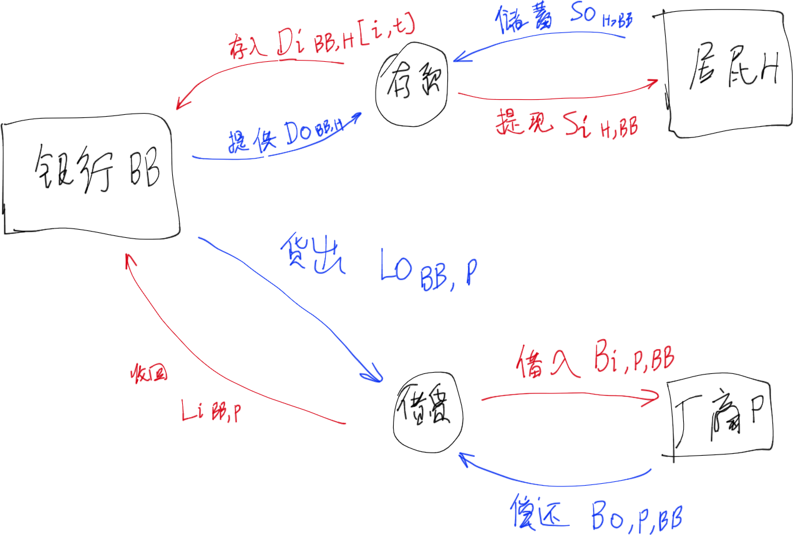
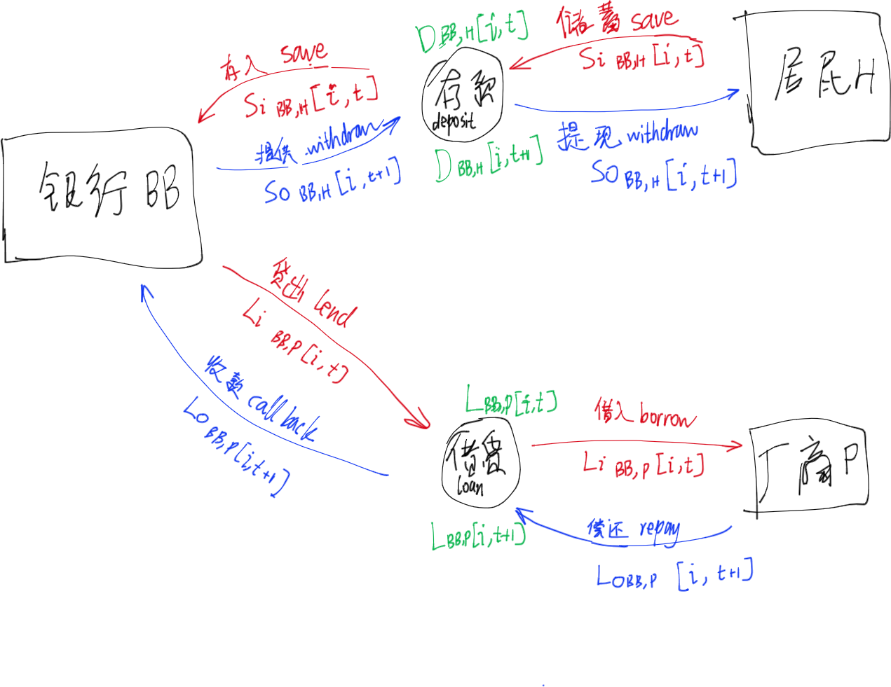
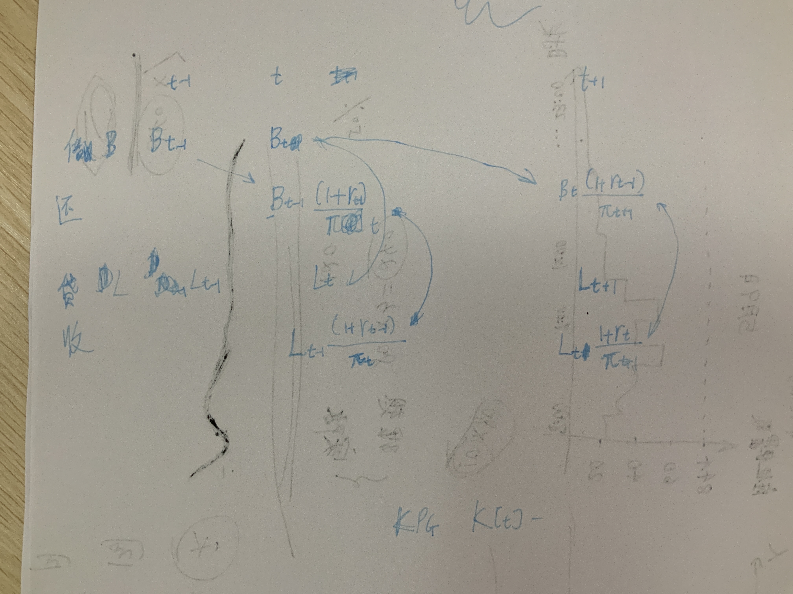
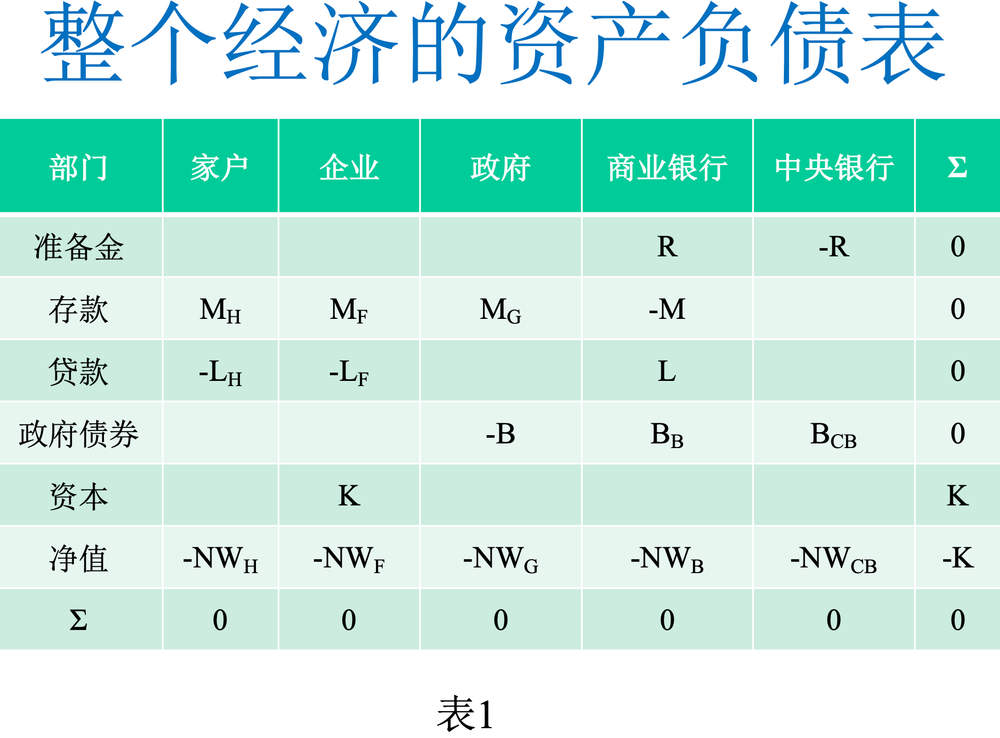

#【项目】：博士毕业论文 

# 建模思路与项目之于系统性金融风险

### 思考建模

- #【思考】 主流经济学的问题：金融机构不应该仅仅是中介，而应该作为一个重要的体系考虑。  

- 费雪、明斯基：
    - 系统性风险一定不能避开债务问题，否则谈不上研究系统性风险
    
      

##### 可能的风险点的特殊建模  

- 企业违约导致银行流动性风险  
- 共同资产风险传递  
- 同业拆借  
- 道德风险  
- 挤兑现象  
  - 存款保险制度是否有效消除挤兑现象？  
  - 不同的存取款周期和提前取款  
    - [[Allen和Gale（2004a，2004b）]]  
    - [[Allen and Carletti（2006，2008）]]  
- 国家、企业、金融机构、个人负债杠杆过高  
- 假设银行接受监管的时候，一旦不满足监管标准，会被立刻发现。  
- 经济不稳定性  
  - 信心在建模里可以用什么方式刻画或者体现呢？  
  - 自组织临界理论可以作为理解经济不稳定性的一个好方法  
    - 在经济繁荣时，大家都不太理性，积极投资，所以容易积累问题，直至最终到达临界点，然后经济崩塌，洗牌。在经济衰退或者萧条时，大家都比较理性，谨慎管理，所以可以慢慢走出危机，恢复经济正常状态。  

- [ ] 数据获取方法  
  - 与国内国情相似的国外容易获取微观数据的国家数据  
    - 可行性？  
  - 采用同业拆借头寸数据估计（最大熵？？）  
- [ ] 导师：建模的观点是什么？  
- [ ] 一部分在《Projects Management》

### 疑问与问题

- #【问题】 是否考虑有限时间的折现？现有的折现大多考虑无穷时期的折现。
- #【问题】 居民部门为什么要硬性分成借款型和储蓄和投资型？  
    - #【回答】 ：对于许多文献，直接划分借款型和储蓄型部门。但是也有不少文献不做区分。
    - #【问题】 是否可以按照一定规则软性划分借款型和储蓄型？可以在一定条件下其属性强弱可以转换？  
        - #【问题】 如果个人资产高于多少则具有储蓄和投资属性？  
        - #【问题】 或者假设企业家或者银行家为储蓄型家庭？  
        - #【问题】 假设如果银行家或企业家破产，则变成借款型居民？  
    - #【问题】 是否可以每个居民都有借款和储蓄属性？  
- #【问题】 如果假定消费品最终品厂商是充分竞争的，那么如何设定大厂商和小厂商的异质化？
- #【问题】 如何在最终品生产商中考虑竞争力强弱？
- #【问题】 考虑不同的最终品生产商$i$的不同的全要素生产率$A$  
- #【问题】 考虑一个企业家对应一个企业，一个银行家对应一个银行  
- #【问题】 在研究金融危机的时候，用均衡设定是否不太符合现实情况呢？
- #【问题】 是否要考虑借贷的不同长短期，而不是单纯地设置为1期？
- #【问题】 对于各部门来说，借贷款、存取款的期限在DSGE中，都只有1期。但是实际情况是有多期的。比如长短期存款，长短期贷款。是否要考虑借贷的不同长短期，而不是单纯地设置为1期，以体现银行的借短贷长的特性之一？  
- #【问题】 是否考虑？
  - #【问题】 如果考虑，那么就会内生化转换率之于居民之角色，而不是泊松过程。
    - #【问题】 如果分析银行家的道德风险因素，有可能需要考虑银行家。不考虑的理由是：
        - #【问题】 分析的重点应该放在银行方面，而不是企业部门。

### 假设  

- 具体假设见模型笔记系列；

### 模型部分 

#### 修改和定义变量  

Progress: 71%  

- [x] 函数外框  
  Progress: 100%  

  任务：  

  - 删除所有处于位置上下标与参数组的单词变量之外框{}。  

  相关变量  

  - 包括  

  - [x] {Bankrupt}  
    Progress: 100%  
  - [x] {Loss}  
    Progress: 100%  
  - [x] {Attribute}  
    Progress: 100%  
  - [x] {Manage}  
    Progress: 100%  
  - [x] Hour  
    Progress: 100%  
  - [x] {TFP}  
    Progress: 100%  
  - [x] {Lab}  
    Progress: 100%  
  - [x] {Asset}  
    Progress: 100%  
  - [x] {Liability}  
    Progress: 100%  
  - [x] {Equity}  
    Progress: 100%  
  - [x] Repay  
    Progress: 100%  
  - [x] {LR}  
  - 建议  
    - 沿着全局定义一路找下来  

  - 执行方式  
    - 先搜罗大致范围的，后续遇到再添加  

- [x] 定义变量名  
  Progress: 100%  

  - [x] 相关变量  
    Progress: 100%  
    - [x] Uti  
    - [x] Utility  

- [x] h_{HB,PE}[i,t]改为Hour……  
  Progress: 100%  

- [x] H020的i去掉  
  Progress: 100%  

- [x] 居民部门010  
  Priority: 1  
  Progress: 99%  

  - [x] $r_{BB,HB}[i,t]$改成$r_{L,BB,HB}[i,t]$ 
    Progress: 100%  

    (r_\{)(BB,)HB(\}\[i,.*?\])   
    改成  
    $1L,$2H$3  

  - [x] r_{BB,HI}[i,t]改成r_{D,BB,H}[i,t]  
    Progress: 100%  

    (r_\{)(BB,)HI(\}\[i,.*?\])   
    改成  
    $1D,$2H$3  

 - [x] 除了全局变量和参数文件、方案020、方案021、H020、H021之外，全部改HB、HI为H  
   Progress: 98%  

     - [x] 借款型居民改成居民借款行为， 投资和储蓄型居民改为居民储蓄行为。  
       Progress: 100%  
     - [x] \mathbb{HB}和\mathbb{HI}改成\mathbb{H}  
       Progress: 100%  
     - [x] L_{BB,HB}  
       Progress: 100%  
     - [x] D_{BB,HI}  
       Progress: 100%  
     - [x] B_{HB  
       Progress: 100%  
     - [x] Asset_{BB,HB}[i,j,t]  
       Progress: 100%  
     - [x] D_{HI}  
       Progress: 90%  

- [x] <del>“储蓄”改“存款”</del>  
  Priority: 2  
  Progress: 0%  

- [x] Progress: 0%  

- [ ] 区分存量变量、流量变量  
- [ ] 区分：  
  - [ ] 借入变量  
    - [ ] Borrow  
    - [ ] B  
  - [ ] 偿还变量  
  - [ ] 贷出变量  
  - [ ] 收回变量  

##### #【问题】 如何重新改变量，能够区分资金流入和流出，能够使得SFC方法和DSGE之设定变量方法能相兼容？

区分资金流入和流出：
- [ ] 取消$D_{H}$改成$D_{BB,H}$或者 $D_{H,BB}$；
- [ ] 贷款$L$改成区分流进流出；
- [x] 借款$B_{\Box}$改成$Br_{\Box}$；

###### #【想法】 方案一：

资金流流出主体是$\Box o$，流入是$\Box i$；

- 设置储户存放储蓄为$So_{H,BB}$、银行获得存款为$Di_{BB,H}$、银行提供存款为$Do_{BB,H}$、储户提现储蓄为$Si_{H,BB}$，银行存款；
- 设置银行贷出为$Lo_{BB,P}$、厂商借入为$Bi_{P,BB}$、厂商偿还为$Bo_{P,BB}$、银行收款为$Li_{BB,P}$；

###### #【想法】 方案二：

同一批资金流开始运作放出资金是$\Box i$，结束运作收回资金是$\Box o$，视为流量；存款存量为$D_\Box$；

- 设置储户存入储蓄save为$Si_{BB,H}$、银行获得储蓄save为$Si_{BB,H}$、银行提供储蓄save为$So_{BB,H}$、储户提现储蓄save为$Si_{BB,H}$；
- 设置银行贷出lend为$Li_{BB,P}$、厂商借入borrow为$Li_{BB,P}$、厂商偿还repay为$Lo_{BB,P}$、银行收款call back为$Lo_{BB,P}$；

#### 各模块  

##### 居民部门  

- [ ] 居民部门 

Progress: 100%  

- [x] 改用模块H010，只用一个同质性部门代替。原来是H020，设置了借款型、投资和储蓄型居民。  

##### 生产部门  

- [ ] 生产部门  

Progress: 0%  

- [ ] 生产部门的扰动项变量  
  Progress: 75%  

##### 商业银行  

- [ ] 商业银行 

- [ ] 重新修改商业银行资产负债表。有空再说，按照SFC方法修改？  

##### 银行间市场  

- [ ] 银行间市场

##### 各地政府部门  

- [ ] 各地政府部门

##### 央行和监管部门  

- [ ] 央行和监管部门 
  Progress: 0%  
  - [ ] 相关监管要求借鉴  

##### 只显示各模块接口部分  

- [x] 居民部门  
  Progress: 100%  
- [ ] 生产部门  
  Progress: 65%  
  - [x] 消费品生产部门  
    Progress: 100%  
  - [ ] 房地产商部门  
    Progress: 0%  
- [ ] 银行部门  
  Progress: 5%  
  - [ ] 商业银行部门  
    Priority: 1  
    Progress: 10%  
    - [x] 现在主要在方案011当中修改，但是需要改到模块BB120和方案010。  
      Progress: 100%  
    - [x] 所有居民部门的细化子部门只在模块接口部分显示。  
      Progress: 100%  
    - [ ] 所有生产部门之子部门只在模块接口部分显示。  
      Progress: 10%  
    - [ ] 增设影子银行业务的开关。  
      Progress: 0%  
  - [ ] 影子银行部门  
    Progress: 0%  
- [ ] 政府部门  
  Progress: 10%  
- [ ] 是否复制一份模块接口内容至描述部分？还是保持现有独立一份于模块接口？  

#### 图表

##### 绘制以下图表  

- [ ] 全局资产负债表  
- [ ] 全局存量表  
- [ ] 全局流量表
- [ ] 绘制示意图：借贷流程。   Progress: 10%   
- [ ]  绘制各方案和各模块调用示意图   Progress: 10%  
- [ ]  重新完善各方案中各模块调用细节   Progress: 10%  
- [ ]  绘制各模块及其接口   Progress: 10%    

#### 各方案  

##### 方案010

#【要求】 方案010是主要方案。

###### 框架图

- [ ] 2021-09-17 22:47:13更新框架图之变量之内容；

  

###### 居民部门  

- 分析挤兑引发的风险
    - 考虑存款有两种类型：短期存款、长期存款；
- 考虑了通货膨胀率
- #【问题】 看不懂(Gerali等, 2010)的居民部门大众消费的效用形式  
- 考虑添加MIU需求至效用函数  
- TODO 改用模块H010，只用一个同质性部门代替。原来是H020，设置了借款型、投资和储蓄型居民。  

###### 生产部门  

- 消费品生产商  
    - 资本来源  
        - 信贷  
            - 银行  
            - 政府  
            - 是否考虑上市公司之资本市场融资？
            - 金融市场融资  
            - 是否考虑上市公司之活动在金融市场？  
            - 是否考虑政府信贷？  
        - 自己更新  
    - 简化其描述，在建模主过程中  
    - 考虑了通货膨胀率  
- 生产部门采用PG010，为了简化

###### 银行部门  

- 银行利润以股利形式消费，是否符合中国国情？  
    - 问导师  
- 应该内生化关于银行退出市场的假设  
- 应该内生化关于银行收到违约冲击的假设  
- 对于传统商业银行部门，包括两类资产：传统贷款、从影子银行购买的资管产品。  
- 考虑了通货膨胀率  
- 行为分析  
    - 股利分红行为似乎不符合国情？  
        - 问导师  
- 银行部门建模之目标应该考虑通胀率？  
- 商业银行最大化目标  
    - 利润最大  
    - 商誉最大  
- 调整成本  
    - 不同资产之间  
    - 同一资产跨期之间  
- 我国商业银行不能投资非金融企业  
      
    我国《商业银行法》规定不允许商业银行在境内从事信托和股票业务，不得向非银行金融机构和企业投资，但同时又允许商业银行从事投资银行业务和部分保险业务。根据相关法规，我国商业银行完全可以在现行法律框架内拓展商业银行业务：（1）可以在境外从事全能银行业务；（2）从事部分投资银行业务和保险业务，如发行金融债券，兑付政府债券，代理保险业务等；（3）推进金融创新，注重发展与资本市场相关的中间业务，如开辟有关企业并购业务、客户理财业务、项目融资业务、券商资金结算与清算业务等。在法律明确放开投资限制之前，商业银行一定要积极在上述几方面中拓展业务并设置相应的机构及配套体系，以积累更多的投资经验和增强风险防范能力。  
    - 可以购买企业债券吗？  
- 生产部门对商业银行的所有信贷需求都能得到满足？  
- 考虑银行保住自己存款客户的能力，也就是储蓄的来源  

###### 银行间市场  

- 银行网络的央行调控，应用网络控制的工具。  
    - 是否央行要能够集中调控央行，而不是过于放任银行间市场自由流动？明斯基的观点之一。  

###### 广义政府部门  

- 关于宏观调控  
    - 宏观调控要有足够预留空间  
    - 宏观调控要有前瞻性  
    - 逆周期调节  
    - 宏观调控的力度、空间需要调整，以目标为可持续性。  
    - 规则化宏观调控要简洁化  
    - 宏观调控要懂得微调  
    - 规则化宏观调控有助于预期管理  
    - 居民杠杆率不能太高  
    - 宏观调控本质与提高宏观调控效率关键  

###### 模型扩展  

###### 房地产商  

- 引入信贷约束机制  
    - 借鉴  
        - [[郭娜_马莹莹_et-al_2018_我国影子银行对银行业系统性风险影响研究——基于内生化房地产商的DSGE模型分析]]
          - [[Iacoviello_2005_House Prices, Borrowing Constraints, and Monetary Policy in the Business Cycle]]
          - [[Christensen_Dib_2008_The financial accelerator in an estimated New Keynesian model]]

###### 影子银行部门  

- 林琳, 曹勇, 肖寒, 2016. 中国式影子银行下的金融系统脆弱性[J]. 经济学(季刊), (03 vo 15): 1113–1136.  
  
    - 怎么理解商业银行与影子银行关联关系(31)  
- 

##### 方案011

[[系统性金融风险建模之方案_011]]

Progress: 25%  

- [ ] 商业银行部门用的是方案011  
  Priority: 1  
  Progress: 25%  

  - [ ] 迁移到模块BB20、方案010  

- [ ] 提取BB120之模块接口，并且用在各方案。  
  Priority: 5  
  Progress: 25%  

  

##### 方案030、方案031

[[系统性金融风险建模之方案_030]]、[[系统性金融风险建模之方案_031]]

- #【要求】：作为备选的重要方法！  
- #【想法】 借鉴流量存量一致性方法。考虑分阶段资金流入流出量。  
    - 存量表：相关文献
    [[Xing_Xiong_et-al_2021_The role of debt in aggregate demand.pdf]]、
、[[Xing_Xiong_et-al_2021_The role of debt in aggregate demand (演示文稿).pptx]]
      
    
   - 流量表  
    
      

- [ ] 借贷期限、存取期限改为多期  

##### 方案020、方案021

[[系统性金融风险建模之方案_020]]、[[系统性金融风险建模之方案_021]]

- [ ] 完成方案2的生产部门资本品和银行关系部分，涉及到模块BB120；
  Progress: 35%  

- [ ] 精简中间品生产商的方程和推导  
  Progress: 75%  
  - [ ] 精简主要推导过程至附录  
    Priority: 1  
    Progress: 35%  
  - [ ] #【问题】 混合型新凯恩斯菲利普斯曲线（hybrid NKPC）的存在意义？  
    Progress: 0%  
  - [ ] #【进度】：延迟 混合型新凯恩斯菲利普斯曲线（hybrid NKPC）的推导过程  
    Progress: 0%  
  - [ ] #【进度】：延迟 推导消费品中间品生产商之价格水平的时变表达式  
    Progress: 0%  

###### 居民部门  

- [ ] 分析挤兑引发的风险  
    - 考虑存款有两种类型：  
        短期存款、长期存款  
- [ ] 考虑了通货膨胀率  
- [ ] 看不懂[[Gerali_Neri_et-al_2010_Credit and banking in a DSGE model of the Euro area]]的居民部门大众消费的效用形式  

- [ ] 生产部门采用[[模块之消费品生产商PG020]]

###### 生产部门

###### 消费品中间品生产商  

- Calvo定价机制  
- 资本来源  
    - 自己更新  
    - 信贷  
        - 银行  
        - 政府  
        - 是否考虑上市公司之资本市场融资？  
              
            金融市场融资  
        - 是否考虑上市公司之活动在金融市场？  
        - 是否考虑政府信贷？  
- 简化其描述，在建模主过程中  
- 考虑了通货膨胀率  

###### 资本品生产商  

- [ ] 完成方案2的生产部门资本品和银行关系部分  

    

- #【问题】 资本品生产商到底做什么的？意义在哪里？  
  
    - #【回答】 看看DSGE相关资料。
    - 导师：国家发展直接融资，是为了稳定金融。间接融资容易导致金融不稳定。  
          
        商业银行法关于银行投资的规定：不能投资！  
        
        **第三十八条**　商业银行应当按照中国人民银行规定的贷款利率的上下限，确定贷款利率。  
        　　**第三十九条**　商业银行贷款，应当遵守下列资产负债比例管理的规定：  
        　　（一）资本充足率不得低于百分之八；  
        　　（二）贷款余额与存款余额的比例不得超过百分之七十五；  
        　　（三）流动性资产余额与流动性负债余额的比例不得低于百分之二十五；  
        　　（四）对同一借款人的贷款余额与商业银行资本余额的比例不得超过百分之十；  
        　　（五）国务院银行业监督管理机构对资产负债比例管理的其他规定。  
    
- 是否引入Hayashi(1982)提出的资本调整成本？  

- 资本品生产商与中间品生产商贷款于银行有何关系？  
        
    非金融公司通过发行股票并将其出售给金融中介机构为每个时期的资本支出提供资金。企业发行$s$单位状态或有债权（权益），该单位等于获得的资本单位$K_{t+1}$的数量。金融中介人与非金融公司之间的金融合同是股权合同（或等效的状态或有债务合同）。非金融公司支付的国家或有利率等于向金融中介机构支付的事后资本回报率$r_{kt+1}$。非金融公司在考虑这种随机还款的情况下设定其资本需求$K_{t+1}$。在$t+1$期开始时（在实现冲击之后），当输出可用时，非金融公司获取资源$Y_{t+1}$并使用它们向股东（或金融中介机构）偿还。企业以每单位资本$q_t$的价格对每个金融债权进行定价。  
    - 问导师  

- [ ] 不建议使用。  
    因为生产部门过于复杂，  
    而且不保证真实。  

###### 银行部门  

- [ ] 考虑添加MIU需求至效用函数  
- 我国银行的所有制是不是全民所有制？  
    - 问导师  
- 应该内生化关于银行退出市场的假设  
- 应该内生化关于银行收到违约冲击的假设  
- 对于传统商业银行部门，包括两类资产：传统贷款、从影子银行购买的资管产品。  
- 考虑了通货膨胀率  
- 行为分析  
    - 股利分红行为似乎不符合国情？  
        - 问导师  
- 银行部门建模之目标应该考虑通胀率？  
- 商业银行最大化目标  
    - 利润最大  
    - 商誉最大  
- 调整成本  
    - 不同资产之间  
    - 同一资产跨期之间  
- 我国商业银行不能投资非金融企业  
        
    我国《商业银行法》规定不允许商业银行在境内从事信托和股票业务，不得向非银行金融机构和企业投资，但同时又允许商业银行从事投资银行业务和部分保险业务。根据相关法规，我国商业银行完全可以在现行法律框架内拓展商业银行业务：（1）可以在境外从事全能银行业务；（2）从事部分投资银行业务和保险业务，如发行金融债券，兑付政府债券，代理保险业务等；（3）推进金融创新，注重发展与资本市场相关的中间业务，如开辟有关企业并购业务、客户理财业务、项目融资业务、券商资金结算与清算业务等。在法律明确放开投资限制之前，商业银行一定要积极在上述几方面中拓展业务并设置相应的机构及配套体系，以积累更多的投资经验和增强风险防范能力。  
    - 可以购买企业债券吗？  

###### 广义政府部门  

- 关于宏观调控  
    - 宏观调控要有足够预留空间  
    - 宏观调控要有前瞻性  
    - 逆周期调节  
    - 宏观调控的力度、空间需要调整，以目标为可持续性。  
    - 规则化宏观调控要简洁化  
    - 宏观调控要懂得微调  
    - 规则化宏观调控有助于预期管理  
    - 居民杠杆率不能太高  
    - 宏观调控本质与提高宏观调控效率关键  

###### 模型扩展  

###### 房地产商  

- 引入信贷约束机制  
    - 借鉴  
        - [[郭娜_马莹莹_et-al_2018_我国影子银行对银行业系统性风险影响研究——基于内生化房地产商的DSGE模型分析]]
          - [[Iacoviello_2005_House Prices, Borrowing Constraints, and Monetary Policy in the Business Cycle]]
           - [[Christensen_Dib_2008_The financial accelerator in an estimated New Keynesian model]]

###### 影子银行部门  

- [[林琳_曹勇_et-al_2016_中国式影子银行下的金融系统脆弱性]]
    - 怎么理解商业银行与影子银行关联关系公式(31)  
- …  

###### 零售部门  

- 是否考虑将消费品最终品生产商变成零售商？  

[//begin]: # "Autogenerated link references for markdown compatibility"
[郭娜_马莹莹_et-al_2018_我国影子银行对银行业系统性风险影响研究——基于内生化房地产商的DSGE模型分析]: ../../Reference/郭娜_马莹莹_et-al_2018_我国影子银行对银行业系统性风险影响研究——基于内生化房地产商的DSGE模型分析 "我国影子银行对银行业系统性风险影响研究——基于内生化房地产商的DSGE模型分析"
[Iacoviello_2005_House Prices, Borrowing Constraints, and Monetary Policy in the Business Cycle]: ../../Reference/Iacoviello_2005_House Prices, Borrowing Constraints, and Monetary Policy in the Business Cycle "House Prices, Borrowing Constraints, and Monetary Policy in the Business Cycle"
[Christensen_Dib_2008_The financial accelerator in an estimated New Keynesian model]: ../../Reference/Christensen_Dib_2008_The financial accelerator in an estimated New Keynesian model "The financial accelerator in an estimated New Keynesian model"
[系统性金融风险建模之方案_011]: ../../Models/模型框架方案/系统性金融风险建模之方案_011 "系统性金融风险建模"
[系统性金融风险建模之方案_020]: ../../Models/模型框架方案/系统性金融风险建模之方案_020 "系统性金融风险建模"
[系统性金融风险建模之方案_021]: ../../Models/模型框架方案/系统性金融风险建模之方案_021 "系统性金融风险建模"
[Gerali_Neri_et-al_2010_Credit and banking in a DSGE model of the Euro area]: ../../Reference/Gerali_Neri_et-al_2010_Credit and banking in a DSGE model of the Euro area "Credit and banking in a DSGE model of the Euro area"
[模块之消费品生产商PG020]: ../../Models/模型框架模块/模块之消费品生产商PG020 "模块之消费品生产商PG020"
[林琳_曹勇_et-al_2016_中国式影子银行下的金融系统脆弱性]: ../../Reference/林琳_曹勇_et-al_2016_中国式影子银行下的金融系统脆弱性 "中国式影子银行下的金融系统脆弱性"
[//end]: # "Autogenerated link references"