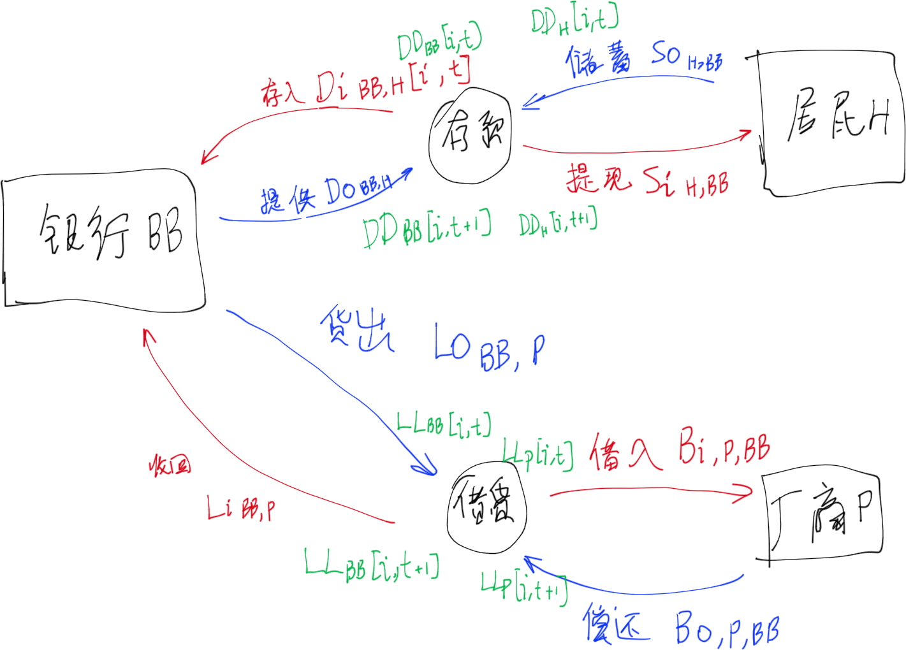
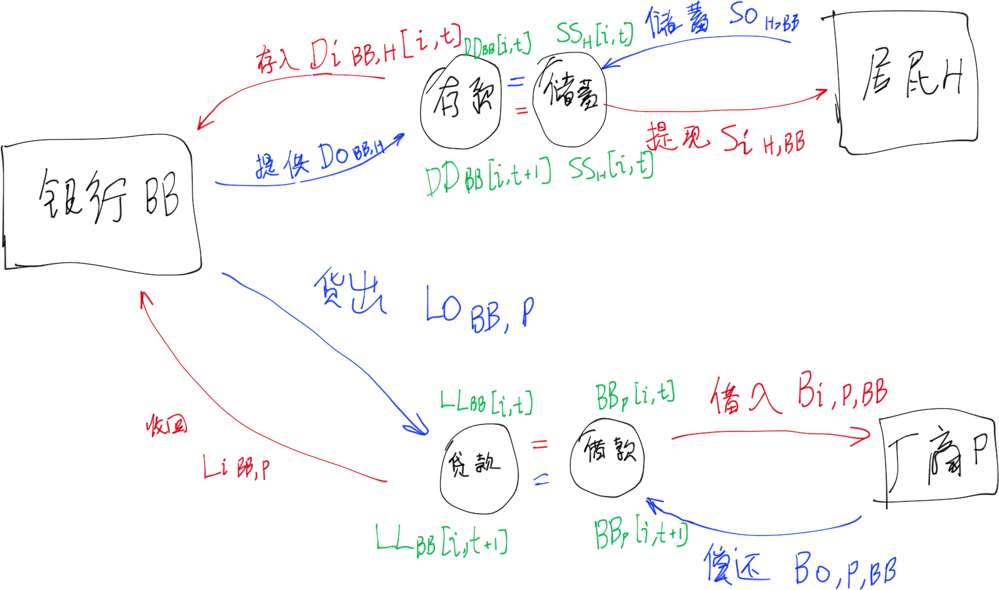
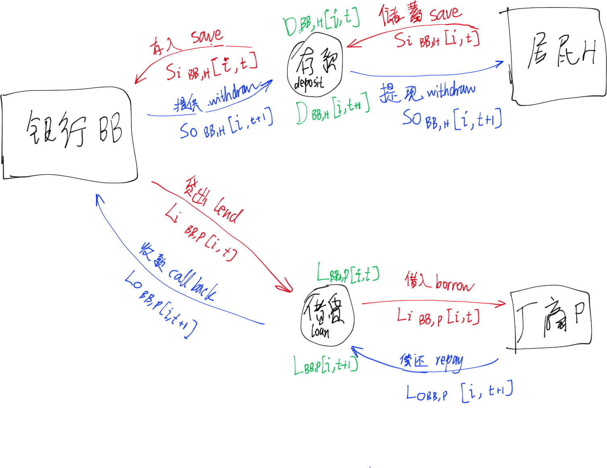
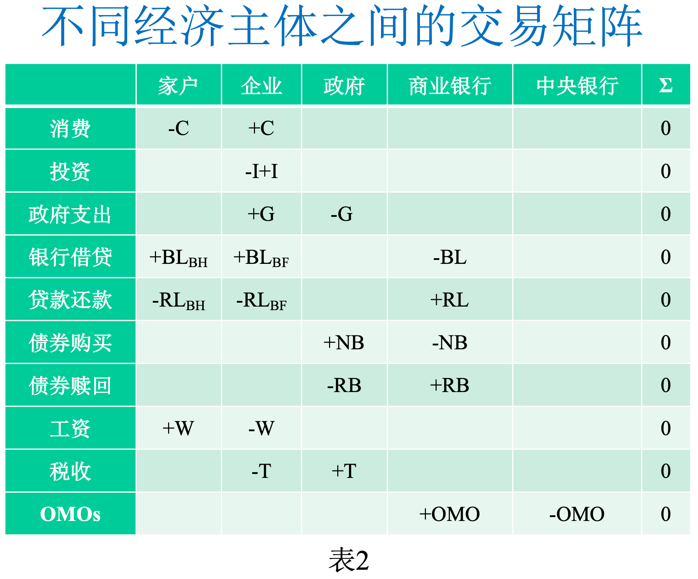
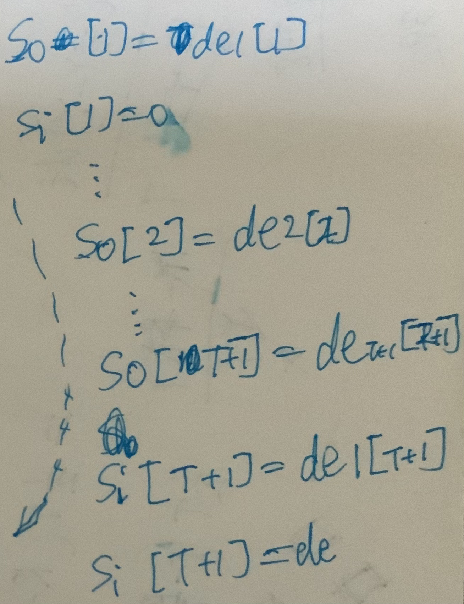
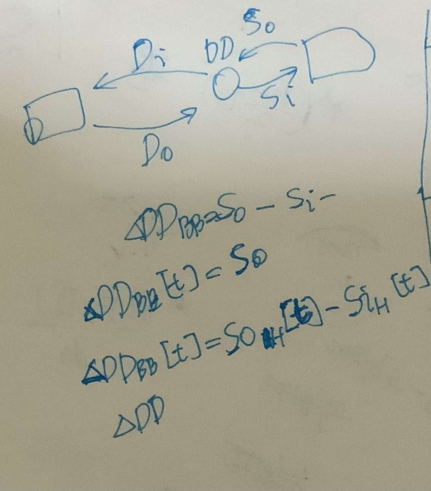
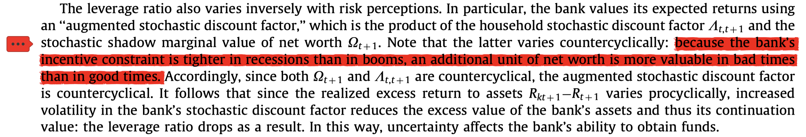

#项目/SystemicRisk 

[TOC]

# 思路与过程之于建模系统性风险

## 思考、灵感、想法、问题、困难

[[问题困难想法思考之于系统性金融风险]]

## 假设  

- 具体假设见模型笔记系列；

# 测度部分

具体见[[描述之系统性风险测度]]。

 
# 程序部分

- [ ] (@[[2021-12-18]]) 修改更新资产负债表，使得能够根据已知手动更改的变量，修改更新其余变量；
- [ ] (@[[2021-12-18]]) 修改更新各冲击，使得能够根据已知手动更改的变量，修改更新其余变量；
- [ ] (@2021-12-18) 构建函数，功能包括初始化冲击；
- [x] [[设计原则之于更新银行状态]]
- [ ] [[设计原则之于更新银行资产负债表]]
- [ ] [[设计原则之于更新银行冲击]]
- [x] [[设计原则之于更新银行损失]]

# 模型部分 

## 修改和定义变量  

	
- [x] (@2021-11-26) 修改以下称谓：
	- [x] 下述在drowio的相应也要手动改动；
	- [x] 集合运算符不符合要求的“\\and”、“\\or”改成“\\cap”、“\\cup”。复合要求的改成“\\wedge“、”\\vee”
	- [x] “银行间资产流动性挤兑冲击”改成“银行间流动性挤兑冲击”；
	- [x] “银行间负债违约冲击”改成“银行间违约冲击”
	- [x] “Lo”写错了，改成“Bo”。
	- [x] “非银行间外生冲击”$Shock_{-BI}$应该改称为“外生银行外冲击”$Shock_{exB}$，且该冲击为外生的。
		- [x] 相应损失等变量也要看看是否要改？暂时不改！
	- [x] “初始外生冲击”应该改称呼为“银行外外生冲击”。但是保留“初始外生冲击阶段”。
	- [x] “银行内冲击”改成“银行内资产负债冲击”。
	- [x] 相关传染方式改为“银行间违约损失冲击传染方式”、“银行间挤兑流动冲击传染方式”。“银行间流动挤兑冲击传染方式”改为“银行间挤兑流动冲击传染方式”；
	- [x] “{def,BI}”、“{run,BI}”改成“{BI,def}”、“{BI,run}”
	- [x] 统一描述形式$\mathbb{B}_{ilq} \or \mathbb{B}_{br}$为$\mathbb{B}_{(ilq \or br) \and cre}$；
	- [x] “LL”改成“L”，“DD”改成“D”；

- [ ] (@2021-12-02)等基本完成模块BI0000时
	- [ ] 补充定义冲击相关变量
	- [ ] 覆盖模块外生冲击

 - [x] #问题 #进度/已解决 如何重新改变量，能够区分资金流入和流出，能够使得SFC方法和DSGE之设定变量方法能相兼容？

需求：

区分资金流入和流出：
- [x] 取消$D_{H}$改成$D_{BB,H}$或者 $D_{H,BB}$；
- [x] 贷款与借款应区分流进流出；
- [x] 借款$B_{\Box}$改成$Bi_{\Box}$或$Bo_{\Box}$；

#想法 方案一：

- 设置资金流流出主体是$\Box o$，流入是$\Box i$，流入流出总量是$\Box io$；
- 设置银行存款存量为$D_{BB}$，居民储蓄存量为$D_{H}$，银行贷款存量为$L_{BB}$，厂商借款存量为$L_{H}$；
- 设置储户存放储蓄为$So_{H,BB}$、银行获得存款为$Di_{BB,H}$、银行提供存款为$Do_{BB,H}$、储户提现储蓄为$Si_{H,BB}$，银行存款；
- 设置银行贷出为$Lo_{BB,P}$、厂商借入为$Bi_{P,BB}$、厂商偿还为$Bo_{P,BB}$、银行收款为$Li_{BB,P}$；

#想法 方案二：

- 设置资金流流出主体是$\Box o$，流入是$\Box i$，流入流出总量是$\Box io$；
- 设置银行存款存量为$DD_\Box$，居民储蓄存量为$SS_\Box$，银行贷款存量为$LL_\Box$，厂商借款存量为$BB_\Box$；
- 设置储户存放储蓄为$So_{H,BB}$、银行获得存款为$Di_{BB,H}$、银行提供存款为$Do_{BB,H}$、储户提现储蓄为$Si_{H,BB}$，银行存款；
- 设置银行贷出为$Lo_{BB,P}$、厂商借入为$Bi_{P,BB}$、厂商偿还为$Bo_{P,BB}$、银行收款为$Li_{BB,P}$；

#想法 方案三：

- 设置同一批资金流开始运作放出资金是$\Box i$，结束运作收回资金是$\Box o$，视为流量；
- 设置银行存款存量为$DD_\Box$，居民储蓄存量为$SS_\Box$，银行贷款存量为$LL_\Box$，厂商借款存量为$BB_\Box$；
- 设置储户存入储蓄save为$Si_{BB,H}$、银行获得储蓄save为$Si_{BB,H}$、银行提供储蓄save为$So_{BB,H}$、储户提现储蓄save为$Si_{BB,H}$；
- 设置银行贷出lend为$Li_{BB,P}$、厂商借入borrow为$Li_{BB,P}$、厂商偿还repay为$Lo_{BB,P}$、银行收款call back为$Lo_{BB,P}$；

任务：
采取方案二。

- [x] 修改流程图之相关部分描述；(@2021-09-22 01:11)
- [x] 修改Models文件里面相关部分变量及其描述。(@2021-09-23 )
	- [x] 只修改现有[[方案DSGE030]]及其相关文件内之内容；
	- [x] #优先/低 修改其他方案之内容。（暂时不重要，不考虑）(@2022–03-01 )；

## 各描述

- [x] (@2021-11-24) 新增[[描述之银行破产清算]]；
- [x] (@[[2021-11-24]] 16:32:51) 新增[[描述之银行资产负债表]]；
- [ ] @[[2021-12-15]]) 单独提取[[描述之资金分摊方式]]

## 各模块

### 外生冲击

#### 模块之存款挤兑流动性外生冲击

#### 模块之非银行间贷款损失外生冲击

### 央行和监管部门  

- [ ] 央行和监管部门模块；
	- [ ] 相关监管要求借鉴[[Models/建模思路/系统性风险测度指标]]

- #思考 关于宏观调控：
	- 宏观调控要有足够预留空间  
	- 宏观调控要有前瞻性  
	- 逆周期调节  
	- 宏观调控的力度、空间需要调整，以目标为可持续性。  
	- 规则化宏观调控要简洁化  
	- 宏观调控要懂得微调  
	- 规则化宏观调控有助于预期管理  
	- 居民杠杆率不能太高  
	- 宏观调控本质与提高宏观调控效率关键  

#想法 后续研究监管的时候可以考虑放松假设

      

- 监管部门与银行间，银行与银行间存在博弈行为？用演化博弈还是微分博弈？如何把微分博弈变成差分博弈？

### 外生经济

#### 居民部门  

- [ ] 居民部门 
	- [x] 改用模块H030，只用一个同质性部门代替。原来是H010； 

- 分析挤兑引发的风险作为银行间市场初始冲击
	- 考虑存款有两种类型：短期存款、长期存款；

#### 生产部门  

##### 模块之消费品生产商PG020（不需要用）

具体见[[模块之消费品生产商PG020]]

- Calvo定价机制  
- 资本来源  
    - 自己更新  
    - 信贷  
        - 银行  
        - 政府  
        - 是否考虑上市公司之资本市场融资？  
              
            金融市场融资  
        - 是否考虑上市公司之活动在金融市场？  
        - 是否考虑政府信贷？  
- 简化其描述，在建模主过程中  
- 考虑了通货膨胀率  

##### 模块之消费品生产商PG020（不需要用）

[[模块之消费品生产商PG020]]

###### 资本品生产商  

- [ ] #进度/取消 #优先/很低 完成方案DSGE2系列的生产部门资本品和银行关系部分  

    

    

![[问题困难想法思考之理论建模部分#^oo55v16]]
![[问题困难想法思考之理论建模部分#^0m3eqkf]]

##### 模块之消费品生产商PG030

[[模块之消费品生产商PG030]]

- [ ] 生产部门

  - [x] 改用模块PG030；

  - #问题 生产部门的扰动项变量？？？； 

- 消费品生产商  
	- 资本来源  
		- 信贷  
			- 银行  
			- 政府  
			- 是否考虑上市公司之资本市场融资？
			- 金融市场融资  
			- 是否考虑上市公司之活动在金融市场？  
			- 是否考虑政府信贷？  
		- 自己更新其资本  
	- 简化其描述，在建模主过程中  
	- 考虑了通货膨胀率  

  

#### 商业银行  

##### 模块之商业银行BB020（不需要用）

[[模块之商业银行BB020]]

- [ ] 考虑添加MIU需求至效用函数  
- 我国银行的所有制是不是全民所有制？  
    - 问导师  
- 应该内生化关于银行退出市场的假设  
- 应该内生化关于银行收到违约冲击的假设  
- 对于传统商业银行部门，包括两类资产：传统贷款、从影子银行购买的资管产品。  
- 考虑了通货膨胀率  
- 行为分析  
    - 股利分红行为似乎不符合国情？  
        - 问导师  
- 银行部门建模之目标应该考虑通胀率？  
- 商业银行最大化目标  
    - 利润最大  
    - 商誉最大  
- 调整成本  
    - 不同资产之间  
    - 同一资产跨期之间  
- 我国商业银行不能投资非金融企业  
        
    我国《商业银行法》规定不允许商业银行在境内从事信托和股票业务，不得向非银行金融机构和企业投资，但同时又允许商业银行从事投资银行业务和部分保险业务。根据相关法规，我国商业银行完全可以在现行法律框架内拓展商业银行业务：（1）可以在境外从事全能银行业务；（2）从事部分投资银行业务和保险业务，如发行金融债券，兑付政府债券，代理保险业务等；（3）推进金融创新，注重发展与资本市场相关的中间业务，如开辟有关企业并购业务、客户理财业务、项目融资业务、券商资金结算与清算业务等。在法律明确放开投资限制之前，商业银行一定要积极在上述几方面中拓展业务并设置相应的机构及配套体系，以积累更多的投资经验和增强风险防范能力。  
    - 可以购买企业债券吗？  

##### 模块之商业银行BB300

[[模块之商业银行BB300]]

- [x] 重新修改商业银行资产负债表。有空再说，按照SFC方法修改？  

- 银行利润以股利形式消费，是否符合中国国情？  
	- 问导师  
- 应该内生化关于银行退出市场的假设  
- 应该内生化关于银行收到违约冲击的假设  
- 对于传统商业银行部门，包括两类资产：传统贷款、从影子银行购买的资管产品。  
- 考虑了通货膨胀率  
- 行为分析  
	- #问题 股利分红行为似乎不符合国情？  
- 银行部门建模之目标应该考虑通胀率？  
- 商业银行最大化目标  
	- 利润最大  
	- 商誉最大  
- 调整成本  
	- 不同资产之间  
	- 同一资产跨期之间  

- #注意 我国商业银行不能投资非金融企业  
      
>     我国《商业银行法》规定不允许商业银行在境内从事信托和股票业务，不得向非银行金融机构和企业投资，但同时又允许商业银行从事投资银行业务和部分保险业务。根据相关法规，我国商业银行完全可以在现行法律框架内拓展商业银行业务：（1）可以在境外从事全能银行业务；（2）从事部分投资银行业务和保险业务，如发行金融债券，兑付政府债券，代理保险业务等；（3）推进金融创新，注重发展与资本市场相关的中间业务，如开辟有关企业并购业务、客户理财业务、项目融资业务、券商资金结算与清算业务等。在法律明确放开投资限制之前，商业银行一定要积极在上述几方面中拓展业务并设置相应的机构及配套体系，以积累更多的投资经验和增强风险防范能力。  

- #想法 借鉴流量存量一致性方法。考虑分阶段资金流入流出量。  
	- 存量表：相关文献： [[Xing_Xiong_et-al_2021_The role of debt in aggregate demand.pdf]]、[[Xing_Xiong_et-al_2021_The role of debt in aggregate demand (演示文稿).pptx]]
	  
    
	- 流量表  
   
	  

- [x] 借贷期限、存取期限改为多期  

#### 各地政府部门  

- [ ] 各地政府部门
	- [ ] #思考 如果考虑添加地方政府债务，则可以启用；（ #问题 从现实说这个比较重要，但是本研究是否优先研究这个？）

### 只显示各模块接口部分  

- [x] 居民部门

- [x] 生产部门
- [x] 消费品生产部门
- [ ] #优先/较低 房地产商部门
  
- [ ] 银行部门
	- [x] 商业银行部门
	- [ ] 现在主要在方案DSGE030当中修改，Progress: 100%  
	- [ ] 所有居民部门的细化子部门只在模块接口部分显示。  TODO暂停所有生产部门之子部门只在模块接口部分显示。  
	- [ ] 增设影子银行业务的开关。  
	- [ ] 影子银行部门  
  
- [ ] 政府部门  
  
- [ ] 是否复制一份模块接口内容至描述部分？还是保持现有独立一份于模块接口？  

### 图表

#### 绘制以下图表  

- [x] (@[[2021-11-29]] 13:56:32) 绘制银行状态转换图；
- [x] (@[[2021-11-29]] 13:56:27) 基于银行状态转换图，绘制银行风险传导图；

- [ ] 全局资产负债表  

- [ ] 全局存量表  

- [ ] 全局流量表

- [ ] 绘制示意图：借贷流程。   Progress: 10%   

- [x] 绘制各方案和各模块调用示意图

- [x] 重新完善各方案中各模块调用细节

- [ ] 绘制各模块及其接口

- [ ] 绘制借贷时序示意图 
  

  

## 各方案  

### 银行间市场 

#### 方案之BI1112
方案[[方案之BI1112]]，基于[[方意_2016_系统性风险的传染渠道与度量研究——兼论宏观审慎政策实施]]、[[方意_黄丽灵_2019_系统性风险、抛售博弈与宏观审慎政策]]等文献之模型。

#思考 银行资产萎缩，导致准备金不足的时候，但是未到达资不抵债的时候，会先收回债务银行之资产，补充准备金，以偿债。但是因为合同，银行不应该违约，因此假设银行不会撕毁合同。
- [x] (@[[2021-10-24]]) 补充债权银行收回破产银行之款项的时候， 资产负债表变动；

#思考 如果银行之资产继续萎缩，导致资不抵债的时候，不一定立刻倒闭，有可能会决策对部分债权银行违约。使得负债降低。但是，其信用对已经违约的债权银行一落千丈。因此，假设考虑当资不抵债的时候，一方面，对债权银行违约那些损失的部分，另一方面，一定会发生倒闭行为。然后清算过程中偿还债权银行剩余债务。
- [x] (@[[2021-10-24]]) 补充债务银行遭受挤兑的时候， 资产负债表变动；

#问题 破产银行清算之后，其债权银行如何接收破产银行资产类别，转换为其他资产中的流动资金？是的！

#问题 由于存在银行间流动性挤兑冲击传染方式，那么这个是冲击还是损失？好像只是冲击，不一定造成损失。所以需要区别冲击和损失两个概念！

#问题 是否分离$Loss_{init,BI}[i,t_{1}]$为$Loss_{def,BI}[i,\tau_{i-1}]$、$Loss_{run,BI}[i,\tau_{i-1}]$？

#问题/2021-11-19 是否放置债务银行收回银行间资产到下一轮传染？

#问题/2021-11-19 债务银行动用非流动性资产以偿还银行间负债。怎么描述？

#### 方案之BI1111

方案[[方案之BI1111]]，基于方案[[方案之BI1112]]、模块[[模块之非银行间贷款损失外生冲击]]，构建混合初始外生冲击。

- [x] (@[[2021-11-26]]) 是否合并银行内资产负债冲击之初始冲击和非初始冲击的共同部分？否！因为比较麻烦
- [x] (@[[2021-11-26]]) 要不要分离银行外冲击与银行内资产负债冲击部分，重新排列阶段顺序：形成顺序：银行外冲击 -> 银行间传染冲击 -> 银行内资产负债冲击 -> 银行间传染冲击 -> 银行内资产负债冲击 -> 银行间传染冲击 -> ……过程？是！
- [ ] (@[[2021-11-26]]) 模块中，在实际运行程序的时候，势必会出现两种银行内资产负债冲击叠加、两种银行间冲击叠加的情形，是否只是简单叠加上去？还是需要另外描述？如果只是简单叠加，其实不需要单独描述；

- [x] (@[[2021-11-24]]) 重绘流程图之初始冲击部分；
- [x] (@[[2021-11-27]]) 重绘详细流程图之传染部分；
- [x] (@[[2021-11-29]]) 重绘简明流程图之传染部分；
- [ ] #2021-12-18 继续建模BI0000；
- [ ] 如果后续要加上银行决策过程，则可以结合[[模块之商业银行BB300]]关于银行目标函数的描述。银行目标主要是考虑最小化自身损失；

#### 方案之BI1121

基于基础方案[[方案之BI1111]]，扩展子方案[[方案之BI1121]]，其银行考虑以下监管措施：
- 杠杆率监管
- 存贷比监管
- 存款准备金率：
	- #问题/2021-10-22 在银行间流动性挤兑冲击传染方式  
$i_{br} \stackrel{run,BI}{\longrightarrow} k_{deb}$，如果债务银行被收回同业拆借之后，准备金低于法定存款金率，会不会导致新的问题？

- 为了避免流动性短缺状态，银行$i_{ilq}$会收回部分银行间资产、抛售非银行间资产、或者收回非银行间资产，以缓解流动性问题。注意，抛售和收回概念不一样。抛售仅影响债权方，收回则会同时影响债权方与债务方。

#问题/2021-11-24 收回全部还是部分银行间资产？

- 银行网络的央行调控，应用网络控制的工具。  
    - 是否央行要能够集中调控央行，而不是过于放任银行间市场自由流动？明斯基的观点之一。  

- [ ] 系统性风险传染渠道，借鉴[[方意_2016_系统性风险的传染渠道与度量研究——兼论宏观审慎政策实施]]。
	具体来说，通过银行间市场资产负债模型，

#### 方案之BI1221

- [ ] 基于基础方案[[方案之BI1111]]，扩展子方案[[方案之BI1221]]，研究资产抛售决策对系统性风险的影响。借鉴[[方意_黄丽灵_2019_系统性风险、抛售博弈与宏观审慎政策]]。这个行为主要有两种驱动：
	- 受到“窗口指导”政策影响。
	- #创新 银行自身决策。理由是因为[[方意_黄丽灵_2019_系统性风险、抛售博弈与宏观审慎政策]]所述过：
	> 实践过程中，若不存在监管部门强制规定，各银行不会选择先抛售流动性资产。因为这样做有利于银行自身效用。但是不符合整个银行体系的稳定。 

#### 方案之BI1311

- [ ] 基于基础方案[[方案之BI1111]]，扩展子方案[[方案之BI1311]]，研究银行持有共同资产对银行系统的影响，在银行间市场传染过程，从而研究共同资产因素对系统性风险的影响。
	- 共同资产在银行间市场传染中的指标，借鉴了[[方意_郑子文_2016_系统性风险在银行间的传染路径研究——基于持有共同资产网络模型]]借鉴了[[Marc_Augustin_et-al_2015_Vulnerable Banks]]。

### 方案DSGE010（暂时不用）

  

#### 居民部门  

- 暂时不考虑添加MIU需求至效用函数  

### 方案DSGE011（暂时不用）

[[方案DSGE011]]

Progress: 25%  

- [x] 商业银行部门用的是方案DSGE011  
	  Priority: 1  
	  Progress: 25%  
	- [x] 迁移到模块BB20、方案DSGE010  

- [ ] 提取BB120之模块接口，并且用在各方案。  
	Priority: 5  
	Progress: 25%  

  

#### 模型扩展  

##### 房地产商  

- 引入信贷约束机制  
	- 借鉴  
		- [[郭娜_马莹莹_et-al_2018_我国影子银行对银行业系统性风险影响研究——基于内生化房地产商的DSGE模型分析]]
		  - [[Iacoviello_2005_House Prices, Borrowing Constraints, and Monetary Policy in the Business Cycle]]
		  - [[Christensen_Dib_2008_The financial accelerator in an estimated New Keynesian model]]

##### 影子银行部门  

- 林琳, 曹勇, 肖寒, 2016. 中国式影子银行下的金融系统脆弱性[J]. 经济学(季刊), (03 vo 15): 1113–1136.  
	- 怎么理解商业银行与影子银行关联关系(31)  
- 

### 方案DSGE030、方案DSGE031

> #要求 方案DSGE030是主要方案。

对于[[方案DSGE030]]

- [x] 商业银行
	- [x] 改用[[模块之商业银行BB300]]；

#### 框架图

- [x] 2021-09-17 22:47:13更新框架图之变量之内容；

#### 模型扩展  

对于[[方案DSGE031]]扩展模型：

##### 房地产商  

- 引入信贷约束机制  
    - 借鉴  
        - [[郭娜_马莹莹_et-al_2018_我国影子银行对银行业系统性风险影响研究——基于内生化房地产商的DSGE模型分析]]
          - [[Iacoviello_2005_House Prices, Borrowing Constraints, and Monetary Policy in the Business Cycle]]
           - [[Christensen_Dib_2008_The financial accelerator in an estimated New Keynesian model]]

##### 地方政府债务

#想法 是否考虑地方政府债务？

##### 影子银行部门  

- [[林琳_曹勇_et-al_2016_中国式影子银行下的金融系统脆弱性]]
    - 怎么理解商业银行与影子银行关联关系公式(31)  
- …  

### 方案DSGE020、方案DSGE021（基本不用）

#进度/取消 #优先/很低 [[方案DSGE020]]、[[方案DSGE021]] 基本不用，因为生产商方案不符合现在研究方向，过于复杂。

- #进度/取消 完成方案2的生产部门资本品和银行关系部分，涉及到模块BB120；
  Progress: 35%  

- #进度/取消 精简中间品生产商的方程和推导  
  Progress: 75%  

- #进度/取消 精简主要推导过程至附录  
    Priority: 1  
    Progress: 35%  

- #进度/取消 #问题 混合型新凯恩斯菲利普斯曲线（hybrid NKPC）的存在意义？  
    Progress: 0%  

- #进度/取消 混合型新凯恩斯菲利普斯曲线（hybrid NKPC）的推导过程  
    Progress: 0%  
  
- #进度/取消 推导消费品中间品生产商之价格水平的时变表达式  
    Progress: 0%  

##### 居民部门  

##### 生产部门

- [ ] 生产部门采用[[模块之消费品生产商PG020]]、[[模块之消费品生产商PG021]]

##### 银行部门  

##### 广义政府部门  

##### 零售部门  

- 是否考虑将消费品最终品生产商变成零售商？  

