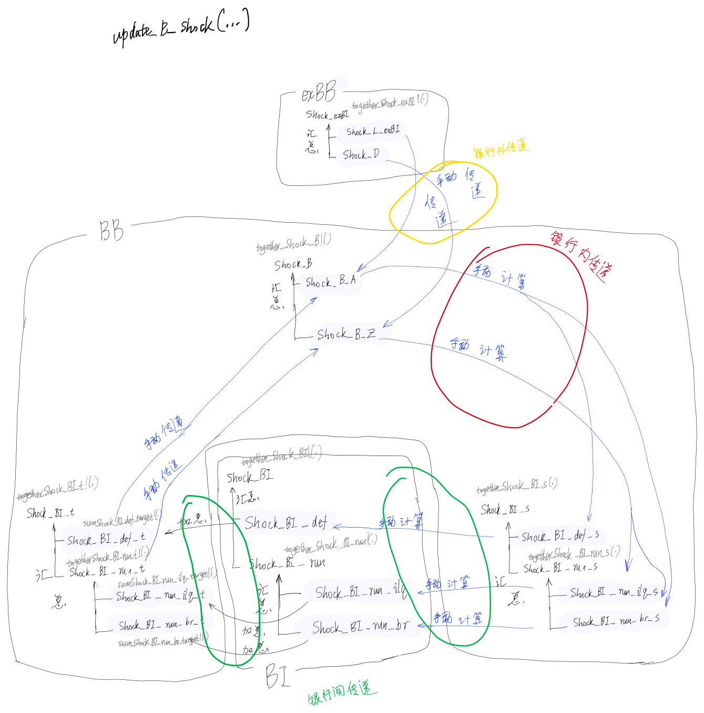

# 设计原则之于更新银行冲击

当冲击针对银行或银行间，发生变化时：

- 每一传染轮次，`Shock_*`系列变量将被重置；
- 只能通过`Shock_*`系列变量变动`BI`与`BB`之资产负债表相关变量；
- 当冲击变量层级树内叶子节点发生变动时，应当及时通过冲击变量层级树内之叶子节点汇总更新冲击变量层级树；
- 通过给定的切入点（参数`byWay`指定的变量）更新时，可以级联更新相邻且可以自动更新的其它资产负债表变量。但是更新树末端必须止步于遇到那些变量，其需要手动计算，或者手动传递的；

