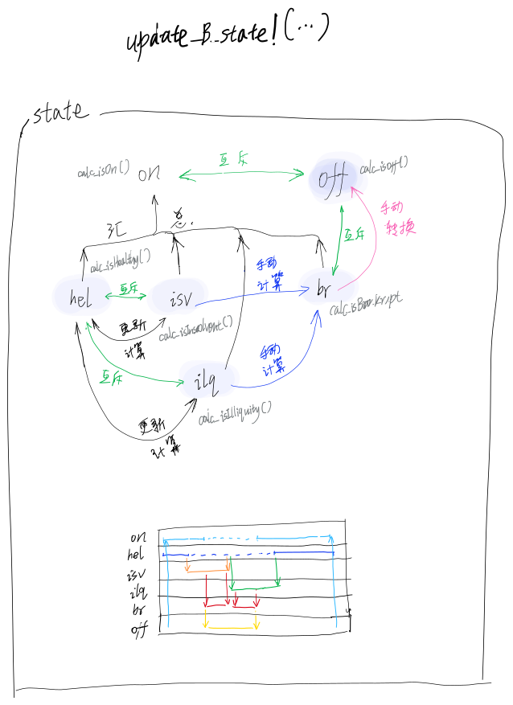

# 设计原则之于更改银行状态

当资产负债表变化时：

- 只能直接更新哪些资产负债表变量直接控制的状态，那些因为资产负债表变化驱动状态转换为目标状态的；
- 更新状态只能由其状态之低一层状态（暨其包含的子状态）驱动更新，而不能由被包含的父状态更新；
- 更新状态后，应该考虑更新相邻且不相容的状态；
- 更新状态后，应该考虑更新被包含的状态；
- 更新状态后，无需更新不相邻的、或者相容的、或者子级的状态；

应该更新银行状态的时候：

- 如果严格按照ABM范式设计，原则上应该在每一个步长，检查与更新银行状态；
- 如果为了运算速度，则当资产负债表变化时；

#### 原理示意图之于更新银行状态：

