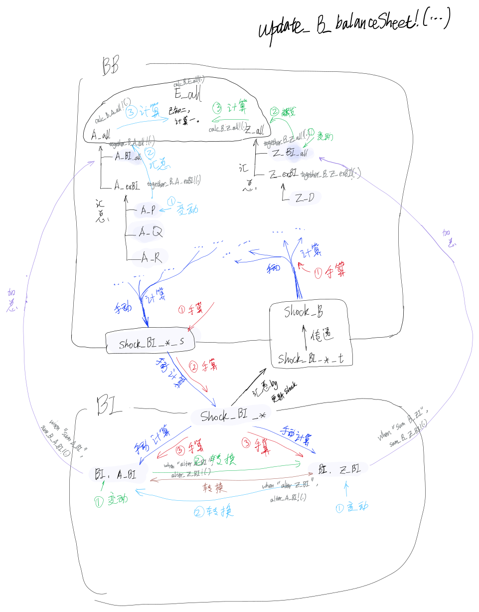
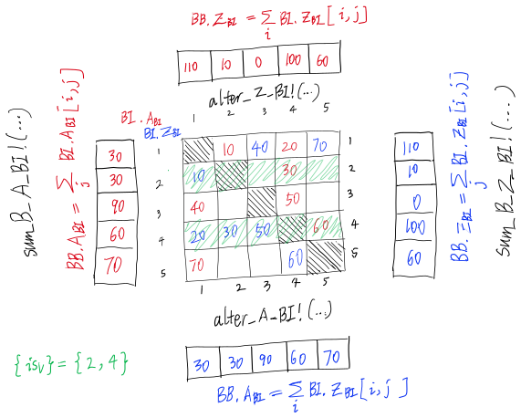

# 设计原则之于更新银行资产负债表

- 只能直接更新那些在变量资产负债表内的变量，其由算法计算而生成，该算法被专门设计出来，而不是可以通过通用规则自动更新的；
- 只能通过`Shock_*`系列变量变动`BI`与`BB`之资产负债表相关变量；
- 每一传染轮次，资产负债表内之变量会变动，但不会重置；
- 当资产负债表内叶子节点发生变动时，应当及时通过资产负债表内之叶子节点汇总更新资产负债表；
- 通过给定的切入点（参数`byWay`指定的变量）更新时，可以级联更新相邻且可以自动更新的其它资产负债表变量。但是更新树末端必须止步于遇到那些变量，其需要手动计算；

#### 原理示意图之于更新银行资产负债表

