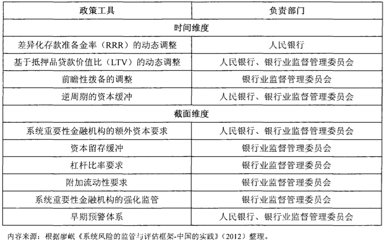

# 防范与化解系统性风险

我们的目标是什么？

2021年货币政策要稳字当头，平衡好恢复经济和防范风险的关系。

现代

## 相关政策与工具

#### 宏观审慎政策

##### 相关的政策工具

> 根据苏明政, 2014. 我国系统性金融风险的测度、传染与防范研究[D]. p101-.

时间维度
	差异化存款准备金率（RRR）的动态调整
	基于抵押品贷款价值比（LTV）的动态调整
	前瞻性拨备的调整
	逆周期的资本缓冲

截面维度
	系统重要性金融机构的额外资本要求
	资本留存缓冲
	杠杆比率要求
	附加流动性要求
	系统重要性金融机构的强化监管
	早期预警体系

#### 微观审慎监管

#### 货币政策

周小川行长于2016年6月24日在华盛顿参加IMF中央银行政策研讨上的发言《把握好多目标货币政策：转型的中国经济的视角》指出，全球金融危机以来，有很多关于中央银行的讨论和反思

##### 货币政策三大工具

公开市场操作

## 参考

- 

