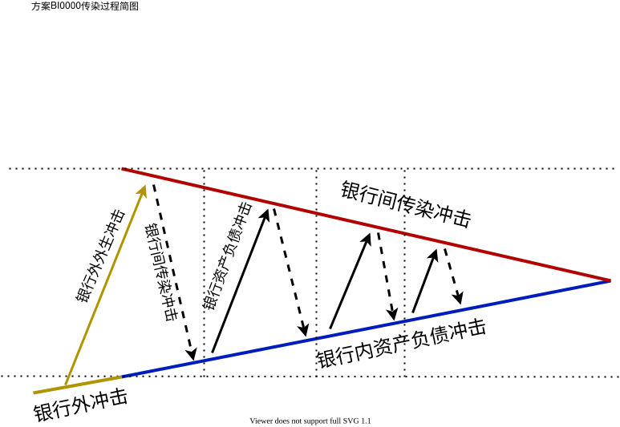

[TOC]

# 方案之BI1111

# 方案特点：

该模块是各子模块的基准模块。

该模块直接考虑纳入银行资产负债表至银行间市场建模。与没有考虑银行资产负债表建模的相关研究相比，有以下优点：

- 将银行破产对其债权方造成的损失中的损失率内生化；
- 仅仅考虑银行间资产与银行间负债波动导致的权益损失变化，会导致遗漏一些重要的传染方式；

该模块基于模型于文献[[方意_2016_系统性风险的传染渠道与度量研究——兼论宏观审慎政策实施]]

该模块具有以下主要特点以有助于描述银行间市场：

- 所有银行具有同质性，用多主体表示；
- 所有资产抛售比例或者负债违约偿付等级完全相同；
- 不考虑不同类别的非银行间共同资产因素；
- 没有考虑任何监管约束。因此：

  - 资产负债表中，暂不考虑法定准备金要求；

> [[方意_2016_系统性风险的传染渠道与度量研究——兼论宏观审慎政策实施]]当中只考虑了杠杆率监管，并且给出了不考虑其它监管因素的理由。

该模块没有考虑银行目标。如果后续要加上银行目标，则可以结合[[模块之商业银行BB300]]关于银行目标函数的描述。银行目标主要是考虑最小化自身损失；

# 方案假设：

对于本基准模块，我们需要作出一系列假设。尽管这些假设可能有较多限制性，以至于与现实存在一定差距，但是对于清晰且顺利地分析银行间市场系统风险传染过程，排除其他因素干扰，减少模型复杂度，具有重要意义。

假设银行间市场，商业银行面临的初始冲击仅针对非银行间资产$A_{-BI}[i,t]$。包括非银行间贷款$L_{-BI}[i,t]$、可用资金$Q_{B}[i,t]$；

> 此假设异于[[方意_2016_系统性风险的传染渠道与度量研究——兼论宏观审慎政策实施]]之假设初始冲击可以对银行所有类别资产其作用。

对于当前国情，至少在当前时期，按照国情来说，我们考虑的银行破产因素实质上应该是技术性破产，即资不抵债陷入困难，而不是实际意义上的破产，从而进入破产重组程序。

假设考虑当资不抵债的时候，直接进入破产状态，进入破产程序；

> 假设银行资不抵债的时候，不会先收回债务银行之资产，以补充准备金，而是倒闭。考虑此的主要原因是因为考虑到贷款合同约束，银行不会违约，因此银行不会撕毁合同。
>
> 银行资产资不抵债的时候，不一定立刻倒闭，有可能会决策对部分债权银行违约。使得负债降低。但是其信用对已经违约的债权银行一落千丈，因此，假设考虑此时一定会倒闭。倒闭之后，一方面，对债权银行违约那些损失的部分，另一方面，清算过程中偿还债权银行剩余债务。

假设银行决策其行为时不考虑负债偿付优先等级，负债偿付等级完全相同，暨资不抵债银行发生违约的负债部分，将按各类型负债规模平摊，而不考虑偿付给债权银行的优先级别、偿付规模；

> 银行的负债偿付等级完全相同，根据[[方意_2016_系统性风险的传染渠道与度量研究——兼论宏观审慎政策实施]]沿用[[Upper_2011_Simulation methods to assess the danger of contagion in interbank markets]]假设。
>
> 在该文献中，其对模型的关于银行破产的三个简化性的假设：
>
> （1）银行破产过程中没有交易成本。 此假设借鉴了Angeloni 和 Faia（2013），其在建立包含银行的DSGE模型时也假设银行破产没有任何交易成本。 假设存在破产交易成本，并不会显著影响本文的结论，但却增加了模型的计算成本；
>
> （2）银行的负债偿付等级完全相同，即任何类别负债，其单位负债承受的损失相同；
>
> （3）银行的破产将收回其所有资产，且银行破产并影响其债务方资产的价值， 这一假设与现实比较相符；
>

假设银行决策其回收资产时不考虑资产回收优先等级，回收银行间资产等级完全相同，暨流动性短缺银行需要回收的资产部分，将按各类型资产规模平摊，而不考虑回收其对债务银行之资产的优先级别、偿付规模；

> 回收资产等级完全相同，借鉴[[Upper_2011_Simulation methods to assess the danger of contagion in interbank markets]]假设的银行的负债偿付等级完全相同这一概念进行创新。

(@[[2021-11-18]]) 补充相关依据。假设债务银行为了偿债，被迫以降低负债方式缩表时，默认优先动用流动资产（超额准备金），而后动用其他资产。假设动用其他资产的顺序是：收回银行间资产、抛售其他资产；

假设债务银行抛售非银行间资产时，存在抛售损失，暨抛售损失率为100%；

> 这样做的意义是只考虑动用流动性资产，而不考虑非流动性资产的过程。

假设在银行风险传染过程，银行抛售非银行间贷款资产的时候，不存在抛售损失，暨抛售损失率为0%；

> 这样做的意义是简化分析过程。

假设流动性短缺银行会根据所缺流动性收回等量银行间资产以偿还剩余负债，缓解流动性问题；

假设流动性短缺银行收回全部银行间资产仍不足以偿还剩余负债，则进入破产状态；

假设资不抵债银行预期收回全部银行间资产仍然不足以偿还剩余负债，则进入破产状态；

假设破产银行清算过程，将收回全部银行间资产相应资产；

假设在银行风险传染过程，没有足够反应时期重新举债，因此没有重新举债行为。其中重新举债对象包括不通过银行间市场获取新的同业融资。

> 在[[方意_2016_系统性风险的传染渠道与度量研究——兼论宏观审慎政策实施]]存在重新举债行为。其假设举债只有居民部门存款部分能够重新举债重置，举债比例为$\theta_{B}$。

假设在银行风险传染过程中，不考虑附加外生流动性冲击。包括客户取款、银行挤兑等。暨外生冲击只出现在第一轮次传染过程；

假设银行破产之后，将收回其所有在债务银行之资产，转为流动资金，偿付给其他债权银行；

假设银行破产后，就退出银行间市场，不再后续参与经济过程；

假设银行破产后，存款会作为银行负债清算；

假设在银行风险传染过程，假设银行破产清算时，考虑暂时由央行托管。其资产与负债暂时由央行托管。贷款利率维持原有利率不变；

# 方案接口

- [ ] TODO 模块接口 混合银行外冲击

# 方案描述

英文全名：

Interbank market

变量名：

bank_inter

数学符号：

$\Box_{BI}$

银行间市场考虑银行间市场之间的作用关系；

其中包括描述以下时期，银行间市场交易的资产负债关系构成的网络结构。

其中，时期包括：

- 正常时期；
- 发生危机造成的传染的时期；

银行间市场按照交易行为划分

- 银行间同业拆借；
- 银行间同业存单；

本研究将上述两者统一列为银行间交易，以便与研究。

其采用矩阵法分析风险传导在空间维度上的变化；

## 构建银行间资产负债网络结构

对于银行间市场，我们构建由$N_{B}$个银行$i,i \in \{1,\cdots,N_{B}\}$构成的矩阵$Lo_{BI}[t]$，来描述银行间市场交易贷出网络$Lo_{BI}[t]$：

$$
\begin{equation}
Lo_{BI}[t]:=\begin{pmatrix}
Lo_{BI}[1,1,t] & \cdots & Lo_{BI}[1,j,t] & \cdots & Lo_{BI}[1,N_{B},t] \\
\vdots & \ddots & \vdots & \ddots & \vdots \\
Lo_{BI}[i,1,t] & \cdots & Lo_{BI}[i,j,t] & \cdots & Lo_{BI}[i,N_{B},t] \\
\vdots & \ddots & \vdots & \ddots & \vdots \\
Lo_{BI}[N_{B},1,t] & \cdots & Lo_{BI}[N_{B},j,t] & \cdots & Lo_{BI}[N_{B},N_{B},t]
\end{pmatrix}
\end{equation}
$$

其中，
矩阵$Lo_{BI}[t]$：表示时期$t$，银行间市场交易行为的网络。每一行银行表示贷出。每一列银行表示借入；
元素$Lo_{BI}[i,j,t]$：表示时期$t$，银行$i$贷出资金给银行$j$；

类似地，可以构建银行间市场交易借入网络$Li_{BI}[t]$，二者关系刚好相反，因此不赘述。

事实上，当我们研究银行间资产负债关系时，主要还是通过构建相应的资产负债网络$A_{BI}[t]$，定义如下：

$$
\begin{equation}
A_{BI}[t]:=\begin{pmatrix}
A_{BI}[1,1,t] & \cdots & A_{BI}[1,j,t] & \cdots & A_{BI}[1,N_{B},t] \\
\vdots & \ddots & \vdots & \ddots & \vdots \\
A_{BI}[i,1,t] & \cdots & A_{BI}[i,j,t] & \cdots & A_{BI}[i,N_{B},t] \\
\vdots & \ddots & \vdots & \ddots & \vdots \\
A_{BI}[N_{B},1,t] & \cdots & A_{BI}[N_{B},j,t] & \cdots & A_{BI}[N_{B},N_{B},t]
\end{pmatrix}
\label{银行间资产负债网络}
\end{equation}
$$

其中，
矩阵$A_{BI}[t]$：银行间市场形成的资产负债表，于时期$t$；
元素$A_{BI}[i,j,t]$：银行$i$对银行$j$的同业资产，暨银行$j$对银行$i$的同业负债$Z_{BI}[i,j,t]$，于时期$t$；

在这里，一般称$A_{BI}[i,j,t]$所对应的银行$i$是银行$j$的债权方银行，银行$j$是银行$i$的债务方银行。

类似地可以构建同业负债网络$Z_{BI}[t]$，二者关系刚好相反，因此不赘述。

银行$i$与银行$j$同业资产与同业负债的关系为：
$$
\begin{equation}
A_{BI}[i,j,t] = Z_{BI}[j,i,t]
\end{equation}
$$

对于银行$i$，银行间总资产为$A_{BI}[i,t]$，银行间总负债为$Z_{BI}[i,t]$。
$$
\begin{equation}
A_{BI}[i,t] = \sum_{j_{deb}}^{}\left(A_{BI}[i,j,t]\right)
\end{equation}
$$

## 描述银行间市场风险冲击、传染、损失

描述银行风险冲击、传染详细见《[描述之风险冲击、损失、传染](描述之风险冲击、损失、传染.md)》。

对于初始冲击，一般在银行间市场中，初始冲击多轮下来，可能会对银行个体或者整个银行间市场造成一定的损失。一般我们视初始冲击为外生性的。

本模块暂时只考虑以下纯单一外生冲击之一，不考虑混合外生冲击：

- **存款流动挤兑银行外冲击**：居民部门提前取款需求造成流动挤兑冲击；
- **贷款损失银行外冲击**：生产商部门违约无法偿还借款造成的初始冲击；

## 描述银行状态

银行具有几种状态。

描述银行状态详细见《[描述之银行状态](描述之银行状态.md)》。

## 描述银行间市场风险传染过程

基于[[方意_2016_系统性风险的传染渠道与度量研究——兼论宏观审慎政策实施]]等现有常见的构建银行间市场风险传染过程的文献，构建一个银行间市场风险传染机制。

> 方意, 2016. 系统性风险的传染渠道与度量研究——兼论宏观审慎政策实施[J]. 管理世界, (08): 32-57,187.

银行间市场经历完整的风险传染过程，会经历多轮风险传染轮次。我们划分该过程各轮传染轮次周期$\tau_{i},i=1,\cdots,N_{\tau}$ 。一个传染轮次$\tau_{i}$存在的时间间隔为$\Delta t$。在一个$\Delta t$期间，银行间市场经历一轮传染冲击。通常来说，$\Delta t$ 是一个很短的时期。为了剖析研究其微观机理，我们划分每个传染轮次时间间隔$\Delta t$为若干阶段$t_{i},i=0,1,2,3$ 。接下来分析模型在某一传染冲击轮次阶段$\Delta t$内的微观传染过程。

> 为了方便叙述，以下描述各阶段时，除非区分轮次，否则默认不写出轮次标记。

银行间市场风险传染简图：

详细的银行外冲击传导至银行间过程图：

《 [模块之银行外冲击](模块之银行外冲击.pdf) 》

详细的银行间市场风险传染过程图：

 《 [模块之银行间市场-模块BI0000传染过程](模块之银行间市场-模块BI0000传染过程.pdf) 》

### 初始时刻

初始时刻$t_{0}$：

此时初始化各银行与银行间的相关变量，承接来自上一传染轮次结束时的结果。

### 初始外生冲击阶段

初始外生冲击阶段暨初始轮次$\tau=1$时对应银行内资产负债冲击阶段$t_{1} \in \tau=1$。该阶段起于初始轮次$\tau=1$开始时，对应由银行外冲击$Shock_{exBI}[i,\tau=1]$传导至银行内资产负债冲击$Shock_{B}[i,\tau=1]$。

来自银行间市场以外之外生冲击$Shock_{exBI}[i,t_{1}]$由以下冲击其中之一组合而成：

- 非银行间贷款损失外生冲击$Shock_{L_{-BI}}[i,t_{1}]$；
- 存款挤兑流动银行外冲击$Shock_{D}[i,t_{1}]$；

综上可得非银行间市场混合银行外冲击

$$
\begin{equation}
Shock_{exBI}[i,t_{1}] = \theta_{Shock_{exBI}} \; Shock_{L_{-BI}}[i,t_{1}] + (1-\theta_{Shock_{exBI}}) \; Shock_{D}[i,t_{1}]
\label{非银行间市场混合银行外冲击}
\end{equation}
$$

其中，$\theta_{Shock_{exBI}} = \{0,1\}$表示两类外生冲击虚拟变量。

由式$\eqref{非银行间市场混合银行外冲击}$可知初始轮次$\tau=1$对应的银行内资产负债冲击为
$$
\begin{equation}
Shock_{B,A}[i,t_{1}] = Shock_{exBI}[i,t_{1}]
\label{银行内资产负债冲击来自银行间市场外之外生冲击}
\end{equation}
$$

#### 非银行间贷款损失银行外冲击

对于仅考虑非银行间贷款损失外生冲击，暨式$\eqref{非银行间市场混合银行外冲击}$之$\theta_{Shock_{exBI}}=1$ 。非银行间贷款损失外生冲击影响银行资产端之非银行间资产对应的非银行间贷款$L_{-BI}[i,t_{1}]$，其定义为

$$
\begin{align}
Shock_{B,A}[i,t_{1}] =& Shock_{L_{-BI}}[i,t_{1}] \notag \\
=& \max\{Z_{-BI}[i,t_{0}] ,0\} \notag \\
=& \max\{L_{-BI}[i,t_{0}],0\}
\label{非银行间贷款违约损失银行外冲击}
\end{align}
$$

冲击传导至银行资产端之非银行间贷款，其变动为

$$
\begin{equation}
L_{-BI}[i,t_{1}] = L_{-BI}[i,t_{0}] - Shock_{L_{-BI}}[i,t_{1}]
\label{非银行间贷款资产时变之于非银行间贷款损失外生冲击}
\end{equation}
$$
资产变动导致所有者权益变为
$$
\begin{align}
E_{B}[i,t_{1}] =& \begin{cases}
E_{B}[i,t_{0}] - Shock_{L_{-BI}}[i,t_{1}] & , Shock_{L_{-BI}}[i,t_{1}] < E_{B}[i,t_{0}] \\
0 & , Shock_{L_{-BI}}[i,t_{1}] \ge E_{B}[i,t_{0}] \\
\end{cases} \notag \\
=& \max \{E_{B}[i,t_{0}] - Shock_{L_{-BI}}[i,t_{1}] , 0\}
\label{所有者权益时变之于非银行间贷款损失银行外冲击}
\end{align}
$$

上述式子体现非银行间资产最大损失是可以清空所有者权益。

流动资金变动量为
$$
\begin{equation}
\Delta Q_{B}[i,t_{1}]=0
\label{流动资金时变之于非银行间贷款损失银行外冲击}
\end{equation}
$$
上述式子说明该外生冲击不影响流动资金。

遭受冲击后，银行会有以下情况：

- 第一种，当$Shock_{L_{-BI}}[i,t_{1}] \le E_{B}[i,t_{0}]$时，银行并未出现资不抵债的情况。此时银行状态为健在，暨$i \notin \mathbb{B}_{isv}[t]$。银行不会传递外生冲击到银行体系内其他银行；
- 第二种，当$E_{B}[i,t_{0}] < Shock_{L_{-BI}}[i,t_{1}]$时，银行资不抵债，暨$i \in \mathbb{B}_{isv}[t]$。此时，银行无法正常偿还银行间债务，被迫违约，通过银行间违约损失冲击传染方式传递冲击到银行体系内其他银行。

违约导致银行$i$总负债量变动为
$$
\begin{align}
Z_{B}[i,t_{1}] 
=& \begin{cases} 
Z_{B}[i,t_{0}] & , Shock_{L_{-BI}}[i,t_{1}] \le E_{B}[i,t_{0}]\\
Z_{B}[i,t_{0}] - (Shock_{L_{-BI}}[i,t_{1}] - E_{B}[i,t_{0}])  & , Shock_{L_{-BI}}[i,t_{1}] > E_{B}[i,t_{0}]
\end{cases} \notag \\
=& \min\{ Z_{B}[i,t_{0}] - (Shock_{L_{-BI}}[i,t_{1}] - E_{B}[i,t_{0}]), Z_{B}[i,t_{0}] \}
\label{银行总负债时变之于资不抵债银行违约在初始轮次}
\end{align}
$$

由于本模块假设负债偿付等级相同，因此当银行$i$由于资不抵债时，被迫对各类债权主体违约，包括存款负债$Z_{D}$与银行间负债$Z_{BI}$ 。资不抵债银行$i_{isv}$违约各债权主体之负债比例等同于$i_{isv}$总负债之冲击比例。由式$\eqref{银行总负债时变之于资不抵债银行违约在初始轮次}$可得资不抵债银行$i_{isv}$之银行间负债量变动为
$$
\begin{align}
\dfrac{\Delta Z_{BI}[i_{isv},t_{1}]}{Z_{BI}[i_{isv},t_{0}]} =& \dfrac{\Delta Z_{B}[i_{isv},t_{1}]}{Z_{B}[i_{isv},t_{0}]} \notag \\
\Leftrightarrow Z_{BI}[i_{isv},t_{1}] =& Z_{BI}[i_{isv},t_{0}] \; \dfrac{Z_{B}[i_{isv},t_{1}]}{Z_{B}[i_{isv},t_{0}]} \notag \\
=& Z_{BI}[i_{isv},t_{0}] \; \left( 1 - \dfrac{Shock_{L_{-BI}}[i_{isv},t_{1}] - E_{B}[i_{isv},t_{0}]}{Z_{B}[i_{isv},t_{0}]} \right)
\label{银行间负债时变之于资不抵债银行违约在初始轮次}
\end{align}
$$

类似分析可得非银行间负债变为

$$
\begin{equation}
Z_{-BI}[i_{isv},t_{1}] = Z_{-BI}[i_{isv},t_{0}] \; \left( 1 - \dfrac{Shock_{L_{-BI}}[i_{isv},t_{1}] - E_{B}[i_{isv},t_{0}]}{Z_{B}[i_{isv},t_{0}]} \right)
\label{银行存款负债时变之于资不抵债银行违约}
\end{equation}
$$

由式$\eqref{银行间负债时变之于资不抵债银行违约在初始轮次}$得银行$i_{isv}$之银行贷款损失外生冲击传导至银行间传染冲击为
$$
\begin{align}
Shock_{BI,def}[:,i_{isv},t_{1}] =& \left| \Delta Z_{BI}[i_{isv},t_{1}] \right| \notag \\
=& \dfrac{Z_{BI}[i_{isv},t_{0}] \; (Shock_{L_{-BI}}[i_{isv},t_{1}] - E_{B}[i_{isv},t_{0}])}{Z_{B}[i_{isv},t_{0}]}
\label{银行间传染冲击通过单个银行非银行间贷款损失外生冲击}
\end{align}
$$

#### 存款挤兑流动银行外冲击

对于存款挤兑流动银行外冲击，暨式$\eqref{非银行间市场混合银行外冲击}$之$\theta_{Shock_{exBI}}=0$ 。存款挤兑流动银行外冲击$Shock_{D}[i,t_{1}]$影响银行负债端之存款$D_{B}[i,t_{0}]$，其定义为

$$
\begin{align}
Shock_{B,Z}[i,t_{1}] =& Shock_{D}[i,t_{1}] \notag \\
=& \max\{Z_{-BI}[i,t_{0}] ,0\} \notag \\
=& \max\{D_{B}[i,t_{0}],0\}
\label{存款挤兑流动银行外冲击}
\end{align}
$$
冲击传导至银行负债端之非银行间负债，其变动为
$$
\begin{equation}
Z_{-BI}[i,t_{1}] = Z_{-BI}[i,t_{0}] - Shock_{D}[i,t_{1}]
\label{非银行间负债时变之于存款挤兑流动银行外冲击当未回收资产时}
\end{equation}
$$

根据式$\eqref{非银行间负债时变之于存款挤兑流动银行外冲击当未回收资产时}$和假设，银行$i$为应对损失，动用流动资金（准备金）$Q_{B}[i,t_{0}]$还债。流动资金变为
$$
\begin{align}
Q_{B}[i,t_{1}] =& \begin{cases} 
Q_{B}[i,t_{0}] - Shock_{D}[i,t_{1}] & , Shock_{D}[i,t_{1}] < Q_{B}[i,t_{0}] \\
0 & , Shock_{D}[i,t_{1}] \ge Q_{B}[i,t_{0}] \\
\end{cases} \notag \\
=& \max \{Q_{B}[i,t_{0}] - Shock_{D}[i,t_{1}] , 0\}
\label{流动资金时变之于存款挤兑流动银行外冲击}
\end{align}
$$
上述式子体现非银行间资产最大损失是可以清空所有流动资金。

同样地，由式$\eqref{存款挤兑流动银行外冲击}$$\eqref{流动资金时变之于存款挤兑流动银行外冲击}$可得非银行间资产变为
$$
\begin{align}
A_{-BI}[i,t_{1}] =& \begin{cases}
A_{-BI}[i,t_{0}] - Shock_{D}[i,t_{1}] & , Shock_{D}[i,t_{1}] < Q_{B}[i,t_{0}] \notag \\
A_{-BI}[i,t_{0}] - Q_{B}[i,t_{0}] & , Shock_{D}[i,t_{1}] \ge Q_{B}[i,t_{0}]  \\
\end{cases} \\
=& \max \{ A_{-BI}[i,t_{0}] - \min \{ Shock_{D}[i,t_{1}] , Q_{B}[i,t_{0}] \} ,L_{-BI}[i,t_{0}] \}
\label{非银行间资产时变之于存款挤兑流动银行外冲击}
\end{align}
$$

所有者权益变动量为
$$
\begin{equation}
\Delta E_{B}[i,t_{1}] = 0
\end{equation}
$$
上述式子说明该外生冲击只影响非银行间资产流动性。

根据式$\eqref{存款挤兑流动银行外冲击}$$\eqref{流动资金时变之于存款挤兑流动银行外冲击}$，银行会有以下情况：

- 情况1：当$Shock_{D}[i,t_{1}] \le Q_{B}[i,t_{0}]$时，银行并未出现流动性短缺情况$i \notin \mathbb{B}_{ilq}$ 。银行不会传递外生冲击到银行体系内；
- 情况2：当$Q_{B}[i,t_{0}] < Shock_{D}[i,t_{1}] \le Q_{B}[i,t_{0}] + A_{BI}[i,t_{0}] + L_{-BI}[i,t_{0}]$时，银行动用所有流动资金（准备金）$Q_{B}[i,t_{1}]$，仍未能偿还负债。此时银行处于流动性短缺状态$i \in \mathbb{B}_{ilq}$ 。流动性短缺银行$i_{ilq}$会收回对外贷款与银行间资产偿债缓解流动性问题。由于收回银行间资产，因此该银行传递剩余冲击到银行体系内，成为银行间传染冲击；
- 情况3：当$Shock_{D}[i,t_{1}] > Q_{B}[i,t_{0}] + A_{BI}[i,t_{0}] + L_{-BI}[i,t_{0}]$时，银行$i_{ilq}$预期其全部收回资产仍然不足以偿还剩余负债，则会进入资不抵债状态$i \in \mathbb{B}_{isv}$；

银行需要回收资产量为
$$
\begin{align}
\Delta A_B[i,t_{1}] 
=& \begin{cases}
0 &, Shock_{D}[i,t_{1}] \le Q_{B}[i,t_{0}] \\
Shock_{D}[i,t_{1}] - Q_{B}[i,t_{0}]  & , Shock_{D}[i,t_{1}] > Q_{B}[i,t_{0}] \\
\end{cases} \notag \\
=& \min\{ Z_{B}[i,t_{0}] - (Shock_{L_{-BI}}[i,t_{1}] - E_{B}[i,t_{0}]), Z_{B}[i,t_{0}] \}
\label{银行回收资产量当流动性短缺时在初始轮次}
\end{align}
$$
由于本模块假设资产回收等级相同，因此当银行$i_{ilq}$由于流动性短缺时，被迫收回各类债务主体之资产，包括部分对外贷款$L_{-BI}$、部分银行间资产$Li_{BI}[i_{ilq},t_{1}]=\Delta A_{BI}[i_{ilq},t_{2}]$ 。收回资产全部用于补充短缺的流动资金$Q_{B}[i,t_{0}]$，而后该资金立刻被用于偿还剩余的存款挤兑流动银行外冲击$Shock_{D}[i,t_{1}] - Q_{B}[i,t_{0}]$。根据式$\eqref{银行回收资产量当流动性短缺时在初始轮次}$可得流动性短缺银行$i_{ilq}$之银行间资产量变动为
$$
\begin{align}
\dfrac{\Delta A_{BI}[i_{ilq},t_{1}]}{A_{BI}[i_{ilq},t_{0}]} =& \dfrac{\Delta A_{B}[i_{ilq},t_{1}]}{A_{B}[i_{ilq},t_{0}]} \notag \\
\Leftrightarrow A_{BI}[i_{ilq},t_{1}] =& A_{BI}[i_{ilq},t_{0}] \; \dfrac{A_{B}[i_{ilq},t_{1}]}{A_{B}[i_{ilq},t_{0}]} \notag \\
=& A_{BI}[i_{ilq},t_{0}] \; \left( 1 - \dfrac{Shock_{D}[i_{ilq},t_{1}] - Q_{B}[i_{ilq},t_{0}]}{A_{B}[i_{ilq},t_{0}]} \right)
\label{银行间资产时变之于流动性短缺银行收回资产在初始轮次}
\end{align}
$$
类似分析可得非银行间贷款变为
$$
\begin{equation}
L_{-BI}[i_{ilq},t_{1}] = L_{-BI}[i_{ilq},t_{0}] \; \left( 1 - \dfrac{Shock_{D}[i_{ilq},t_{1}] - Q_{B}[i_{ilq},t_{0}]}{A_{B}[i_{ilq},t_{0}]} \right)
\label{银行非银行间贷款时变之于流动性短缺银行收回资产在初始轮次}
\end{equation}
$$
由式$\eqref{银行间资产时变之于流动性短缺银行收回资产在初始轮次}$得银行$i$之存款挤兑流动银行外冲击传导至银行间市场冲击为
$$
\begin{align}
Shock_{BI,run}[:,i_{ilq},t_{1}] =& \left| \Delta A_{BI}[i_{ilq},t_{1}] \right| \notag \\
=& \dfrac{A_{BI}[i_{ilq},t_{0}] \; (Shock_{D}[i_{ilq},t_{1}] - Q_{B}[i_{ilq},t_{0}])}{A_{B}[i_{isv},t_{0}]}
\label{银行间传染冲击通过单个银行存款挤兑流动银行外冲击}
\end{align}
$$

### 银行资产负债冲击阶段

非初始轮次$\tau=2,\cdots,N_{\tau}$之银行内资产负债冲击阶段$t_{1}$：

非初始轮次$\tau=2,\cdots,N_{\tau}$之初始时刻$t_{0}$时，银行$i$面临由上一轮次三种银行间传染方式传导形成的两种银行内资产负债冲击。银行间传染方式将在银行间传染冲击阶段详细描述。我们现在仅简单列出：

- 由银行间违约损失冲击传染方式$i_{isv} \stackrel{BI,def}{\longrightarrow} j_{cre}$，导致在银行间市场中，资不抵债银行$i_{isv}$违约导致债权银行$j_{cre}$之银行间资产部分损失，从而造成银行资产损失冲击；
- 流动性短缺银行银行间挤兑流动冲击传染方式 $i_{ilq} \stackrel{BI,run}{\longrightarrow} k_{deb}$ 导致在银行间市场中，流动性短缺银行$i_{ilq}$召回债务银行$k_{deb}$之银行间部分负债，因此被迫首先使用非银行间资产中的流动性资产以偿还负债，从而造成银行负债挤兑流动冲击；
- 破产银行银行间挤兑流动冲击传染方式 $i_{br} \stackrel{BI,run}{\longrightarrow} k_{deb}$ 导致在银行间市场中，破产银行$i_{br}$召回债务银行$k_{deb}$之银行间负债，因此被迫首先使用非银行间资产中的流动性资产以偿还负债。因此银行间市场对其之银行间冲击传导为银行内的流动性冲击，从而造成银行负债挤兑流动冲击；

综上，以及在银行间传染冲击阶段详细描述之冲击表达式$\eqref{债权银行遭受银行内资产冲击}$$\eqref{债务银行遭受银行内流动性冲击其来自流动性短缺银行在单轮}$$\eqref{债务银行遭受银行内流动性冲击其来自破产银行在单轮}$可得来自上一轮次银行间冲击传导至本轮银行间资产负债冲击为式$\eqref{银行间冲击传导至银行内资产负债冲击}$，详细描述于银行间传染冲击阶段。

#### 银行内资产冲击

这里银行内资产冲击指银行间贷款违约损失冲击。该冲击影响银行资产端之银行间贷款$A_{BI}[i,t_{1}]$，其定义为

$$
\begin{equation}
Shock_{B,A}[i,t_{1}] = Shock_{BI,def}[j_{cre},:,\tau-1] = \max\{A_{BI}[i,t_{0}] ,0\}
\label{银行间贷款违约损失冲击}
\end{equation}
$$

冲击传导至银行间贷款，其变动为
$$
\begin{align}
A_{BI}[i,t_{1}] =& \begin{cases}  \notag
A_{BI}[i,t_{0}] - Shock_{B,A}[i,t_{1}] &, Shock_{B,A}[i,t_{1}] < A_{BI}[i,t_{0}] \\
0 &, Shock_{B,A}[i,t_{1}] \ge A_{BI}[i,t_{0}] \\
\end{cases} \notag \\
=& \max\{A_{BI}[i,t_{0}] - Shock_{B,A}[i,t_{1}],0\}
\label{银行间贷款资产时变之于银行间贷款违约损失冲击}
\end{align}
$$
资产变动导致所有者权益变为
$$
\begin{align}
E_{B}[i,t_{1}] =& \begin{cases}
E_{B}[i,t_{0}] - Shock_{BI}[i,t_{1}] & , Shock_{BI}[i,t_{1}] < E_{B}[i,t_{0}] \\
0 & , Shock_{BI}[i,t_{1}] \ge E_{B}[i,t_{0}] \\
\end{cases} \notag \\
=& \max \{E_{B}[i,t_{0}] - Shock_{BI}[i,t_{1}] , 0\}
\label{所有者权益时变之于银行间贷款违约损失冲击}
\end{align}
$$

上述式子体现银行间资产最大损失是可以清空所有者权益。

流动资金变动量为
$$
\begin{equation}
\Delta Q_{B}[i,t_{1}] = 0
\label{流动资金时变之于银行间贷款违约损失冲击}
\end{equation}
$$
上述式子说明该外生冲击不影响流动资金。

遭受冲击后，银行会有以下情况：

- 第一种，当$Shock_{B,A}[i,t_{1}] \le E_{B}[i,t_{0}]$时，银行并未出现资不抵债的情况。此时银行状态为健在，暨$i \notin \mathbb{B}_{isv}[t]$。银行不会传递外生冲击到银行体系内其他银行；
- 第二种，当$E_{B}[i,t_{0}] < Shock_{B,A}[i,t_{1}]$时，银行资不抵债，暨$i \in \mathbb{B}_{isv}[t]$。此时，银行无法正常偿还银行间债务，被迫违约，通过银行间违约损失冲击传染方式传递冲击到银行体系内其他银行。

违约导致银行$i$总负债量变动为
$$
\begin{align}
Z_{B}[i,t_{1}] 
=& \begin{cases} 
Z_{B}[i,t_{0}] & , Shock_{B,A}[i,t_{1}] \le E_{B}[i,t_{0}]\\
Z_{B}[i,t_{0}] - (Shock_{B,A}[i,t_{1}] - E_{B}[i,t_{0}])  & , Shock_{B,A}[i,t_{1}] > E_{B}[i,t_{0}] \\
\end{cases} \notag \\
=& \min\{ Z_{B}[i,t_{0}] - (Shock_{B,A}[i,t_{1}] - E_{B}[i,t_{0}]), Z_{B}[i,t_{0}] \}
\label{银行总负债时变之于资不抵债银行违约在非初始轮次}
\end{align}
$$

由于本模块假设负债偿付等级相同，因此当银行$i$由于资不抵债时，被迫对各类债权主体违约，包括存款负债$Z_{D}$与银行间负债$Z_{BI}$ 。资不抵债银行$i_{isv}$违约各债权主体之负债比例等同于$i_{isv}$总负债之冲击比例。由式$\eqref{银行总负债时变之于资不抵债银行违约在非初始轮次}$可得资不抵债银行$i_{isv}$之银行间负债量变动为
$$
\begin{align}
\dfrac{\Delta Z_{BI}[i_{isv},t_{1}]}{Z_{BI}[i_{isv},t_{0}]} =& \dfrac{\Delta Z_{B}[i_{isv},t_{1}]}{Z_{B}[i_{isv},t_{0}]} \notag \\
\Leftrightarrow Z_{BI}[i_{isv},t_{1}] =& Z_{BI}[i_{isv},t_{0}] \; \dfrac{Z_{B}[i_{isv},t_{1}]}{Z_{B}[i_{isv},t_{0}]} \notag \\
=& Z_{BI}[i_{isv},t_{0}] \; \left( 1 - \dfrac{Shock_{B,A}[i_{isv},t_{1}] - E_{B}[i_{isv},t_{0}]}{Z_{B}[i_{isv},t_{0}]} \right)
\label{银行间负债时变之于资不抵债银行违约在非初始轮次}
\end{align}
$$

类似分析可得非银行间负债变为

$$
\begin{equation}
Z_{-BI}[i_{isv},t_{1}] = Z_{-BI}[i_{isv},t_{0}] \; \left( 1 - \dfrac{Shock_{B,A}[i_{isv},t_{1}] - E_{B}[i_{isv},t_{0}]}{Z_{B}[i_{isv},t_{0}]} \right)
\label{银行间负债时变之于资不抵债银行违约}
\end{equation}
$$

由式$\eqref{银行间负债时变之于资不抵债银行违约在非初始轮次}$得银行$i_{isv}$之银行贷款损失外生冲击传导至银行间传染冲击为
$$
\begin{align}
Shock_{BI,def}[:,i_{isv},t_{1}] =& \left| \Delta Z_{BI}[i_{isv},t_{1}] \right| \notag \\
=& \dfrac{Z_{BI}[i_{isv},t_{0}] \; (Shock_{B,A}[i_{isv},t_{1}] - E_{B}[i_{isv},t_{0}])}{Z_{B}[i_{isv},t_{0}]}
\label{银行间传染冲击通过单个银行银行间贷款违约损失冲击}
\end{align}
$$

#### 银行内负债冲击

这里银行内负债损失冲击指银行间负债损失冲击。该冲击影响银行负债端之银行间负债$Z_{BI}[i,t_{1}]$，其定义为
$$
\begin{align}
Shock_{B,Z}[i,t_{1}] =& Shock_{B,Z}[i,t_{1}] \notag \\
=& \max\{Z_{BI}[i,t_{0}] ,0\} \notag \\
=& \max\{D_{B}[i,t_{0}],0\}
\label{银行间挤兑流动冲击}
\end{align}
$$

- [ ] 冲击传导至银行之银行间负债，其变动为

$$
\begin{equation}
Z_{BI}[i,t_{1}] = Z_{BI}[i,t_{0}] - Shock_{B,Z}[i,t_{1}]
\label{银行间负债时变之于银行间挤兑流动冲击}
\end{equation}
$$

根据式$\eqref{银行间负债时变之于银行间挤兑流动冲击}$和假设，银行$i$为应对损失，动用流动资金（准备金）$Q_{B}[i,t_{0}]$还债。流动资金变为
$$
\begin{align}
Q_{B}[i,t_{1}] =& \begin{cases} 
Q_{B}[i,t_{0}] - Shock_{B,Z}[i,t_{1}] & , Shock_{B,Z}[i,t_{1}] < Q_{B}[i,t_{0}] \\
0 & , Shock_{B,Z}[i,t_{1}] \ge Q_{B}[i,t_{0}] \\
\end{cases} \notag \\
=& \max \{Q_{B}[i,t_{0}] - Shock_{B,Z}[i,t_{1}] , 0\}
\label{流动资金时变之于银行间挤兑流动冲击}
\end{align}
$$
上述式子体现非银行间资产最大损失是可以清空所有流动资金。

由式$\eqref{银行间挤兑流动冲击}$$\eqref{流动资金时变之于银行间挤兑流动冲击}$可得此时的同样地，由式$\eqref{银行间挤兑流动冲击}$$\eqref{流动资金时变之于银行间挤兑流动冲击}$可得银行间资产变为
$$
\begin{align}
A_{BI}[i,t_{1}] =& \begin{cases}
A_{BI}[i,t_{0}] - Shock_{B,Z}[i,t_{1}] & , Shock_{B,Z}[i,t_{1}] < Q_{B}[i,t_{0}] \notag \\
A_{BI}[i,t_{0}] - Q_{B}[i,t_{0}] & , Shock_{B,Z}[i,t_{1}] \ge Q_{B}[i,t_{0}]  \\
\end{cases} \\
=& \max \{ A_{BI}[i,t_{0}] - \min \{ Shock_{B,Z}[i,t_{1}] , Q_{B}[i,t_{0}] \} ,L_{-BI}[i,t_{0}] \}
\label{银行间资产时变之于银行间挤兑流动冲击}
\end{align}
$$

所有者权益变动量为
$$
\begin{equation}
\Delta E_{B}[i,t_{1}] = 0
\end{equation}
$$
上述式子说明该外生冲击只影响非银行间资产流动性。

根据式$\eqref{银行间挤兑流动冲击}$$\eqref{流动资金时变之于银行间挤兑流动冲击}$，银行会有以下情况：

- 情况1：当$Shock_{B,Z}[i,t_{1}] \le Q_{B}[i,t_{0}]$时，银行并未出现流动性短缺情况$i \notin \mathbb{B}_{ilq}$ 。银行不会传递外生冲击到银行体系内；
- 情况2：当$Q_{B}[i,t_{0}] < Shock_{B,Z}[i,t_{1}] \le Q_{B}[i,t_{0}] + A_{BI}[i,t_{0}]  + L_{-BI}[i,t_{0}]$时，银行动用所有流动资金（准备金）$Q_{B}[i,t_{1}]$，仍未能偿还负债。此时银行处于流动性短缺状态$i \in \mathbb{B}_{ilq}$ 。流动性短缺银行$i_{ilq}$会收回对外贷款与银行间资产偿债缓解流动性问题。由于收回银行间资产，因此该银行传递剩余冲击到银行体系内，成为银行间传染冲击；
- 情况3：当$Shock_{B,Z}[i,t_{1}] > Q_{B}[i,t_{0}] + A_{BI}[i,t_{0}] + L_{-BI}[i,t_{0}]$时，银行$i_{ilq}$预期其全部收回资产仍然不足以偿还剩余负债，则会进入资不抵债状态$i \in \mathbb{B}_{isv}$；

银行需要回收资产量为
$$
\begin{align}
\Delta A_B[i,t_{1}] 
=& \begin{cases}
0 &, Shock_{B,Z}[i,t_{1}] \le Q_{B}[i,t_{0}] \\
Shock_{B,Z}[i,t_{1}] - Q_{B}[i,t_{0}]  & , Shock_{B,Z}[i,t_{1}] > Q_{B}[i,t_{0}] \\
\end{cases} \notag \\
=& \min\{ Z_{B}[i,t_{0}] - (Shock_{L_{-BI}}[i,t_{1}] - E_{B}[i,t_{0}]), Z_{B}[i,t_{0}] \}
\label{银行回收资产量当流动性短缺时在非初始轮次}
\end{align}
$$
由于本模块假设资产回收等级相同，因此当银行$i_{ilq}$由于流动性短缺时，被迫收回各类债务主体之资产，包括部分对外贷款$L_{-BI}$、部分银行间资产$Li_{BI}[i_{ilq},t_{1}]=\Delta A_{BI}[i_{ilq},t_{2}]$ 。收回资产全部用于补充短缺的流动资金$Q_{B}[i,t_{0}]$，而后该资金立刻被用于偿还剩余的银行间挤兑流动冲击$Shock_{B,Z}[i,t_{1}] - Q_{B}[i,t_{0}]$。根据式$\eqref{银行回收资产量当流动性短缺时在非初始轮次}$可得流动性短缺银行$i_{ilq}$之银行间资产量变动为
$$
\begin{align}
\dfrac{\Delta A_{BI}[i_{ilq},t_{1}]}{A_{BI}[i_{ilq},t_{0}]} =& \dfrac{\Delta A_{B}[i_{ilq},t_{1}]}{A_{B}[i_{ilq},t_{0}]} \notag \\
\Leftrightarrow A_{BI}[i_{ilq},t_{1}] =& A_{BI}[i_{ilq},t_{0}] \; \dfrac{A_{B}[i_{ilq},t_{1}]}{A_{B}[i_{ilq},t_{0}]} \notag \\
=& A_{BI}[i_{ilq},t_{0}] \; \left( 1 - \dfrac{Shock_{B,Z}[i_{ilq},t_{1}] - Q_{B}[i_{ilq},t_{0}]}{A_{B}[i_{ilq},t_{0}]} \right)
\label{银行间资产时变之于流动性短缺银行收回资产在非初始轮次}
\end{align}
$$
类似分析可得非银行间贷款变为
$$
\begin{equation}
L_{-BI}[i_{ilq},t_{1}] = L_{-BI}[i_{ilq},t_{0}] \; \left( 1 - \dfrac{Shock_{B,Z}[i_{ilq},t_{1}] - Q_{B}[i_{ilq},t_{0}]}{A_{B}[i_{ilq},t_{0}]} \right)
\label{银行非银行间贷款时变之于流动性短缺银行收回资产在非初始轮次}
\end{equation}
$$
由式$\eqref{银行间资产时变之于流动性短缺银行收回资产在非初始轮次}$得银行$i$之银行间挤兑流动冲击传导至银行间市场冲击为
$$
\begin{align}
Shock_{BI,run}[:,i_{ilq},t_{1}] =& \left| \Delta A_{BI}[i_{ilq},t_{1}] \right| \notag \\
=& \dfrac{A_{BI}[i_{ilq},t_{0}] \; (Shock_{B,Z}[i_{ilq},t_{1}] - Q_{B}[i_{ilq},t_{0}])}{A_{B}[i_{ilq},t_{0}]}
\label{银行间传染冲击通过单个银行存款挤兑流动银行外冲击}
\end{align}
$$

#### 两种银行内冲击叠加

> TODO 两种银行内冲击叠加？？？模块中，在实际运行程序的时候，势必会出现两种银行内资产负债冲击叠加、两种银行间冲击叠加的情形，是否只是简单叠加上去？还是需要另外描述？如果只是简单叠加，其实不需要单独描述；

### 银行间传染冲击阶段

银行间传染冲击阶段$t_{2}$：

无论处于哪种传染轮次，在进入银行间传染冲击阶段之后，都通过以下传染方式造成冲击：

- 银行间违约损失冲击传染方式 $i_{isv} \stackrel{BI,def}{\longrightarrow} j_{cre}$ ；
- 银行间挤兑流动冲击传染方式$i \stackrel{BI,run}{\longrightarrow} k_{deb}$ ​ ；

其中，对于银行间挤兑流动冲击传染方式$i \stackrel{BI,run}{\longrightarrow} k_{deb}$  ，无论哪种传染轮次该冲击传染方式都由两类途径：流动性短缺银行、破产银行清算。由此银行间挤兑流动冲击传染方式 $i \stackrel{BI,run}{\longrightarrow} k_{deb}$ 可以细分为两种传染方式：

- 流动性银行银行间挤兑流动冲击传染方式 $i_{ilq} \stackrel{BI,run}{\longrightarrow} k_{deb}$ ；
- 破产银行银行间挤兑流动冲击传染方式 $i_{br} \stackrel{BI,run}{\longrightarrow} i_{deb}$ ；

对于该阶段冲击由银行内资产负债冲击传导至银行间传染冲击。根据所处轮次$\tau$，该阶段冲击为分为两种情况：

- 初始轮次冲击$\tau=1$时；
- 非初始轮次冲击$\tau=2,\cdots,N_{\tau}$；

初始轮次冲击$\tau=1$时，由式$\eqref{银行间传染冲击通过单个银行非银行间贷款损失外生冲击}$$\eqref{银行间传染冲击通过单个银行存款挤兑流动银行外冲击}$可知来自银行$i$之银行间传染冲击为
$$
\begin{equation}
Shock_{BI}[:,i,t_{2}] = \begin{cases}
Shock_{BI,def}[:,i,t_{1}]={Shock_{BI,L_{-BI}}[:,i,t_{1}]} & , i \in \mathbb{B}_{isv} \wedge t \in \tau = 1\\
Shock_{BI,run}[:,i,t_{1}]={Shock_{BI,D}[:,i,t_{1}]} & , i \in \mathbb{B}_{ilq} \cup \mathbb{B}_{br} \wedge t \in \tau = 1\\
\end{cases}
\label{银行间传染冲击在初始轮次}
\end{equation}
$$
非初始轮次冲击$\tau=2,\cdots,N_{\tau}$时，由式$\eqref{银行间传染冲击通过单个银行银行间贷款违约损失冲击}$$\eqref{银行间传染冲击通过单个银行银行间挤兑流动冲击}$可知来自银行$i$之银行间传染冲击为
$$
\begin{equation}
Shock_{BI}[:,i,t_{2}] = \begin{cases}
Shock_{BI,def}[:,i,t_{1}] & , i \in \mathbb{B}_{isv} \wedge t \in \tau>1\\
Shock_{BI,run}[:,i,t_{1}] & , i \in \mathbb{B}_{ilq} \cup \mathbb{B}_{br} \wedge t \in \tau>1 \\
\end{cases}
\label{银行间市场传染冲击在非初始轮次}
\end{equation}
$$

#### 银行间违约损失冲击传染方式

银行间违约损失传染冲击$Shock_{BI,def}[i,t]$

当银行$i_{isv}$由于资不抵债时，被迫违约，通过银行间违约损失冲击传染方式 $i_{isv} \stackrel{BI,def}{\longrightarrow} j_{cre}$ 传染至对应的债权银行$j_{cre}$ 。此时银行$i_{isv}$之银行间负债$Z_{BI}[i_{isv},t_{0}]$对外造成银行间违约损失

$$
\begin{equation}
Loss_{BI,def}[:,i_{isv},t_{1}] = \left| Shock_{BI,def}[:,i_{isv},t_{0}] \right|
\end{equation}
$$

由于本模块假设负债偿付等级相同，因此由式$\eqref{银行间负债时变之于资不抵债银行违约在初始轮次}$可得资不抵债银行$i_{isv}$之各债权银行$j_{cre}$之负债的实际价值变为
$$
\begin{align}
Z_{BI}[i_{isv},j_{cre},t_{2}] =& {Z_{BI}[i_{isv},j_{cre},t_{1}]} \; \dfrac{Z_{B}[i_{isv},t_{2}]}{Z_{B}[i_{isv},t_{1}]} \label{资不抵债银行之银行间负债时变之于资不抵债银行违约} \\
=& Z_{BI}[i_{isv},j_{cre},t_{1}] \; \left( 1 - \dfrac{Shock_{L_{-BI}}[i,t_{1}]}{Z_{B}[i_{isv},t_{1}]} \right) \notag
\end{align}
$$

由式$\eqref{银行间传染冲击通过单个银行非银行间贷款损失外生冲击}$$\eqref{资不抵债银行之银行间负债时变之于资不抵债银行违约}$可得债权银行$j_{cre}$遭受单个资不抵债银行$i_{isv}$冲击为
$$
\begin{equation}
Shock_{BI,def}[j_{cre},i_{isv},t_{2}] = Z_{BI}[i_{isv},j_{cre},t_{1}] \; \dfrac{Shock_{BI,def}[:,i_{isv},t_{1}]}{Z_{BI}[i_{isv},t_{0}]} \\ 
\label{债权银行遭受单个银行间违约损失传染冲击在单轮}
\end{equation}
$$
对应造成损失为
$$
\begin{equation}
Loss_{BI,def}[j_{cre},i_{isv},t_{2}]
= \left| Shock_{BI,def}[j_{cre},i_{isv},t_{2}] \right|
\label{债权银行遭受单个银行间违约损失传染冲击损失在单轮}
\end{equation}
$$
对于银行$j_{cre}$作为债权银行，若有多个债务银行资不抵债$\mathbb{B}_{deb} \cup \mathbb{B}_{isv}$，则由式 $\eqref{债权银行遭受单个银行间违约损失传染冲击在单轮}$ 可知，该银行在该轮传染中遭受银行间违约损失传染冲击
$$
\begin{equation}
Shock_{BI,def}[j_{cre},:,t_{2}] := \sum_{i \in \mathbb{B}_{isv} \cap \mathbb{B}_{deb}} Shock_{BI,def}[j_{cre},i,t_{2}]
\label{债权银行遭受银行间违约损失传染冲击在单轮}
\end{equation}
$$
由式$\eqref{债权银行遭受单个银行间违约损失传染冲击损失在单轮}$$\eqref{债权银行遭受银行间违约损失传染冲击在单轮}$可知银行遭受银行间违约损失传染冲击造成损失为
$$
\begin{equation}
Loss_{BI,def}[j_{cre},t_{2}] := \sum_{i \in \mathbb{B}_{isv} \cap \mathbb{B}_{deb}} Loss_{BI,def}[j_{cre},i,t_{2}]
\label{债权银行遭受银行间违约损失传染冲击损失在单轮}
\end{equation}
$$

冲击将各资不抵债银行$i_{isv}$对应债权银行$j_{cre}$之银行间资产变动与冲击、损失关系为
$$
\begin{align}
A_{BI}[j_{cre},t_{2}] 
=& A_{BI}[j_{cre},t_{1}] - Shock_{BI,def}[j_{cre},t_{2}] \notag \\
=& A_{BI}[j_{cre},t_{1}] - Loss_{BI,def}[j_{cre},t_{2}]
\label{银行间违约损失传染冲击传染阶段债权银行之银行间资产变动}
\end{align}
$$

由于债权银行$j_{cre}$银行间资产收缩，因此由式$\eqref{债权银行遭受银行间违约损失传染冲击在单轮}$$\eqref{银行间违约损失传染冲击传染阶段债权银行之银行间资产变动}$可知银行间违约损失传染冲击传导为银行内银行间资产冲击
$$
\begin{equation}
Shock_{B,A}[j_{cre},\tau+1] = Shock_{BI,def}[j_{cre},:,t_{2}] = \Delta A_{BI}[j_{cre},t_{2}]
\label{债权银行遭受银行内资产冲击}
\end{equation}
$$

。

#### 银行间挤兑流动冲击传染方式

银行间挤兑流动冲击传染方式 $i_{ilq} \cup i_{br} \stackrel{BI,run}{\longrightarrow} k_{deb}$ ：

这类传染方式分为两种情况考虑：初始传染轮次$\tau=1$、非初始传染轮次$\tau>1$ 。无论哪种传染轮次都由两类途径：流动性短缺银行、破产银行清算。于是银行间挤兑流动冲击传染方式 $i_{ilq} \stackrel{BI,run}{\longrightarrow} k_{deb}$ 可以细分为两种传染方式：流动性银行银行间挤兑流动冲击传染方式 $i_{ilq} \stackrel{BI,run}{\longrightarrow} k_{deb}$ 、破产银行银行间挤兑流动冲击传染方式 $i_{br} \stackrel{BI,run}{\longrightarrow} i_{deb}$ ；

##### 流动性短缺银行银行间挤兑流动冲击传染方式

流动性短缺银行银行间挤兑流动冲击传染方式 $i_{ilq} \stackrel{BI,run}{\longrightarrow} k_{deb}$ 

当银行$i_{ilq}$由于流动性短缺时，被迫收回部分银行间资产，通过银行间违约损失冲击传染方式 $i_{isv} \stackrel{BI,def}{\longrightarrow} j_{cre}$ 传染至对应的债权银行$j_{cre}$ 。此时银行$i_{isv}$之银行间负债$Z_{BI}[i_{isv},t_{0}]$受到冲击$Shock_{BI,def}[i,:,t_{2}]$造成银行间违约损失

对于流动性短缺银行$i_{ilq}$为了获得流动性，收回部分银行间资产
$$
\begin{align}
Li_{BI}[i_{ilq},t_{2}] =& Shock_{BI,run}[:,i_{ilq},t_{2}] \notag \\
=& \Delta A_{BI}[i_{ilq},t_{2}] \notag \\
=& \sum_{k_{deb}}{\Delta A_{BI}[i_{ilq},k_{deb},t_{2}]} \notag \\
\label{流动性短缺银行银行间流动挤兑传染冲击资不抵债银行回收债务流量}
\end{align}
$$

收回部分银行间资产后，影响资产债务方银行$k_{deb}$，通过流动性银行银行间挤兑流动冲击传染方式 $i_{ilq} \stackrel{BI,run}{\longrightarrow} k_{deb}$ 。此时，银行$i_{ilq}$在流动性短缺时候，为了获取流动性并且偿还存款债务，按照所缺流动性收回部分对债务银行$k_{deb}$之资产$A_{BI}[i_{isv},k_{deb},t_{1}]$，暨债务银行$k_{deb}$之负债$Z_{BI}[i_{isv},k_{deb},t_{1}]$。由于假设回收资产等级相同，因此流动性短缺银行$i_{ilq}$回收各债务方银行$k_{deb}$之银行间资产比例等同于各$i_{ilq}$对$k_{deb}$资产之比例
$$
\begin{align*}
\dfrac{\Delta A_{BI}[i_{ilq},k_{deb},t_{2}]}{A_{BI}[i_{ilq},k_{deb},t_{1}] } =& \dfrac{Shock_{BI,run}[:,i_{ilq},t_{2}]}{A_{BI}[i_{ilq},t_{1}]} \\
\Leftrightarrow \dfrac{\Delta A_{BI}[i_{ilq},k_{deb},t_{2}]}{A_{BI}[i_{ilq},k_{deb},t_{1}] } =& \dfrac{\Delta A_{BI}[i_{ilq},t_{2}]}{A_{BI}[i_{ilq},t_{1}]} \\
\Leftrightarrow \dfrac{A_{BI}[i_{ilq},k_{deb},t_{2}]}{A_{BI}[i_{ilq},k_{deb},t_{1}] } =& \dfrac{A_{BI}[i_{ilq},t_{2}]}{A_{BI}[i_{ilq},t_{1}]}
\end{align*}
$$

因此流动性短缺银行$i_{ilq}$对应单个债务银行$k_{deb}$​之银行间资产变动为
$$
\begin{equation}
A_{BI}[i_{ilq},k_{deb},t_{2}] = A_{BI}[i_{ilq},k_{deb},t_{1}] \; \dfrac{A_{BI}[i_{ilq},t_{2}]}{A_{BI}[i_{ilq},t_{1}]}
\label{流动性短缺银行对应单个债务银行之银行间资产变动}
\end{equation}
$$
流动性短缺银行$i_{ilq}$之债务银行$k_{deb}$之遭受冲击量为
$$
\begin{equation}
Shock_{BI,run}[k_{deb},i_{ilq},t_{2}] = Z_{BI}[k_{deb},i_{ilq},t_{1}] \; \dfrac{Shock_{BI,run}[:,i_{ilq},t_{2}]}{Z_{BI}[i_{ilq},t_{1}]} \\
\label{债务银行遭受来自单个流动性短缺银行银行间违约损失传染冲击在单轮}
\end{equation}
$$
对于多个流动性短缺银行$i_{ilq}$，债务银行$k_{deb}$之遭受冲击量为
$$
\begin{equation}
Shock_{BI,run}[k_{deb},:,t_{2}] =\sum_{i \in \mathbb{B}_{ilq} \cap \mathbb{B}_{cre}}{Shock_{BI,run}[k_{deb},i,t_{2}]}
\label{债务银行遭受来自流动性短缺银行银行间流动挤兑传染冲击在单轮}
\end{equation}
$$
其中，
$\mathbb{B}_{ilq} \cap \mathbb{B}_{cre}$：流动性短缺的债权银行个体构成的集合；

冲击将会造成债务银行$k_{deb}$之银行间负债端变为
$$
\begin{equation}
Z_{BI}[k_{deb},t_{2}] = Z_{BI}[k_{deb},t_{1}] - Shock_{BI,run}[k_{deb},:,t_{2}]
\end{equation}
$$
为应对其负债端变动，根据资产负债表平衡特点，预期其对应资产端需要等量变动
$$
\begin{equation}
\Delta \tilde{A}_{-BI}[k_{deb},t_{2}] = \Delta Z_{BI}[k_{deb},t_{2}]
\end{equation}
$$

由于债务银行$k_{deb}$被召回银行间负债，因此被迫首先使用非银行间资产中的流动性资金$Q_{B}$以偿还负债。由上述可知流动性短缺银行银行间挤兑流动冲击传导为银行内银行间负债端冲击
$$
\begin{equation}
Shock_{B,Z}[k_{deb},\tau+1] = Shock_{BI,run}[k_{deb},:,t_{2}] = \Delta Z_{BI}[k_{deb},t_{2}]
\label{债务银行遭受银行内流动性冲击其来自流动性短缺银行在单轮}
\end{equation}
$$

。

##### 破产银行银行间挤兑流动冲击传染方式

破产银行银行间挤兑流动冲击传染方式 $i_{br} \stackrel{BI,run}{\longrightarrow} k_{deb}$ 

为了清算资产偿还负债，破产银行$i_{br}$清算过程要强制收回关于所有对债务银行$k_{deb}$之资产$A_{BI}[i_{isv},k_{deb},t_{1}]$，暨债务银行$k_{deb}$之负债$Z_{BI}[i_{isv},k_{deb},t_{1}]$，回收资产为
$$
\begin{align*}
Li_{BI}[i_{br},t_{2}] =& Shock_{BI,run}[:,i_{br},t_{2}] \\
=& \Delta A_{BI}[i_{br},t_{2}] \\
=& \sum_{k_{deb}}{Li_{BI}[i_{br},k_{deb},t_{2}]} \\
=& \sum_{k_{deb}}{Bo_{BI}[k_{deb},i_{br},t_{2}]} \\
=& \sum_{k_{deb}}{\Delta A_{BI}[i_{br},k_{deb},t_{2}]} \\

\label{破产银行银行间流动挤兑传染冲击资不抵债银行回收债务流量}
\end{align*}
$$

收回全部银行间资产后，影响资产债务方银行$k_{deb}$，通过破产银行银行间挤兑流动冲击传染方式 $i_{br} \stackrel{BI,run}{\longrightarrow} k_{deb}$ 更新。

破产银行$i_{br}$之债务银行$k_{deb}$之遭受冲击量为
$$
\begin{equation}
Shock_{BI,run}[k_{deb},i_{br},t_{2}] = \left| \Delta Z_{BI}[k_{deb},i_{br},t_{2}] \right| = Z_{BI}[k_{deb},i_{br},t_{1}]
\label{债务银行遭受来自单个破产银行银行间流动挤兑传染冲击在单轮}
\end{equation}
$$
对于多个破产银行$i_{br}$，债务银行$k_{deb}$之遭受冲击量为
$$
\begin{equation}
Shock_{BI,run}[k_{deb},:,t_{2}] = \sum_{i \in \mathbb{B}_{br} \cap \mathbb{B}_{cre}}{Shock_{BI,run}[k_{deb},i_{br},t_{2}]}
\label{债务银行遭受来自破产银行银行间流动挤兑传染冲击在单轮}
\end{equation}
$$
其中，
$\mathbb{B}_{br} \cap \mathbb{B}_{cre}$：破产的债权银行个体构成的集合；

债务银行$k_{deb}$之银行间负债端变为
$$
\begin{align}
Z_{BI}[k_{deb},t_{2}] =& Z_{BI}[k_{deb},t_{1}] - Shock_{BI,run}[k_{deb},:,t_{2}] \notag \\
=& Z_{BI}[k_{deb},t_{1}] - \sum_{i \in \mathbb{B}_{br} \cap \mathbb{B}_{cre}}{Z_{BI}[k_{deb},i_{br},t_{1}]}
\end{align}
$$
对应资产端需要等量变动
$$
\begin{equation}
\Delta \tilde{A}_{B}[k_{deb},t_{2}] = \Delta Z_{BI}[k_{deb},t_{2}]
\end{equation}
$$

变动部分中，其中包括由于债务银行$k_{deb}$被召回银行间负债，因此被迫首先使用非银行间资产中的流动性资金$Q_{B}$以偿还负债。

破产银行银行间挤兑流动冲击传导为银行内银行间负债端冲击
$$
\begin{equation}
Shock_{B,Z}[k_{deb},\tau+1] = Shock_{BI,run}[k_{deb},:,t_{2}] = \sum_{i \in \mathbb{B}_{br} \cap \mathbb{B}_{cre}}{Bo_{BI}[k_{deb},i,t_{2}]}
\label{债务银行遭受银行内流动性冲击其来自破产银行在单轮}
\end{equation}
$$

。

#### 银行间传染冲击传导至银行内资产负债冲击

银行间传染冲击传导至各银行内形成下一传染轮次之银行内资产负债冲击。其中有三种方式传导而来的两类银行内资产负债冲击：

- 由银行间违约损失冲击传染方式$i_{isv} \stackrel{BI,def}{\longrightarrow} j_{cre}$，导致在银行间市场中，资不抵债银行$i_{isv}$违约导致债权银行$j_{cre}$之银行间资产部分损失；
- 流动性短缺银行银行间挤兑流动冲击传染方式 $i_{ilq} \stackrel{BI,run}{\longrightarrow} k_{deb}$ 导致在银行间市场中，流动性短缺银行$i_{ilq}$召回债务银行$k_{deb}$之银行间部分负债，因此被迫首先使用非银行间资产中的流动性资产以偿还负债；
- 破产银行银行间挤兑流动冲击传染方式 $i_{br} \stackrel{BI,run}{\longrightarrow} k_{deb}$ 导致在银6行间市场中，破产银行$i_{br}$召回债务银行$k_{deb}$之银行间负债，因此被迫首先使用非银行间资产中的流动性资产以偿还负债。因此银行间市场对其之银行间冲击传导为银行内的流动性冲击；

综上，以及在银行间传染冲击阶段详细描述之冲击表达式$\eqref{债权银行遭受银行内资产冲击}$$\eqref{债务银行遭受银行内流动性冲击其来自流动性短缺银行在单轮}$$\eqref{债务银行遭受银行内流动性冲击其来自破产银行在单轮}$可得下一传染轮次之银行内资产负债冲击为

$$
\begin{align}
Shock_{B}[i,\tau+1] =& \begin{cases}
Shock_{B,A}[i,:,\tau+1] &, i \in \mathbb{B}_{cre} \\
Shock_{B,Z}[i,:,\tau+1]  &, i \in \mathbb{B}_{deb} \cap \mathbb{B}_{hel} ,j \in (\mathbb{B}_{ilq} \cup \mathbb{B}_{br}) \cap \mathbb{B}_{cre} \\
\end{cases} \notag \\
=& \begin{cases}
Shock_{BI,def}[j_{cre},:,\tau] &, i \in \mathbb{B}_{cre} \\
Shock_{BI,run}[k_{deb},:,\tau]  &, i \in \mathbb{B}_{deb} \cap \mathbb{B}_{hel} ,j \in (\mathbb{B}_{ilq} \cup \mathbb{B}_{br}) \cap \mathbb{B}_{cre} \\
\end{cases}
\label{银行间冲击传导至银行内资产负债冲击}
\end{align}
$$

。

### 破产清算阶段

破产清算阶段$t_{3}$：

如果在本轮次传染过程中，资不抵债银行$i_{isv}$或流动性短缺银行$i_{ilq}$变成破产银行$i_{br}$，则被清算。由破产清算规则[[描述之银行破产清算]]可知，破产银行$i_{br}$负债中的一部分银行间负债$Z_{BI}[i_{br},j_{cre},t_{1}]$因为损失，无法偿还，因此违约。违约冲击传染过程已在上一阶段描述。其余银行间负债强制偿还给债权银行$j_{cre}$之后，转为其非银行间资产$A_{-BI}[j_{cre},t_{3}]$。债权银行$j_{cre}$之非银行间资产$A_{-BI}[j_{cre},t_{3}]$变为
$$
\begin{equation}
A_{-BI}[j_{cre},t_{3}] = A_{-BI}[j_{cre},t_{2}] + Z_{BI}[i_{isv},j_{cre},t_{2}] \label{破产清算阶段债权银行之非银行间资产变动}
\end{equation}
$$
由式$\eqref{银行间违约损失传染冲击传染阶段债权银行之银行间资产变动}$$\eqref{破产清算阶段债权银行之非银行间资产变动}$可得受资不抵债银行$i_{isv}$影响，债权银行$j_{cre}$之总资产$A_{B}[j_{cre},t_{2}]$变为
$$
\begin{align}
A_{B}[j_{cre},t_{3}] 
=& A_{B}[j_{cre},t_{2}] + \Delta A_{-BI}[j_{cre},t_{3}] + \Delta A_{BI}[j_{cre},t_{2}] \notag \\
=& A_{B}[j_{cre},t_{1}] + \Delta Z_{BI}[i_{isv},j_{cre},t_{2}]
\label{资不抵债银行之债权银行总资产变动}
\end{align}
$$

破产银行$i_{br}$清出部分处理过程如下。对于$i_{br}$之资产之其他贷款，考虑暂时由央行托管。对于$i_{br}$之负债之存款，考虑暂时由央行托管。贷款利率维持原有利率不变。托管之后，退出银行体系风险传染过程，可以认为其银行资产、负债、所有者权益清零。同时从网络中移除该节点，不再参与后续传染过程。
$$
\begin{equation}
E_{B}[i_{br},t_{3}] = 0
\label{破产银行所有者权益清零}
\end{equation}
$$

$$
\begin{equation}
A_{B}[i_{br},t_{3}] = 0
\label{破产银行资产清零}
\end{equation}
$$

$$
\begin{equation}
Z_{B}[i_{br},t_{3}] = 0
\label{破产银行负债清零}
\end{equation}
$$

### 尾声阶段

在该阶段，判断如果银行间仍然出现传染冲击，则进入下一轮传染轮次$\tau+1$，否则结束整个传染过程。

## TODO 分析损失

- [ ] 综合式$\eqref{破产银行资产清零}$$\eqref{资不抵债银行之单个债权方银行之银行间负债时变之于资不抵债银行违约}$$\eqref{债权银行之银行间资产变动}$，经过轮次$\tau_{i}$之后，银行间资产负债矩阵$\eqref{银行间资产负债网络}$之时变形式为：

$$
\begin{equation}
A_{BI}[i,j,t_{4}] = \begin{cases}
A_{BI}[i,j,t_{1}] & ,i \notin \mathbb{B}_{isv}[t_{1}] \wedge j \notin \mathbb{B}_{isv}[t_{1}] \\
0 & ,i \in \mathbb{B}_{isv}[t_{1}] \\
0 & ,j \in \mathbb{B}_{isv}[t_{t}] \\
\end{cases}
\end{equation}
$$

- [ ] 由$\eqref{债权银行遭受单个银行间违约损失传染冲击在单轮}$ $\eqref{债务银行遭受来自单个流动性短缺银行银行间违约损失传染冲击在单轮}$ $\eqref{债务银行遭受来自单个破产银行银行间流动挤兑传染冲击在单轮}$银行间遭受冲击之时变形式为：

$$
\begin{equation}
Shock_{j,i,\tau+1} = \begin{cases}
0 & j,i \in \mathbb{B}_{hel} \\
Shock_{BI,def}[j,i,\tau] = {Z_{BI}[i,j,\tau]} \; \dfrac{\Delta Z_{B}[i,\tau]}{Z_{B}[i,\tau]} & j \in \mathbb{B}_{cre} \wedge i \in \mathbb{B}_{isv} \wedge \tau>1 \\
Shock_{BI,run}[j,i,\tau] = A_{BI}[i,j,\tau] \; \dfrac{\Delta A_{BI}[i,j,\tau]}{A_{B}[i,\tau]} & j \in \mathbb{B}_{deb} \wedge i \in \mathbb{B}_{ilq} \wedge \tau>1 \\
Shock_{BI,run}[j,i,\tau] = A_{BI}[i,j,\tau] & j \in \mathbb{B}_{deb} \wedge i \in \mathbb{B}_{br} \wedge \tau>1 \\
\end{cases}
\end{equation}
$$

- [ ] 银行间损失之时变形式为：

$$
\begin{equation}
Loss_{BI}[i,j,t_{2}] = \begin{cases}
A_{BI}[i,j,t_{1}] & ,i \notin \mathbb{B}_{isv}[t_{1}] \wedge j \notin \mathbb{B}_{isv}[t_{1}] \\
0 & ,i \in \mathbb{B}_{isv}[t_{1}] \\
0 & ,j \in \mathbb{B}_{isv}[t_{t}] \\
\end{cases}
\end{equation}
$$

根据式$\eqref{所有者权益时变之于非银行间贷款损失银行外冲击}$可得面临非银行间贷款损失外生冲击造成银行$i$外生部分损失为
$$
\begin{equation}
Loss_{L_{-BI}}[i,t_{1}] = \Delta E_{B}[i,t_{1}] = \max\{E_{B}[i,t_{0}],0\}
\label{外生损失之于非银行间贷款损失外生冲击}
\end{equation}
$$

根据式$\eqref{流动资金时变之于存款挤兑流动银行外冲击}$可得面临存款挤兑流动银行外冲击造成银行$i$外生部分损失为
$$
\begin{equation}
Loss_{D}[i,t_{1}] = Loss_{Z_{-BI}}[i,t_{1}] = \Delta Q_{B}[i,t_{1}] = \max\{Q_{B}[i,t_{1}],0\}
\label{外生损失之于存款挤兑流动银行外冲击}
\end{equation}
$$
由式$\eqref{所有者权益时变之于非银行间贷款损失银行外冲击} \eqref{流动资金时变之于存款挤兑流动银行外冲击}$可知银行外生冲击部分损失为
$$
\begin{equation}
Loss_{exBI} = \begin{cases}
Loss_{L_{-BI}}[i,t_{1}] \\
Loss_{-BI,D}[i,t_{1}]
\end{cases}
\end{equation}
$$
根据式$\eqref{所有者权益时变之于银行间贷款违约损失冲击}$可得面临银行间贷款损失冲击造成银行$i$之银行内部分损失为
$$
\begin{equation}
Loss_{B,A_{BI}}[i,t_{1}] = Loss_{A_{BI}}[i,t_{1}] = \Delta E_{B}[i,t_{1}] = \max\{E_{B}[i,t_{0}],0\}
\label{损失之于银行间贷款违约损失冲击}
\end{equation}
$$

根据式$\eqref{流动资金时变之于银行间挤兑流动冲击}$可得面临银行间挤兑流动冲击造成银行$i$银行内部分损失为为
$$
\begin{equation}
Loss_{B,Z_{BI}}[i,t_{1}] = Loss_{A_{BI}}[i,t_{1}] = \Delta E_{B}[i,t_{1}] = \max\{E_{B}[i,t_{0}],0\}
\label{损失之于银行间挤兑流动冲击}
\end{equation}
$$

银行$i$面临银行间挤兑流动冲击造成银行内部分损失

由式$\eqref{债权银行遭受单个银行间违约损失传染冲击损失在单轮} \eqref{债权银行遭受银行间违约损失传染冲击在单轮}$可知银行遭受银行间违约损失传染冲击造成损失为
$$
\begin{equation}
Loss_{B,run}[i,t_{2}] := \sum_{j \in \mathbb{B}_{isv} \cap \mathbb{B}_{deb}} Loss_{BI,run}[i,j,t_{2}]
\end{equation}
$$

其中，
$\mathbb{B}_{isv} \cap \mathbb{B}_{deb}$：资不抵债的债务银行个体构成的集合；

## 构建风险测度指标

我们临时使用系统风险指标SR、脆弱性指标VBI、传染性指标CBI构建测度风险，先看效果。具体描述之于SR指标详见《[描述之系统性风险测度](描述之系统性风险测度.md)》

## 理论分析影响因素之于银行间市场风险传染方式

- [ ] (@[[2021-11-25]]) TODO 很重要！描述影响因素之于银行间市场风险传染方式。

> （借鉴[[方意_2016_系统性风险的传染渠道与度量研究——兼论宏观审慎政策实施]]等）该文献分析传染渠道影响因素采用了如下参数：
>
> - 法定杠杆率
> - 重置率
> - 资产价格折扣率
> - 外生冲击
>
> 这里面我们着重研究两大类外生冲击对银行系统性风险影响。相比之下，我们使用了两种外生冲击。

# 参考

参考：@FangYi_2016a [[方意_2016_系统性风险的传染渠道与度量研究——兼论宏观审慎政策实施]]、@FangYi_2016 [[方意_2016_宏观审慎政策有效性研究.md]]、[[方意_黄丽灵_2019_系统性风险、抛售博弈与宏观审慎政策.md]]、[[方意_2017_中国银行业系统性风险研究——宏观审慎视角下的三个压力测试.md]]、[[方意_郑子文_2016_系统性风险在银行间的传染路径研究——基于持有共同资产网络模型]]、[[张萌_2015_货币国际化视角下的系统性风险传导机制与监管策略研究]]等文献。

> 方意, 2016. 系统性风险的传染渠道与度量研究——兼论宏观审慎政策实施[J]. 管理世界, (08): 32-57,187.
>
> 方意, 黄丽灵, 2019. 系统性风险、抛售博弈与宏观审慎政策[J]. 经济研究, (09 vo 54): 41–55.
>
> 方意, 2017. 中国银行业系统性风险研究——宏观审慎视角下的三个压力测试[J]. 经济理论与经济管理, (02): 48–66.
>
> 方意, 郑子文, 2016. 系统性风险在银行间的传染路径研究——基于持有共同资产网络模型[J]. 国际金融研究, (06): 61–72.
>
> 张萌, 2015. 货币国际化视角下的系统性风险传导机制与监管策略研究[D]. 云南大学.
>
> 

