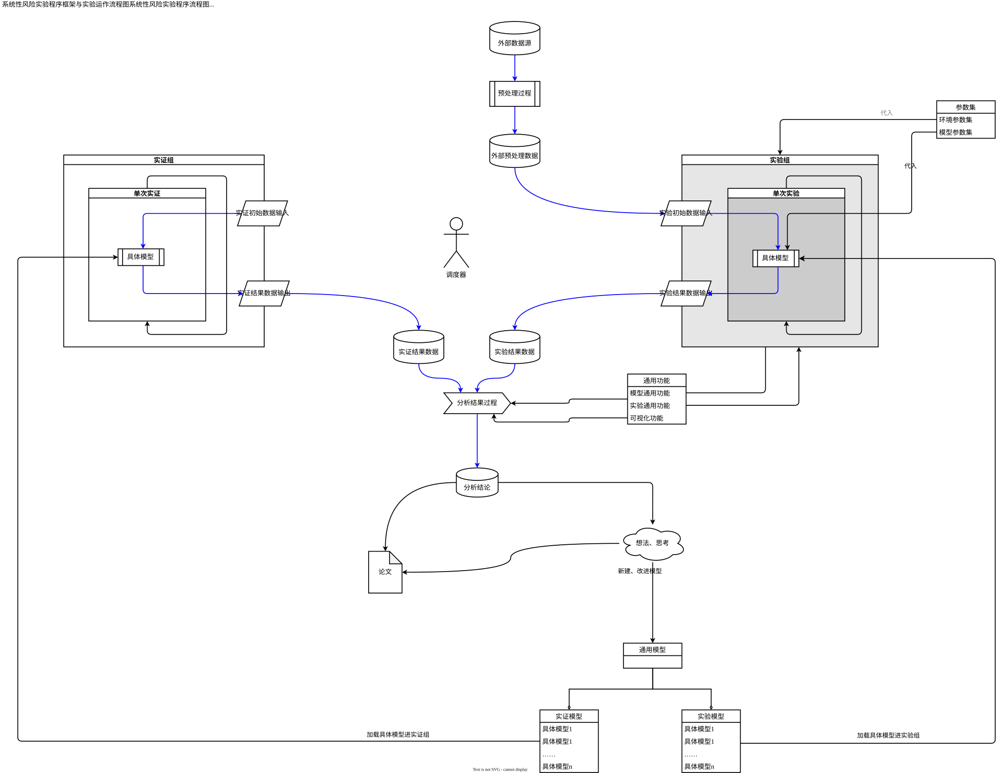
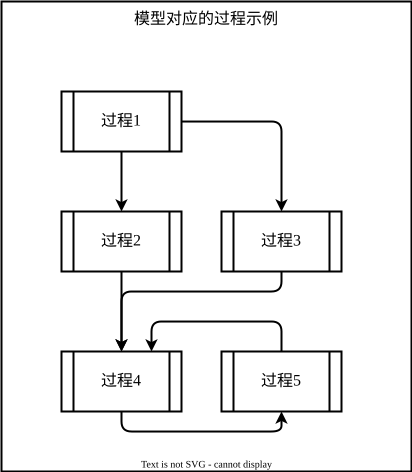
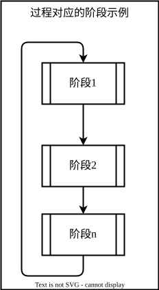

# SystemicRiskSimulator

当前版本：`v0.0.45_alpha`

## 项目简介

系统性风险模拟器。主要使用的方法是多主体建模方法。

## 安装

### 依赖项

- Python 3.11
- pip

### 安装步骤

1. 安装 Python 3.11 ；
2. 从[gitee]()克隆仓库到本地；
3. 进入项目目录；
4. 新建一个新的 `venv` 环境
5. 打开终端，安装依赖项 `pip install -r requirements.txt`

如果安装出错，请告知开发者。

## 使用方法

### 基本使用

## 项目结构

### 总体架构

#TODO

### 实验框架图

## 常见问题解答

## 贡献指南

## 许可证

## 更新日志

### 其它说明：

#TODO README所描述的流程图已经过时，等后续补充。

