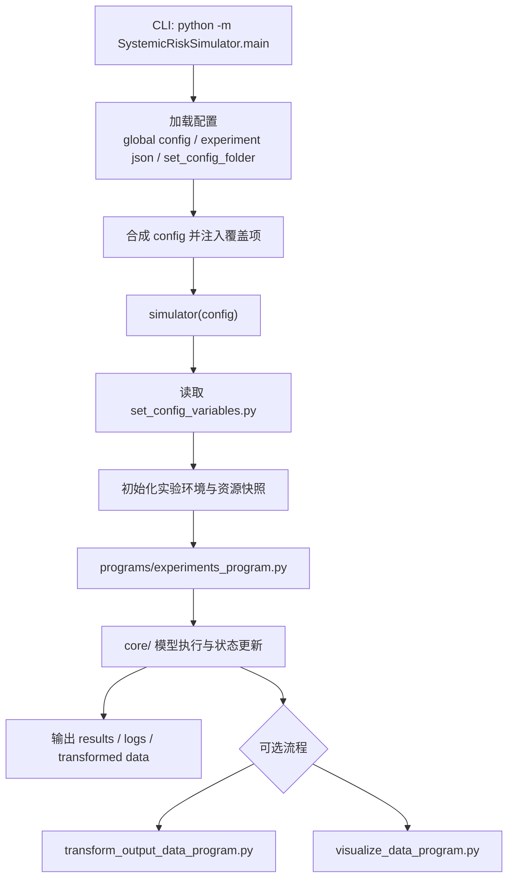

# SystemicRiskSimulator

当前版本：`v0.1.0`

## 项目简介

`SystemicRiskSimulator` 是一个面向金融系统性风险研究的模拟器，核心方法为多主体建模（ABM），并支持可选的 Gymnasium/RL 扩展流程。

- 统一入口：`SystemicRiskSimulator/main.py`
- 核心运行函数：`simulator(config)`
- 典型实验流程：读取配置 -> 复制实验资源快照 -> 运行实验程序 -> 输出结果

## 安装

### 依赖项

- Python 3.13
- pip（建议最新稳定版）
- venv（Python 内置）
- Git

### 安装步骤

1. 克隆仓库（GitHub）：

```powershell
git clone https://github.com/ComplexScienceLab/SystemicRiskSimulator.git
cd SystemicRiskSimulator
```

2. 创建并激活虚拟环境（venv）：

```powershell
python -m venv .venv
.\.venv\Scripts\Activate.ps1
```

3. 安装依赖：

```powershell
python -m pip install --upgrade pip
pip install -r requirements.txt
```

如果安装过程中出现问题，请提交 Issue 或联系维护者。

## 使用方法

### 基本使用

推荐通过模块入口运行：`python -m SystemicRiskSimulator.main`

1. 使用全局配置 `config.json` 选择实验：

```powershell
python -m SystemicRiskSimulator.main --global-config config.json --experiment ib2111
```

2. 直接指定实验 JSON：

```powershell
python -m SystemicRiskSimulator.main --experiment-json Samples/exp/exp_sample_IB2111.json
```

3. 兼容模式：直接指定 `set_config_variables.py` 所在目录：

```powershell
python -m SystemicRiskSimulator.main --set-config-folder Samples/libraries/configs_library/config_sample_IB2111
```

4. 通过 `--override` 覆盖配置项（可重复传入）：

```powershell
python -m SystemicRiskSimulator.main --global-config config.json --experiment ib2111 --override is_auto_confirmation=true --override test_max_num_of_turn=100
```

### Samples 运行前准备（重要）

很多 `Samples` 配置依赖预生成的 `agents/*.pkl` 与 `parameters.pkl`。建议先运行对应 sample 的生成脚本，再启动实验。

以 `IB2111` 为例：

```powershell
$env:PYTHONPATH='C:/Users/Ethan/CoreFiles/ProjectsFile/SystemicRiskSimulator'
cd Samples/libraries/agents_library/agents_sample_IB2111
python set_agents_variables.py

cd ../../parameters_library/parameters_sample_IB2111
python set_parameters_variables.py

cd ../../../../
python -m SystemicRiskSimulator.main --experiment-json Samples/exp/exp_sample_IB2111.json
```

### 输出说明

程序运行后会按配置生成实验输出目录，并在其中写入配置快照、日志与实验结果数据。请优先通过配置控制输出路径，不建议在运行中手动清理正在使用的输出目录。

## 项目结构

```text
SystemicRiskSimulator/
|- SystemicRiskSimulator/      # 核心包：core / programs / tools / main.py
|- data/                       # 历史兼容与模板目录（当前主流程可直接运行，不再强依赖其作为正式运行源）
|- Samples/                    # 样例配置、样例实验与样例数据
|- config.json                 # 全局实验入口配置（可选）
|- requirements.txt            # 依赖清单
|- pyproject.toml              # 包元数据与构建配置
```

## 文档索引

- 开发者指南：`docs/开发者指南.md`
- 用户手册：`docs/用户手册.md`
- API 手册：`docs/API手册.md`

## 当前迁移状态

1. 统一入口迁移：已完成。推荐使用 `python -m SystemicRiskSimulator.main`。
2. 运行时 `data/` 目录依赖：已弱化。当前通过 `runtime_model_import_source='external'` 与 `runtime_copy_resources_into_simulator_data=False` 支持直接运行。
3. `Samples/exp` 入口脚本：已兼容到 `SystemicRiskSimulator.main` 的 `simulator`。
4. JSON 配置替代 Python 配置：已具备基础能力（可通过 `--experiment-json` 选择 config），但本质仍依赖 `set_config_variables.py`，暂未做到“纯 JSON 全量配置”。
5. `model_sample_IB2111_improved`：已接入 `run_bank_interbank_cascade`，但当前仍需外部 `ComplexSystemLab` 依赖，且在部分参数下存在不收敛风险。

## 总体架构



## 实验框架图

### Mermaid（新增）


### 历史流程图（保留）


## 常见问题解答

- Q: 配置文件应该改哪里？
  - A: 优先通过 `config.json` 或实验 JSON 管理；实验细节在对应 `set_config_variables.py` 中维护。
- Q: 可以只跑部分实验吗？
  - A: 可以，使用 `--experiment` 选择目标实验，或在配置中设置实验 ID 范围。
- Q: 输出文件太多怎么办？
  - A: 优先开启压缩/精简导出配置，并将输出目录设置到独立磁盘路径。

## 贡献指南

欢迎提交 PR 或 Issue。建议流程：

1. Fork 并创建功能分支。
2. 在本地完成修改与基础验证。
3. 提交 PR，说明变更动机、影响范围和验证方式。

## 许可证

本项目使用 `GNU AGPLv3` 许可证。

## 更新日志

暂未在 README 维护更新日志，后续统一补充。

### 其它说明

README 中过时内容已完成本轮更新：
- 已补充新的 Mermaid 流程图；
- 已保留历史流程图作为参考；
- 原 TODO“README所描述的流程图已经过时，等后续补充。”已完成。
