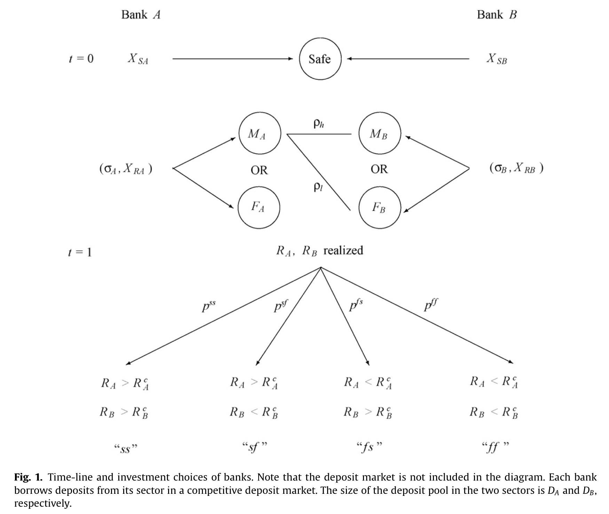

# A theory of systemic risk and design of prudential bank regulation

## Metadata

* Type: [[Article]]
* Authors: [[Viral V. Acharya]]
* Date: [[2009]]
* Date added: [[2020-05-02]]
* Publication: [[Journal of Financial Stability]]
* Cite key: Acharya_2009_Atheoryofsystemicriskanddesignofprudentialbankregulation
* Topics: [[课程论文]], [[系统性风险理论模型]]
* Related: 
* Tags: [[Zotero Import]], [[Systemic Risk]], [[Bank Regulation]], [[Capital Adequacy]], [[Crisis]], [[Risk-Shifting]], [[银行监管]]
* PDF Attachments: [Acharya_2009_A theory of systemic risk and design of prudential bank regulation.pdf](zotero://open-pdf/library/items/KCQTYU85)

### Abstract

 Systemic risk is modeled as the endogenously chosen correlation of returns on assets held by banks. The limited liability of banks and the presence of a negative externality of one bank’s failure on the health of other banks give rise to a systemic risk-shifting incentive where all banks undertake correlated investments, thereby increasing economy-wide aggregate risk. Regulatory mechanisms such as bank closure policy and capital adequacy requirements that are commonly based only on a bank’s own risk fail to mitigate aggregate risk-shifting incentives, and can, in fact, accentuate systemic risk. Prudential regulation is shown to operate at a collective level, regulating each bank as a function of both its joint (correlated) risk with other banks as well as its individual (bank-specific) risk.

## 摘要

系统性风险被建模为银行所持有资产收益的内生选择的相关性。 银行的有限责任以及一个银行对其他银行健康状况的负面外部性的负面影响，导致了一种系统的风险转移激励机制，所有银行都进行相关投资，从而增加了整个经济领域的总风险。 通常仅基于银行自身风险的银行关闭政策和资本充足要求之类的监管机制无法减轻总体风险转移诱因，并且实际上会加剧系统性风险。 审慎监管在集体层面上发挥了作用，根据与其他银行的共同（相关）风险以及其个人（特定于银行的）风险对每个银行进行监管。

## 综述

## 模型

在我们的模型中，银行可以使用简单债务合同形式的存款。 借款时，银行投资于风险和安全资产。 此外，他们选择进行风险投资的“行业”。 不同银行对行业的选择决定了其投资组合收益的相关性。 当处于均衡状态时，银行倾向于向类似行业贷款，因此系统性风险是内生性后果

我们建立了一个具有许多代理的多时期一般均衡模型，即。银行和储户以及许多市场。安全和风险资产的市场以及存款市场。为了研究系统性风险及其审慎监管，该模型纳入了（i）银行对存款违约的可能性； （ii）一家银行倒闭导致的财务外部性； （iii）监管激励措施； （iv）这些功能的相互作用。该模型建立在气泡和危机的Allen and Gale（2000a）模型的基础上，该模型是一种风险转移的单周期，单投资者模型。该模型的示意图如图1所示。

每个银行投资两种资产：

- 安全资产
- 风险资产

安全资产收益是单调递增衰减的。

风险资产在$t=0$开始单位投资回报是$R_{it} \in [0,R_{max}]$。

两家银行都投资同一个行业的**风险投资的回报相关性**$\rho_h$大于分别投资两个行业的相关性$\rho_l$。

TODO