# The Nexus of Monetary Policy and Shadow Banking in China

# Metadata

* Item Type: [[Article]]
* Authors: [[Kaiji Chen]], [[Jue Ren]], [[Tao Zha]]
* Date: [[2018-12-01]]
* Date Added: [[2021-04-10]]
* URL: [10.1257/aer.20170133](10.1257/aer.20170133)
* DOI: [10.1257/aer.20170133](https://doi.org/10.1257/aer.20170133)
* Cite key: Chen2018
* Topics: [[影子银行]], [[货币政策]]
* Tags: 
* PDF Attachments
  - [Chen_Ren et al_2018_The Nexus of Monetary Policy and Shadow Banking in China.pdf](zotero://open-pdf/library/items/H8D38ZUA)

# Abstract

We study how monetary policy in China influences banks’ shadow banking activities. We develop and estimate the endogenously switching monetary policy rule that is based on institutional facts and at the same time tractable in the spirit of Taylor (1993). This development, along with two newly constructed micro banking datasets, enables us to establish the following empirical evidence. Contractionary monetary policy during 2009–2015 caused shadow banking loans to rise rapidly, offsetting the expected decline of traditional bank loans and hampering the effectiveness of monetary policy on total bank credit. We advance a theoretical explanation of our empirical findings. (JEL E32, E52, G21, O16, O23, P24, P34)


#  Zotero links

* [Local library](zotero://select/items/1_NGL2JAN8)
* [Cloud library](http://zotero.org/users/6240833/items/NGL2JAN8)


# 笔记

## 文章类别

货币政策有效性分析。


## 基本观点


在中国现有的银行系统中，影子银行的增长阻碍了紧缩性货币政策对银行总体信贷的抑制作用，应进行银行系统改革。


## 研究过程


现实：

为应对2008年国际金融危机，首先，中国政府于2008年11月宣布实施“四万亿”投资计划，之后，中国人民银行于2009-2015年间实施紧缩性货币政策，收紧M2货币供给。该货币政策旨在对冲财政刺激期间的高信贷供给。事实上，根据总体时间序列数据可知，2009年到2015年间，M2供给和银行传统贷款的增长均有所下降，但同时，影子银行贷款也在上升。

影子银行贷款占总信贷份额已达到20%左右，其中，委托贷款占总信贷份额达到10%以上


问题：

  \1. 中国2009-2015年紧缩性货币政策政策如何影响银行系统信贷情况，即探究紧缩性货币政策与影子银行增长及银行贷款下降的因果关系？

  \2. 由于银行系统的总体信贷为传统银行贷款和影子银行贷款之和，2009-2015年实施的紧缩性货币政策是否达到控制银行系统总体信贷的预期目标，即在现有的银行系统下，检验货币政策实现央行预期目标的有效性？


政策建议：

- 对于银监会来说，按M2增长情况置于相应的总体信贷上的限制
- 对于国务院和中国人民银行，使用利率作为中间目标，移除LDR限制，加强资本充足度的要求（调整ARIX类中细节资产的风险）


# 摘录


### 【香樟推文1382】The Nexus of Monetary Policy and Shadow Banking

何克润 香樟经济学术圈 *2019-03-11*

**原文信息**：*Chen, K., Ren, J., & Zha, T. (2018). The Nexus of Monetary Policy and Shadow Banking in China. American Economic Review, 108(12), 3891–3936. https://doi.org/10.1257/aer.20170133*


**本文发表于《American Economic Review》2018年12月，作者Kaiji Chen, Jue Ren和Tao Zha。属于货币政策有效性分析类。其基本观点为：在中国现有的银行系统中，影子银行的增长阻碍了紧缩性货币政策对银行总体信贷的抑制作用，应进行银行系统改革****。**


01

—


#### 研究动机


为应对2008年国际金融危机，首先，中国政府于2008年11月宣布实施“四万亿”投资计划，之后，中国人民银行于2009-2015年间实施紧缩性货币政策，收紧M2货币供给。该货币政策旨在对冲财政刺激期间的高信贷供给。事实上，根据总体时间序列数据可知，2009年到2015年间，M2供给和银行传统贷款的增长均有所下降（见图1面板A），但同时，影子银行贷款也在上升（见图1面板B）。


**具体来说，2013-2015年间，影子银行贷款占总信贷的份额已增长到20%左右（见图1面板C），其中，委托贷款占总信贷的份额达到10%以上（见图1面板D）。**


**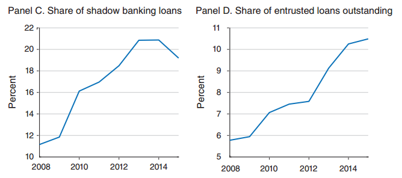**


基于以上事实，这里有两个问题需要探究：

  \1. 中国2009-2015年紧缩性货币政策政策如何影响银行系统信贷情况，即探究紧缩性货币政策与影子银行增长及银行贷款下降的因果关系？

  \2. 由于银行系统的总体信贷为传统银行贷款和影子银行贷款之和，2009-2015年实施的紧缩性货币政策是否达到控制银行系统总体信贷的预期目标，即在现有的银行系统下，检验货币政策实现央行预期目标的有效性？


02

—


#### 研究逻辑与基本结果


为回答以上问题，本文基于文献Jiménez et al. (2014)，使用两个自建的微观数据集对中国2009-2015年紧缩性货币政策进行实证分析发现，尽管紧缩性货币政策对传统银行贷款具有抑制作用，但对影子银行活动具有激励作用，同时鼓励银行以风险非贷款资产的形式将影子银行业务计入资产负债表内。之后，本文基于文献Bianchi and Bigio (2017)构建理论模型，并使用面板动态VAR估计并解释紧缩性货币政策激励银行通过增加风险非贷款资产来绕开监管要求的原因。以上实证和理论分析共同说明，在现有的银行系统下，影子银行的增加严重降低了货币政策对总体信贷的有效性。

  具体来说，本文研究框架如下：

  第一部分为中国银行系统与货币政策，首先分别引入量化货币政策、影子银行（紧缩性货币政策时期）、国有非国有银行三个基本元素，然后通过整体路线图概述了中国银行系统与货币政策的制度性事实。

  第二部分为中国货币政策的估计，通过估计一个货币政策规则来构建外生M2增长的时间序列，从而描述了货币政策的变量与数据来源。

  第三部分为关于影子银行表内表外的微观数据集，其中，表外数据集为委托贷款（Entrusted Loan）的季度面板数据集，表内数据则为关于银行资产（Bank Asset）的季度面板，这两个自建的新数据集共同交代了影子银行的变量与数据来源。

  第四部分为货币政策对影子银行业务的影响，由于在面对货币政策变动时，银行的影子银行业务具有两阶段的表现，即首先作为被动接受者（Passive Facilitators）调整表外委托贷款，然后转为主动参与者（Active Participants），将影子银行活动计入表内，因此本部分首先对货币政策变动对表外影子银行活动的影响进行面板回归，然后对以上分析进行稳健性检验，之后通过面板回归分析货币政策对表内影子银行活动的影响，最后分析表内和表外业务之间的联系，从而为本文的货币政策有效性分析提供了微观实证基础。

  第五部分为银行系统中货币政策的有效性，首先以第四部分的实证结果为基本假设，构建动态理论模型，之后以以上理论模型为基础结合文献Romer and Romer (2004)的方法构建面板动态VAR计量模型，使用之前的数据集检验货币政策在现有银行系统中的有效性（即2009-2015年紧缩性是否达到降低银行系统总体信贷的预期效果）。

  最后一部分为结论，总结本文结果并提出政策建议与研究展望。

  本文具体的展开细节见下文。


03

—


#### 中国银行系统&货币政策的制度性事实


一国货币政策、银行系统以及银行业监管要求的不同既决定了其货币政策控制总信贷的有效性差异，同时也是本文实证和理论研究的制度性基础。鉴于此，本部分呈现了如下三方面制度性事实：

- 中国的量化货币政策的运行机制
- 2009-2015年间（紧缩性货币政策时期）影子银行活动增加的制度性事实
- 非国有和国有银行的影子银行活动在表外表内所表现的差异（原文称为“Institutional Asymmetry制度性非对称”）


 对于中国货币政策的描述可总结为“三个指标，两个工具，两个要求”。

​    具体来说，“三个指标”是指货币政策的两个最终目标，即每年3月由国务院发布的政府工作报告中的预期GDP增长率（如2019年为6%-6.5%）和CPI涨幅（如2019年为3%左右）（如图2面板A和B为2001-2015年预期GDP增长率和CPI涨幅）。


唯一的中间目标，即保持CPI稳定的情况下，为实现预期GDP增长率而由国务院设定的M2增长目标。事实上，人民银行根据经济增长条件按季度调整M2增长率，并与国务院设定的M2增长目标一致，因此，实际年度M2增长和预期年度M2增长率基本一致（如图3面板A和B）。


  “两个工具”是指中国人民银行为达到M2增长目标而使用的两个主要的货币政策工具：公开市场业务和存款准备金制度。

公开市场操作是指中央银行在公开市场上买卖有价证券以影响M2增长率的活动，1998年5月被中国人民银行将其引入，通过20多年的发展，该工具已成为人民银行调控货币供给的常规性手段。截止2015年5月，公开市场一级交易商已达到46个，包括银行和一些非银行金融机构。从交易品种看，中国人民银行公开市场业务债券交易主要包括回购交易、现券交易和发行中央银行票据。其中回购交易分为正回购和逆回购两种，正回购为中国人民银行向一级交易商卖出有价证券，并约定在未来特定日期买回有价证券的交易行为，正回购为央行从市场收回流动性的操作，正回购到期则为央行向市场投放流动性的操作；逆回购为中国人民银行向一级交易商购买有价证券，并约定在未来特定日期将有价证券卖给一级交易商的交易行为，逆回购为央行向市场上投放流动性的操作，逆回购到期则为央行从市场收回流动性的操作。现券交易分为现券买断和现券卖断两种，前者为央行直接从二级市场买入债券，一次性地投放基础货币；后者为央行直接卖出持有债券，一次性地回笼基础货币。中央银行票据即中国人民银行发行的短期债券，央行通过发行央行票据可以回笼基础货币，央行票据到期则体现为投放基础货币。

存款准备金制度是指中央银行通过调整法定存款准备金率，影响金融机构的信贷资金供应能力，从而间接调控M2增长率。该制度建立于1984年，但由于调整法定准备金率对信贷作用较为猛烈，相比公开市场业务更少变动，不能作为中国人民银行季度性政策工具。因此，正如文献Leeper et al.(1996)认为，由于超额准备金的波动更为较大，法定准备金变动不能作为衡量货币供给扩张或收缩的有效统计量。以上观点反映了中国的情形（如图4面板A和B）。


“两个要求”是指LDR上限要求和安全贷款要求。

​      LDR上限要求建立于1994年，是为了控制商业银行贷款的规模，即要求商业银行必须将存贷比保持在75%以下。如果无法满足，商业银行将以高价吸收额外存款，被称为“重拾点”增加存款以满足LDR要求。当货币政策变动时，由于LDR要求导致的银行贷款的下降，被称为“银行借贷渠道”（Bank lending channel）。

安全贷款要求于2010年建立，是为了控制商业银行贷款的质量，即限制银行贷款对高金融风险行业（如房地产等）的流向。这使得银行增加风险非贷资产的投资。

对于影子银行方面的描述，总结为两方面表现：表外方面与表内方面。

表外影子银行方面，主要表现为委托贷款业务。自2009-2015年，委托贷款已成为第二大贷款源，仅次于传统银行贷款。1997年，中国人民银行允许开展委托贷款业务。银行及非银行机构作为委托商（Trustee），其开展委托贷款业务流程总结如下：


另外，与银行贷款相比，委托贷款的到期日要短于传统贷款，但由于具有更高的风险，收益率要高于传统贷款，如下表1所示：


表内影子银行方面，主要体现在ARIX（Account Receivable Investment excluding central bank bills and government bonds）资产中。这个资产分类将影子银行业务以风险非贷款资产形式计入会计平衡表内。因此这类资产不受到LDR和安全资产限制。ARIX其中一项资产便是委托贷款，对于非国有银行来说，委托贷款占ARIX的比重达到78.04%。

对于银行来说，在中国最主要的特点便是是否具有国有属性。这个属性将银行分成两类：国有银行和非国有银行。

国有银行是中央政府直接控股，包括中国工商银行、中国银行，中国建设银行，中国农业银行以及交通银行。其他的银行则为非国有银行，如浦发银行、北京银行等。其中，2015年非国有银行占银行系统的资产份额为47.38%，权益份额为47.22%。

对于商业银行来说，需要遵守三个主要监管要求：资本要求，准备金要求以及LDR要求。这三项要求在非国有和国有银行中的表现如下表2：

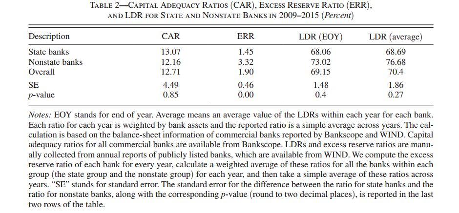

可以看到，非国有和国有银行在资本要求（资本充足比率）的差异并不显著，而准备金方面则具有显著差异，非国有银行具有更高的超额储备金，是否超过LDR限制方面，则不统计显著。综上所述，这些监管要求并不能解释影子银行业务在国有和非国有银行间的差异。

结合以上中国货币政策和银行系统的基本元素，得到如下路线图：

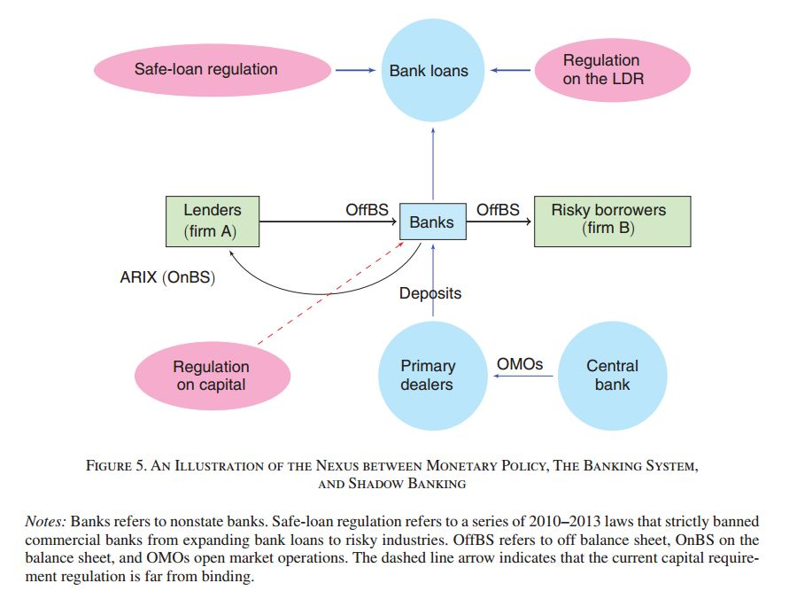

从右下角中央银行开始，与一级交易商在公开市场进行交易，一级交易商将存款存入商业银行，商业银行一方面作为中间委托商向两个企业（企业A和B）间进行委托贷款交易，另一方面提供传统贷款业务，其中传统贷款收到安全贷款和LDR监管限制，同时银行自身还收到资本充足性限制。


04

—


#### 中国货币政策的估计


货币政策包括两部分：预期内的货币供给内生增长和预期外的货币供给外生增长部分。为分析货币政策对影子银行活动增加的影响，必须进行时间序列分解，将预期外的货币供给外生增长部分抽取出来。正如实证文献(Leeper et al. 1996; Christiano, Eichenbaum, and Evans 1999, 2005; Sims and Zha 2006)一样。基于此本部分通过估计一个符合中国国情的货币政策规则来得到外生M2增长的时间序列。

  首先，货币政策规则方面，最经典的货币规则便是“泰勒利率规则”（Taylor 1993），但不适用于中国国情，原因有二：（1）中国是新兴经济体，其转移动态由投资驱动的非平衡增长路径刻画（Chang et al. 2016），因此无法定义趋势增长部分；（2）中国货币政策中间目标不是利率，而是M2增长率。因此无法使用利率规则。鉴于此，本文根据中国货币政策操作逻辑：每年年末，中央政府设定下一年的M2增长率（保持和下一年的预期年度经济增长率一致）；每季度末，人民银行货币委员会（MPC）决定下一季度的M2增长率 ，根据本季度的CPI通胀指数 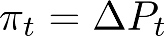 和实际季度GDP增长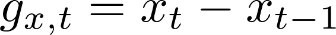 与预期经济增长目标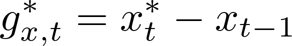之间的差异，其中上标星号均表示预期目标值。国务院设定GDP增长率下限作为实际增长目标，如果季度实际GDP大于目标值，如果通货膨胀问题不严重，则MPC将增加M2增长，以迎合实际产出增长。这种机制称为“货币政策的内生切换规则”，即总结模型如下：


其中， 为服从正态分布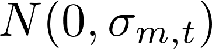的独立随机波动序列。为通货膨胀系数，产出系数如下：


其中，上标“a”代表在预期目标之上，“b”为预期目标之下。这些系数对应货币政策相对于产出增长的两种状态：（1）正常状态，即实际GDP增长率达到政府设定的经济增长目标；（2）缺口状态，即实际GDP增长率低于政府设定的经济增长目标。当处于正常状态时，产出系数为正，否则为负。所对应的方差如下：


本文使用2000年第一季度到2016年第二季度数据，进行最大似然估计（如Hamilton 1994），得出结果如下表：


可以看出，所有系数估计均1%内显著，M2增长的一阶惯性系数为0.39个百分点，说明货币政策具有温和的一阶惯性。通货膨胀系数为负值，意味着每年提高1%的通货膨胀，年均M2增长率下降1.6（=0.04*4）个百分点。由可知，当实际GDP增长高于目标值，每高出1%，年均M2增长率增加0.72（=0.18*4）个百分点；由可知，当实际GDP增长低于目标值，每低出1%，年均M2增长率增加5.20（=1.30*4）个百分点。这说明中国货币政策在面临增长缺口时，表现得更为激进。同时，和

的估计值意味着产出缺口时期的货币政策波动是正常时期的2（=0.010/0.005）倍。

  然后，基于以上估计式，将年度M2增长序列分解出M2增长的内生（图2面板C）和外生部分（图2面板D）如下：

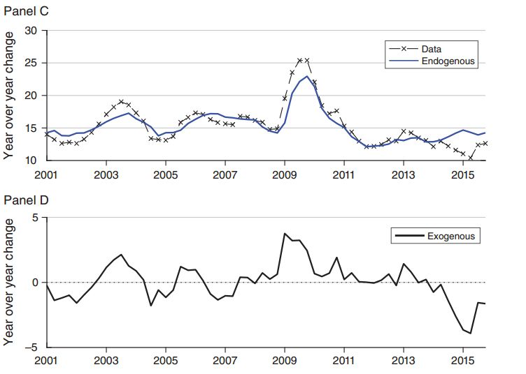

由面板C可知，内生M2增长部分与实际数据较为接近，说明中国M2增长的变动大部分是由政策当局的内生反应机制导致的。面板D为外生M2增长，即为实际M2增长率与内生增长率的差额。如上图知，自2009年后，内生和外生M2增长均稳步下降。外生M2序列为分析2009-2015年紧缩性货币政策对影子银行活动（包括表外影子银行产品和表内风险非贷资产）的影响，提供了货币政策的数据基础。


05

—


#### 影子银行微观数据集


为从微观角度实证分析货币政策对影子银行的影响，一方面需要反映货币政策的时间序列数据（上一部分已给出），另一方面需要关于影子银行活动的银行微观层面数据，这就是本部分所关注的部分。此部分交代了两个自建的银行微观数据集，用于反映了影子银行活动中银行表外和表内的表现。

表外影子银行活动，主要通过委托贷款的交易数据来反映，涉及到两个非金融企业和一个委托商之间的贷款交易情况。通过整理A股上市公司季度披露报告和Bankscope数据库得到该面板数据集，其样本时间区间为2009-2015年，以委托商单次贷款交易为观测个体，季度为时间单位，包含80个银行（5个国有银行和75个非国有银行）和45个非银行金融机构，共1379个观测点。具体形式如下图（红线方框内为委托商所披露的委托贷款情形：总委托贷款额和平均委托贷款额的对数形式，其他财务指标来自Bankscope）：


表内影子银行活动，主要通过ARIX持有情况反映。通过阅读整理上市银行年报和Bankscope数据库得到如下季度面板数据集，以银行为观测个体，共16个。（红线方框部分为ARIX持有量的对数形式）

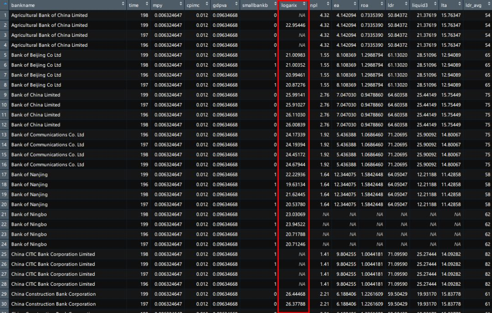

以上数据集的具体构造过程可参考原文附录。


06

—


#### 货币政策对影子银行的影响

现在，本文将回答第一个重要问题：货币政策变动对影子银行活动具有怎样的影响？因此，本部分将进行实证分析货币政策变动对影子银行活动的影响，发现国有和非国有银行在表外表内均表现出显著差异，同时非国有银行具有将表外影子银行业务转移到表内的过程。

**在表外影子银行方面**，使用以上的委托贷款数据集，进行如下面板回归：

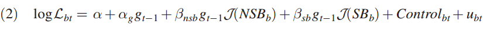

其中，代表非国有银行，代表国有银行；当委托商为非国有银行时，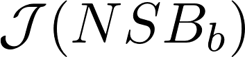取1，否则取0，当委托商为国有银行时，取1，否则取0；下标“bt”代表委托商b在时刻t，为在时刻t，与委托商b相关的委托贷款总额；是上一年的外生M2供给增长率；扰动项为；控制变量组为，包括上一年的GDP增长率, 上一年GDP平减指数的变动和委托商的类型（和），得到回归结果见下表4：


上表第一列使用583个委托商2009年一季度到2015年到第四季度的全样本。从边际效应来看，系数反映非银行委托商的委托贷款对货币政策变动的边际效应，系数为正且10%水平下统计显著，说明非银行委托商的委托贷款增长率和外生M2增长率同向变动，即在货币政策紧缩时期，非银行委托商并未积极参与增加委托贷款业务。系数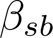表示国有银行委托商面对货币政策变动时，其委托贷款业务的边际效应，统计不显著，意味货币政策紧缩时期，其委托贷款业务并未增长。系数为非国有银行委托商面对货币政策变动时委托贷款业务的边际调整效应，系数符号为负且高度统计显著，说明，当非国有银行委托商在面对M2增长率下降时，将增加委托贷款业务。从总效应来看，1个百分点的外生M2增长下降对国有银行委托商委托贷款减少的总影响为17.42个百分点（在10%水平下统计显著），与之对应的非国有银行的表现则有所不同，反而增加委托贷款，每1%的外生M2增长的减少，平均增加10.65%的委托贷款欧额，以下为表中第一列的stata代码： 

- 
- 
- 
- 

```
***Table 4 column (1)***xtreg log_sum_loan  smallbankb mpy_smallbankb largebankb mpy_largebankb mpy cpimc gdpva,robustlincom mpy + mpy_smalllincom mpy + mpy_largebankb
```

虽然以上第一列的得到初步结果，但仍然需要稳健性检验，待检验的问题如下：

1. 紧缩性货币政策导致的委托贷款额的增加到底是来自交易次数（反映贷款广度的增加，由于委托商的多样化风险分散策略）的增加还是平均贷款额（反映贷款强度，强度越大风险越高，本文想要的）的增加？
1. 在面对紧缩性货币政策下，国有和非国有属性是否能大致刻画两类银行委托商在委托贷款方面的反应？即其他银行属性，如财务指标衡量的属性对这种行为差异的影响如何？

基于问题A，本文将模型（2）中的解释变量的委托贷款总额替换为委托贷款平均额，得如下模型：


其中，表示为委托商b在t时刻所委托的平均委托贷款额。得到结果如下表第一列：

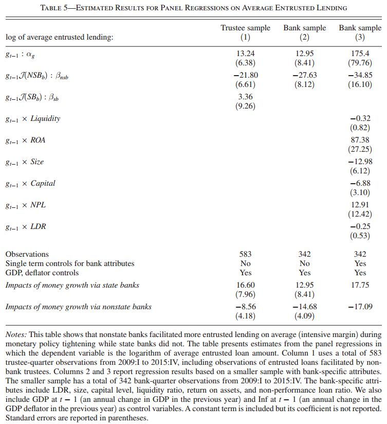

对比表4第一列可知，得到的结果基本一致。其stata代码如下：

- 
- 
- 
- 

```
***Table 5 column (1)***xtreg log_avg_loan   smallbankb mpy_smallbankb largebankb mpy_largebankb mpy cpimc gdpva,robustlincom mpy + mpy_smalllincom mpy + mpy_largebankb
```


至于第二个问题，将样本范围缩小为银行委托商，基于文献Kashyap and Stein (2000)和Jiménez et al.(2014)把银行的财务指标，如LDR，size，liquidity和capital position作为新增的控制变量，所对应的中国情形具体指标为 LDR ，总资产的对数值，权益-资产比率，流动资产比率，资产收益率ROA，不良贷款率NPL，其描述性统计结果如下表6：


此时，其模型表现如下：


基于以上模型，得到表4表5的第三列结果，并不能发现LDR（统计不显著）是影响委托贷款的重要因素。而Size和ROA是显著的，即无法反应银行的资产规模和收益率，但即使控制了这些因素，仍然高度显著，即委托贷款的需求并不受制于银行的国有非国有属性。更进一步，那些非国有属性所导致的货币政策-委托贷款效应有多大呢？为方便比较，使用相同的小样本，得到表4表5的第二列，可知，没有控制其他银行财务属性的非国有银行总效应为-14.00（-14.68），但控制其他财务指标后，则为-17.97（-17.09），但后者并不显著，因此综上所述，得出稳健后的结论：

- 当面临货币政策紧缩时，非国有银行委托贷款业务将增长，但国有银行则随之下降。这种现象称为委托贷款的“制度非对称性”。
- 以上的“制度非对称性”基本可以用银行的国有属性来刻画，与银行本身的财务属性无关。


**在表内影子银行方面**，银行作为“主动参与者”，将影子银行产品计入会计平衡表内。鉴于此，本部分将实证分析影子银行的表内活动。

使用银行资产数据集，估计如下面板回归模型：


其中，代表银行b在时刻t的ARIX，控制变量包括,和。回归结果见表7：

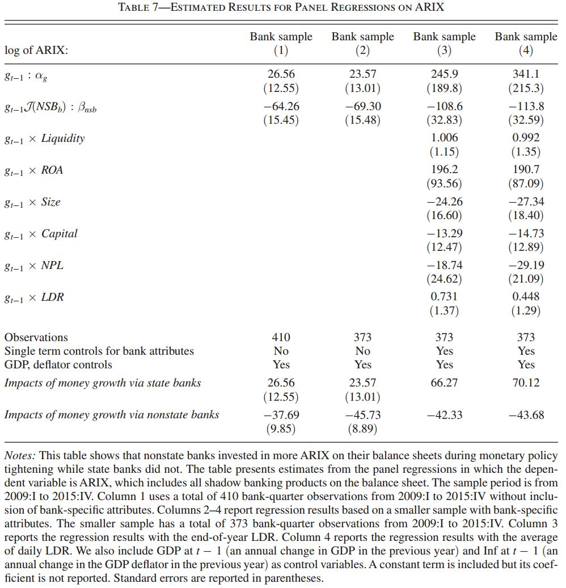

上表第一列为没有控制银行其他财务属性的结果，发现国有银行在面对货币政策紧缩时，减少其ARIX持有量，具体来说，M2增长率每下降1%，ARIX持有量平均减少26.56%；而非国有银行则与之相反，即M2增长率每下降1%，ARIX持有量平均增加37.69%，以上结果均显著。综上所述，当面临货币政策紧缩时，非国有银行增加ARIX投资，而国有银行则不然。

现在，想知道银行类型指标是否仍然可以较好地说明ARIX的制度非对称性，因此，将表6的银行财务指标的单项和与外生M2增长变动的交互项加入控制变量组中，由于数据缺失原因，原有的410个观测值减少为373个，此时，新的样本下所得到的回归（不含银行其他财务指标）结果显示，1%的M2增长率下降，导致45.73%的非国有银行ARIX增加（与未缩减样本前不同，为37.69%，但方向相同，相差仍可接受，未改变基本结论）。之后加入银行财务指标及与M2增长变动的交互项作为控制变量组，得到表7第三列和第四列，其中第三列中的LDR为期末值，第四列则为LDR平均值，可以看出，估计的国有银行和非国有银行的关于M2增长的ARIX效应均不统计显著。

另外，由于委托贷款是影子银行贷款的组成部分，因此，之前，对非国有银行的影子银行业务的影响可能存在低估。为了确定低估的程度，比较基于委托贷款数据集和基于资产数据集的两个回归结果，即表4中的第三列估计值为17.97个百分点，表7第三列估计值为42.33个百分点，由于委托贷款数据集中为流量，资产数据集为存量，因此，17.97转换为存量为35.51（=（1+0.1797）*0.3010）个百分点。其中30.10%为ARIX平均季度增长率，由此看出，虽然根据委托贷款所估计的影子银行效应被低估了，但低估的程度并不大。即使使用为包含银行财务指标的样本，也可得到类似结果。

综上所述，我们可以得到和表外方面类似的结论如下：

- 当面临货币政策紧缩时，非国有和国有银行在ARIX投资行为中也表现不一致：非国有银行增加ARIX投资，而国有银行则减少其投资；也存在ARIX投资上的制度非对称性。
- 以上的“制度非对称性”基本可以用银行的国有属性来刻画，与银行本身的财务属性无关。
- 另外，面对紧缩性货币政策，ARIX投资的情形也进一步验证了之前所估计的非国有银行表外委托贷款的行为。


**在表外和表内的联系方面，**即说明非国有银行既是“被动应对者”也是“主动参与者”，他们参与委托贷款的表外影子银行业务，同时将这些业务以ARIX资产形式计入会计平衡表内。因此，对2009-2015年间的委托贷款业务（流量）和ARIX增量（流量）进行相关性分析得下表8：


由表8第一行可知，非国有银行的委托贷款与ARIX增量显著正相关（0.621），国有银行也一样（0.224）。由第二行可知，对非国有银行而言，ARIX占总信贷的份额ARIX/(ARIX+B)与委托贷款的相关性也保持以上相同的结果（0.458），但对国有银行而言，ARIX占总信贷的份额的相关性结果则有所不同，显著负相关（-0.179）。因此，可以知道，非国有银行具有将影子银行业务计入表内的偏好，但国有银行则不然。正如下图8所示：


由图7可知，2009-2015年，国有银行ARIX占总信贷的份额保持在3%左右，而非国有银行自2011年后大幅增加，至2015年已接近30%。这说明，对于非国有银行来说，ARIX在其总信贷中具有重要地位，而国有银行则不然。更细节的信息参见下表9：

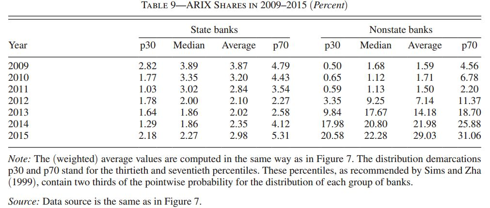

综上得出结论：

- 银行将表外影子银行的业务计入表内ARIX投资，尤其是非国有银行在这方面的表现非常明显。

07

—


#### 中国银行系统中货币政策的有效性

当面对货币政策紧缩时，非国有银行首先在表外增加委托贷款等影子银行业务（“被动应对者”），然后将这些影子银行业务以ARIX投资形式计入表内（“主动参与者”）。但紧缩性货币政策的实施是为了降低银行总体信贷（传统贷款+影子银行贷款），那么该货币政策是否达到预期还有待检验。因此，本部分将建立理论模型并使用结构VAR分析中国货币政策的有效性。

**理论模型方面，**即非国有银行在面对货币政策冲击时，如何进行最优化配置银行贷款和ARIX投资的组合。模型的主要设定如下：

首先设定**货币政策冲击**，直接影响经济中的存款总量。由外生货币供给增长（由于之前已经知道货币政策冲击与存款准备金无关，因此的变动仅仅通过公开市场业务来实现）表示如下：


然后，得出货币政策冲击对存款总量的影响，即货币政策冲击影响异质性存款退出比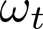的下限。由于的波动较少（年均变动在-0.05到0.05之间），因此根据以上定义式可推出的近似式如下：

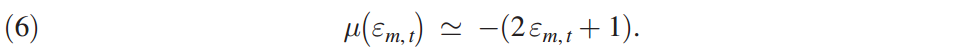

这意味着紧缩性货币政策通过改变异质性存款退出的分布而导致存款总量的下降。这与下图8的2009年后的实际情况也一致。

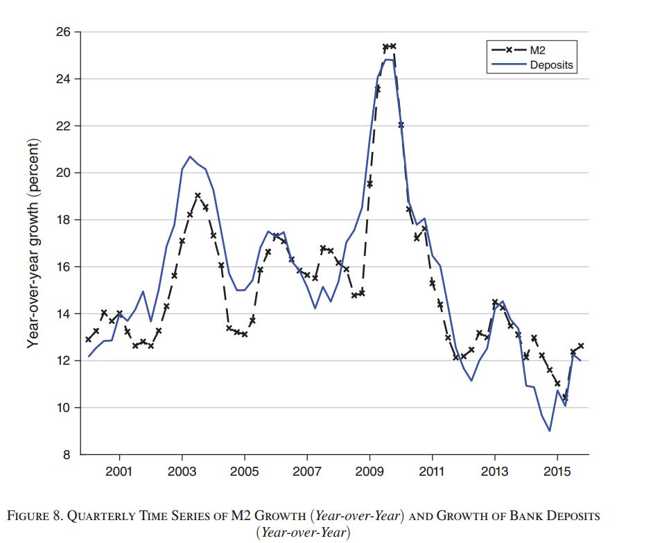

然后，设定银行**最优投资组合配置**方面，即基于文献Bianchi and Bigio (2017)建模当公开市场业务导致的货币政策变动时，银行如何进行最优投资组合配置以及其总体信贷的反应。

基本思路是将每个银行决策分为两个时期：借贷时期（Lending Stage）与平衡时期（Balancing Stage），对这两个时期进行无限期跨期叠代，得到最优资产配置和总体信贷情况。

首先，**借贷阶段**的设定，如下图所示：


在每期期初，中央银行实施紧缩性货币政策即下降，在公开市场出售央行债券给一级交易商，并在期内对其进行短期流动性贷款，贷款额等于新增的债券额。（上图左为资产，右为负债）。

此时，银行观测到央行在公开市场上的操作，预期到一级交易商存款退出的风险上升，即上升，因此开始进行以下三方面的决策：

- 存款需求
- 红利分配
- 投资组合：跨期银行贷款，风险非贷投资（即ARIX投资），现金

其中，银行贷款为安全资产，无违约风险，但收到LDR限制，其跨期贴现价格为


风险非贷资产为风险资产，存在违约风险，但不受LDR限制，其跨期贴现价格为


然后，**平衡阶段**的设定，有两个随机事件：存款退出冲击和风险非贷资产违约冲击。

存款退出冲击方面，如下图所示：


在此阶段，一级交易商通过提取商业银行的存款去偿付央行的贷款。正如以上央行和一级交易商的资产负债表所示。对于银行个体来说，该行为形成了异质性存款退出冲击（idiosyncratic withdrawal shocks）。此时，新的LDR跨期限制，表示如下：


其中，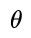为政府设定的LDR上限；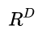为存款利率；左边为贷款的现值，右边为存款退出冲击后留存的存款贴现值。当存款不能满足上述LDR限制时，银行将花费额外成本去弥补存款缺口，存款缺口记为：

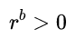

弥补缺口的额外成本表示如下：


其中，为获得额外一单位存款所花费的成本。


ARIX违约冲击方面，违约冲击表示成如下随机过程：


其中，表示违约状态下，风险非贷资产的收回率。

因此，综上所述，在每期期末，银行初始状态为（C,B,D），接下来进入借贷阶段，遭遇公开市场操作的货币政策冲击后，根据对存款退出冲击的预期进行DIV，C，B，D，I^r 最优配置，之后进入平衡阶段，遭遇真正的存款退出冲击和违约冲击，此时，银行通过花费额外成本弥补存款缺口，形成新的（C，B，D）。可表示如下图：


现在，考虑优化问题，即在借贷阶段的最优投资组合问题和平衡阶段的迭代问题

首先是**借贷阶段的优化问题**，表示如下：

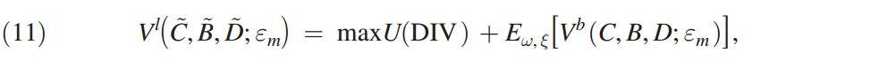


其中，表示借贷阶段的值函数，表示平衡阶段的值函数；表示银行的效用函数，表示关于的条件数学期望。银行面对的外生变量为，在（12）-（16）的限制下，通过选择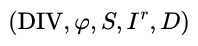来求解最优化问题（11）。

对于（12）-（16）的预算限制，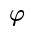代表银行额外持有的现金，代表已被偿付的贷款。代表新增的贷款，因此，方程（12）为资金流限制，方程（13）代表杠杆限制，其中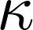代表杠杆率；方程（14）为流动性限制，为流动比率；方程（15）为现金积累方程，方程（16）则为贷款积累方程。

然后是**平衡阶段的迭代问题**，表示如下：


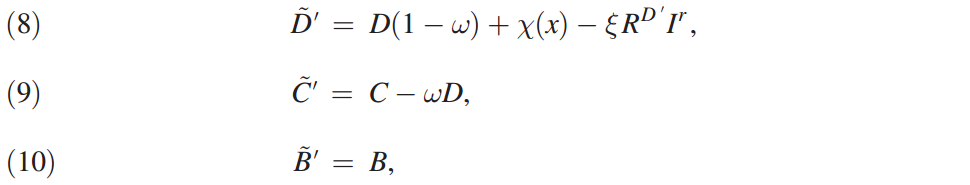

其中，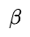为主观贴现因子，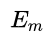为关于货币政策冲击的数学期望，方程（8），（9）和（10）分别为平衡时期中存款，现金，和贷款的动态积累方程。


通过结合两个阶段，得到如下的总的优化模型：


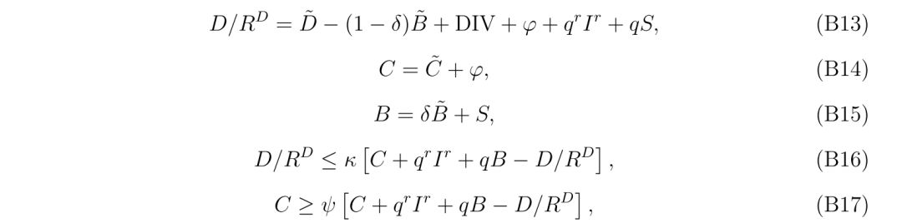

即在B13-B17的条件下，通过选择求解B22问题，得出如下条件：


即紧缩性货币政策实施后，将造成存款退出风险增加，从而增加预期监管成本，这往往降低银行贷款的有效回报。由如下无套利条件：


可知，贷款有效回报率的降低会导致银行用风险非贷投资替代贷款业务。

另外，紧缩性货币政策也对总体信贷（贷款和风险非贷资产的总和）具有动态影响。如下命题可知：

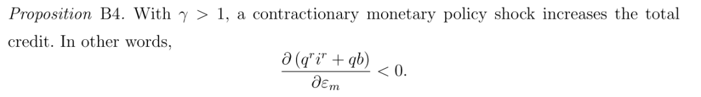

当风险厌恶系数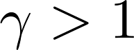时，紧缩性货币政策导致预期监管成本上升，降低了银行股权的收益率，产生两个效应：

（1）收入效应：股权收益率下降，使得股利分配后权益增加。

（2）替代效应：今天的权益增加，导致明天的权益替代，从而使得银行倾向于减少储蓄需求。

当收入效应大于替代效应时，银行通过增加风险非贷资产弥补存款缺口导致的额外成本增加总信贷，否则则不然。

虽然有以上的理论分析，但是对2009-2015年货币政策对总体信贷控制是否有效还需进行实证检验，即接下来的结构VAR估计部门。

**结构VAR估计方面，**即估计货币政策变动对银行总信贷的动态效应。使用之前的银行微观数据集，进行如下结构VAR模型估计：

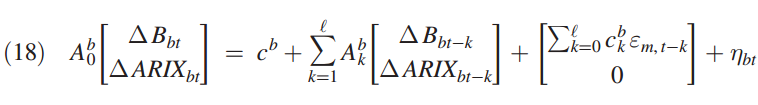

其中，上标b代表银行个体b，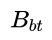代表银行b在时刻t的银行贷款，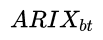代表银行b在时刻t的ARIX持有，为i.i.d扰动向量，代表除货币政策冲击以外的其他冲击，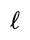

为滞后阶数，设为4（一年），对于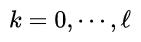，有


滞后变量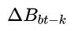和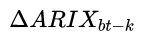用于反映不同到期日下已偿付的贷款对当前贷款和ARIX持有的影响，控制了这些效应后，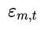的动态影响仅仅反映对新增贷款和新投资的影响。由于缺失ARIX早些年的数据，因此本样本区间仅为2011年第一季度到2015年第四季度。基于此，使用最大似然估计得到如下结果，见图9：


可以看到，面对货币政策紧缩，银行贷款稳步下降，而ARIX则上升，并在第四季度到达顶点（2.5%），根据误差带可知，以上结果均统计显著。此时，总体信贷在第一年逐步增长，显著增加大于0，但之后变得统计不显著。从中央银行视角来看，紧缩性货币政策对银行系统的影响，由于ARIX持有上升效应抵消了银行贷款的下降效应，从而是无效率的。
   基于以上结论，本文提出如下政策建议：

- 对于银监会来说，按M2增长情况置于相应的总体信贷上的限制

- 对于国务院和中国人民银行，使用利率作为中间目标，移除LDR限制，加强资本充足度的要求（调整ARIX类中细节资产的风险）

  

08

—


结论

**实证方面**：2009-2015年紧缩性货币政策导致银行系统中，表外影子银行业务（委托贷款）和表内影子银行业务（ARIX风险投资）的上升。

**理论部分**：紧缩性货币政策降低银行贷款，同时增加非国有银行风险非贷资产，以绕过LDR和安全资产监管要求。

**文献分类**：中国银行借贷渠道如何影响实体经济？中国金融自由化如何削弱政府政策的有效性？Brunnermeier, Sockin, 和Xiong (2017)


09

—


原文附录：摘要&结论

**Abstract**

> *We study how monetary policy in China influences banks’ shadow banking activities. We develop and estimate the endogenously switching monetary policy rule that is based on institutional facts and at the same time tractable in the spirit of Taylor (1993). This development, along with two newly constructed micro banking datasets, enables us to establish the following empirical evidence. Contractionary monetary policy during 2009–2015 caused shadow banking loans to rise rapidly, offsetting the expected decline of traditional bank loans and hampering the effectiveness of monetary policy on total bank credit. We advance a theoretical explanation of our empirical findings.*

**Conclusion**

>  *The rapid rise of shadow banking induced incentives for China’s banking sector to bring the shadow banking risk onto its balance sheet. In this paper, we establish empirical evidence that contractionary monetary policy during 2009–2015 caused the rise of both shadow banking lending off-balance sheet and risky assets in the form of ARIX in the banking system. Grounded in China’s institutional facts, we estimate the tractable monetary policy rule and obtain a time series of monetary policy shocks. This time series, together with the two micro banking datasets we constructed, enables us to perform robust analyses on our findings, especially about the role nonstate banks played in shadow banking activities both off and on the balance sheet. Our theory shows that while contractionary monetary policy reduces bank loans as expected, it simultaneously encourages nonstate banks to increase investments in risky nonloan assets to circumvent the LDR and safe-loan regulations to which bank loans are subject.*
>
>  *Our research focuses on the banking sector: how monetary policy affects the asset side of banks’ balance sheets. It abstracts from other important issues. One issue is how the bank lending channel is transmitted into the real economy. It is possible that the transmission mechanism for bank loans differs materially from transmission for ARIX holdings. The importance of this topic merits future research.*
>
>  *Another issue relates to policy reforms. In a recent paper, Brunnermeier, Sockin, and Xiong (2017) provide a discussion on how financing flexibility may erode the effectiveness of the government’s well-intended policies. In particular, they argue that China’s liberalized financial system, by loosening financial regulations on the shadow banking system, does not allow its government to experiment with a temporary stimulus such as the post-2008 stimulus program, that can be easily reversed afterward. Our paper provides strong empirical support for their argument and is consistent with calls for establishing a macroprudential framework to coordinate with monetary policy while financial markets are liberalized. Although our empirical findings are specific to China, we hope that their broad policy implications as well as our empirical methodology for analyzing the banking data will be useful for studies on other economies.*

10

—


参考文献


*[1] Allen, Franklin, Yiming Qian, Guoqian Tu, and Frank Yu. Forthcoming. “Entrusted Loans: A Close Look at China’s Shadow Banking System.”Journal of Financial Economics.
[2] Bianchi, Javier, and Saki Bigio. 2017. “Banks, Liquidity Management, and Monetary Policy.” NBER Working Paper 20490.
[3] Brunnermeier, Markus K., Michael Sockin, and Wei Xiong. 2017. “China’s Gradualistic Approach: Does It Work for Financial Development?”American Economic Review 107 (5): 608–13.
[4] Chang, Chun, Kaiji Chen, Daniel F. Waggoner, and Tao Zha. 2016. “Trends and Cycles in China’s Macroeconomy.”**inNBER Macroeconomics Annual, Vol. 30, edited by Martin Eichenbaum and Jonathon Parker, 1–84. Chicago: University of Chicago Press.
[5] Chen, Kaiji, Patrick Higgins, Daniel F. Waggoner, and Tao Zha. 2017. “Impacts of Monetary Stimulus on Credit Allocation and Macroeconomy: Evidence from China.” NBER Working Paper 22650.
[6] Chen, Kaiji, Jue Ren, and Tao Zha. 2018. “The Nexus of Monetary Policy and Shadow Banking in China: Dataset.”American Economic Review. https://doi.org/10.1257/aer.20170133.
[7] Chen, Kaiji, Tong Xu, and Tao Zha. 2017. “Optimal Monetary Policy Applicable to China.” Unpublished.
[8] Chen, Zhou, Zhiguo He, and Chun Liu. 2017. “The Financing of Local Government in China: Stimulus Loan Wanes and Shadow Banking Waxes.” NBER Working Paper 23598.
[9] Christiano, Lawrence J., Martin S. Eichenbaum, and Charles L. Evans. 1999. “Monetary Policy Shocks: What Have We Learned and to What End?” InHandbook of Macroeconomics, Vol. 1A, edited by John B. Taylor and Michael Woodford, 65–148. Amsterdam: Elsevier.
[10] Christiano, Lawrence J., Martin S. Eichenbaum, and Charles L. Evans. 2005. “Nominal Rigidities and the Dynamic Effects of a Shock to Monetary Policy.”Journal of Political Economy 113 (1): 1–45.
[11] Fernandez, Roque B. 1981. “A Methodological Note on the Estimation of Time Series.” Review of Economics and Statistics 63 (3): 471–76.
[12] Hachem, Kinda Cheryl, and Zheng Michael Song. 2016. “Liquidity Regulation and Unintended Financial Transformation.” NBER Working Paper 21880.
[13] Hamilton, James D. 1994. Time Series Analysis. Princeton, NJ: Princeton University Press.
[14] Higgins, Patrick, and Tao Zha. 2015. “China’s Macroeconomic Time Series: Methods and Implications.” Unpublished.
[15] Jiménez, Gabriel, Steven Ongena, José-Luis Peydró, and Jesús Saurina. 2014. “Hazardous Times for Monetary Policy: What Do Twenty-Three Million Bank Loans Say about the Effects of Monetary Policy on Credit Risk-Taking?”Econometrica 82 (2): 463–05.
[16] Kahneman, Daniel, and Amos Tversky. 1979. “Prospect Theory: An Analysis of Decision under Risk.” Econometrica 47 (2): 263–91.
[17] Kashyap, Anil K., and Jeremy C. Stein. 2000. “What Do a Million Observations on Banks Say about the Transmission of Monetary Policy?”American Economic Review 90 (3): 407–28.
[18] Leeper, Eric M., Christopher A. Sims, Tao Zha, Robert E. Hall, and Ben S. Bernanke. 1996. “What Does Monetary Policy Do?”Brookings Papers on Economic Activity 1996 (2): 1–78.
[19] Li, Bing, and Qing Liu. 2017. “On the Choice of Monetary Policy Rules for China: A Bayesian DSGE Approach.”China Economic Review 44: 166–85.
[20] Romer, Christina D., and David H. Romer. 2004. “A New Measure of Monetary Shocks: Derivation and Implications.”American Economic Review 94 (4): 1055–84.
[21] Rotemberg, Julio J., and Michael Woodford. 1997. “An Optimization-Based Economic Framework for the Evolution of Monetary Policy.”NBER Macroeconomic Annual, Vol. 12, edited by Ben S. Bernake and Julio Rotemberg, 297–346. Chicago: University of Chicago Press. Rubio-Ramírez, Juan F., Daniel F. [22] Waggoner, and Tao Zha. 2010. “Structural Vector Autoregressions: Theory of Identification and Algorithms of Inference.”Review of Economic Studies 77 (2): 665–96.
[23] Sargent, Thomas J., and Paolo Surico. 2011. “Two Illustrations of the Quantity Theory of Money: Breakdowns and Revivals.”American Economic Review 101 (1): 109–28.
[24] Sims, Christopher A., and Tao Zha. 1999. “Error Bands for Impulse Responses.” Econometrica 67 (5): 1113–55.
[25] Sims, Christopher A., and Tao Zha. 2006. “Were There Regime Switches in US Monetary Policy?” American Economic Review 96 (1): 54–81.
[26] Taylor, John B. 1993. “Discretion versus Policy Rules in Practice.” Carnegie-Rochester Conference Series on Public Policy39: 195–214.
[27] Waggoner, Daniel F., and Tao Zha. 2003. “A Gibbs Sampler for Structural Vector Autoregressions.” Journal of Economic Dynamics and Control 28 (2): 349–66.
[28] Xiaochun, Zhou. 2016. “Managing Multi-Objective Monetary Policy: From the Perspective of Transition Chinese Economy.” Michel Camedssus Speech presented at International Monetary Fund, Washington, DC.*