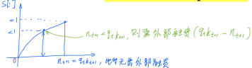

# The financial accelerator in an estimated New Keynesian model

![[Christensen2008-zotero#Metadata]]

Other files:

* Mdnotes File Name: [[Christensen2008]]
* Metadata File Name: [[Christensen2008-zotero]]

##  Zotero links

* [Local library](zotero://select/items/1_8F36HGAF)
* [Cloud library](http://zotero.org/users/6240833/items/8F36HGAF)

## Notes

##### 企业家

企业家的假设：

- 每时期存在固定的生存率（退出率）；

企业家存在的行为：

- 根据一些判据，企业家决策是否还贷或者违约；

加总值之于企业家净价值，组成如下：
$$
n_{t+1}=\color{blue}{\nu v_{t}}+ \color{red}{(1-\nu) g_{t}}
\tag{14}
$$
其中，
$n$：资本净值；
$\nu$：企业家跨期生存率；
红色表示获得所有资本，获得由失败退出的企业家那儿；
蓝色表示自身净值，获得由上一期；
$g_{t}$：从失败退出的企业家那儿获得转移支付的价值；
$v_{t}$：自身创造的净价值。定义为
$$
v_{t}=\left[\color{blue}{f_{t}} q_{t-1} k_{t} - \color{red}{E_{t-1} f_{t}} \color{green}{\left(q_{t-1} k_{t}-n_{t}\right)} \right]
\tag{15}
$$

其中，
$\color{blue}{f_t}$：事后估计的实际回报，对于资本被持有于时期$t$来说；
$\color{green}{\left(q_{t-1} k_{t}-n_{t}\right)}$：需要外部融资的部分，于上一期，相对于本期来说；
$\color{red}{E_{t-1} f_{t}}$：外部融资成本（实际利率隐含为贷款合同，签署于时期$t-1$）。定义为
$$
E_{t} f_{t+1} := E_{t}\left[\color{blue}{S(\cdot)} R_{t} / \pi_{t+1}\right]
\tag{11}
$$
其中，
$f_t$：预测的边际外部融资成本，对于持有的资本在时期$t$来说；
$R_t/\pi_{t+1}$：期望的实际利率；

其中，外部融资溢价$\color{blue}{S(\cdot)}$：
$$
\begin{array}{l}
S(\cdot)=S\left(\frac{n_{t+1}}{q_{t} k_{t+1}}\right), \\
S^{\prime}(\cdot)<0 \text { and } S(1)=1
\end{array}
\tag{12}
$$
当分式的比值$\frac{n_{t+1}}{q_{t} k_{t+1}}$下降时，意味着$n_{t+1}<q_t k_{t+1}$，则企业家需要外部融资$(q_t k_{t+1} - n_{t+1})$，此时$S(\cdot)<1$，示意图

，企业家依赖于无担保借款（高杠杆）在更大程度上为项目融资，这样使得借贷风险增加。

结合(11)(12)，可以得对数线性化的外部融资率：
$$
\hat{f}_{t+1}=\hat{R}_{t}-\hat{\pi}_{t+1}+\psi\left(\hat{q}_{t}+\hat{k}_{t+1}-\hat{n}_{t+1}\right)
$$
其中，$\psi$表示弹性，即外部融资溢价相对于企业家的杠杆状况变化的弹性。

企业家的资本需求量，依赖于：

1. 期望边际回报；

2. 本期之期望边际外部融资成本$E_{t} f_{t+1}$。

   

$$
E_{t} f_{t+1}=E_{t}\left[\frac{\color{blue}{z_{t+1}}+\color{green}{(1-\delta)q_{t+1}} }{q_{t}}\right]
\tag{10}
$$
其中，分子表示下一期资本价值。其中，蓝色表示单位资本产出，绿色表示上一期单位资本折余。
分母表示本期单位资本价值。
整个式子可以理解为如果跨期之间的单位资本量的差距，如果下一期资本价值相比本期资本价值更多，则多出来的比例被等同于一种相对的成本，这种成本称为外部融资成本。

约束条件：

企业家的资本需求由以下决定：

资本需求约束：

$$
E_{t} f_{t+1}=E_{t}\left[S(\cdot) R_{t} / \pi_{t+1}\right]
\tag{11}
$$

其中，$S(\cdot)$：外部融资溢价的变换函数；

技术约束：规模报酬不变的技术：
$$
y_{t} \leqslant k_{t}^{\alpha}\left(A_{t} h_{t}\right)^{1-\alpha}, \quad \alpha \in(0,1)
\tag{16}
$$

##### 资本家

资本家调整资本存在成本，其目标是追求最大化利润：
$$
\max _{i_{t}} E_{t}\left[q_{t} x_{t} i_{t}-i_{t}-\frac{\chi}{2}\left(\frac{i_{t}}{k_{t}}-\delta\right)^{2} k_{t}\right]
$$
其中，最优条件，暨standard Tobin’s Q equation
$$
E_{t}\left[q_{t} x_{t}-1-\chi\left(\frac{i_{t}}{k_{t}}-\delta\right)\right]=0
\tag{22}
$$
资本家的资本供给量给企业家，是由以下决定：
$$
E_{t}\left[q_{t} x_{t}-1-\chi\left(\frac{i_{t}}{k_{t}}-\delta\right)\right]=0
\tag{22}
$$
其中，
$$
k_{t+1}=x_{t} i_{t}+(1-\delta) k_{t}
$$

$$
\log \left(x_{t}\right)=\rho_{x} \log \left(x_{t-1}\right)+\varepsilon_{x t}
$$

where $\rho_{x} \in(-1,1)$ is an autoregressive coefficient, and $\varepsilon_{x t}$ is normally distributed with mean zero and standard deviation $\sigma_{x}$

##### 零售商

零售业仅用于将名义刚性引入该经济体。 零售商以等于企业家名义边际成本的价格从企业家那里购买批发商品，并无成本地区分它们。 然后，他们在垄断竞争的市场中出售这些差异化的零售产品。 根据Calvo（1983）和Yun（1996），我们假设除非零售商收到随机信号，否则他们无法重新优化其销售价格。 接收到这样的信号的恒定概率为（1-φ）。 因此，每个零售商j设置价格，～p t（j），该价格在l个时期内使预期利润最大化。 因此，l = 1 /（1-φ）是价格保持不变的平均时间长度。 但是，零售商j必须以概率φ收取前一时期以稳态总通货膨胀率π为指标的有效价格。 在时间t处，如果零售商j收到重新优化的信号，它会选择价格～p t（j），以使其折扣最大化，即在其价格固定的间隔内的预期实际总利润。

$$
\max _{\left\{\tilde{p}_{t}(j)\right\}} E_{0}\left[\sum_{l=0}^{\infty}(\beta \phi)^{l} \lambda_{t+l} \Omega_{t+l}(j) / p_{t+l}\right]
\tag{25}
$$

