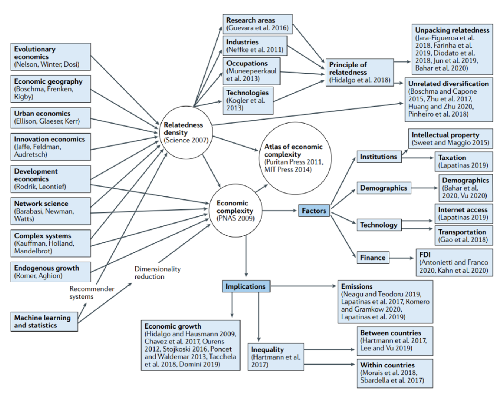

# Economic complexity theory and applications

# Metadata

* Item Type: [[Article]]
* Authors: [[César A. Hidalgo]]
* Date: [[02/2021]]
* Date Added: [[2021-03-17]]
* URL: [http://www.nature.com/articles/s42254-020-00275-1](http://www.nature.com/articles/s42254-020-00275-1)
* DOI: [10.1038/s42254-020-00275-1](https://doi.org/10.1038/s42254-020-00275-1)
* Cite key: Hidalgo2021
* Topics: [[【综述】]]
* Tags: #学科:经济学, #方向：复杂性理论, #zotero, #literature-notes, #reference
* PDF Attachments
	- [Hidalgo - 2021 - Economic complexity theory and applications.pdf](zotero://open-pdf/library/items/CZQLRHLU)

# Abstract

Economic complexity methods have become popular tools in economic geography, international development and innovation studies. Here, I review economic complexity theory and applications, with a particular focus on two streams of literature: the literature on relatedness, which focuses on the evolution of specialization patterns, and the literature on metrics of economic complexity, which uses dimensionality reduction techniques to create metrics of economic sophistication that are predictive of variations in income, economic growth, emissions and income inequality.

#  Zotero links
* [Local library](zotero://select/items/1_CE5GRHZ8)
* [Cloud library](http://zotero.org/users/6240833/items/CE5GRHZ8)

# Highlights and Annotations

- [[Hidalgo2021 - ]]

