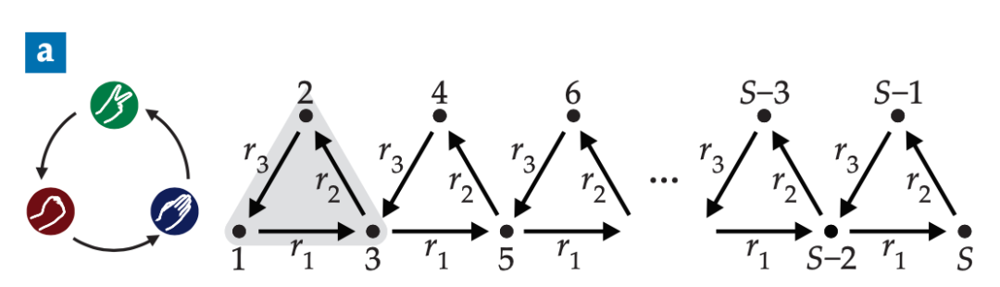
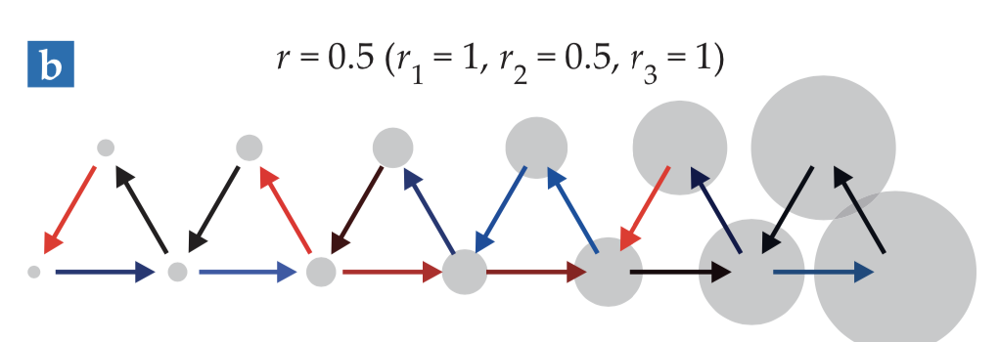
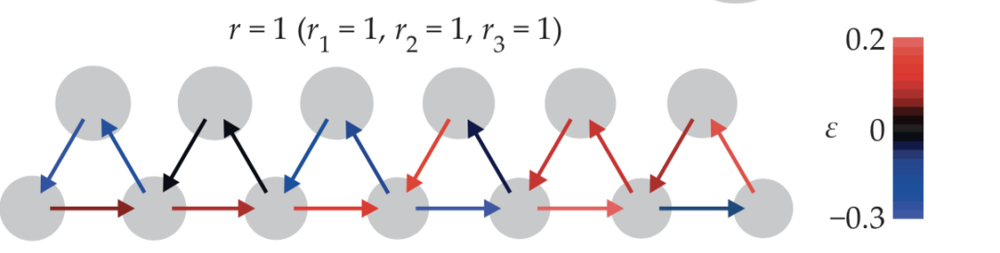

# Topological phases emerge in an ecological model

![[Hill_2021_Topological phases emerge in an ecological model-zotero#Metadata]]

Other files:
* Mdnotes File Name: [[Hill_2021_Topological phases emerge in an ecological model]]
* Metadata File Name: [[Hill_2021_Topological phases emerge in an ecological model-zotero]]

##  Zotero links
* [Local library](zotero://select/items/1_VEPQXDLP)
* [Cloud library](http://zotero.org/users/6240833/items/VEPQXDLP)

## Notes
- 

## 借助拓扑学，解释生态系统中的种群变化

Original Heather Hill 集智俱乐部 *3/17*

**导语**

***\*拓扑学在过去50年间被广泛应用于凝聚态物理的研究中，量子霍尔效应、拓扑绝缘体等发现中均表现出拓扑的物性。在拓扑态中，物质的行为体现来源于能带的连通性而不是对称性，而拓扑学提供了研究物质行为的新方式。近期，研究人员开始探索其他领域中系统的拓扑效应，德国慕尼黑大学的 Erwin Frey 和他的小组成员在一个生态模型中确定了拓扑相的存在。这项工作揭示出拓扑学在其他动态生物系统中的潜力。\****

Heather Hill **| 作者**潘佳栋 **| 译者**刘培源 **| 审校**

邓一雪 **| 编辑**

# 原文题目：Topological phases emerge in an ecological model原文地址：https://physicstoday.scitation.org/doi/full/10.1063/PT.3.4695 

当一列波（例如电子波函数）绕着一条拓扑非平凡路径运动时，它在完成闭环后将得到一个相，而不是回到初始状态。虽然在细节上，带状结构的拓扑是复杂而难以理解的，但其重要特征是局部的动态激发（dynamic excitations）在系统边界处的涌现。即使在有缺陷的情况下，这种激发也是稳定的，这就是所谓的鲁棒性。

 

研究者已经在讨论除了凝聚态物质外，其他系统的拓扑效应，包括自推进粒子[1]、大气和海洋中的波[2]。

 

#   

###   ***\*1. 剪刀石头布游戏\****   

Frey的研究生Johannes Knebel受到机械超材料拓扑相的启发，开始探索其他可能存在拓扑态的系统。Knebel与Frey的另一位学生Philipp Geiger一直在研究**反对称的Lotka-Volterra方程****（ALVE，又称捕食者-猎物方程）**。ALVE是研究许多动态系统时会用到的模型，以生态学为例，ALVE被用于研究种群个体数量的动态变化：捕食者和猎物的关系如何影响种群增长。Frey小组近期用粒子替代物种，来以ALVE来预测在高能量状态下玻色·爱因斯坦凝聚物的形成。[4]

 

 

 

**ALVE也可以用来描述博弈论中的一部分：石头剪刀布循环**。将石头剪刀布游戏中的3种动作作为三角形的3个点，通过箭头表明获胜的动作。在石头剪刀布的循环中，每个动作都会以一定概率获胜或失败。**在种群动力学的计算中，三角形的每个点代表一个物种，箭头代表物种间物质流动的速率**，即一种物种数量的减小导致另一个物种数量的增加。每一个循环都是三个物种间物质传递的局域振子。

 

单独的循环，例如第一个（图1中灰色突出显示的部分），可以组成不同的几何图形，每个物种占据一个顶点。给定不同物种质量的初始组成后，点之间发生非线性相互作用，物种的质量组成会发生变化。**质量传递模型模拟了系统的种群动力学。**

 

 图1 ：石头剪刀布循环中S个物种的相互作用

 

当Frey的小组开始寻找石头剪刀布循环的二维结构中的拓扑性时，他们观察到手型边缘态（chiral edge states）的存在，类似于二维冷原子格点的拓扑模式。但是，很难将这些观察和拓扑学严格关联起来。在了解拓扑学中的基本内容后，研究人员转向了一个更简单的系统：一维链（1D chain）。

#   

###   ***\*2. 一维链的极化行为\****   

图2显示了一维剪刀石头布循环的一种数值结果。初始状态下，总质量均匀分布在整个链上，通过对计算进行归一化，使得所有试验的传输率r1=1。然后，研究人员改变偏度r=r2/r3的值。

 

图2：偏度为0.5时的一维石头剪刀布链，质量的时间平均分布在右侧[3]

 

当r<1时，质量的时间平均分布（灰色圆圈）在右侧，而当r>1时，平均质量分布在左侧。尽管质量平均值是稳定的，但是系统并未处于静止状态，而是保持动态并围绕该平均值波动。研究人员称这种行为为质量极化：平均质量变得局域化，并随着距链边缘距离的增大，呈指数级下降。**从生态角度看，这代表一个物种主导了栖息地。**

 

偏斜度独立地决定质量极化。r1的值以及r2和r3的特殊值会改变质量分布的数值，但是不能改变质量分布的相对大小。而且，极化状态的出现与初始质量分布和速率的随机扰动ε无关，如图3中箭头的颜色所示。即使在链的最高节点之间添加耦合，质量分布的相对大小也不会发生改变。

 

 

图3：偏度为1时，质量均匀地分布在整个链条上[3]

 

当r=1时，左右极化态之间会发生跃迁，没有任何一种物种能主导栖息地，并且时间平均质量分布不会集中在链中的一个点上。在图3中，平均质量的分布将保持其初始状态，即质量均匀分布在整个链上。如果质量最初限制在几个位置上，则平均质量在空间中沿链条移动时会保持相同的形状。链上两个这样的质量包，在相互作用后仍保持其形状和速度，其行为类似于孤子。

 

极化状态和过渡态的特征本质上是拓扑的，这使Frey及其团队感到惊讶。在大多数非线性动力学模型中，系统的行为较多地受到参数变化的影响，并且通常会耗散或变得混乱，这与观察到的行为相反。

 

#   

###   ***\*3. 如何用拓扑学解释结果？\****   

为了使用拓扑结构解释他们的观察结果以及将ALVE和凝聚态物理联系起来，研究人员计算了一维石头剪刀布链的能带结构（energy band structure）的等效值[5]。首先，他们以S-by-S反对称矩阵的形式对相互作用进行公式化，找到了特征值和特征向量，并从中发现了能带结构。

 

由于其汉密尔顿对称性，石头剪刀布模型与一维超导的Alexei Kitaev模型有关。正如Alexei Kitaev模型一样，一个不变量表征了能带结构的拓扑。拓扑不变量的一个例子是亏格（genus），它按照表面上的孔数量对几何图形进行分类。甜甜圈和咖啡杯具有相同的亏格，因此可以从一种形状平滑地变形为另一种形状。但是，甜甜圈不能顺利地变形为具有不同亏格的球体。r<1和r>1这两个偏度状态的拓扑不变量具有不同的值，因此这两个偏度状态是不同的拓扑相。这些拓扑相体现在系统边界的质量极化状态中。

 

拓扑态是否会出现在现实生活中的生物或生态系统中还有待观察。有希望的候选者是**基因调控网络**，它由一系列控制细胞内基因表达的分子组成。**如果拓扑态存在，那么该网络能够在调节选定的基因的同时，不受外部干扰和噪声影响。**

 

Frey和他的学生们计划将他们的方法应用于其他动态系统，特别是随机系统。Frey说，他希望能够将拓扑相的重要想法提供给广大的生物和软凝聚态物理学的读者。他解释说：“我相信，将研究方法从一个物理学领域转移到另一个领域，仍然是最鼓舞人心的创新之一。”

 

**参考文献：**

\1. A. Souslov, B. C. van Zuiden, D. Bartolo, V. Vitelli, Nat. Phys. 13, 1091 (2017).

\2. P. Delplace, J. B. Marston, A. Venaille, Sci- ence 358, 1075 (2017).

\3. J. Knebel, P. M. Geiger, E. Frey, Phys. Rev. Lett. 125, 258301 (2020).

\4. J. Knebel, M. F. Weber, T. Krüger, E. Frey, Nat. Commun. 6, 6977 (2015).

\5. A. Y. Kitaev, Phys.-Usp. 44, 131 (2001).    

  
[//begin]: # "Autogenerated link references for markdown compatibility"
[Hill_2021_Topological phases emerge in an ecological model]: Hill_2021_Topological phases emerge in an ecological model "Topological phases emerge in an ecological model"
[//end]: # "Autogenerated link references"