# Inter-GPS: Interpretable Geometry Problem Solving with Formal Language and Symbolic Reasoning

![[Lu2021-zotero#Metadata]]

Other files:
* Mdnotes File Name: [[Lu2021]]
* Metadata File Name: [[Lu2021-zotero]]

#  Zotero links
* [Local library](zotero://select/items/1_PS7LD4H4)
* [Cloud library](http://zotero.org/users/6240833/items/PS7LD4H4)

# Notes
- 

* Mdnotes File Name: [[Lu2021]]

# Comment- Accepted to ACL 2021, 13 pages, 6 figures

> 实现高级别的数学逻辑推理能力一直是通用人工智能追求的目标之一。近日，UCLA 联合浙江大学和中山大学的研究者提出了首个基于符号推理的几何数学题求解器 Inter-GPS。Inter-GPS 将几何题的图片和文字解析为统一的形式语言，运用相关的几何定理，逐步进行符号推理直至预测出最终的答案。Inter-GPS 实现了 57.5% 的准确率，远超神经网络方法的 33.0% 的准确率。

机器之心发布，机器之心编辑部。

几十年来，如何让人工智能算法具备复杂的数学推理能力，像人类一样求解各种数学题，一直是科学家们追求的目标。其中，求解几何数学题就是一项非常具有挑战的任务。求解几何题，算法需要理解题目的文字和图形信息，识别丰富的几何元素和关系，运用相关的几何定理，完成一系列的数值计算，直至求解出最终的问题答案。 

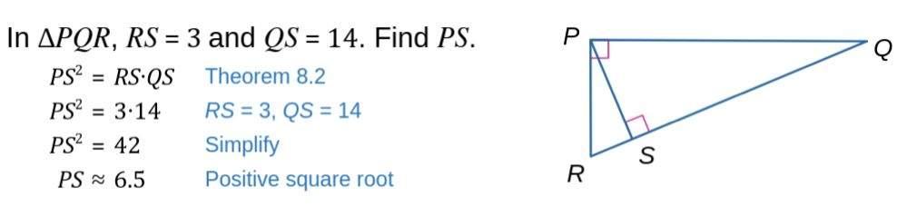一道典型的几何数学题。

心理学家和教育家的研究表明，**求解几何问题需要符号抽象和逻辑推理的高级思维能力。**人类在求解几何题的时候，会抽象出题目的结构化语义，从而完成后续的逻辑推理。形式语言是由基于一套符合特定规则的语句组成，通常用于语言学和数学领域。研究团队认为将几何题目输入解析为形式语言的描述是非常重要的。

来自 UCLA、浙江大学和中山大学等机构的联合研究团队提出了**一种基于形式语言和符号推理的、具有很强可解释性的几何解题方法：Inter-GPS。**

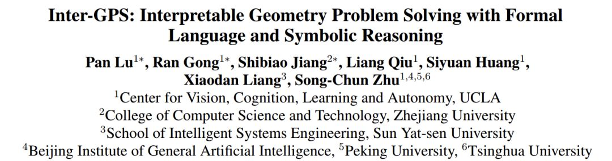

- 论文链接：[https://arxiv.org/pdf/2105.04165.pdf](https://link.zhihu.com/?target=https%3A//arxiv.org/pdf/2105.04165.pdf)
- 代码链接：[https://github.com/lupantech/InterGPS](https://link.zhihu.com/?target=https%3A//github.com/lupantech/InterGPS)
- 项目主页：[https://lupantech.github.io/inter-gps](https://link.zhihu.com/?target=https%3A//lupantech.github.io/inter-gps)

Inter-GPS 实现了一个自动解析器，通过目标检测和规则匹配将输入的图片和文字信息解析为统一的形式语言表达。与已有的参数学习方法不同，Inter-GPS 将几何解题定义为问题目标的搜索任务，通过融入定理知识作为条件规则，逐步进行符号推理。同时，Inter-GPS 实现了一个定理预测模型，来推断解题可能所需的定理应用顺序，从而帮助获得合理的搜索路径 。Inter-GPS 展示了一种可解释的方式来解决几何问题，同时大量的实验表明，Inter-GPS 比现有的神经网络方法取得了非常显著的提升。

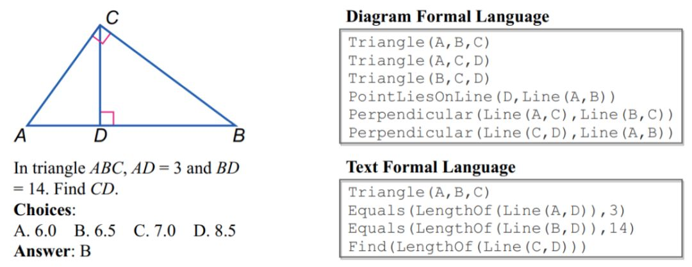

*Geometry3K 数据集的一个样例。*

团队还收集了一个大规模的几何数据集 Geometry3K，弥补了当前该领域的空白。Geometry3K 包含 3002 道高质量的中学几何问题，每道题目标注了详细的形式化语言，为后续的几何问题求解的研究建立了很好的评估基准。目前，该工作已经被 ACL 2021 收录，将在会上做口头报告。

**几何形式语言**

本文将题目表达为几何领域的形式语言。几何形式语言是一组由谓语和参数构成的语句组成。几何形式语言将用到以下几个基本术语：

- **谓词（predicate）**表示几何形状、几何关系或者计算函数；
- **语句（literal，也称 logic form）**是谓词作用于参数所构成的一条表达。多条语句组成了形式语言空间中对问题文本和图片的语义描述；
- **元素（primitive）**表示一个基本的几何单元，例如图形中提取到的点、线段、圆弧或圆。

本文一共定义了 91 个谓词和对应的语句模板。为了方便开发，根据不同的功能，它们被分为了 6 组：

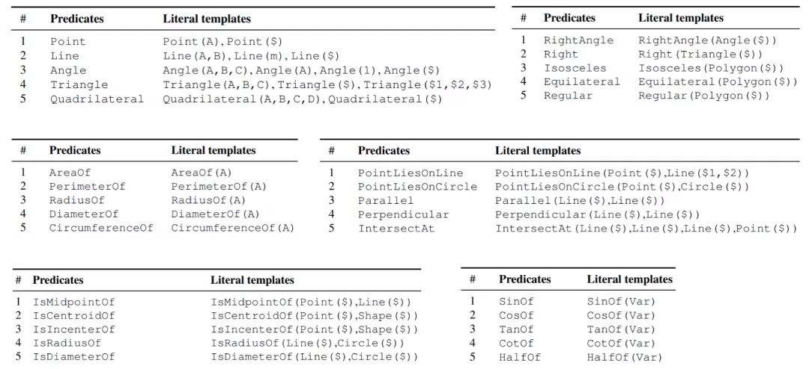

*几何领域中的谓语及形式语言模板（部分）。*

**Geometry3K 数据集**

**数据收集**

已有的几何题数据集往往数据规模比较小、包含有限的题目类型，或者没有公开。因此，研究团队首先建立了一个新的大规模基准数据集，称为 Geometry3K。这些数据从两本中学教材收集，涵盖了北美 6 到 12 年级的几何知识。每道题收集了 LaTeX 格式的问题文本、几何图形、四个选项和正确答案。为了模型的精细评估，每个数据标注了问题目标和几何图形的类型。

不同于现有的数据集，Geometry3K 对每道题的题目文字和图形标注了统一的形式语言描述。这些形式语言填补了传统方法处理文本和视觉内容存在的语义鸿沟，有利于问题求解器进行符号推理。

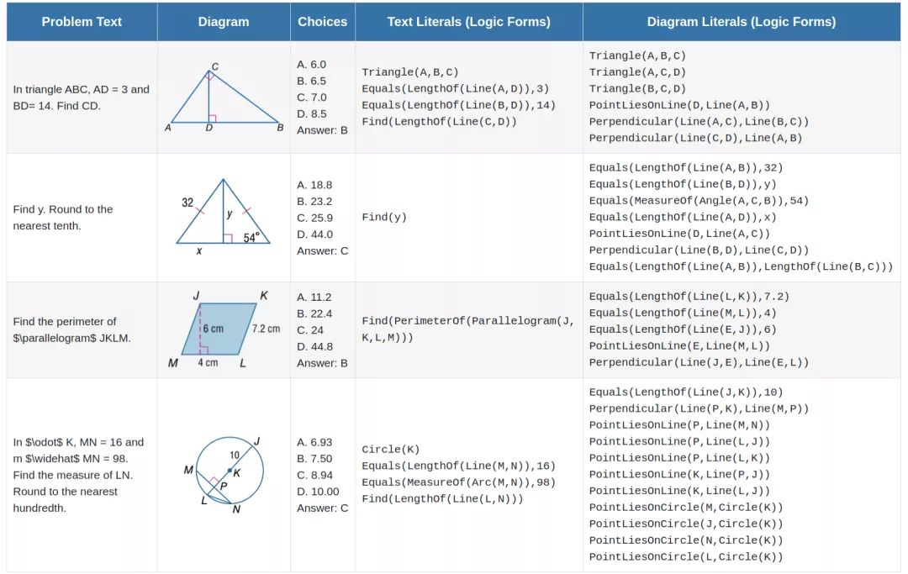

*Geometry3K 的数据样例。*

**数据统计**

Geometry3K 数据集由 3002 个问题组成，分为训练集、验证集和测试集 3 个集合。问题文本的词数分布出现了长尾现象，这表明几何求解模型需要理解文本内容中的丰富语义。

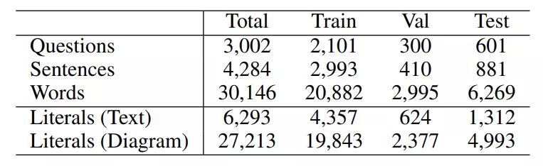

*Geometry3K 的基本统计信息。*

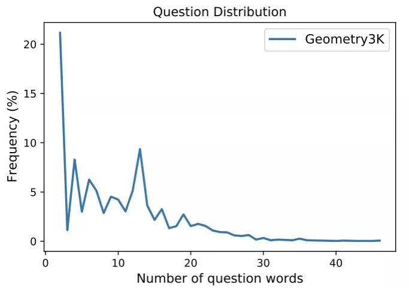

*Geometry3K 中问题词数的分布情况。*

**数据比较**

目前，Geometry3K 是已公开中最大的几何问题数据集。除了已有数据集 [2,3,4,5] 包含的四种基本图形（线段、三角形、正四边形和圆），Geometry3K 还包含了不规则四边形和其他多边形。此外，Geometry3K 的问题涉及到更多的未知变量和运算符类型，这就要求求解器通过解方程来求得问题的目标。值得注意的是，在 GEOS 数据集 [2] 中，80.5% 的问题可以仅根据问题文本内容而被解答。相比之下，对于 Geometry3K 数据集，如果缺少图片信息，只有不到 1% 的题目可以被正确求解。总的来说，Geometry3K 是一个很有挑战的几何问题求解的基准数据集。

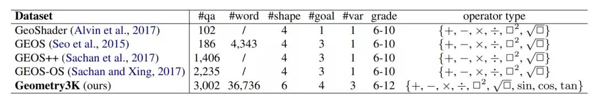

*Geometry3K 与已有几何数据集的比较。*

**几何数学题解析**

**题目文字解析**

题目文字解析是将文字内容翻译为几何形式语言。受到已有工作的启发，本文利用基于规则的解析方法来获得高精度的解析结果。本文也尝试了基于神经网络的语义解析方法完成形式语言的翻译。但是神经网络方法生成的形式语言会带有很多错误。这是因为神经网络通常是数据驱动，然而已有的数据集规模有限，因此削弱了这些高度数据驱动的方法。这些带有误差的生成结果并不适用于基于符号推理的几何求解器。

**题目图形解析**

对于题目的几何图形，本文实现了全自动的图形解析器，无需人工干预就能将图形解析为形式语言的表达。首先图形解析器利用霍夫变换（Hough Transform）提取图形中的几何元素。然后，解析器通过一个强大的目标检测模型 RetinaNet 提取图片中的符号和文本区域。这些文本区域进一步由 OCR 工具 MathPix 识别出其中的文字内容。

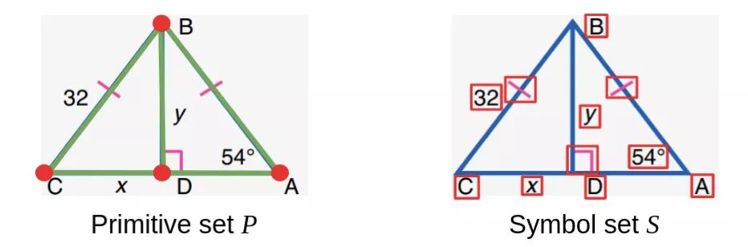

*提取到的几何元素集合 P（左）和符号集合 S（右）。*

在获得几何元素集 P 和符号集 S 之后，我们需要关联每个符号到与其相关的几何元素上。具体地，本文把关联任务定义为在几何关系约束下的优化问题：

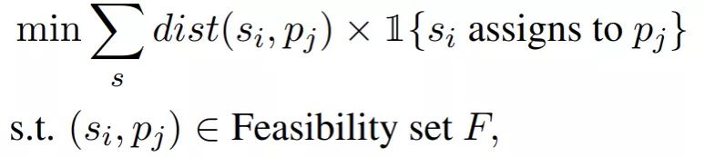

在上面的公式中，dist 度量了符号 si 和几何元素 pj 之间的欧几里得距离，F 定义了约束符号定位的几何关系。例如，垂直符号只能关联到两条正交的线段。最终，关联的几何元素和符号会通过简单的规则转换到最终的形式语言表达。

这些形式语言表达了结构化、层次化的几何属性和关系，通过运用相关的几何定理，几何关系集会不断更新，直至求得问题的目标：

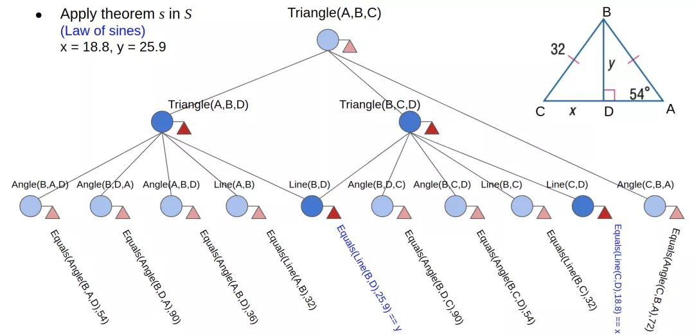

*形式语言所表达的层次化几何关系。*

**Inter-GPS 求解器**

**基于符号推理的求解**

本文提出了基于符号推理的几何问题求解器 Inter-GPS。Inter-GPS 将几何关系集 R 和定理集 KB 作为输入，应用定理预测器预测适用的定理序列，逐步对关系集进行符号推理，从而输出问题目标的答案。

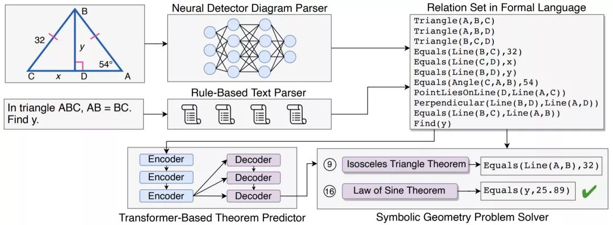

*Inter-GPS 的框架。*

关系集 R 定义了给定问题中的几何属性和关系，被初始化为问题解析器生成的形式语言。定理集 KB 表示为一组定理，其中定理 ki 是由条件 p 和结论 q 组成的规则。在搜索步骤 t，如果定理 ki 的条件 p 与当前关系集 Rt-1 相匹配，则根据结论 p 更新关系集。在应用若干定理之后，可以建立起已知变量和未知目标 g 之间的方程组：

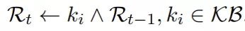

通过求解这个方程组，即可求解该问题目标：

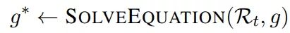

**定理顺序预测**

Geometry3K 中的几何问题是从高中课本中收集的，具有一定的难度，往往需要运用多个定理才能求解。那对于每道题，如何找到适用的几何定理呢？一种简单的搜索方法是暴力随机枚举定理集中的所有定理。然而这种随机搜索的方法效率很低，如果过早采用复杂的定理，还可能导致问题无法被求解。

一个理想的求解器需要预测适用的几何定理应用顺序，从而高效地求解几何问题。一个表现优秀的学生可以通过一定量的解题训练，学习到几何知识，在实际测试中运用学到的知识快速完成问题的求解。受此启发，本文提出了一个定理预测器。定理预测器通过在训练数据上进行多轮尝试学习后，可以对测试问题预测出可能的定理应用序列。

然而由于繁重的标注工作量，Geometry3K 没有为几何题标注适用的定理应用序列。为此，本文从定理集中多次随机抽样以生成序列。对于一个生成的定理应用序列，如 3-5-17，如果求解器应用了该序列能正确求得问题的答案，则该序列可视为正例。对于一道题的多个正例序列，长度最短的序列被近似认为是最优序列。经过多轮采样和尝试，本文获得了 1501 道训练题目的近似最优定理应用序列。

给定问题的形式化被描述 L =

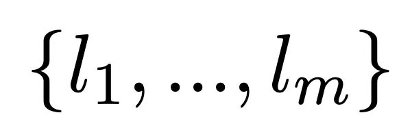

，定理预测器要重构近似最优的定理序列 T =

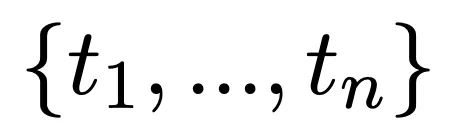

。本文将该任务处理为序列到序列的学习，使用基于 Transformer 的序列生成方法，优化定理序列 T 的负对数似然损失：

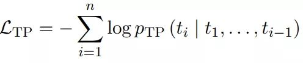

**低阶定理优先的搜索**

在应用了定理预测器所生成的定理序列后，Inter-GPS 很可能仍然无法找到问题目标。一般来说，人类在解决数学问题时倾向于先使用简单的定理来减少复杂的计算。如果简单的定理不够求解问题，他们则会考虑使用更复杂的定理。为此，本文将定理集分为两组：低阶定理集 KB1，即简单的定理；高阶定理集 KB2，即复杂的定理。应用了预测的定理顺序之后，在接下来的每个搜索步骤中，Inter-GPS 首先尝试低阶定理集 KB1 中的定理来更新关系集 R：

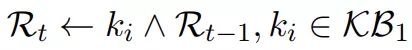

如果低阶定理不能进一步更新 R，则考虑使用高阶定理来更新 R：

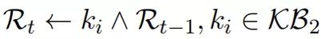

**实验与分析**

**实验结果**

受益于基于形式语言的符号推理，Inter-GPS 在 Geometry3K 数据集上实现了 57.5% 的总体准确率，远远超过神经网络最好取得的 33.0% 的准确率，甚至超过了普通成年人的准确率。如果采用人工标注的形式语言，Inter-GPS 可以进一步获得 20.8% 的提高。

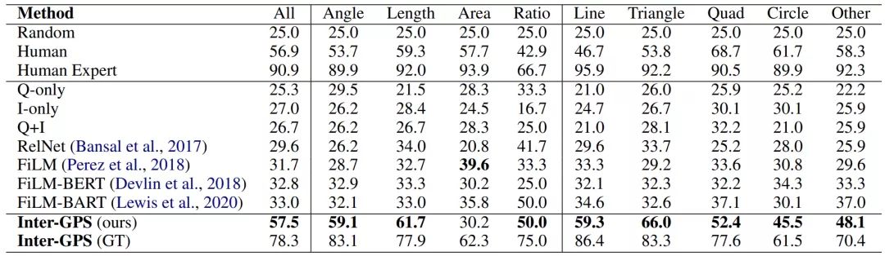

*不同模型在 Geometry3K 上的结果。*

**不同的搜索策略**

本文评估了不同的搜索策略：

- Random：即随机应用定理集中的定理；
- Low-first：在每一轮搜索中，优先使用低阶定理；
- Predict：先应用预测的定理，之后随机应用定理集中的定理；
- Final：先应用预测的定理，之后优先使用低阶定理。

可以看到使用低阶优先（Low-first）的搜索策略，可以显著降低平均搜索步骤到 6.5 步。而 Inter-GPS 最终采用的搜索策略可以以较低的搜索步骤，实现最高的解题准确率。

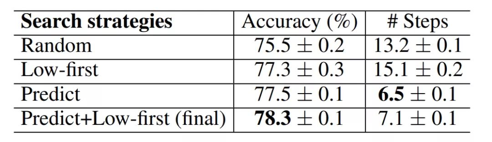

*Inter-GPS 在不同搜索策略下的表现。*

**不同的形式语言输入**

目前的 Inter-GPS 非常依赖形式语言输入的质量。实验表明，目前的文本解析器已经能实现接近人工标注的质量。然而图形解析器生成的形式语言表达还有很大的提升空间。

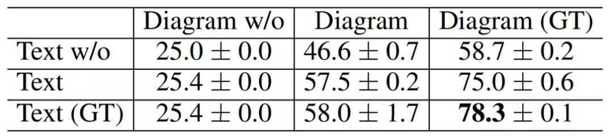

*Inter-GPS 在不同形式语言输入的表现。*

**搜索步数的分布**

Inter-GPS 最终采用的搜索策略首先应用预测的定理顺序，然后优先使用低阶定理。该策略表现出非常优秀的搜索效率：**对于成功求解的题目，65.97% 可以在 2 步内求解，70.06% 可以在 5 步内求解。**

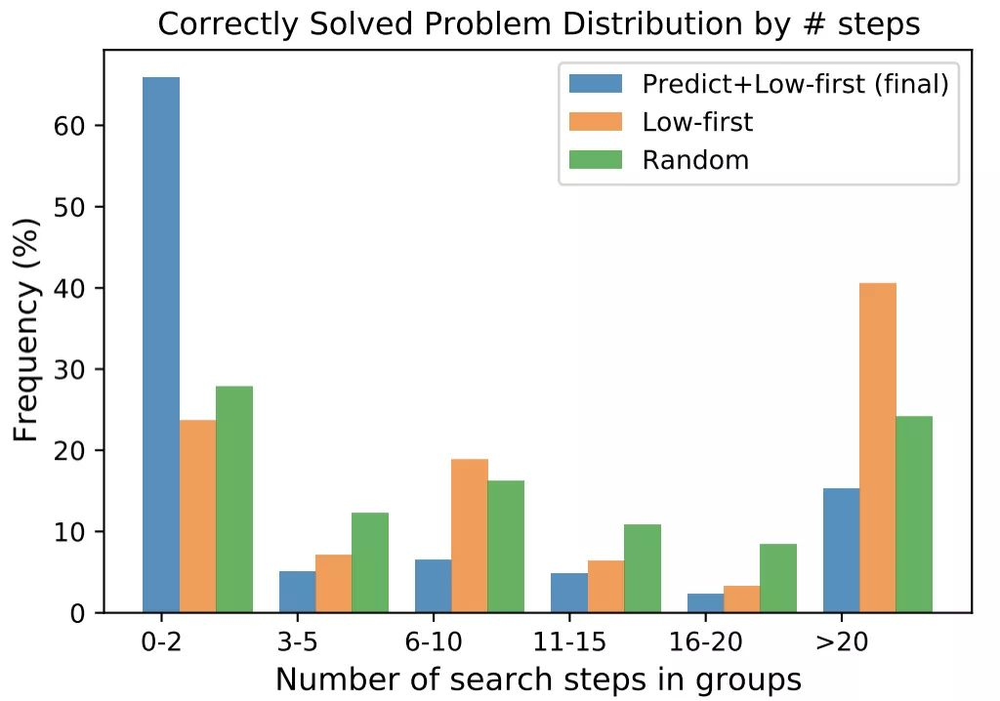

*Inter-GPS 成功求解题目所需的步数分布。*

**符号推理 VS 神经网络**

目前，神经网络未能在 Geometry3K 数据集中取得令人满意的结果。一个主要的原因是由于数据样本有限，神经网络不能学习出问题输入的有效语义表达。另外，神经网络学到的隐式表征可能不适合几何问题解决这类复杂的逻辑推理任务。

为此，本文做了一个有趣的实验，即将一个神经网络方法中的文本和图形输入替换为形式语言表达，结果取得了 9.2% 的准确率提升。这表明如果神经网络能够学习具有丰富语义的结构表征，那么其在逻辑推理任务上可以表现出较大的潜力。

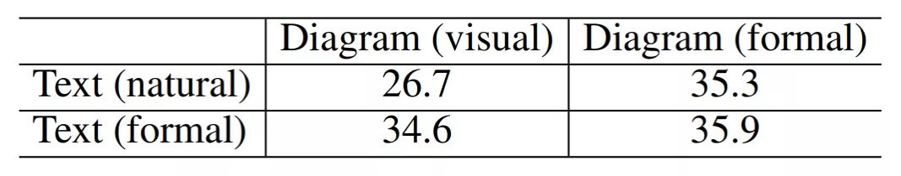

*神经网络采用形式语言作为输入（formal）。*

**失败场景**

尽管 Inter-GPS 取得了不错的结果，但还是无法处理一些难度较大的场景。如文本解析器无法正确解析复杂的文本表达，图形解析器无法处理含糊的标注和多个图形的组合。同时 Inter-GPS 还无法求解需要应用多个复杂定理的问题。

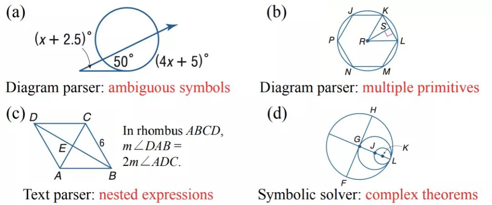

*Inter-GPS 失败的几个场景。*

**结论与展望**

求解几何问题是数学问答中最具挑战性的任务之一。本文中，研究团队构建了大规模的几何问题基准 Geometry3K。Geometry3K 包含 3002 道中学几何问题，并且每个数据标记了详细的形式化语言描述。研究团队提出了新颖的、具有可解释的几何问题解决方法 Inter-GPS。Inter-GPS 将问题内容自动解析为几何形式语言，并基于定理知识进行推理以推断出答案。实验表明，Inter-GPS 明显优于已有的神经网络模型。本文的工作可以启发符号推理和可解释模型的研究，也可以促进智能教育领域的相关研究。

*主要引用文献：*

*[1] Minjoon Seo, Hannaneh Hajishirzi, Ali Farhadi, and Oren Etzioni. 2014. Diagram understanding in geometry questions. In Proceedings of the AAAI Conference on Artificial Intelligence (AAAI).*

*[2] Minjoon Seo, Hannaneh Hajishirzi, Ali Farhadi, Oren Etzioni, and Clint Malcolm. 2015. Solving geometry problems: Combining text and diagram interpretation. In Proceedings of Empirical Methods in Natural Language Processing (EMNLP), pages 1466–1476.*

*[3] Mrinmaya Sachan, Kumar Dubey, and Eric Xing. 2017. From textbooks to knowledge: A case study in harvesting axiomatic knowledge from textbooks to solve geometry problems. In Proceedings of Empirical Methods in Natural Language Processing (EMNLP), pages 773–784.*

*[4] Chris Alvin, Sumit Gulwani, Rupak Majumdar, and Supratik Mukhopadhyay. 2017. Synthesis of solutions for shaded area geometry problems. In The Thirtieth International Flairs Conference.*

*[5] Mrinmaya Sachan and Eric Xing. 2017. Learning to solve geometry problems from natural language demonstrations in textbooks. In Proceedings of the 6th Joint Conference on Lexical and Computational Semantics, pages 251–261.*