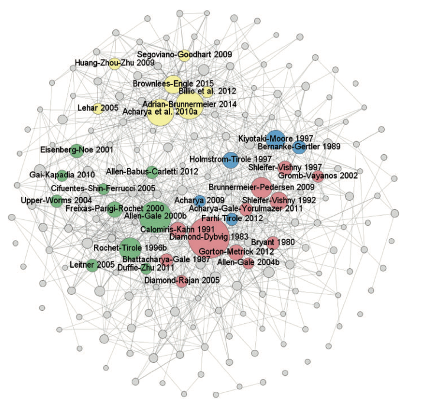

[TOC]

# Where the Risks Lie: A Survey on Systemic Risk

## Metadata

* Type: [[Article]]
* Authors: [[Benoit Sylvain]], [[Colliard Jean-Edouard]], [[Hurlin Christophe]], [[Pérignon Christophe]]
* Date: [[]]
* Date added: [[2020-07-30]]
* Publication: [[Working Papers]]
* Cite key: Sylvain__WheretheRisksLieASurveyonSystemicRisk
* Topics: [[系统性风险【综述】]]
* Related: 
* Tags: [[Zotero Import]]
* PDF Attachments: [Sylvain_Jean-Edouard et al_Where the Risks Lie.pdf](zotero://open-pdf/library/items/M2PB43B3)

## Highlights and Annotations

* [[Sylvain__WheretheRisksLieASurveyonSystemicRisk - 在线全文：]]

## 摘要

我们回顾了有关系统性风险的大量文献，并将其与当前的监管辩论联系起来。 在评估这一快速增长领域的成就时，我们发现了两种主要方法之间的差距。 第一个是单独研究系统性风险的不同来源，使用机密数据，并激发有针对性但复杂的监管工具。 第二种方法是使用市场数据来产生不与任何特定理论直接相关的全局度量，但是可以支持更有效的监管。 弥合这一差距将需要涵盖理论模型和改进的数据披露。

## 文献梳理

## 系统性风险形成机制

考虑$N$各金融机构$i$（例如银行），对应风险敞口$x_i$，其中$\alpha$的比例是系统性风险因素$y_{i}^{S}=\alpha_{i} x_{i}$，其余是机构的自有的风险因素$y_{i}^{I}=\left(1-\alpha_{i}\right) x_{i}$。

基准回报的定义：
$$
\hat{\pi}_{i}\left(y_{i}^{S}, y_{i}^{I}, \varepsilon^{S}, \varepsilon^{i}\right)=\left(\rho^{S}+\varepsilon^{S}\right) \times y_{i}^{S}+\left(\rho^{i}+\varepsilon^{i}\right) \times y_{i}^{I}
$$
CAPM framework, systematic risk

接下来描述三种机制：