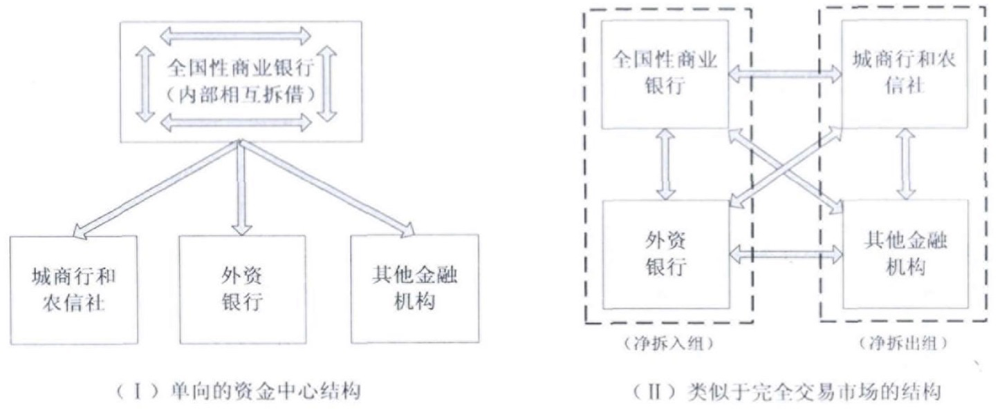

# 同业拆借视角下银行业流动性风险传染效应研究

## Metadata

* Type: [[Article]]
* Authors: [[ 彭建刚]], [[ 童磊]]
* Date: [[2013]]
* Date added: [[2020-05-02]]
* Publication: [[湖南社会科学]]
* Cite key: PengJianGang_2013_TongYeChaiJieShiJiaoXiaYinXingYeLiuDongXingFengXianChuanRanXiaoYingYanJiu
* Topics: [[博士毕业论文开题报告]], [[课程论文]], [[系统性风险 复杂网络仿真]], [[系统性风险 复杂网络实证]], [[银行系统性风险 演化]], [[银行系统性风险 压力测试法]], [[银行系统性风险 稳定性]], [[【方法】压力测试法]]
* Related: 
* Tags: [[Zotero Import]], [[风险传染]], [[流动性冲击]], [[同业拆借市场]], [[网络结构]]
* PDF Attachments: [彭建刚_童磊_2013_同业拆借视角下银行业流动性风险传染效应研究.pdf](zotero://open-pdf/library/items/GBKCSNHZ)

### Abstract

 银行间同业拆借市场是流动性风险传染的重要渠道,其市场结构健全与否关系到金融体系的稳健程度。本文采用压力测试方法对我国银行间同业市场上分类交易商之间的流动性风险传染效应进行了研究,结果发现:大规模流动性冲击会导致流动性风险蔓延和同业市场交易量萎缩,但在小规模流动性冲击下,风险具有收敛性。这表明我国同业市场具有一定程度的稳定性,但监管部门有必要对系统重要性银行实施更为审慎的流动性风险监管。

 

## 基于  

- Allen,Gale(2000)的研究的四种代表性的银行间市场网络的结构的机理，  

## 工作  

将我国银行同业交易商分为四大类，根据Allen, Gale(2000)的研究建立了包括四类交易商的网络结构，采用压力测试的方法对我国银行间同业市场上分类交易商之间的流动性和风险传染效应进行了研究。  
发现：  
    大规模流动性冲击会导致流动性风险蔓延和同业市场交易量萎缩。  
    小规模流动性冲击下，风险具有收敛性。  

- 分析了我国银行同业交易商，分为四大类，根据Allen,Gale(2000)的研究建立了包括四类交易商的网络结构，采用压力测试的方法对我国银行间同业市场上分类交易商之间的流动性和风险传染效应进行了研究。  
- 数据  
  - 同业拆借市场已成为我国金融机构之间调剂流动性头寸的重要交易市场。要探讨流动性风险在同业拆 借市场的传染途径 ,先要对我国同业拆借市场结构进行描 述。  
  - 最大熵方法  
    - 中国银行间同业拆借中心并没有公布分类交易商之间的 双边数据，根据 Wind 数据库中分类交易商的拆入拆出数 据可以大致刻画出同业市场结果的基本特征。 本文选取了 2011年度分类交易商的日交易数据。  
    - 估算我国同业拆借市场的分类交易商双边交易数据  
  - 拆借市场的交易主体的结构的变化  
    - 

## 发现  

- 小规模流动性冲击下，风险具有收敛性。  
- 大规模流动性冲击会导致流动性风险蔓延和同业市场交易量萎缩。  

## 特点  

- 多主体分析  
- 模拟仿真   