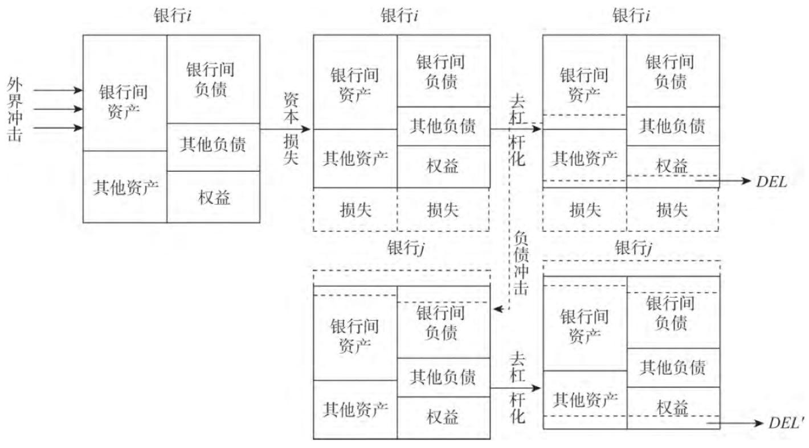

[toc]

# 方意\_2017\_中国银行业系统性风险研究——宏观审慎视角下的三个压力测试

# 中国银行业系统性风险研究——宏观审慎视角下的三个压力测试

## Metadata

* Type: [[Article]]
* Authors: [[ 方意]]
* Date: [[2017]]
* Date added: [[2020-06-19]]
* Publication: [[经济理论与经济管理]]
* Cite key: FangYi_2017_ZhongGuoYinXingYeXiTongXingFengXianYanJiuHongGuanShenShenShiJiaoXiaDeSanGeYaLiCeShi
* Topics: [[方意]], [[银行系统性风险 影响因素]], [[系统性风险 宏微观审慎监管]], [[银行系统性风险 压力测试法]]
* Related: 
* Tags: [[Zotero Import]], [[系统性风险]], [[Systemic Risk]], [[网络模型]], [[地方政府融资平台贷款]], [[房地产贷款]], [[压力测试]], [[Financial Network Model]], [[LGFP's Loans]], [[Real Estate's Loan]], [[Stress Test]], [[_tablet_modified]]
* PDF Attachments: [方意_2017_中国银行业系统性风险研究——宏观审慎视角下的三个压力测试.pdf](zotero://open-pdf/library/items/A9QKC5ZF)

### Abstract

本文在传统网络模型中加入去杠杆——降价抛售机制,研究以下两类宏观经济冲击对银行体系系统性风险的影响。从房地产贷款违约压力测试看,房地产贷款违约引起的传染风险是系统性风险的重要来源;传染损失比重和去杠杆次数结果则表明,2007年我国银行面临的传染风险最高,之后呈现快速下降的趋势;参数敏感性结果表明,网络模型中去杠杆、降价抛售以及破产对传染风险的相对重要性依次递减。从地方政府融资平台贷款违约压力测试看,大型商业银行受平台贷款违约的影响小于股份制和城市商业银行。此外,平台贷款违约概率存在阈值,在阈值之上银行损失和倒闭急剧攀升。基于银行倒闭压力测试,量化出本文的网络模型相对于传统网络模型的优越性。本文还发现中国金融体系的系统重要性与系统脆弱性指标的“错配”对于维持金融体系稳定非常关键。

## 现状  

- 国际金融危机对中国的影响：  

  - 房地产  
  - 地方融资  

  此次危机中，中国金融体系虽然没有受到直接冲击，但危机期间的经济刺激计划，“天量”银行信贷涌入房地产相关行业，并刺激推动了房地产价格暴涨以及泡沫的形成。与此同时，为配合中央政府的经济刺激计划，地方政府纷纷成立了融资平台，并以此向银行大量举债。  

## 研究  

- 1  
  - 模型  
    - 基于传统网络模型，纳入由监管杠杆率要求的去杠杆降价抛售机制，增加宏观审慎维度的压力测试，的压力测试网络模型  
  - 研究  
    - 研究两类冲击  
      - 房地产贷款违约  
      - 地方政府融资平台贷款违约  
    - 利用银行倒闭冲击，量化论证的本网络模型相对于传统网络模型的优势。  
- 2  
  - 研究  
    - 通过参数敏感性分析论证的网络模型中多个核心机制的相对重要性。  
  - 结论  
    - 中国银行体系中单家银行的系统重要性指标与系统性脆弱性指标存在错配，这种错配使得中国金融体系较为稳健。  

## 综述

#### 从研究主题

- 关于房地产市场风险及其调控  

  - 房地产信贷风险  

    - 张晓晶和孙涛  

      张晓晶，孙涛。中国房地产周期与金融稳定【J】。经济研究，2006, (8)  

      - 发现房地产周期对金融业稳 定的影响主要体现在房地产信贷风险暴露、政府担 保风险以及长存短贷的期限错配风险等。  

    - 臧旭恒和黄宇  

      - 基于微观调查数据得出商业银行的抵押贷款风险在2006年后趋向于下降。  

    - 洪正等人  

      [洪正,申宇,吴玮.高管薪酬激励会导致银行过度冒险吗?——来自中国房地产信贷市场的证据[J].经济学(季刊),2014,13(04):1585-1614. ][1]  

        

      摘要  
      本文以我国房地产信贷市场为例,实证检验了银行高管薪酬激励与房地产信贷风险之间的联系。结果表明,总体上银行高管薪酬与房地产信贷风险呈现显著正相关,进一步的研究还发现两者之间存在倒U形关系,即高管薪酬开始增加时银行有较强的冒险动机,房贷增速加快,当超过某一临界值时薪酬继续提高,银行将趋于保守,房贷增速降低。而且不同类型银行间具有明显差异,平均而言,提高高管薪酬使得城市和农村商业银行更容易冒险,而国有和股份制银行则更可能变得谨慎。  

      - 则从银行高管薪酬激励角度看待房地产信贷风险导致的银行金融危机问题， 发现银行高管薪酬与房地产信贷风险呈现倒U型关系  

  - 房地产价格调控政策。  

    - 王永钦和包特、朱国钟和颜色  
      - 对贷款首付比例政策、房屋限购政策、房产税政策等进行了相应的研究  

- 关于地方政府融资平台风险  

  - 研究背景  

    从 2009 年 “ 四万亿元”经济刺激计划以后开始, 且主要从定 性方面予以探讨  

    - 刘煜辉和沈可挺  
      - 研究了LGFP债务激增的原因，并指出中央与地方财政分权不当以及现有的公共资本投融资体制存在的缺陷都是重要诱因。  
    - 葛鹤军和缑婷  
      - 认为LGFP信用风险较高的原因在于财政支出的软约束、财政分权不充分、财政资源使用效率不高、LGFP依赖地方政府信用进行高负债经营、LGFP资产结构问题等。  
    - 杨艳和刘慧婷  
      - 定性地分析了LGFP在资金获取、运营和管理中累计的财政风险，并指出上述财政风险在“双边软约束”条件下可能会转变为金融风险。关于LGFP的定量和理论研究较少。  
    - 刘昊等人  
      - 基于东部Ｓ省数据发现，平台整体债务风险与地区经济发展水平成正比，且区（县）级平台债务风险高于市级平台，城投类平台与开发区类平台的债务风险９比交通类和国资管理类要高。  
    - 许友传和陈可桢  
      - 基于带跳跃的随机过程方法研究发现，当LGFP价值的下降幅度超过30％时，将有1/4左右的LGFP债务违约。  
    - 刘伟和李连发  
      - 从债务偿还能力、举债意愿以及资源配置效率角度对LGFP的举债行为构建了理论模型。  

- 不足  

  - 应当说，上述两类研究更多的是从其自身出发，很少考虑其风险对于银行业的冲击，更没有考虑其出现违约之后银行体系的风险传染过程。  

- 评述  

  - 要真正理解房地产行业、地方政府融资平台的 风险必须考虑它们对银行风险的影响  

#### 从研究方法  

- 网络模型方法  

  网络模型方法是一种重要的系统性风险测度方法，该类方法以银行间的直接借贷关系为研究对象，并通过假设银行倒闭等极端现象作为外生冲击进行网络模拟研究。  

  - 综述类文章  

    - Upper 2011  
      - 对银行网络模型在各个主要国家的应用进行了深入 的文献综述  

  - 包括  

    - 利用银行间同业拆借数据  
      - 范小云，王道平，刘澜飚。规模、关联性与中国系统重要性银行的衡量【J】。金融研究，2012, (11)  
      - 贾彦东。金融机构的系统重要性分析——金融网络中的系统风险衡量与成本分担 [J]. 金融研究，2011，  
      - 方意。系统性风险的传染渠道与度量研究——兼论宏观审慎政策实施[J]. 管理世界，2016，  
    - 利用银行间支付结算数据  
      - 范小云,王道平,刘澜飚。规模、关联性与中国系统重要性银行的衡量【J】。金融研究,2012, (11)  
      - 贾彦东。金融机构的系统重要性分析一一金融网络中的系统风险衡量与成本分担【J】。金融研究，2011, (10)  
      - 方意。系统性风险的传染渠道与度量研究一一兼论宏观审慎政策实施【J】。管理世界，2016, (8).  

  - 现状  

    - 网络模型在中国的应用较晚  

  - 特点  

    - 这类传统网络模型以银行间的直接关联为基础，在一定程度上能研究不利冲击下银行之间的风险传染过程。  

  - 缺点  

    - 考虑的传染渠道过于单一，仅包含银行破产这一传染渠道。  

      尽管银行破产传染渠道是一种重要的传染渠道，但并不是唯一的传染渠道，且在现实金融体系中并不多见。最近爆发的金融危机表明，金融体系的内部传染过程更多以金融资产降价抛售为条件，并不完全依赖于金融机构的破产。  

    - 考虑的外部冲击过于单一，仅能分析银行破产这一外生冲击。  

      这一不足之处，在某种程度上是“致命”的。  

      - 首先，在应用该模型时，关于哪一家银行破产作为冲击存在较大的主观性，为此一般均假设每家银行都有破产的可能性，并都作为一种冲击进行试验。  
      - 其次，根据Upper 2011的结论，银行危机的爆发很少以单家银行的破产作为开端，而往往来源于宏观经济等层面的不利冲击，且这些不利冲击对所有银行都会产生影响。  

    - 仅适合于银行破产冲击的模型并不太适合于中国。  

      原因在于近些年来，中国很少有银行倒闭。与此同时，对于中国而言，房地产行业贷款违约、地方政府融资平台贷款违约等非常重要的现实冲击会对银行产生较大影响，能研究这些冲击对银行造成风险的网络模型非常具有吸引力，而这显然超出传统网络模型的能力范畴。  

      - 于中国而言，重要因素并非银行倒闭，而是地方政府融资平台贷款违约的冲击  
      - 改进缺点  
        - 研究这些冲击对银行造 成风险的网络模型非常具有吸引力  
        - 借鉴  
          - (Tressel, 2010)  
            - 在传统网络模型中纳入去杠杆——降价抛售机制  
            - 特点  
              - 由于其利用了国家之间的双边传染数据，进而也不需要估测银行之间的双边敞口数据。  
            - 不足  
              - 但是该研究以不包含中国的国际银行体系为研究对象  
              - 且并没有考虑单家银行之间的风险传染关系。  
              - 研究的冲击也并不是当前对中国而言重要的现实冲击。  

- 基于网络模型的压力测试方法  

  - 定义  

    压力测试是一系列用来评估一些极端但又可信的宏观经济冲击对金融体系脆弱性影响的技术总称， 而宏观压力测试由于能模拟潜在金融危机 等极端事件对金融系统稳定性的影响， 引起了国际监管组织和各国监管当局的格外重视。  

  - 相关综述  

    - 徐明东， 刘晓星 ． 金融系统稳定性评估：基于宏观压力测试方法的国际比较 ［ Ｊ ］ ． 国际金融研究， ２００８  

  - 相关模型  

    - 雏形框架  

      - Wilson 1997  
      - Boss 2002  
      - 将银行的贷款违约概率等风险指标转化为宏观综合指标，然后将此综合指标作为被解释变量，并选取宏观经济指标、银行财务指标作为解释变量进行多元线性回归，再通过对解释变量进行合理的压力情景假设，便能对银行风险进行合理的预测。  

    - 后续改进  

      - 华晓龙. 2009. 《基于宏观压力测试方法的商业银行体系信用风险评估》. 数量经济技术经济研究, 期 04 vo 26: 117–28.  

        - 通过Logit模型对银行的信用风险按上述方法进行了压力测试  

      - 当前比较权威的宏观压力测试是由国际货币基金组织和世界银行联合开展的“金融部门评估规划”FSAP。  

        - H. Elsinger, A Lehar, M Summer. Using Market Information for Banking System Risk Assessment  [J]. Interna tional Journal of Central Banking, 2006b, 2 (1)  
        - Elsinger, Helmut, Alfred Lehar和Martin Summer. 2005. 《Using Market Information for Banking System Risk Assessment》. _SSRN Electronic Journal_. [<u>https://doi.org/10.2139/ssrn.787929][2]</u>.  

      - 在FSAP基础上  

        - 英格兰央行建立了TD压力测试系统  
          - M. Haldane, S Hall, S Pezzini. A New Approach to Assessing Risks to Financial Stability  [Z]. Bank of England Financial Stability Paper, Na 2, 2007.  
        - 奥地利央行建立了SRM压力测试系统  
          - H. Elsinger, A Lehar, M Summer. Risk Assessment for Banking Systems  [J]. Management Science, 2006a, 52 (9)  

      - IMF针对中国的评估  

        - International, Monetary和Fund. 2011. 《People’s Republic of China: Financial System Stability Assessment》. _Imf Staff Country Reports_.  

        - 缺点  

          - 未考虑传染造成的间接损失  

            只考虑资产面冲击导致的直接损失，对银行网络体系相互作用导致传染性损失几乎没有研究。事实上，由于其没有考虑银行之间的传染风险，不仅低估了不利宏观经济冲击导致的银行总风险。  

          - 缺少宏观审慎维度的因素  

            原因在于，宏观审慎银行体系整体的稳定为目标，其最核心的环节是考虑面临不利外生冲击下银行在银行关联的网络的互相传染，进而放大初始冲击。因此需要通过网络模型来考虑具有宏观审慎维度的系统性风险。  

      - 历年 中国人民银行的《中国金融稳定报告》  

  - 缺点  

    - 压力测试仅仅只考虑到宏观经济冲击对银行体系的直 接影响， 忽视了银行体系内部传染。  

[1]: https://kns.cnki.net/KXReader/Detail?TIMESTAMP=637334586327762500&DBCODE=CJFQ&TABLEName=CJFD2014&FileName=JJXU201404015&RESULT=1&SIGN=%2bqyr0qbra315RLDiu48lkstMQkg%3d

## 模型

### 构建银行双边敞口矩阵

假设：

- 银行体系同质银行数$N$；
- 银行间的资产负债关系：$\boldsymbol{X}=\left(X_{i j}\right)_{N \times N}$；
- 银行$i$的资产：$A_{i}=\sum_{j=1}^{N} X_{i j}$；
- 银行$i$的负债：$L_{i}=\sum_{i=1}^{N} X_{i j}$；

最大信息熵方法以计算银行之间的双边敞口矩阵：

1. 标准化：

   总资产：$a_{i}=A_{i} / \sum_{i=1}^{N} A_{i}$

   总负债：$l_{j}=L_{j} / \sum_{j=1}^{N} L_{j}$

   

1. 虚拟矩阵$\boldsymbol{x}^\star$：
   $$
   x_{ij}^\star =\left\{\begin{array}{l}
   0, i=j \\
   a_{i} l_{j}, \quad i \neq j
   \end{array}\right.
   $$

1. 求解矩阵$\boldsymbol{x}$：
   $$
   \begin{array}{l}
   \min _{x(i, j)} \sum_{i=1}^{N} \sum_{j=1}^{N} x_{i j} \ln \left(\frac{\boldsymbol{x}_{i j}}{\boldsymbol{x}_{i j}^{\star}}\right)\\
   \text{s.t.} \quad \sum_{j=1}^{N} x_{i j}=a_{i}, \sum_{i=1}^{N} \boldsymbol{x}_{i j}=l_{j}, \boldsymbol{x}_{i j}>0
   
   \end{array}
   $$

构建银行资产负债表网络模型：

假设银行$i$的资产负债：
$$
\sum_{j=1}^{N} X_{i j}+OA_{i}=\sum_{j=1}^{N} X_{j i}+B_{i}+E_{i}
$$
其中，

- $\sum_{j=1}^{N} X_{i j}$：银行$i$持有银行网络中其他银行资产的数量；
- $OA_i$：银行$i$持有的银行网络之外的资产数量，例如企业、对个人的贷款等；
- $\sum_{j=1}^{N} X_{j i}$：银行$i$对银行网络中其他银行的负债数量；
- $B_i$：银行$i$对银行网络之外的负债，如其吸收的零售存款、向非银行部门发行的债券等；
- $E_i$：银行$i$的权益（资本金）；

银行面临==法定杠杆率要求==$LEV$【3】：
$$
E_{i} /\left(\sum_{j=1}^{N} X_{i j}+O A_{i}\right) \geqslant L E V
$$

银行面临两类冲击：

- 其它资产$OA_i$的冲击：

  此时，资产和权益同时损失$Loss_i$：

  - 当$Loss_i<E_i$时，遭受损失的银行$i$的杠杆率低于法定杠杆率要求$LEV$。为此银行$i$卖出资产$DEL_i$，使得达到要求【4】：
    $$
    \begin{aligned}
    E_{i}-\operatorname{Loss}_{i}=& L E V \times\left(\sum_{j=1}^{N} X_{i j}+\left(O A_{i}-\operatorname{Loss}_{i}\right)-D E L_{i}\right)
    \end{aligned}
    $$
    变形可得$DEL_i$【4.5】：
    $$
    DEL_i=\sum_{j=1}^{N} X_{i j}+OA_{i}-\operatorname{Loss}_{i}-1 / L E V \times\left(E_{i}-\operatorname{Loss}_{i}\right)
    $$

  - 当$Loss_i \ge E_i$时，银行$i$违约并卖出全部资产，且仍然存在违约。

    假设外生常数违约损失率$\lambda$，则银行$i$对银行$j$带来的损失：
    $$
    \operatorname{Loss}_{j i}=\lambda \times X_{j i}
    $$
    

银行无力偿债（倒闭）的冲击：

因为当银行遭受损失时需要抛售资产，对于银行$i$，其抛售的资产就是对手方银行$j$的负债。

假设：银行$i$卖出资产服从均匀分布。

此时，银行$j$面临的负债冲击【6】：
$$
\operatorname{Shock}_{j}=X_{i j} /\left(\sum_{j=1}^{N} X_{i j}+O A_{i}\right) \times D E L_{i}
$$
假设：

- 负债冲击中有$\alpha$部分可以被重置，即可以通过重新举债获得；
- 当市场流动性不足时，卖出的资产遭受额外资本损失。损失的程度用降价抛售的严重程度$\kappa$表示；

银行$j$面临负债冲击时，资产负债情况【7】：
$$
\begin{array}{l}
\sum_{k=1}^{N} X_{j k}-(1+\kappa) \times(1-\alpha) \times \operatorname{Shock}_{j}+OA_{j} \\
\quad=\left(\sum_{k=1}^{N} X_{k j}-(1-\alpha) \times \operatorname{Shock}_{j}\right)+B_{j}+\left(E_{j}-\kappa \times(1-\alpha) \times \operatorname{Shock}_{j}\right)
\end{array}
$$
银行面临法定杠杆率要求$LEV$【3】，此时银行$j$的资产负债变化为：
$$
\begin{aligned}
& E_{j}- \kappa \times(1-\alpha) \times \operatorname{Shock}_{j}  \\
&=\left[\sum_{k=1}^{N} X_{j k}-(1+\kappa) \times(1-\alpha) \times \operatorname{Shock}_{j}+OA_{k}-D E L_{j}\right] \times L E V
\end{aligned}
$$
综上，得到银行风险传染示意图

### 分析

分析三个压力测试：房地产行业贷款违约的压力测试、地方政府融资平台贷款违约的压力测试、银行倒闭的压力测试。

#### 房地产行业贷款违约的压力测试

#### 地方政府融资平台贷款违约的压力测试

#### 银行倒闭的压力测试