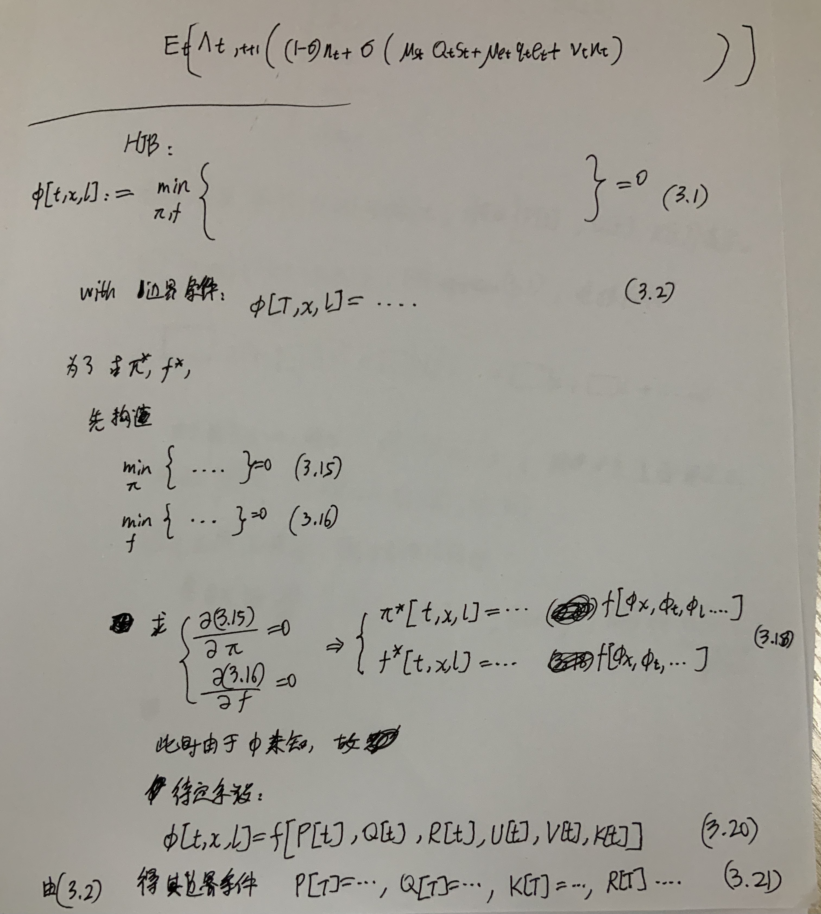
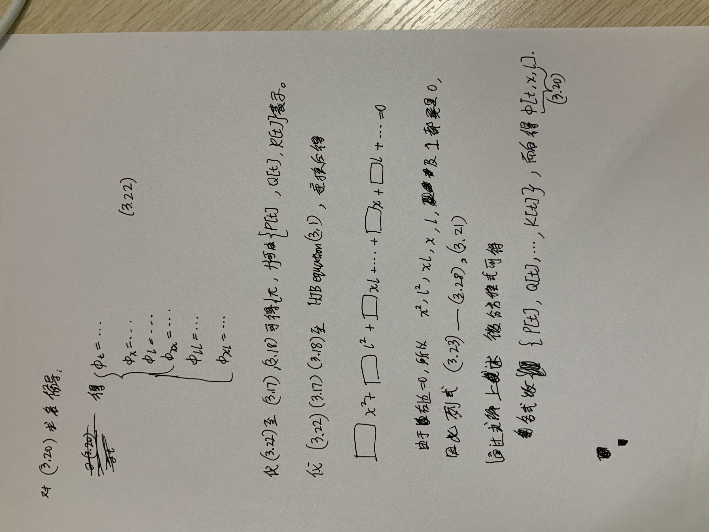

# Optimal investment strategies and intergenerational risk sharing for target benefit pension plans

![[Wang2018-zotero#Metadata]]

Other files:
* Mdnotes File Name: [[Wang2018]]
* Metadata File Name: [[Wang2018-zotero]]

#  Zotero links
* [Local library](zotero://select/items/1_JEEK5HJL)
* [Cloud library](http://zotero.org/users/6240833/items/JEEK5HJL)

# Notes
- 

### 第三部分的公式求解：

