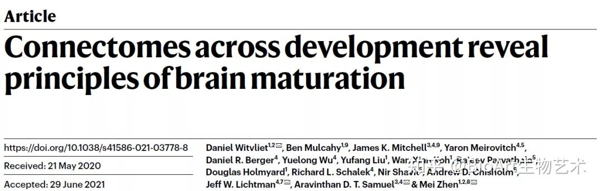
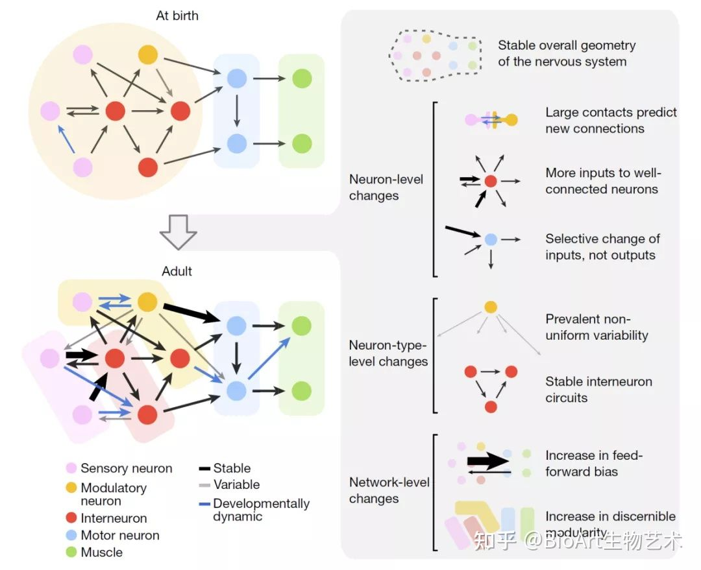

# Connectomes across development reveal principles of brain maturation

## Metadata

* Item Type: [[Article]]
* Authors: [[Daniel Witvliet]], [[Ben Mulcahy]], [[James K. Mitchell]], [[Yaron Meirovitch]], [[Daniel R. Berger]], [[Yuelong Wu]], [[Yufang Liu]], [[Wan Xian Koh]], [[Rajeev Parvathala]], [[Douglas Holmyard]], [[Richard L. Schalek]], [[Nir Shavit]], [[Andrew D. Chisholm]], [[Jeff W. Lichtman]], [[Aravinthan D. T. Samuel]], [[Mei Zhen]]
* Date: [[2021-08]]
* Date Added: [[2021-07-24]]
* URL: [https://www.nature.com/articles/s41586-021-03778-8](https://www.nature.com/articles/s41586-021-03778-8)
* DOI: [10.1038/s41586-021-03778-8](https://doi.org/10.1038/s41586-021-03778-8)
* Cite key: Witvliet2021
* Topics: [[Collection]]
* Tags: #学科/认知科学, #内容/神经元连接规律, #zotero, #literature-notes, #reference

## Abstract

An animal’s nervous system changes as its body grows from birth to adulthood and its behaviours mature1–8. The form and extent of circuit remodelling across the connectome is unknown3,9–15. Here we used serial-section electron microscopy to reconstruct the full brain of eight isogenic Caenorhabditis elegans individuals across postnatal stages to investigate how it changes with age. The overall geometry of the brain is preserved from birth to adulthood, but substantial changes in chemical synaptic connectivity emerge on this consistent scaffold. Comparing connectomes between individuals reveals substantial differences in connectivity that make each brain partly unique. Comparing connectomes across maturation reveals consistent wiring changes between different neurons. These changes alter the strength of existing connections and create new connections. Collective changes in the network alter information processing. During development, the central decision-making circuitry is maintained, whereas sensory and motor pathways substantially remodel. With age, the brain becomes progressively more feedforward and discernibly modular. Thus developmental connectomics reveals principles that underlie brain maturation.

##  Zotero links
* [Local library](zotero://select/items/1_KN7BLTWC)
* [Cloud library](http://zotero.org/users/6240833/items/KN7BLTWC)

# Nature | 绘制大脑发育图谱，寻找神经连接规律

[BioArt生物艺术](https://www.zhihu.com/org/bioart)

生物学话题下的优秀答主

**撰文 | 苏怡汀**

**责编 | 兮**

大脑一生面临的挑战重重，从出生到成熟，从衰老到死亡，外界环境时常波动，身体结构也一直在变化。为了适应生存，神经连接也在不断改变，比如在生殖期开始有新的连接形成，在学习过程中的神经连接随着外界反馈会不断自我修正，而与躯体运动相关的连接则一直保持强有力的输出等等。这些变化现象背后的规律如何？要回答这个问题，需要系统地观察全脑所有神经元的发育轨迹，才能透过现象看本质。

近日，来自加拿大Lunenfeld-Tanenbaum 研究所的**Mei Zhen**团队与哈佛大学**Aravinthan D.T. Samuel**、**Jeff W Lichtman**合作在***Nature\***上发表了文章***Connectomes across development reveal principles of brain maturation\***，通过**连续切片电镜技术**（serial-section electron microscopy），**将线虫大脑从出生到成熟的全脑连接结构高精度地重塑了出来**。他们通过统计每一个神经连接和神经肌肉连接的长度、形状，位置，揭晓了线虫大脑发育过程中的六条重要规律：1）均衡的神经突起生长；2）非均衡的突触增长；3）刻板与易变共存的连接；4）稳定的中间神经元连接；5）随年龄增长的正反馈通路；6）随年龄增长的模块化增加。

图：线虫大脑发育的规律

**均衡的神经突起生长：**研究人员发现，每一个神经突起的形状和在大脑中的相对位置在出生时基本上就已经建立。从出生到成熟，线虫的身高增长了五倍，神经突起的总长度也同样增长了五倍，这些神经突起绝大多数情况下都同大脑成比例增长，让神经细胞之间的物理接触也能同时维持下来。不仅如此，化学性突触的总数量在此发育期间增长了六倍，除了第一个幼虫阶段（L1 ），突触数量与神经突起的数量也是成比例的，也就是说，突触密度在发育阶段同样均衡稳定。

**非均衡的突触增长：**从出生到成熟阶段，突触增长会重塑大脑的连接谱，新长出的突触不仅产生新的连接，还会加强已有连接。对于已有连接的加强，每个连接的平均突触数量从出生时期的1.7增长到成熟期的6.9，而对于新连接的产生，这段时期内则增长了大约2.4倍。但新连接的产生并不是所有细胞都“雨露均沾”的。研究人员发现，在出生时就有大量物理接触的细胞之间更容易产生新突触，并且突触也更喜欢产生在出生时就有很多连接的热点神经元上（hub neuron），有趣的是，**和哺乳动物不同，线虫的突触并没有明显的突触修剪现象**（synapse pruning）。

**刻板与易变共存的连接：**线虫神经细胞间的连接可以是刻板不变的，也可以是经常变化的。**稳定连接**（stable connection）在出生时就已存在，并且保持着相对稳定的连接强度，发育中动态变化的连接（developmentally dynamic connection，以下称**发育动态连接**）则在发育过程中维持单一方向的变化（比如始终增加，或始终减弱连接强度），这两种类型的连接占总连接数量的43%，代表着所有线虫生物体共有的连接。除此之外，还有一类为**易变连接**（variable connection），它们没有固定的发育方向（时而增强时而减弱），也不一定存在于所有的线虫中，易变连接代表着每一个线虫独一无二的连接。

**稳定的中间神经元连接**：中间神经元之间、中间神经元与运动神经元之间的连接以稳定连接为主，其数量高于发育动态连接。与之相反的是，感觉、运动神经元有更多发育动态连接而不是稳定连接，这说明负责将感觉信息传入下游神经元的连接是不断变化的，而中间神经元的环路的结构则大致稳定。

**随年龄增长的正向连接通路**：随着年龄增长，突触的变化将如何影响信息流动？研究人员将突触连接分为三类：从感觉层到运动层的细胞连接为正向连接（feedforward connection），从运动层到感觉层为反向连接（feedback  connection），同一类细胞之间的连接为递归连接（recurrent  connection）。他们发现，对于稳定连接，突触的增加会更多地增强正向连接而不是反向或递归连接。同样的，发育动态连接中也选择性地偏好增加正向连接环路的强度。这一结果说明，随着年龄增长，大脑的信息更多地从感觉到运动方向流动。

**模块化随年龄增长**：通过加权随机块模型（weighted stochastic block  modeling），研究人员利用神经细胞的突触连接信息将它们分为不同的模块。他们发现，线虫大脑的所有神经元在出生时只有两个大模块，而在接下来的发育过程中，随着发育动态连接的增加，模块也开始增加，直到成年以后最终分出了六个大模块，分别为头部、尾部运动模块，运动输出模块，和前、中、后感觉模块。同样的模块物理位置也相对接近，很可能也有相似的功能。
总而言之，**本文利用连续切片电镜鸿篇绘制了线虫的发育连接动态图谱，不仅为理解线虫发育提供了实用的参考，也为神经系统的发生提炼了重要的规律，相信未来的跨物种比较，将为我们慢慢揭晓哺乳动物、甚至人类的神经发育之谜。**

**原文链接：[https://doi.org/10.1038/s41586-021-03778-8](https://link.zhihu.com/?target=https%3A//doi.org/10.1038/s41586-021-03778-8)**

**转载须知**【原创文章】BioArt原创文章，欢迎个人转发分享，未经允许禁止转载，所刊登的所有作品的著作权均为BioArt所拥有。BioArt保留所有法定权利，违者必究。