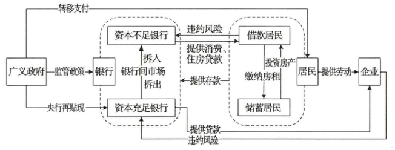

# 银行资本监管与系统性金融风险传递——基于DSGE模型的分析

## Metadata

* Type: [[Article]]
* Authors: [[ 王擎]], [[ 田娇]]
* Date: [[2016]]
* Date added: [[2020-06-05]]
* Publication: [[中国社会科学]]
* Cite key: WangQing_2016_YinXingZiBenJianGuanYuXiTongXingJinRongFengXianChuanDiJiYuDSGEMoXingDeFenXi
* Topics: [[系统性风险 传导机制]], [[银行资本监管]], [[系统性风险 Dsge]]
* Related: 
* Tags: [[Zotero Import]], [[资本监管]], [[系统性金融风险]], [[巴塞尔协议]], [[动态随机一般均衡模型]]
* PDF Attachments: [王擎_田娇_2016_银行资本监管与系统性金融风险传递——基于DSGE模型的分析.pdf](zotero://open-pdf/library/items/5WAYYF7A)

### Abstract

2008年爆发的国际金融危机，使防范系统性金融风险成为监管部门面对的重大课题，更严格监管资本的巴塞尔协议Ⅲ应运而生，但其在中国的实施效果有待观察。基于中国经济金融特点构建的DSGE模型，包含实体经济和金融体系在内的居民、银行、企业和政府四大部门，通过使用1998—2014年中国数据估算校准参数，在全要素生产率、住房需求、货币供应、基准利率、消费贷款违约率、企业贷款违约率的外生冲击下，分析银行受到提高资本约束要求时，系统性金融风险传递的运行机制。结果发现，在资本约束下，缘于资本监管的顺周期性，系统性金融风险经历三个阶段的传递后，实体经济并未得到有效改善。而基于各类银行资本充足平均水平，小幅度提高资本监管要求，以及更加严格地加强对资本不足银行的监管，则有助于抑制金融风险传递。

## 工作

近年的研究中，国外已有学者开始将银行部门、金融加速器以及银行间市场和银行资本等多重金融因素，融合到DSGE模型中，发现银行间市场和银行资本市场的金融摩擦，放大并传播了冲击效应，但是资本监管要求减弱了金融冲击等的实际影响，降低了宏观经济波动。

基于中国经济金融特点，构建了DSGE模型，分析不同的因素对系统性风险的影响，模型包含居民、银行、企业、央行（含政府部门）四大部门。其中银行部门和居民部门按照资金富余程度进行了细分，由此引入了银行间市场的分析。

## 优点

- 引入银行部门、金融加速器、银行间市场、银行资本等多重金融因素至DSGE模型中
- 将使监管政策的研究跳出至今无法定论的微观风险效应视角，从宏观审慎层面分析和研判资本监管政策的有效性和改进方向。

## 缺点

- 对于居民和银行间市场的划分只对整体采用固定的比例划分，没有考虑居民之间、银行之间可以在不同类型转换的细节。
- 未考虑到股票市场。
- 未考虑到当挤兑状态时，无法偿还居民存款的情况。

## 模型

### 构建

#### 经济运行框架

#### 部门行为分析

- 符号解释

    - $$
        \Box_\Box^\color{red}{\Box} = \left\{
        \begin{array}{l}
        B,R \quad 借款居民相关 \\ S \quad 储蓄居民有关 \\  L \quad  资本充足银行\\ D \quad 资本紧缺银行 \\ I,F \quad 与企业相关 \\ C \quad 央行、政府有关 \\ M \quad 与银行同业市场有关
        \end{array}
        \right.
        $$

- 假设：
  - 家庭、企业家无期限生存
  - 信贷市场属于标准的Dixit-Stiglitz模式
  - 家庭和企业家持有的存款和带宽构成是CES形式
  - 每家银行的存款和贷款需求主要取决于 银行提供 的利率水平。
  - 银行的批发部门处于完全竞争条件
  - 银行的两个零售部门处于垄断竞争条件
  - 假设银行可以在中央银行以政策利率 r_t无限融资
  - 零售商处于垄断竞争地位
  - 模型中引入资本品生产商的主要目的就是为资本 定价。
  - 为了引入粘性价格和银行不完全的传递 , 假 设 银行对企业家和家庭贷款收取的利率调整成本为 二次型
  - 货币政策遵从Taylor准则指定

- 居民部门

    - 分类
      
        - 借款居民$B$、储蓄居民$S$
        
    - 借款居民部门$B$

        - 行为
          
            - 工作：于时期$t$以工资率$w_t$提供劳动时长$n_t^B$给生产部门，目的是获取报酬。
        - 消费$C_t^{B}$；
          
            - 借消费贷款：向资金紧缺银行$D$借款本息$\mu_{t}^{B}$，借款利率$r_{t}^{B}$，用以消费。
        - 还消费贷款：向资金紧缺银行$D$还款本息$\nu _{ t }^{ B } \frac{\mu_{ t }^{ B }-1}{\pi_{ t }}$。其中，
              $\nu_t^B$：消费贷款违约率，违约居民占借款居民的比例；
          $\pi_t$：通货膨胀率；
            - 住房分期还款：向储蓄居民缴纳房租$r_{t}^{S H} H_{t-1}$。
              $r _{ t }^{ SH }$：时期$t$的住房$H_{t-1}$的使用成本；
              居民还住房贷款存在违约行为。违约率：
              $\nu_t^H$
              
            - 住房借款：向资金紧缺银行借款住房本息$\mu_t^H$，实际可用本金$\mu_{t}^{ H } / 1+ r _{ t }^{ H }$。

            - 接受政府转移支付$\tau T$，其中$\tau$表示借款居民占居民的比例；

            - 如果有违约于消费借款，则需要缴纳借消费贷款的惩罚金

              > （交给谁？）
        $$
              \frac{\theta^{B}}{2}\left[\left(1-\nu_{t}^{B}\right) \frac{\mu_{t-1}^{B}}{\pi_{t}}\right]^{2}
        $$

        

- 目标
  
  - 效用$U_{B}$最大化：
    $$
    \max _{\left\{ C _{t}^{ B }, H _{t}, n _{t}^{ B }, \mu_{t}^{ B }, \mu_{t}^{ H }\right\}} E _{0}\left\{\sum_{t=0}^{\infty} \beta_{ B }^{t}\left[\gamma \log \left( C _{ t }^{ B }\right)+\left(1-\gamma_{ e }^{\gamma}\right) \log \left( H _{ t }\right)+\phi \log \left(1- n _{ t }^{ B }\right)\right]\right\}
    $$

- 储蓄居民部门$S$
  
    - 行为
    
        - 工作：于时期$t$以工资率$w_t$提供劳动时长$n_t^S$给生产部门，目的是获取报酬。
    
        - 消费$C_t^S$；
    
        - 投资房产$I_t^H$；
    
        - 存款$D_t^S$至银行以利率$r_t^S$；
    
            - 收款从上期住房租金从借款居民
              $$
              \frac{\left(1+ r _{ t }^{ SH }-\delta_{ H }\right)}{\pi_{ t }} H _{ t -1}
              $$
        
    - 接受政府转移支付$(1-\tau) T$。
            
      
    - 目标
      
        - 效用$U_S$最大化：
              $$
              \max _{\left\{C_{t}^{S}, H_{t}, n_{t}^{S}, D_{t}^{s}\right\}} E_{0}\left\{\sum_{t=0} \beta_{s}^{t}\left[\gamma \log \left(C_{t}^{S}\right)+\left(1-\gamma_{\varepsilon}^{\gamma}\right) \log \left(H_{t}\right)+\phi \log \left(1-n_{t}^{S}\right)\right]\right\}
              $$
              

- 银行部门

    - 分类

      - 资金净拆出银行（大银行、资本充足方）
      - 资金净拆入银行（经营策略激进的银行、资本紧缺方）

    - 资金净拆出银行（资本充足方）$F$

      - 行为

        - 股利分红$C_t^L$

        - 贷款本金$\mu_t^F$以利率$r_t^F$给企业，存在未违约比例$\nu_t^F$

        - 收款本息于未违约企业以利率$r_{t-1}^F$：
          $$
          \nu_{ t }^{ F } \frac{\mu_{ t -1}^{ F }-\left(1+ r _{ t -1}^{ F }\right)}{\pi_{ t }}
          $$

        - 吸收储蓄型居民$S$存款以利率$r_t^S$：
          $$
          \frac{ D _{ t }^{ L }}{1+ r _{ t }^{ S }}
          $$

        - 还款给储蓄型居民$S$：
          $$
          \frac{ D _{ t -1}^{ L }}{\pi_{ t }}
          $$

        - 同业拆出给银行为$\mu_{t}^{M}$；

        - 同业拆入于银行，存在违约比例$\nu_t^I$：
          $$
          \nu_{ t }^{ I } \frac{\mu_{ t -1}^{ M }}{\pi_{ t }}\left(1+ r _{ t }^{ I }\right)
          $$
          其中违约比例$\mu_t^I$；

        - 向央行贴现以利率$r_t^C$：
          $$
          \frac{\mu_{ t }^{ C }}{1+ r _{ t }^{ C }}
          $$
          
        - 还央行贴现：
          $$
              \frac{\mu_{ t }^{ C }-1}{\pi_{ t }}
          $$
    
- 目标
      
  - 效用$U_F$最大化
    $$
          \max _{\left\{ C _{t}^{ L }, \mu_{t}^{ F }, D _{ t }^{ L }, \mu_{ t }, \mu_{ t }^{ M }\right\}} E _{0}\left\{\sum_{t=0}^{\infty} \beta_{ L }^{ t }\left[\frac{\left( C _{ t }^{ L }\right)^{1-\sigma}}{(1-\sigma)}+\eta \log \left( k _{ t }^{ L }- k ^{\circ}\right)\right]\right\}
    $$
    
  - 资金流约束（左出右入）
    $$
          \begin{aligned}
          &C _{ t }^{ L }+\mu_{ t }^{ F }+\mu_{ t }^{ M }+\frac{ D _{ t -1}^{ L }}{\pi_{ t }}+\frac{\mu_{ t -1}^{ C }}{\pi_{ t }} \leqslant\\
          &\nu_{ t }^{ F } \frac{\mu_{ t -1}^{ F }\left(1+ r _{ t -1}^{ F }\right)}{\pi_{ t }}+\nu_{ t }^{ I } \frac{\mu_{ t -1}^{ M }\left(1+ r _{ t }^{ I }\right)}{\pi_{ t }}+\frac{ D _{ t }^{ L }}{1+ r _{ t }^{ S }}+\frac{\mu_{ t }^{ C }}{1+ r _{ t }^{ C }}
          \end{aligned}
    $$
  - 存贷比约束
    
    $$
    \mu_{ t }^{ F } \leqslant \varphi^{ L } \cdot\left( D _{ t }^{ L } / (1+ r _{ t }^{ S })\right)
    $$
    
    - 其中，$\varphi^L$表示贷存比上限，反映流动性。
    
    
    
    
  
- 资金净拆入银行（资本不足方）$D$
  
  - 行为
    
    - 股利分红$C_t^D$；
    
    - 提供消费贷款本金$\mu_t^B$以利率$r_t^B$给居民$B$；
    
        - 收回消费贷款本息以违约比例$\nu_t^B$：
          $$
          \nu_{ t }^{ B } \frac{\mu_{ t }^{ R }-1}{\pi_{ t }}\left(1+ r _{ t -1}^{ B }\right)
          $$

        - 提供住房贷款本金$\mu_t^N$以利率$r_t^H$给居民$B$；
          
        - 收回住房贷款本息以违约比例$\nu_t^H$：
          $$
              \nu_{ t }^{ H } \frac{\mu_{ t }^{ N }-1}{\pi_{ t }}\left(1+ r _{ t -1}^{ H }\right)
          $$
        
        - 拆入资金$\mu_t^I$于资金净拆出银行以利率$r_t^I$；
        
        - 偿还本息给拆入银行的资金以偿还率$\mu_t^I$：
          $$
          \nu_{ t }^{ I } \frac{\mu_{ t }^{ I }-1}{\pi_{ t }}
          $$
        
        - 吸收储蓄型居民$S$的存款$D_t^D$以利率$r_t^S$；
        
        - 偿还储蓄型居民$S$的存款$\frac{ D _{ t -1}^{ D }}{\pi_{ t }}$；
        
        - 如果银行间市场借入资产违约，则惩罚：
          $$
              \frac{\theta^{ I }}{2}\left[\left(1-\nu_{ t }^{ I }\right) \frac{\mu_{ t }^{ I }-1}{\pi_{ t }}\right]^{2}
          $$
        
      - 目标
      
        - 效用$U_D$最大化
      
        $$
        \max _{\left\{ C _{t}^{ D }, D _{t}^{ D }, \mu_{t}^{1}, \mu_{t}^{ R }, \mu_{t}^{ N }, v_{t}^{ I }\right\}} E _{0}\left\{\sum_{t=0}^{\infty} \beta_{ D }^{ t }\left[\frac{\left( C _{ t }^{ D }\right)^{1-\sigma}}{(1-\sigma)}+\eta \log \left( k _{ t }^{ D }- k ^{\circ}\right)\right]\right\}
        $$

- 企业
  
  - 假设
    
    - 只有一种产出品的完全竞争厂商
    
  - 行为
    
    - 资源约束（产品的变化平衡）$Y _{ t }= C _{ t }^{ F }+ I _{ t }^{ K }+ Q _{ t }+\frac{ Q ^{ F }}{2}\left[\left(1-\nu_{ t }^{ F }\right) \frac{\mu_{ t }^{ P }-1}{\pi_{ t }}\right]^{2}$
    
    - 吸纳劳动力生产，其生产函数$Y_{t}=A_{t} K_{t-1}^{\alpha} n_{t}^{1-\alpha}$
    
    - 资本累积方程：$K _{ t }=\left(1-\delta_{ K }\right) K _{ t -1}+ I _{ t }^{ K }$
    
    - 预算约束：
        $$
        w _{ t } n _{ t }+v_{ t }^{ F } \frac{\mu_{ t -1}^{ P }}{\pi_{ t }} \leqslant Q _{ t }+\frac{\mu_{ t }^{ P }}{1+ r _{ t }^{ F }}
        $$
        
    - 发放工资给居民$B$、居民$S$为$w _{ t } n _{ t }$；
    
    - 全民消费（企业以全民所有制形式存在）$C_t^F$；
    
    - 投资实物资本于生产与折旧的设备$I_t^K$；
    
        - 向资本充足型银行借款以利率$r_t^F$：
          $$
          \frac{\mu_{t}^{P}}{1+r_{t}^{F}}
          $$
        - 偿还银行借款，以还款的企业比例$\nu_t^F$：
          $$
          \nu_{t}^{F} \frac{\mu_{t}^{P}-1}{\pi_{t}}
          $$
        
    - 销售产品获得资金$Q_t$；
      
      - 如果有违约于银行的借款，则需要缴纳贷款违约以产品的形式：
        $$
        \frac{Q^{F}}{2}\left[\left(1-\nu_{t}^{F}\right) \frac{\mu_{t-1}^{P}}{\pi_{t}}\right]^{2}
        $$
    
  - 目标
    
    - 效用$U_F$最大化
      $$
      \max _{\left\{ n _{t}, k _{t}, Q _{t}, \mu_{t}^{ P }\right\}} E _{0}\left\{\sum_{ t =0}^{\infty} \beta_{ F }^{ t }\left[\log \left( C _{ t }^{ F }\right)\right]\right\}
      $$
  
- 广义政府
  
  - 假设：
        
    - 集合政府和央行的功能；
    - 根据现有文献表明，中国并没有按照泰勒规则执行。
  - 行为
    - 转移支付给居民$T_t$；
    - 供应货币$M_t$；
    - 货币政策其货币政策以货币供应量的增长率表示：
      $$
      \frac{ M _{ t }}{ M _{ t -1}} \triangleq g _{ t }
      $$
  - 目标
    
    - （无？）

#### 模型公式

- [ ] TODO

### 求解和简化

### 校准

一阶条件

