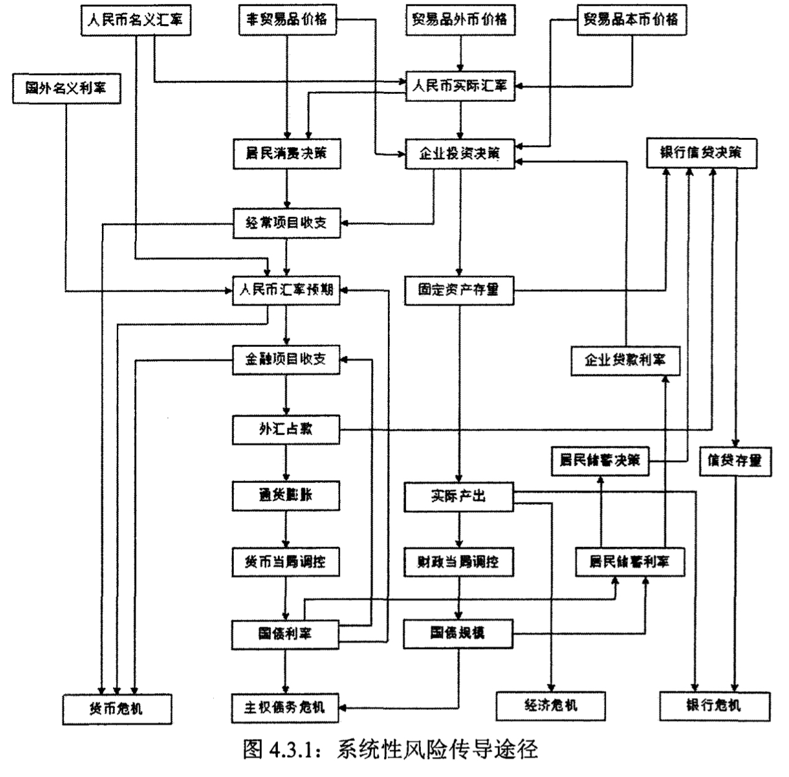
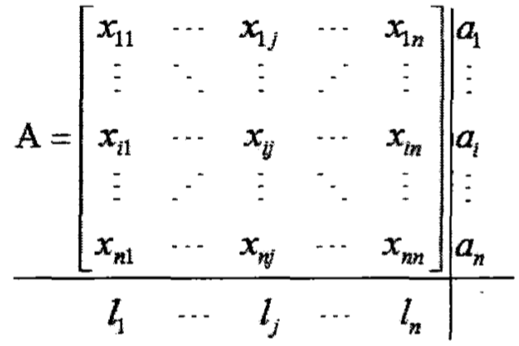

# 货币国际化视角下的系统性风险传导机制与监管策略研究

# Metadata

* Type: [[Thesis]]
* Authors: [[ 张萌]]
* Date: [[2015]]
* Date added: [[2020-06-06]]
* Cite key: ZhangMeng_2015_HuoBiGuoJiHuaShiJiaoXiaDeXiTongXingFengXianChuanDaoJiZhiYuJianGuanCeLueYanJiu
* Topics: [[系统性风险 救助]], [[系统性风险 监管]], [[系统性风险 传导机制]]
* Related: 
* Tags: [[Zotero Import]]
* PDF Attachments: [张萌_2015_货币国际化视角下的系统性风险传导机制与监管策略研究.pdf](zotero://open-pdf/library/items/HPSW3PBL)

# Highlights and Annotations

# 笔记

### 系统性风险传导途径

### 系统性风险传导机制

续表

### 银行间的理论模型构建

#### 方法：

矩阵法。

#### 假设：

矩阵法原始假设条件包括：(1) 银行间市场属于完全市场结构，即每家银行对其他银行的资产与负债具有概率分布的独立性；(2) 每家银行尽可能平均地与其他银行开展同业交易；(3) 每家银行不能对自己持有资产或负债。另外，为排除货币当局救助因素对银行间风险传导机制的干扰，同时考虑流动性压力下，银行挤兑因素以及集中抛售资产时的折价因素，本节在原始假设基础上附加 2 个假设条件：(4) 货币当局不对任何银行实施注资救助；(5) 当一家银行因流动性压力而倒闭时，其他银行的准备金则因挤兑而减少；(6) 银行间市场流动性紧缩条件下，银行集中抛售资产时将存在部分折价损失。

