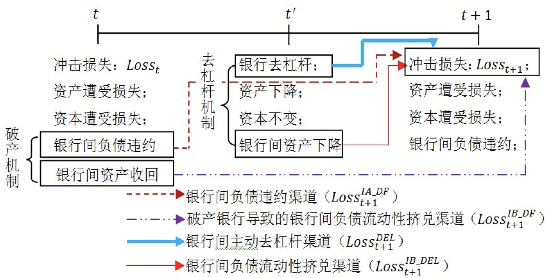

# 系统性风险的传染渠道与度量研究——兼论宏观审慎政策实施

## Metadata

* Item Type: [[Article]]
* Authors: [[ 方意]]
* Date: [[2016]]
* Date Added: [[2020-05-26]]
* Cite key: FangYi_2016a
* Topics: [[系统性风险研究角度之测度]], [[系统性风险研究角度风险传染]], [[系统性风险研究角度政策监管、救助、最后贷款人]]
* Related: [[Noncore bank liabilities and financial vulnerability]], [[系统性风险、抛售博弈与宏观审慎政策]], [[Vulnerable Banks]]
* Tags: #网络模型, #【方法】：测度, #【研究】：中国银行业系统性风险, #【研究】：传染机制, #【内容】：银行间市场, #【用途】：借鉴方法, #【内容】：宏观审慎监管, #【感觉】：重要, #【用途】：借鉴思路, #【内容】：系统性风险传染, #【学科】：经济学, #【进度】：精读, #【内容】：银行系统性风险, #zotero, #literature-notes, #reference
* PDF Attachments
  - [方意_2016_系统性风险的传染渠道与度量研究——兼论宏观审慎政策实施.pdf](zotero://open-pdf/library/items/JHH3AURJ)

## Abstract

本文创新性构建了包含银行破产机制和去杠杆机制的资产负债表直接关联网络模型。本文发现:(1)四类银行特征和4个外生参数影响四类传染渠道,且影响存在显著差异,四类传染渠道中去杠杆渠道(Loss~(DEL))和银行间负债违约渠道(Loss~(IA_DF))最为重要;(2)在传染过程中,银行破产会导致系统性风险急剧上升,且破产越集中,系统性风险越大;(3)系统性风险存在"区制转换"效应:当低于某一参数阈值,金融体系呈现出随时间递减的"常态"系统性风险(SR),该风险由银行体系杠杆率驱动;当高于某一参数阈值,金融体系呈现出随时间递增的"危机"系统性风险(SR),该风险由银行关联性和资产规模驱动,并主要来源于传染指标较高的大型商业银行;(4)4个外生参数对应了四类针对金融体系整体的宏观审慎政策,脆弱性指标(VBI)和传染性指标(CBI)对应了针对单家金融机构的宏观审慎政策,这些宏观审慎政策应根据金融周期(上行或下行)和系统性风险类型(常态或危机)来实施。

##  Zotero links

* [Local library](zotero://select/items/1_J9MGRSUG)
* [Cloud library](http://zotero.org/users/6240833/items/J9MGRSUG)

## Highlights and Annotations

- [[系统性风险的传染渠道与度量研究——兼论宏观审慎政策实施 - Extracted Annotations (3102021, 43333 PM)]]
- [[系统性风险的传染渠道与度量研究——兼论宏观审慎政策实施 - Extracted Annotations (202099 下午51023)于其考虑的是金融机构持 有相同类型资产由于价格损失而导致的间接传染， 而本文则关注金融机构相互借贷由于破产和降价抛 售成本而导致的直接传染 (方意 20]]
- [[系统性风险的传染渠道与度量研究——兼论宏观审慎政策实施 - Extracted Annotations (2020104 下午62738)于其考虑的是金融机构持 有相同类型资产由于价格损失而导致的间接传染， 而本文则关注金融机构相互借贷由于破产和降价抛 售成本而导致的直接传染 (方意 2]]
- [[系统性风险的传染渠道与度量研究——兼论宏观审慎政策实施 - Extracted Annotations (2021810 下午94347)]]
- [[系统性风险的传染渠道与度量研究——兼论宏观审慎政策实施 - The following values have no corresponding Zotero fieldSR 1AD 中央财经大学金融学院;中央财经大学全球金融治理协同创新中心;中央财经大学银行业研究中心;DS CNKI]]
- [[系统性风险的传染渠道与度量研究——兼论宏观审慎政策实施 - 指标借鉴]]
- [[系统性风险的传染渠道与度量研究——兼论宏观审慎政策实施 - 模型借鉴]]

### 现状、问题  

- 2007~2009 年爆发的国际金融危机凸显了金融体系对房地产行业的过度风险暴露及金融机构之间的过度关联所导致的系统性风险等问题。  

- 中国在此次危机中虽然没有受到直接的冲击，但是仍然存在房地产行业对银行体系造 成的外生冲击风险。  

  - 方意：《房地产市场贷款冲击下的银行研究——基于持有共同资产间接关联视角》，《经济研究》，工作论文，2015 年 a  

    - 我国房地产市场与银行体系已经形成了利益共同体关系  

      房地产行业的资金主要来源于银行信贷，银行体系信贷中有较高比例直接投向于 房地产行业（每年维持在 12%左右，正文表 1），如果考虑到与房地产行业存在紧密关联的行业，如建筑业、钢铁行业等，则银行体系投入到房地 产行业相关的信贷资金会更多。  
    
      
    
    - 房地产行业自身存在巨大的风险  
    
      具体体现为房价与房地产 库存同时处于高位，其中以北京、上海、深圳、广州 为代表的一线城市，房价已经出现大幅泡沫，而国 内三、四线城市房地产销售非常困难，去库存压力 巨大。  
    
    - 我国当前面临经济“新常态”，经济转型带来宏观经济增长的下行压力巨大，此类压力对房地产行业的冲击速度和力度是其他行业难以比拟的。  

- 我国银行体系内部存在各种关联  

  - 包括  
    - 银行间市场的同业拆借、同业存放等直接业务关联。  

### 研究内容

### 研究动机  

- 模型创新的动机  

  - 现有研究的不足  

    这些不足之处的根本原因在于前述研究并没有将一个完整的银行资产负债表纳入到传染渠道研究 之中，而仅仅只考虑银行间资产和银行间负债波动 导致的权益损失变化。 这种局部分析必然会遗漏一 些重要的传染渠道，将本该内生的变量而简单的外 生化。 除此之外，由于没有考虑完整的银行资产负 债表，其可能错误地给出银行破产条件和破产损 失。  

### 本文创新  

- 构建了一个完整的银行资产负债表传染渠道模型  

  - 综合考虑资产负债表关联网络模型的  

    - 破产机制  

      破产机制指的是银行破 产对银行体系的风险传染机制。  

      - 银行间负债违约渠道
      - 破产银行导致的银行间负债流动性挤兑渠道  

    - 去杠杆机制  

      去杠杆机制指的是银行为达到杠杆率监管要求而卖出资产并导致损失的风险传染机制。  

  - 考虑了银行特征和外生参数因素对传染渠道的影响  

- 量化四类传染渠道 ^f5arsg7
	- 银行间负债违约渠道  
	- 破产银行导致的银行间负债流动性挤兑渠道  
	- 银行被动卖出资产遭受的降价抛售成本损失  
	- 银行主动卖出资产遭受的降价抛售成本损失  

- 量化了3个系统性风险相关指标  

  以理论模型为基础，提出并量化了3个系统性风险相关指标.  

  - 系统性风险（SR）  
  - 脆弱性指标（VBI）  
  - 传染性指标（CBI）  

- 提出系统性风险区制转换机制  

  提出了系统性风险区制转换机制。 金融体系有两种风险“基因”：  

  - 作为“显性基因” 的“常态”系统性风险（由杠杆率因素驱动）  
  - 作为“隐性基因”的“危机”系统性风险（由资产规模和 银行关联性因素驱动）。  

- 基于理论和实证，提出**多种宏观审慎政策**  

  基于理论和实证，提出**多种宏观审慎政策**，并对宏观审慎政策在金融周期的不同阶段以及不同类 型系统性风险的实施进行了系统性分析  

### 发现  

- 显著的传染渠道：  
  四类银行特征和4个外生参数影响四类传染渠道，且影响存在显著差异,四类传染渠道中去杠杆渠道、银行间负债违约渠道最为重要。  
- 银行破产加剧系统性风险：  
  在传染过程中，银行破产会导致系统性风险急剧上升，且破产越集中，系统性风险越大；  
- 系统性风险存在“区制转换”效应：  
  当低于某一参数阈值，金融体系呈现出随时间递减的“常态”系统性风险(SR)， 该风险由银行体系杠杆率驱动；当高于某一参数阈值，金融体系呈现出随时间递增的“危机”系统性风险 (SR) ，该风险由银行关联性和资产规模驱动，并主要来源于传染指标较高的大型商业银行；  
- 外生参数与宏观审慎政策的一一对应：  
  4个外生参数对应了四类针对金融体系整体的宏观审慎政策， 脆弱性指标(VBI)和传染性指标(CBI)对应了针对单家金融机构的宏观审慎政策，这些宏观审慎政策 应根据金融周期（上行或下行）和系统性风险类型（常态或危机）来实施。  

### 指标

#### SR指标

优点：

由于银行体系总溢出损失。受银行体系初始资本金规模大小影响。SR指标剔除了银行初始资本金规模对系统性风险大小的影响。更能准确地反映银行体系的系统性风险水平。

指标设计借鉴了[[Marc_Augustin_et-al_2015_Vulnerable Banks]]。

### 综述  

- 中国人民银行_《中国金融稳定报告》、IMF(2011)的中国金融部门评估规划  

  - 都关注了房地产市场对银行体系的风险影响但是其只考虑了冲击带来的直接损失（直接风险），未能考虑冲击之后的传染风险。忽视传染风险方面低估了总风险，一方面从根本上忽略了对系统性风险的考量。  

  - 不足  

    - 没有将一个完整的银行资产负债表纳入到传染渠道研究  

      前述研究并没有将一个完整的银行资产负债表纳入到传染渠道研究之中，而仅仅只考虑银行间资产和银行间负债波动导致的权益损失变化。这种局部分析必然会遗漏一些重要的传染渠道，将本该内生的变量而简单的外生化。  

    - 没有考虑完整的银行资产负债表  

      由于没有考虑完整的银行资产负债表，其可能错误地给出银行破产条件和破产损失。  

- 资产负债表关联网络模型  

  - 破产机制  

    银行破 产对银行体系的风险传染机制  

    - 银行间负债违约渠道  

      - 相关研究  

        - 分析国外各国银行体系的系统性风险  
          - Sheldon 和 Maurer（1998）、Furfine（ Wells（2004）、Upper 和 Worms（2004）、van Lelyveld 和 Liedorp（2004）、IMF（2009）  

      - 传统银行间资产负债网络考虑的传染渠道  

        - 分析中国的系统性风险  

          - 马君潞等（2007）、范小云等（2012）等；  
            - 银行间同业拆借数据  
          - 黄聪和贾彦东（2010）、 贾彦东（2011）；  
            - 银行间支付结算数据  
          - 宫晓琳和卞江（2010）、宫晓琳（2012）等  
            - 资金流量表数据  

        - 缺点  

          - 上述研究往往得到的研究结论是传染损失较小，这与金融危机期间出现的银行倒闭风潮实际并不相符  

            - （Upper，2011； Glasserman and Young，2015）  

          - 只能研究单价金融机构破产导致的传染风险。实际上。系统性风险更多的来源于宏观经济冲击，而非单家机构破产冲击。  

            - Upper，2011  

          - 解决  

            - Chan-Lau（2010）和 Tressel（2010）  

              - 提出  

                - 降价抛售成本渠道  

                  - 定义  

                    商业银行的风险传染不仅来源于银行资产端 （破产银行为其债务方银行），而且来源于银行负债 端。 原因在于其债权方（包括银行在内）提前抽回 债权，从而导致该银行的负债不足以支撑其资产规 模，从而商业银行必须卖出（或收回）资产。 当市场 流动性不足时，卖出资产的行为会导致资产价格损 失，此即为降价抛售成本渠道。  

              - 特点  

                - 引入了融资流动性风险  

              - 不足  

                - 降价抛售成本渠道考虑得不够完全  

                  - 原因  

                    根据降价抛售成本渠道可知，当市场流动性不足时，银行卖出资产会遭受损失，而无论卖出资产源于何种原因。  

                    - Tressel(2010)  

                      - 工作  

                        通过引入法定杠杆率监管要求纳入了降价抛售成本渠道  

                      - 不足  

                        该研究只考虑了由于银行负债端流动性挤兑，而银行被动卖出资产遭受的降价抛售成本损失这样的传染渠道，却未能考虑在杠杆率不达标时，银行主动卖出资产遭受的降价抛售成本损失这样的传染渠道。根据 (方意, 2016) 模型的测算，银行主动卖出资产遭受的降价抛售成本损失这样的传染渠道比 被动卖出资产的降价抛售成本损失这样的传染渠道重要得多  

                - 忽视银行破产会导致降价抛售成本  

                  传统网络模型和考虑融资流动性 网络模型，都忽视了银行破产也会导致降价抛售成本  

                - 外生化银行破产对其债权方银行造成的损失  

                  事实上，损失完全可内生于模型。具体而言，这些研究都认为银行破产对其债权方造成的损失是债权方风险敞口与损失率的乘积，而损失率则被设置为一个外生参数。为了严谨起见，这类模型一般对损失率进行参数敏感性分析（Upper，2011）。然而，根据银行破产的条件可知，在不考虑破产成本的条件下，损失率完全可由商业银行的资产实际价值与负债名义价值计算而得（此时商业银行破产，从而权益值为0）。  

                  - （Upper，2011）  

                    - 特点  

                      损失率则被设置为一个外生参数。为了严谨起见，这类模型一般对损失率进行参数敏感性分析。  

    - 银行间负债流动性挤兑渠道

  - 去杠杆机制  

    去杠杆机制指的是银行为达到杠杆率监管要求而卖出资产并导致损失的风险传染机制。  

  - MARC G R, AUGUSTIN L, DAVID T, 2015. Vulnerable Banks[J]. Journal of Financial Economics, 115(3): 471–485.  

    - 被借鉴模型  
      优先级: 1  
      进度: 35%  
      - Duarte 和 Eisenbach（2015）  
        - 美国金融体系系统性风险测算  
      - 方意：《房地产市场贷款冲击下的银行 究——基于持有共同资产间接关联视角》，《经济研究》，工作 论文，2015 年 a。  
        - 中国金融体系系统性风险测算  
    - 引入杠杆率的来源  
      - 考虑的是金融机构持有相同类型资产由于价格损失而导致的间接传染  

  - 区别  

    - 方意. (2016). 系统性风险的传染渠道与度量研究——兼论宏观审慎政策实施. 管理世界, _08_, 32-57,187.  

- 银行体系内部存在的各种关联性  

  - 相关研究  
    - 中国人民银行最近数年的《中国金融稳 定报告》  
    - IMF（2011）  

[1]: jfs.png

### 模型

引入杠杆率的来源  

- 关注金融机构相互借贷由于破产和降价抛售成本而导致的直接传染

#### 假设

模型的关于银行破产的三个简化性的假设：

为简化模型，关于银行破产有如下假设：

（1）银行破产过程中没有交易成本。 此假设借鉴了Angeloni 和 Faia（2013），其在建立包含银行的 DSGE 模型 时也假设银行破产没有任何交易成本。 假设存在 破产交易成本，并不会显著影响本文的结论，但却增加了模型的计算成本；

（2）银行的负债偿付等级 完全相同，即任何类别负债，其单位负债承受的损 失相同（Upper，2011）；

（3）银行的破产将收回其所有资产，且银行破产并影响其债务方资产的价值， 这一假设与现实比较相符。

此外，假设：

- 银行最低杠杆率要求，有需要去杠杆；

- 破产银行之银行间资产直接转化为负债方银行的其他资产，因为全拿去偿还了。

- 假设银行面临负债流动性挤兑冲击时，只有$\alpha$部分能被重置，就是存款部分，能再次筹集。而银行间市场融资难以再次筹集。也就是说，受到[[金融周期]]影响。

  > 银行间市场的批发融资在经济繁荣时其扩张非常迅猛；在金融危机等风险敏感时期，银行间市场的批发融资则容易遭到流动性挤兑。
  >
  > 该假设理论依据：[[HAHM_SHIN_et-al_2013_Noncore bank liabilities and financial vulnerability]]

  

### TODO模型公式

$$
A_{i, t} =IA _{i, t}+OA_{i, t}
$$

$$
B_{i, t} =IB _{i, t}+OB_{i, t}
$$

一般来说银行关联性指的是以下的内容：

[[商业银行关联性]]

#想法 #创新 由于不考虑杠杆率以外的其他监管要求。可以增加相关的分析

> 由于我国银行体系引入了杠杆率监管，因此， 有必要在此理论模型中考虑此项监管措施。 如中 国银监会制定的《商业银行杠杆率管理办法》规 定系统重要性银行应当于 2013 年底达到最低杠 杆率要求的 4%，而非系统重要性银行则于 2016 年底达到这一要求。 为此，这里我们引入杠杆率 监管，即资本/总资产≥LEV（LEV 为最低的杠杆率 要求）。 需要指出的是，一个更现实的模型需要 考虑更多的金融监管措施（如资本充足率、流动性比例等）以及金融机构在各种管制框架下的套 利行为等。 但是基于以下原因，本文未能考虑上 述因素。（1）在模型中引入资本充足率、流动性比 例等其他金融监管措施在一定程度上与引入杠杆 率的作用类似。 原因在于无论是引入杠杆率监 管，还是引入其他监管措施本质上都是要让商业 银行在监管不达标时有卖出资产的压力，只不过 面临不同的监管措施，商业银行卖出资产的种类 存在差异。 对于杠杆率要求而言，商业银行对于 卖出资产的种类没有偏好（本文后续将沿用此假 设）；对于资本充足率要求而言，商业银行可能更 倾向于卖出高风险资产；对于流动性比例要求而 言，商业银行可能更倾向于卖出低流动性资产。 （2）加入其他金融监管措施，将进一步增加传染 渠道，在一定程度上不仅增加了文章的复杂度， 而且可能冲淡了文章的研究主题。（3）由于模型 包含的银行数目较多，考虑“各种管制框架下的 套利行为”又需要引入商业银行的最优化行为， 这也将增大模型复杂度。

### 参考文献

Cont,R. ,and E. Schaanning,2015,“A Threshold Model for Fire Sales and Price-mediated Contagion”,Working Paper,http: / /sfi. epfl. ch/files/content/sites/sfi/files/shared/Swissquote%20Conference%202015 /Schaanning_amamef. pdf.

Greenwood，R． ，A． Landier，and D． Thesmar，2015，“Vulnerable Banks”，Journal of Financial Economics，115，471—485．

方意. 2016. 《系统性风险的传染渠道与度量研究——兼论宏观审慎政策实施》. 管理世界, 期 08: 32-57,187.

[^资产收益率冲击]:资产收益率冲击表达式是什么？