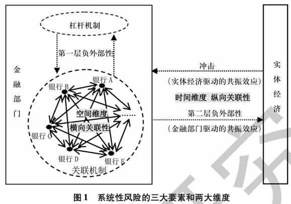
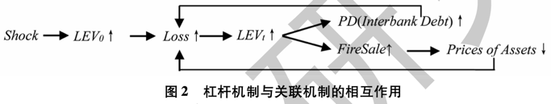
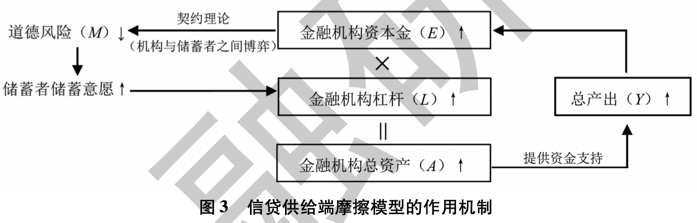
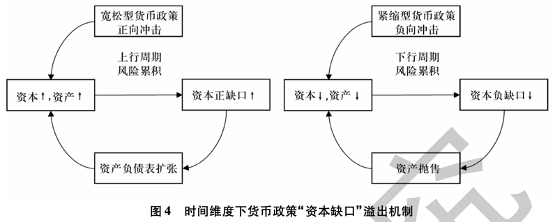

# 宏观审慎与货币政策双支柱框架研究——基于系统性风险视角

## Metadata

* Type: [[Article]]
* Authors: [[ 方意]], [[ 王晏如]], [[ 黄丽灵]], [[ 和文佳]]
* Date: [[2019]]
* Date added: [[2020-06-05]]
* Publication: [[金融研究]]
* Cite key: FangYi_2019_HongGuanShenShenYuHuoBiZhengCeShuangZhiZhuKuangJiaYanJiuJiYuXiTongXingFengXianShiJiao
* Topics: [[方意]], [[货币政策与财政政策双支柱]], [[系统性风险 货币政策与宏观审慎双支柱]]
* Related: [[TongZhongWen_2018_ZhongGuoYinXingYeXiTongXingFengXianDeSheHuiXingXiaoHuaJiZhiYanJiu]]
* Tags: [[Zotero Import]], [[宏观审慎政策]], [[货币政策]], [[空间维度系统性风险]], [[时间维度系统性风险]], [[Cross-Sectional Systemic Risk]], [[Macroprudential Policy]], [[Monetary Policy]], [[Time Dimension Systemic Risk]], [[_tablet]]
* PDF Attachments: [方意_王晏如_et-al_2019_宏观审慎与货币政策双支柱框架研究——基于系统性风险视角.pdf](zotero://open-pdf/library/items/7MWVUJHT)

### Abstract

 本轮国际金融危机之后,建立"宏观审慎政策专门盯住金融稳定目标,货币政策主要关注经济稳定目标"的双支柱成为国际社会的普遍共识。本文基于系统性风险视角,深入剖析系统性风险的累积和实现机制,从时间和空间两个维度梳理宏观审慎政策实现金融稳定的有效性,以及货币政策对系统性风险造成的潜在溢出性。目前从系统性风险的时间维度探讨双支柱政策的研究已较为丰富,可以总结为宏观审慎政策的"逆周期调节"机制和货币政策的"资本缺口"机制。从系统性风险的空间维度探讨双支柱政策的研究,也即对双支柱政策如何作用和改变金融机构内部关联网络的研究正成为研究热点。本文从政策工具和影响机制上对空间维度双支柱政策进行了系统梳理。基于以上分析,本文对双支柱政策的制定提出如下建议:时间维度宏观审慎政策要关注并消除货币政策对时间维度系统性风险的溢出性,同时要加强空间维度宏观审慎政策工具的创新力度。

## 内容

### 系统性风险的生成机理

- 对应金融周期的两个阶段  

  - 风险累积  

    风险累积是指在金融周期的上行阶段金融部门潜在风险逐渐增加的过程  

    - 童中文, 解晓洋, 邓熳利, 2018. 中国银行业系统性风险的“社会性消化”机制研究[J]. 经济研究, (02 vo 53): 124–139.  

  - 风险实现  

- 系统性风险的三大要素、两大维度
  

  - 三大因素  

    - 冲击 

      冲击是系统性风险的诱因，即系统性风险实现的“导火索”(DicksandFulghieri,2019)。冲击的来源分为两类：**内部冲击**和**外部冲击**。 但追根溯源，金融部门内部的冲击，如单家金融机构面临挤兑、破产或股价下跌等危机，绝大所数来源于外部冲击，即实体经济部门 的冲击。金融部门联结着实体经济中的储蓄部门和投资部门，在实现资金配置功能的过程中，也为实体经济风险传导至金融部门提供了天然的通道。此外，冲击还包括来自国际金融市场和本国金融监管政策转变等外部因素。

    - 放大机制  

      - 杠杆机制  

        杠杆机制，是指金融部门中由于负债的存在而将初始冲击自我放大的机制。

      - 关联机制  

        关联机制，是指金融部门中存在业务、管理模式、客户、投资者心理预期等各种关 联性，进而使得单家金融机构的风险通过这些关联性传导至其他金融机构，并遭受其他机构再传染的一种机制。

        - 形成的原因

          - (Acharya and Yorulmazer,2008)、  
            (Benoit et al,2017)  

            - 报团取暖  

              指的是金融机构之间通过相 互融资和业务交易，以共同抵御流动性冲击，实现风险分担。这本质上体现为金融机构的流动性风险管理。  

            - 市场竞争  

              指的是金融机构相似的管理模式、持有更加相似的金融资产以应对金融部门内部的市场竞争。  

      - 杠杆机制和关联机制 二者的相互作用  
        

    - 负外部性  

      负外部性，是系统性风险结果的外在表现，在某种程度上可以用来定义系统性风险或 检验系统性风险指标的有效性。  

  - 两大维度  

    - 空间维度  

      - 网络联动关系（横向关联性）  

        - 定义  

          空间维度系统性风险落脚点是单家金融机构对金融部门总体的贡献或受总体风险的 影响程度。  

        - 特点  

          其往往立足于微观金融视角，考虑金融机构的业务运营、资产配置以及由此形 成的网络联动关系（横向关联性），尤其关注金融机构之间的个体差异（或者称为异质 性）。  

        - 网络模型  

          - 业务关联性  

            - 理论研究  

              - 外生网络模型  

                - 研究发现  

                  - 网络结构对于研究金融网络传染非常重要  

                    网络结构对于研究金融网络传染非常重要，这种结构不仅体现为金融机构之间是否存在关联，更体现为金融机构之间关联 程度的大小。  

                    - Allen and Gale(2000)  

                      - 特点  

                        较早从理论角度考虑了网络结构应对冲击的稳健度  

                      - 观点  

                        关联性存在风险分担和风险传染两种效应  

                      - 意义  

                        后续研究均在这两种效应的权衡中，探讨网络结构与冲击的相互作用关系。  

                    - Elliott et al (2014)  

                      - 观点  

                        金融网络关联度对金融网络传染性的影响具有非单调性，当关联程度较低和较高时，金融传染发生的可能性较小。  

                  - 冲击大小和性质对于金融网络传染非常重要  

                    - Acemoglu et al(2015)  

                      - 研究发现  

                        研究发现，在冲击较小的时候，关联机制以风险分担作用为主；在冲击较大的时候，关联机制以风险传染效应为主。  

              - 内生网络模型  

            - 经验研究  

              - 网络结构研究  

                - 研究发现  

                  大量金融网络结构的经验研究表明，金融网络在现实中多表现为无标度的特征或者称为中心——边缘结构。  

                  - 冲击作用点对于金融网络传染非常重要  

                    - Boss et al,2004;  
                      Li and Schürhoff,2019  

                      - 研究发现  

                        这种结构具有稳健而脆弱的特点。  
                        对网络中任意节点施加一定程度上的负向冲击，网络更多表现为稳健的风险分担能力，但是当特定中心节点被摧毁（破产）时，则会引发整个金融网络的崩溃。  

              - 模拟测算空间维度系统性风险  

                - 直接业务网络  
                  - Upper(2011)  
                  - 马君潞等(2007)  
                  - 范小云等（2012)  
                - 间接业务网络  
                  - Greenwood et al.  (2015)  
                  - Duarte and Eisenbach (2018)  
                  - 方意（2016)  
                  - 方意和黄丽灵（2019)  

            - 有数据的实证研究  

              - 测度系统性风险指标  

                大量学者还依据破产传染的直接关联机制和抛售传染的间接关联机制，利用实际数据来测算空间维度的系统性风险指标。  

              - 工作  

                给定一个外生网络，用实际双边敞口数据、或最大信息熵算法估测出双边敞口数据，基于序列违约、或虚拟违约算法，模拟金融机构倒闭在金融网络之间的传染  

          - 金融市场关联性  

            - 尾部依赖模型  
              - Adrian and Brunnermeier (2016)  
              - Brownlees and Engle (2016)  
              - Acharya et al.  (2017)  
              - 唐文进和苏帆（2017)  
              - 杨子晖等（2018)  
              - 李政等（2019）  
            - DY溢出网络拓扑模型  
              - Diebold and Yilmaz (2014)  
              - 杨子晖和周颖刚（2018)  

          - 相关研究  

            - 模型与参考文献
              

    - 时间维度  

      - 共振效应（纵向关联性）  

        时间维度系统性风险落脚点是金融部门总体风险随时间的变化趋势。其往往立足于 宏观金融视角，以金融部门整体为研究对象，不考虑金融机构之间的差异性，关注金融部 门整体与实体经济之间的共振效应（纵向关联性）  

        - 基于实体驱动的共振效应  

          - 传导机制  

            实体经济波动 → 金融部门波动  

          - 模型  

            - 信贷需求摩擦模型  

              - 特点  

                信贷需求摩擦模型主要关注借款者（包括住户部门和非金融企业部门等）的资产负 债表，通过潜在的金融契约隐性纳入金融部门。  
                借款者向金融机构借款时一般需提供合 格抵押品。抵押品可大幅降低金融机构与借款人之间的信息不对称。 目前，信贷需求摩 擦的模型主要研究以下两类抵押品：以房地产为代表的耐用品以及资产负债表净值。  

              - 相关研究  

                - 机制  

                  借款者的抵押品价值越高，信息不对称程度越小，借款者的借款数量越高或这款成本越低。  
                  此外，在经济周期的作用下，抵押品价值会发生周期性波动。进而引起借款者资产负债表规模的周期性波动。  

                - Kiyotaki and Moore(1997)  

                  - 信贷抵押约束机制模型（KM模型）  
                    - 研究  
                      - 房地产抵押品  

                - Bernanke et al.1999  

                  - 金融加速器模型（BGG模型）  
                    - 研究  
                      - 资产负债表净值抵押品  

        - 金融部门驱动的共振效应  

          - 传导机制  

            金融部门波动 → 实体经济波动  

          - 模型  

            - 纳入信供给摩擦的模型  

              - 特点  

                纳入信供给摩擦的模型关注银行的资产负债表。金融机构的总资产 （以信贷资产为主）由银行的资本金和杠杆共同决定。  

              - 作用机制  
                

                在经济的上行周期，实体经济的产 出（Ｙ）增加，而产出的增加会提升金融机构的盈利能力，使得金融机构的资本金（Ｋ）增 加。金融机构的资本金越多，金融机构与储蓄者之间的信息不对称越弱，金融机构获得可 贷资金增加（存款），从而其开展更多的贷款业务，使得杠杆（Ｌ）升高。 因此，在资本金和 杠杆增加的共同作用下，金融机构的总资产（Ａ）进一步膨胀，实体经济得到的资金支持也 进一步增加。实际上，这也是上行金融周期，杠杆机制促使系统性风险累积的作用原理。  

                - 信贷供给端摩擦模型的作用机制  

              - Gertler and Kiyotaki(2015)  

                - 工作  

                  融合了金融加速器效应和 ＤＤ银行挤兑模型，给出了金融 机构部门与宏观经济之间在下行周期的共振机制。  

                - 发现  

                  当宏观经济疲软时，产出和资产价格 的下降会降低金融机构的盈利能力，从而其资本金遭受损失。此时，储蓄者预期金融机构 偿付存款能力下降、信息不对称程度增强，会对金融机构进行挤兑，从而使得金融机构的 资产负债表快速收缩。信贷资产的萎缩会提高商业信贷的价格，使得实体经济进一步萧 条，加深金融机构资本金和资产价格的下降幅度。 随着金融机构资产负债表状况和资产 清算价格的不断恶化，金融机构的破产概率会随之上升，最终形成“宏观—金融”间的恶 性循环。  

### 系统性风险 宏观审慎政策 对系统性风险的 有效性

- 时间维度宏观审慎政策  

  - 相关工具  

    - 资产类政策工具  

      - 作用  

        限制实体经济驱动的共振效应（即将宏观审慎政策插入在金融机构和借款者的关联中）  

      - 包括  

        - 信贷价值比（LTV）  
        - 债务收入比（DTI）  
        - ……  

      - 相关研究  

        - 理论  
          - Gelain(2011)  
            - 模型  
              - DSGE  
            - 政策工具  
              - 信贷价值比（LTV）  
            - 引入盯住某些金融稳定变量的LTV政策为角度进行分析  
        - 经验  
          - Tillmann(2014)  
            - 模型  
              - Qual VAR  
            - 政策工具  
              - 信贷价值比（LTV）  
              - 债务收入比（DTI）  
            - 工作  
              - 利用Qual VAR，以加坡和中国香港为案例分析了LTV和DTI等紧缩性信贷类宏观审慎政策在限制信贷增 长和房价上涨等目标的有效性。  

    - 资本类政策工具  

      - 作用  

        限制实体经济驱动的共振效应（ 即将宏观审慎政策插入在金融机构和储蓄者的关联中）  

      - 包括  

        - 逆周期资本缓冲  
        - 动态拨备  
        - 资本充足率要求  
        - ……  

      - 相关研究  

        - 理论  
          - Angeloni and Faia(2013)  
            - 发现盯住产出的逆周期资本充足率要求有利于维持金融稳定。  
        - 经验  
          - Jimenez et al.(2017)  
            - 发现西班牙的动态拨备政策能够 效熨平信贷供给周期，并在经济下行周期为实体经济提供资金支持。  

    - 流动类政策工具  

      - 作用  

        限制实体经济驱动的共振效应（ 即将宏观审慎政策插入在金融机构和储蓄者的关联中）。  
        提升金融机构稳定资金供给的能力，从而增加其抵抗流动性冲击的能力。  

      - 包括  

        - 流动性覆盖率（LCR）  
        - 净稳定资金比率（NSFR）  
        - 准备金要求  
        - 存贷比要求  

      - 相关研究  

        - 理论  
          - D Kashyap(2016)  
            - 基于DD银行挤兑模型并纳入流动性监管要求，证实银行持有一定量未被占用的流动性资产可以有效抵挡挤兑风险。  
        - 经验  
          - Banerjee and Hitoshi(2014)  
            - 发现流动性覆盖率监管要求有助于促进银行资产结构向高质量、高流动性结构调整。同时，由于流动性覆盖率监管极大地改变了银行的资产配置行为，从而使得高质量、 高流动性资产产生溢价，因此为保障资产价格与政策利率的均衡关系，还需要货币政策相配合。  

  - 作用  

    时间维度宏观审慎政策，主要用于防范和降低金融部门与实体经济之间的“共振”（顺周期性）效应，具体表现为对金融部门“择时”干预。具体而言，时间维度的宏观审慎政策主要有两个职能：  
    （１）一定程度上熨平金融周期，从而避免信贷、资产价格等过度膨胀，防止因泡沫破裂导致金融部门遭受较严重的外部冲击，降低实体经济驱动的共振效应。  
    （２）在上行周期增加金融机构的资本缓冲以应对下行周期的资本缺口，增强金融部门抵御冲击的能力，降低其最终对实体经济造成的负外部性，从而降低金融部门驱动的共振效应。  

  - 研究方法  

    - 理论方面  
      - 以金融摩擦理论为基础，以DSGE模型进行理论定量分析  
    - 经验方面  
      - 定性向量自回归、双重差分法评估  

- 空间维度宏观审慎政策  

  - 相关工具  

    - 事前的空间维度宏观审慎政策  

      事前的宏观审慎政策是指在金融危机发生前用于防范与化解系统性风险的政策，着 重关注系统性风险的放大机制。 具体而言，该类政策主要有两种模式，“窗口指导”政策 与“系统重要性机构监管”政策  

      - 包括  

        - 窗口指导政策  

          - （方意和黄丽灵， 2019）  
            - 窗口指导”政策，也即宏观审慎当局通过“奖励”或“惩罚”的承诺来激励银行在遭　受冲击后自行选择抛售流动性较强的资产以达到监管要求，从而避免因抛售流动性较差　的资产进一步触发放大机制导致发生系统性危机。  

        - 系统重要性机构监管政策  

          - Greenwood et al. ，2015；李政等，2019  

            - 系统重要性机构监管”政策，特别关注系统重要性机构与其他机构之间关联性和共 同风险敞口引起的系统性风险。由于系统重要性机构其资产规模大、交易对手关系复杂、 资产组合资产类别丰富，其往往在金融网络中占据重要节点。遭受冲击后，其往往可能对 其他金融机构造成较大的负外部性。  

          - 如何使用  

            通过规模、网络联结度等因素识别系统重要性机构，并设定相关政策工具目标减弱系统重要性机构通过杠杆机制和关联机制放大系统性风险的潜在威胁，这是当前受到最广泛关注和实践的空间维度宏观审慎政策。  

    - 事后的空间维度宏观审慎政策  

      - 包括  

        - 流动性注入政策  

          - 资产购买方式  

            - 定义  

              资产购买模式是以购买资产的方式向金融机构或市场注入流动性。  

            - 作用机制  

              宏观审慎当局通过增持流动性较差的资产来提高该类资产的流动性，从而降低金融部门 的横向关联性，使得金融机构抛售少量流动性资产即可维持其目标杠杆（或满足监管要求）。  
              这种模式主要通过降低资产价格下跌幅度以限制“杠杆——资产价格双螺旋”的负反馈循环机制以降低系统性风险。  

          - 信贷政策  

            - 定义  

              信贷政策即为以信贷方式向金融机构或市场注入流动性。  

            - 作用机制  

              在金融部门遭受较大冲击后，宏观审慎当局接纳流动性较差或风险较高的资产作为抵押品为金融机构提供流动性。  

              1. 提升金融机构抵御冲击的能力；  
              1. 调整金融机构的资产负债结构，从而降低金融部门的横向关联性；  

          - 直接向金融机构注资  

            - 定义  

              直接 向金融机构注资。即宏观审慎当局直接向金融机构注入资本金，从而使得金融机构抵御 冲击的能力提升并降低其杠杆，使得部分机构停止抛售资产而降低金融部门整体的负外 部性。  

          - 合并或拆分金融机构  

            - 定义  

              合并或拆分金融机构。合并或拆分金融机构是宏观审慎当局通过推动较为稳 健的银行与遭受损失的银行合并，或将受到冲击的系统重要性金融机构拆分为若干个小 机构。  

            - 作用机制  

              理论上，降低单家金融机构的杠杆与风险敞口可以增加金融机构抵御风险的能力（限制杠杆机制），降低非流动资产或高风险资产在单家机构中的占比可以降低横向关联性（限制横向关联机制），同时自然也降低了杠杆机制与关联机制的相互作用，从而实现系统性风险的化解。  

            - 缺点  

              - 相关研究  
                - Greenwood et al. ，2015  
                  - 通过政策模拟发现这种银行合并不降低风险敞口。相反，合并后遭受冲击的银行的风险直接“污染”了原本较为稳健的银行，甚至使系统性风险不降反升。  

      - 定义  

        事后的空间维度宏观审慎政策是在金融危机发生后用于降低负外部性并维持金融稳 定的政策。其主要形式为“流动性注入”政策。目前，主要有两类不同的“流动性注入”政 策模式：（１）资产购买模式；（２）信贷政策。  

  - 作用  

    空间维度宏观审慎政策用于防范和化解横向关联性带来的负外部性风险，其主要关 注系统性风险的放大机制。  

  - 研究方法  

### 系统性风险 货币政策 溢出性

- 为什么对系统性风险造成影响？  

- 货币政策对 时间维度系统性风险 的溢出  

  - 定义与机制  

    货币政策对时间维度系统性风险的溢出关注金融部门与实体经济之间的纵向关联性 问题。  

  - 相关研究  

    - (Borio and Zhu, 2012;张雪兰和何德旭,2012)  

      - 以货币政策的风险承担渠道为主  

    - 徐明东和陈学彬,2012; 项后军等,2018  

      - 通常不区分上行周期和下行周期，用不良贷款 率、拨备覆盖率， Z-score 等指标代理金融机构的风险承担水平  

    - Adrian and Shin(2010a,2010b)  

      - 以资本缺口机制为核心，讨论货币政策冲击是如何通过金融机构资产负债表的变化影响系统性风险在上行金融周期的累积和下行金融周期的实现  
        

        

      - Adrian, Tobias, 和Hyun Song Shin. 2010. 《Financial Intermediaries and Monetary Economics》. _Handbook of Monetary Economics_ 3.  

      - Shin, Hyun Song, 和Tobias Adrian. 2010. 《Liquidity and Leverage》. _Journal of Financial Intermediation_ 19 (3): 418–37.  

      - 研究内容  

        在金融机构风险中性的假设下，只有当资本金要求约束为紧约束，也即 调增监管要求资本金至与自有资本金相等时，金融机构的期望收益才最大。因此，资本正 缺口对金融机构形成有效激励，为了充分消化这种资本的“剩余生产能力”，金融机构会 扩张其资产负债表，而自有资本金的增加为金融机构的扩表能力提供了保障。 需要指出 的是，“资本缺口”机制中，更为重要的一点在于，金融机构资产负债表扩张在上行金融周 期往往会为金融机构持续提供较高的收益，同时提升资产价格。 在金融机构采用盯市计 价的条件下，这进一步导致金融机构自有资本金的上升和监管资本金的下降。 也即资本 正缺口进一步加大，形成了“资本正缺口—资产负债表扩张”的正反馈循环 (Adrian and Shin,2010b) 。金融机构的风险承担水平在这种顺周期性的循环中逐步上升，最终形成信 贷和资产价格的泡沫。也即上行金融周期形成系统性风险累积。  

        

- 货币政策对 空间维度系统性风险 的溢出  

  - 定义  

    货币政策对系统性风险空间维度的溢出主要关注金融机构之间网络结构的变化，即 系统性风险中横向关联性的变化。  

  - 研究方法  

    - 主要通过建立内生网络模型，刻画异质性金 融机构面临冲击时的资产负债表行为，寻找网络结构的动态均衡。  

    - 相关研究  

      - Wolski and vandeLear(2016)  

        - 研究内容  

          将同业市场分为抵押同业市场和无抵押同业市场。 货币政策宽松 的环境下，金融机构会更偏向于从事风险和收益更高的无抵押同业业务，这与时间维度分 析中“资本缺口”或“追逐收益”机制相一致。因此，风险敞口更高的无抵押同业市场的网 络结构变化更为剧烈，表现为更高的连通度和更少的孤立节点。  

          （１）通过供求匹配影响网络结构。在宽松型 货币政策下，同业市场利率水平较低。此时，金融机构对同业资金的总需求旺盛，而单家 机构对同业资产的供给意愿不足。因此，需求方为了充分满足资产端扩张的要求，会向更 多的同业信贷供给机构进行拆借业务。金融机构更加广泛的业务关联会导致同业网络结 构的中心度降低、连通度上升。  

          （２）通过风险偏好影响网络结构。利用异质代理人模型 （ ABM 模型）通过对金融机构在同业市场上借贷行为的最优化进行建模，模拟研究在面临 内生货币政策冲击时，金融机构同业业务网络结构的动态变化特征，并隐约给出了两种潜在机制。  

