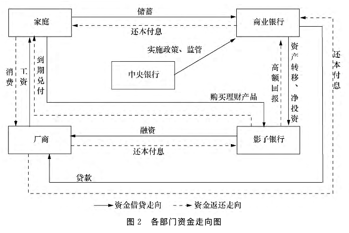
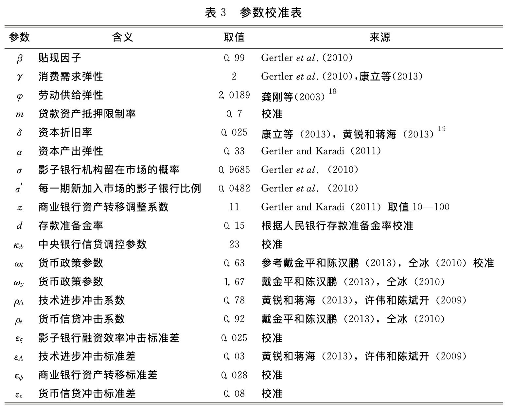
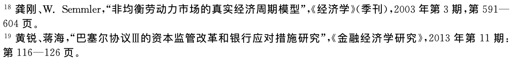
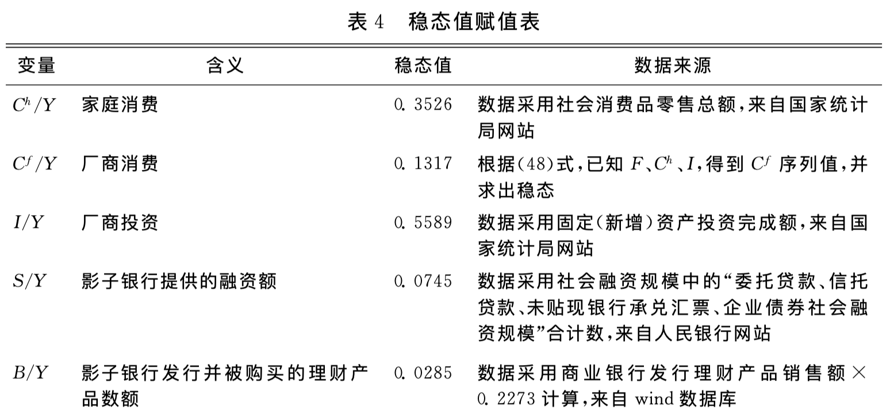
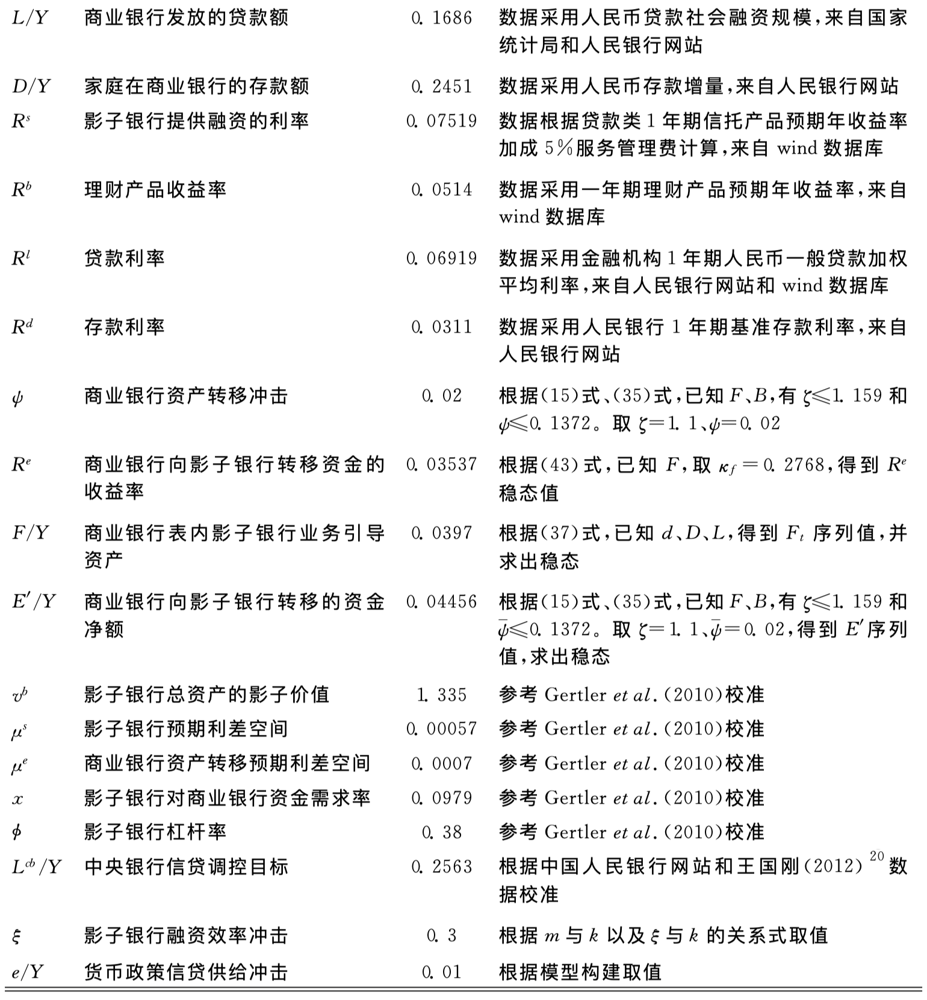
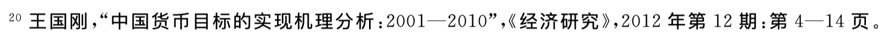
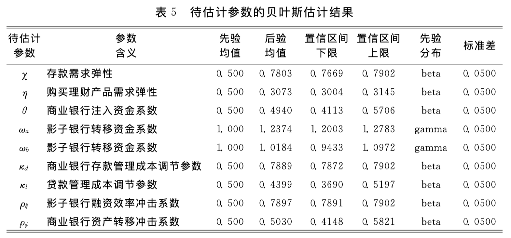

# 中国式影子银行下的金融系统脆弱性

# Metadata

* Item Type: [[Article]]
* Authors: [[ 林琳]], [[ 曹勇]], [[ 肖寒]]
* Date: [[2016]]
* Date Added: [[2020-05-26]]
* Cite key: LinLin2016
* Topics: [[影子银行]], [[影子银行DSGE]], [[DSGE]], [[影子银行]]
* Tags: #financial-system-fragility, #risk-contagion, #shadow-banking, #影子银行, #金融系统脆弱性, #风险传递机制, #zotero, #literature-notes, #reference
* PDF Attachments
  - [林琳_曹勇_et-al_2016_中国式影子银行下的金融系统脆弱性.pdf](zotero://open-pdf/library/items/RXHYH4PR)

# Abstract

本文基于近年来中国影子银行体系迅速增长的现实特征,建立了一个引入影子银行部门的DSGE模型,对中国式影子银行发展过程中的金融系统脆弱性进行了研究。研究结果表明,在疏于监管的影子银行信贷扩张所推动的经济上升期中,商业银行规避监管、取得监管套利的行为主导了影子银行的发展,形成了高杠杆、高度期限错配、关联关系复杂的金融系统,经济上升时期众多单独业务机构忽视系统性风险的行为加剧了顺周期效应,集聚了大量金融风险。

#  Zotero links

* [Local library](zotero://select/items/1_ENN3AJGH)
* [Cloud library](http://zotero.org/users/6240833/items/ENN3AJGH)

# Highlights and Annotations

- [[LinLin2016 - The following values have no corresponding Zotero fieldSR 1AD 南京大学经济学院;中国人民银行南京分行营业管理部;中国人民大学汉青经济与金融高级研究院;美国宾州州立大学经济系;D]]

# 阐述

> 通过Wind数据库、中国货币网，以下截止2013年，

中国影子银行三个金融系统内在脆弱性特征：

- 严重期限错配，缺乏准备拨备。负债方聚集大量短期债务，资产方多为中长期投资；
- 过高杠杆率；
- 业务往来频繁密切，关联关系错综复杂，容易风险传递蔓延；

中国影子银行特征之现实表现为：

- 金融市场资金大量从大型商业银行净流向其他金融机构；
- 在监管机构监管考核存贷比等指标期间，资金往来之于商业银行与非银行金融机构之间频繁，有方向规律性；
- 资金运用期限之于理财产品和信托产品普遍较长；
- 大幅上升的短期资金比例之于金融机构间往来；
- 不断升高的金融杠杆率；

# 模型

### 示意图：

### 家庭部门：

购买理财产品从影子银行发行的$B_{t+i}$；

### 厂商

通过从影子银行融资$S_{t}$以利率$R_{t-1}^{s}$；

厂商应满足收支平衡约束：
$$
S_{t}+Y_{t}+L_{t}=I_{t}+C_{t}^{f}+W_{t} N_{t}+\frac{R_{t-1}^{l} L_{t-1}}{\pi_{t}}+\frac{R_{t-1}^{s} S_{t-1}}{\pi_{t}}
$$

厂商最大化是通过设定企业家效用最大化表示：
$$
L_{t}\left(1+R_{t}^{l}\right)=m K_{t}
$$
资本积累方程： $K_{t}=I_{t}+(1-\delta) K_{t-1}$,
其中， $\alpha$ 为资本要素比例， $m$ 为贷款资产抵押限制率，即商业银行为厂商提供 的贷款不能超过其资本总额的限制比例， $\delta$ 为折旧率， $\xi_{t}$ 为影子银行融资效率 冲击，表示由影子银行提供的融资转化为企业生产资本的比例，是系统的外生冲击，体现了影子银行融资量对企业生产资本的影响，并通过生产资本最 终影响企业的产出。通过影子银行融资效率参数的设置，我们将考察实体经 济与金融部门之间的风险传递路径。该冲击变量满足 $\Lambda R (1), \varepsilon_{\xi, t}$ 为白噪声
$$
\ln \xi_{t}=\rho_{\xi} \ln \xi_{t-1}+\varepsilon_{\xi, t},
$$
其中, $\varepsilon_{\xi, t} \sim N\left(0, \sigma_{\xi}^{2}\right)_{0}$
$\Lambda_{t}$ 是技术冲击，满足 $\Lambda R (1), \varepsilon_{\Lambda, t}$ 为白噪声
$$
\ln A_{t}=\rho_{\Lambda} \ln A_{t-1}+\varepsilon_{\Lambda, t}
$$
其中，$\varepsilon_{\Lambda, t} \sim N\left(0, \sigma_{\Lambda}^{2}\right)$

银行贷款受到企业资本担保比例的约束 :
$$
L_{t}\left(1+R_{t}^{l}\right) \leqslant m K_{t}
$$

影子银行融资量：

$S_{t}\left(1+R_{t}^{s}\right)=\xi_{t} K_{t}$,

$\xi_{t}$ 为影子银行融资效率 冲击，表示由影子银行提供的融资转化为企业生产资本的比例，是系统的外 生冲击，体现了影子银行融资量对企业生产资本的影响，并通过生产资本最 终影响企业的产出。

### 影子银行：

> 参考
> Gertler M, Kiyotaki N, Queralto A, 2012. Financial Crises, Bank Risk Exposure and Government Financial Policy[J]. Journal of Monetary Economics, 59: S17–S34. DOI:[10.1016/j.jmoneco.2012.11.007](https://doi.org/10.1016/j.jmoneco.2012.11.007).
> 构建模型。

#### 行为：

- 销售理财产品给家庭；
- 接受资产转移从商业银行；
- 融资给厂商；
- 影子银行退出市场，当每期的影子银行产品到期兑付之后；

#### 假设：

- 假设影子银行退出市场，当每期的影子银行产品到期兑付之后；

- 假设影子银行不受监管；

  

#### 描述

资产负债表
$$
S_{t}=n_{t}+B_{t}+E_{t}^{\prime}
$$
净资产积累方程
$$
n_{t}=R_{t}^{s} S_{t-1}-R_{t}^{b} B_{t-1}-R_{t}^{e} E_{t-1}^{\prime}
$$
其中，

上标$\Box^{e}$表示商业银行转移给影子银行资金；

上标$\Box^{s}$表示影子银行信贷融资；

上标$\Box^{b}$表示影子银行提供理财产品；

目标函数：
$$
V_{t}=\max E_{t} \sum_{\tau=t+1}^{\infty}(1-\sigma) \sigma^{\tau-t-1} \beta_{t, \tau} n_{\tau}
$$

### 商业银行

最优化的问题
$$
\begin{aligned}
\max E_{0} & \sum_{i=0}^{\infty} Q_{t+i, t} \frac{P_{t}}{P_{t+i}}\left(R_{t+i-1}^{l} L_{t+i-1}+R_{t+i-1}^{e} E_{t+i-1}^{\prime}\right.\\
-&\left.R_{t+i-1}^{d} D_{t+i-1}+r d D_{t+i-1}-P_{t+i}^{\phi}-P_{t+i}^{c}\right)
\end{aligned}
$$
其中， $r$ 为存款准备金利率， $Q_{t+i, t} \triangleq \beta^{i}\left(\frac{C_{t+i}^{h}}{C_{t}^{h}}\right)^{-\gamma}$, 表示随机贴现因子。

**商业银行向影子银行转移的资金净额**的关系式：
$$
E_{t}^{\prime}=\frac{\zeta}{1-\psi_{t}^{\prime}} F_{t}
$$

### 影子银行

影子银行资产负债平衡为(Gertler et al. , 2010, 2012; Gertler and Kiyotaki, 2013):
$$
S_{t}=n_{t}+B_{t}+E_{t}^{\prime} 
$$
影子银行净资产通过留存收益获得
$$
n_{t} = \overbrace{R_{t}^{s} S_{t-1}}^{影子银行提供信贷融资收益}-\overbrace{R_{t}^{b} B_{t-1}}^{理财产品收益} - \overbrace{R_{t}^{e} E_{t-1}^{\prime}}^{商业银行向影子银行转移资金}
$$
其中， $n_{t}$ 为影子银行净资本， $R_{t}^{s}$ 为影子银行提供信贷融资收益率， $R_{t}^{b}$ 为理财产品收益率， $R_{t}^{e}$ 为商业银行向影子银行转移资金的收益率， $E_{t}^{\prime}$ 为商业银行向影子银行转移的资金净额。

商业银行通过资产和资金的流动与影子银行发生关联，最终在影子银行资产负债表中表现为商业银行向影子银行注入净资金。 由于信托、理财产品、委托贷款等影子银行产品到期兑付可退出市场， 假设市场中每期都有影子银行部门机构退出市场。影子银行的最终目标是最大化其退出市场时的期望净资产，因此其目标函数为:
$$
V_{t}=\max E_{t} \sum_{\tau=t+1}^{\infty}(1-\sigma) \sigma^{\tau-t-1} \beta_{t} \overbrace{n_{\tau}}^{影子银行净资本}
$$
$\beta_t$表示贴现因子，$n_\tau$表示影子银行净资本。

定义**影子银行对商业银行资金需求率**：
$$
x_{t}=\frac{\overbrace{E_{t}^{\prime}}^{商业银行向影子银行转移的资金净额}}{\underbrace{S_{t}}_{厂商向影子银行融资量}},
$$
定义商业银行为了私利，从影子银行负债中转移部分资金
$$
\Theta\left(x_{t}\right)=\overbrace{\theta}^{商业银行\\转移资金\\调整系数} (1+\omega_{a} \overbrace{x_{t}}^{影子银行\\对商业银行\\资金需求率} +\frac{\omega_{b}}{2} x_{t}^{2})
$$
其中， $\theta$ 为商业银行转移资金调整系数， $\omega_{a}, \omega_{b}$ 为商业银行转移的资金净额比系数。因此对于影子银行来讲，维持影子银行机构运行的外部约束（**激励相容约束**）如下 :

激励相容约束：
$$
V_{t} \geqslant \Theta\left(x_{t}\right) S_{t}
\tag{17}
$$
(17)式表明影子银行机构能够获得理财产品投资需要满足的条件是，<u>影子银行退出市场时的期望净资产至少大于由于发生道德风险因素而被商业银行抽走的资金数量</u>。 

在 $t-1$ 期影子银行进入市场的价值为 :
$$
V_{t-1}=E_{t-1} \beta_{t, t-1}\left\{(1-\sigma) n_{t}+\sigma \operatorname{Max}\left[V_{t}\right]\right\} .
$$
为便于计算这一问题，我们将 $V_{t}$ 的表达式转化，假设其净资产价值是其 资产负债的线性形式:
$$
V_{t}=\overbrace{v_{t}^{s}}^{影子银行总资产的\\影子价值} S_{t} - \overbrace{v_{t}^{e}}^{接受商业银行\\注入资金的\\影子成本} E_{t}^{\prime}- \overbrace{v_{t}^{b}}^{理财产品的\\影子价值，\\即影子银行\\发行理财产品的\\单位影子成本} B_{t}
$$

其中，
 $v_{t}^{s}$ 是影子银行总资产的影子价值，
 $v_{t}^{e}$ 是接受商业银行注入资金的影子成本，
 $v_{t}^{b}$ 是理财产品的影子价值，即影子银行发行理财产品的单位影子成本。

令

 $\mu_{t}^{s}=v_{t}^{s}-v_{t}^{b}\\ \mu_{t}^{e}=v_{t}^{b}-v_{t}^{e}$

，得到：
$$
V_{t}= \overbrace{\mu_{t}^{s}}^{影子银行\\预期利差空间} S_{t}+ \overbrace{\mu_{t}^{e}}^{商业银行资产转移\\预期利差空间} E_{t}^{\prime}+ \overbrace{v_{t}^{b}}^{理财产品的\\影子价值，\\即影子银行\\发行理财产品的\\单位影子成本} n_{t}
$$
其中， $\mu_{t}^{s}$ 为影子银行预期利差空间， $\mu_{t}^{e}$ 为商业银行资产转移预期利差空间根据约束条件可得到 :
$$
\begin{array}{c}
\frac{\mu_{t}^{e}}{\mu_{t}^{s}+\mu_{t}^{e} x_{t}}=\frac{\omega_{a}+\omega_{b} x_{t}}{1+\omega_{a} x_{t}+\omega_{b} x_{t}^{2}} \\
S_{t}=\phi_{t} n_{t}
\end{array}
$$
其中，
$$
\phi_{t}=\frac{v_{t}^{b}}{\Theta \left(x_{t}\right)-\left(\mu_{t}^{s}+\mu_{t}^{e} x_{t}\right)}
$$
$\phi_{t}$ 为影子银行的杠杆率。应用待定系数法，得到(20)式系数:
$$
\begin{array}{c}
v_{t}^{b}=E_{t}\left(\beta_{t, t+1} \Omega_{t+1} R_{t+1}^{b}\right) \\
\mu_{t}^{s}=E_{t}\left[\beta_{t, t+1} \Omega_{t+1}\left(R_{t+1}^{s}-R_{t+1}^{b}\right)\right] \\
\mu_{t}^{e}=E_{t}\left[\beta_{t, t+1} \Omega_{t+1}\left(R_{t+1}^{b}-R_{t+1}^{e}\right)\right]
\end{array}
$$
其中, $\Omega_{t+1}=1-\sigma+\sigma\left[\nu_{t+1}^{b}+\phi_{t+1}\left(\mu_{t+1}^{s}+\mu_{t+1}^{e} x_{t+1}\right)\right]$ 。
因为每一期有 $\sigma$ 比例的影子银行机构留在市场，并有新加入市场的影子 银行机构，因此每一期影子银行机构包括留在市场的影子银行和新加入市场 的影子银行，整个市场影子银行的净资产为:
$$
\begin{array}{c}
n_{t}=n_{t}^{o}+n_{t}^{y}, \\
n_{t}^{o}=\sigma\left(R_{t}^{s} S_{t-1}-R_{t}^{b} B_{t-1}-R_{t}^{e} E_{t-1}^{\prime}\right) \\
n_{t}^{y}=\sigma^{\prime} R_{t}^{s} S_{t-1}
\end{array}
$$
其中， $n_{t}^{o}$ 为留在市场的影子银行，nt 市场的影子银行比例，假定每一期新进入市场的影子银行的原始净资产仅占一小部分，整个市场影子银行的净资本积累过程方程式为 :
$$
n_{t}=\left(\sigma+\sigma^{\prime}\right) R_{t}^{s} S_{t-1}-\sigma R_{t}^{b} B_{t-1}-\sigma R_{t}^{e} E_{t-1}^{\prime}
$$

# 数据选取、参数校准估计

本文构建的 DSGE 模型方程组包含 26 个方程，26 个内生变量，20 个结构参数和 4 个外生冲击变量：$\Lambda_{t}, \xi_{t}, \psi_{t}, e_{t \circ}$ 模型采用 2005 年至 2013 年季度数据，数据来自中国人民银行网站、国家统计局网站和 wind 数据库。受数据可得性限制，模型中的部分参数借鉴已有文献设定，部分根据实际数据用 贝叶斯估计方法估计，参数校准及稳态取值参见表 3 和表 4 。部分稳态取值说 明如下：根据 $F_{1} C ^{h}$ 、 $I$ 序列值以及 (42)式，得到 $C^{f}$ 序列值; 影子银行提供 的融资额数据所需序列 $S ，$ 主要采用社会融资规模中的分项数据一委托贷 款、信托贷款、未贴现银行承兄汇票、企业债券社会融资规模的合计数，理 由是“理财产品用于支持实体经济的资金已涵盖在社会融资总量中” 14 , 意即 与商业银行关联的影子银行的大部分融资量已经在社会融资规模的统计中; 影子银行发行并被购买的理财产品数额 $B$ 采用“商业银行发行理财产品销售 额X0. 2273” (考虑可得数据商业银行的市场占有率 $55.44 \%$ 、信贷类理产品 占比 $50.14 \%^{15}$ 和理财资金年周转次数为 $4^{16}$ )计算; 影子银行提供融资的利 率 $R^{s}$ 根据贷款类一年期信托产品预期年收益率加 $5 \%$ 服务管理费 17 计算; 商 业银行表内影子银行业务引导资产 $F$ 数据根据 $d 、 D 、 L$ 及 $(34)$ 式可得; 根据(12)式、(31)式，已知 $F 、 B$, 有 $\zeta \leqslant 1.159$ 和 $\bar{\psi} \leqslant 0.1372$, 考虑变量之间的关系，并满足参数取值范围，取 $\zeta=1.1 、 \bar{\psi}=0.02$, 可得商业银行资产转移反贵 均衡参数 $\psi$ 、商业银 行向影子银行转移的资金净额 $E^{\prime} ;$ 已知 $F$, 取 $\kappa_{f}=$0.2768, 可得 $R^{e}$ 稳态值。

