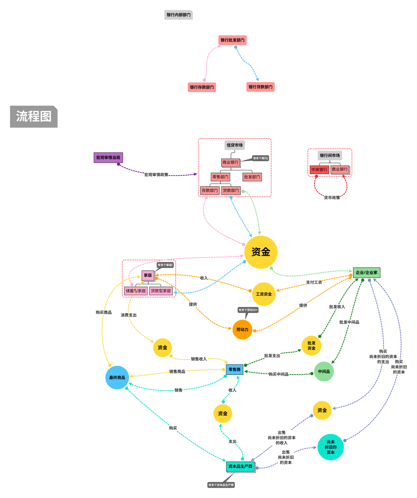

# 基于DSGE模型的宏观审慎政策与货币政策调控框架研究

# Metadata

* Type: [[Article]]
* Authors: [[ 沈姗姗]]
* Date: [[2019]]
* Date added: [[2020-06-05]]
* Publication: [[金融经济学研究]]
* Cite key: ShenShanShan_2019_JiYuDSGEMoXingDeHongGuanShenShenZhengCeYuHuoBiZhengCeDiaoKongKuangJiaYanJiu
* Topics: [[货币政策]], [[货币政策与财政政策双支柱]]
* Related: 
* Tags: [[Zotero Import]], [[宏观审慎政策]], [[货币政策]], [[金融稳定]], [[社会福利]], [[Financial Stability]], [[Macro-Prudential Policy]], [[Monetary Policy]], [[Social Welfare]]
* PDF Attachments: [沈姗姗_2019_基于DSGE模型的宏观审慎政策与货币政策调控框架研究.pdf](zotero://open-pdf/library/items/3Z3955EP)

## Abstract

 构建包含宏观审慎政策与货币政策制定规则的动态随机一般均衡模型,用以模拟中国宏观审慎政策与货币政策之间的合作效率,结果显示,逆周期调节的宏观审慎政策与货币政策合作可以有效降低金融波动,提升社会福利,比非合作调节更加有效。为充分发挥宏观审慎政策效应和实现宏观审慎政策与货币政策的协调合作,有必要在完善宏观审慎政策框架、独立决策制定目标、保证政策目标有所侧重、完善信息沟通与共享机制、形成广泛的政策合作机制等方面进行深入改革。

# 综述  

- 不足  
  - 大多数研究集中在宏观审慎政策与货币政策之间的关系以及两种 政策协调合作的必要性上，但对金融稳定的定义、 更有效地实现目标 、 降低政策冲突，仍缺乏深入的研究 。  

# 研究  

研究宏观审慎政策效应及其与货币政策的合作对社会福利和金融稳定的影响。  

# 工作  

- 基于巴塞尔III协议，增加宏观审慎工具，构建DSGE  

  本文在 Gerali et al． （ 2010）［10］、Quint and Ｒabanal（ 2014） ［11］构建的 DSGE 模型基础上， 根据巴塞尔 III 对逆周期资本缓冲的要求增加了宏观审慎政策工具———资本监管要求，与 货币政策规则平行制定原则，并加入了 Bernake et al． （ 1998） ［12］的金融加速器部分，构建了 兼顾价格粘性 、 工资粘性和群组消费习惯的动态随机一般均衡模型 。  

- 分析宏观审慎政策与货币政策合作的福利  

- 分析外生冲击的影响  

# 作用  

借鉴其分析思路和方法。  

# 创新  

- 基于政策执行的损失函数角度，研究宏观审慎政策效应及其与货币政策的合作对社会福利和金融稳定的影响。  

# 发现  

宏观审慎政策和货币政策协调合作可以明显改善社会福利水平、降低金融波动，并且在政策合作下对关注变量赋予合理权重，能够更加有效地降低损失  

# 政策建议  

- 完善宏观审慎政策框架  
- 制定独立的政策目标并有所侧重  
- 完善信息沟通与分享机制  
- 形成广泛的政策合作机制  

# 模型

- 沈姗姗_2019_基于DSGE模型的宏观审慎政策与货币政策调控框架研究_业务图.pdf  
- 沈姗姗_2019_基于DSGE模型的宏观审慎政策与货币政策调控框架研究_业务图.svg  
- 沈姗姗_2019_基于DSGE模型的宏观审慎政策与货币政策调控框架研究.xmind  

# 理论基础与模型构建

## 假设

- 家庭、企业家无期限生存
- 信贷市场属于标准的Dixit-Stiglitz模式
- 家庭和企业家持有的存款和带宽构成是CES形式
- 每家银行的存款和贷款需求主要取决于 银行提供的利率水平 。
- 银行的批发部门处于完全竞争条件
- 银行的两个零售部门处于垄断竞争条件
- 假设银行可以在中央银行以政策利率 $r_t$无限融资
- 零售商处于垄断竞争地位
- 模型中引入资本品生产商的主要目的就是为资本定价。
- 为了引入粘性价格和银行不完全的传递 ， 假 设银行对企业家和家庭贷款收取的利率调整成本为二次型
- 货币政策遵从Taylor准则指定

## 家庭与企业家行为

- 设置项

  储蓄型家庭的贴现因子 $\beta^{P}$ 比贷款型家庭贴现因子 $\beta^{I}$ 高；$\varepsilon^{d}:$ 任何一家银行向储蓄型家庭提供的存款产品的替代弹性; $\varepsilon^{b} H:$ 任何一家银行向贷款型家庭提供的贷款产品的替代弹性; $\varepsilon^{b} E:$ 任何一家银行向企业家提供的存款产品、贷款产品的替代弹性;

- 定义

  $c:$ 消费;
  $\beta:$ 贴现因子;
  $h:$ 住房需求;
  $l:$ 工作时间;
  $a:$ 用于衡量消费习惯;
  $\varepsilon^{h}:$ 住房需求的外部冲击;
  $\Delta h:$ 住房积累;
  $d:$ 储蓄;
  $q:$ 住房价格
  $\pi:$ 最终消费品价格指数
  $\phi:$ 弗里希劳动供给弹性的倒数 
  $W l:$ 工资收入;
  $b:$ 银行贷款 $T:$ 一次性转移支付;

- 储蓄型家庭

  - 【1】储蓄型家庭$i$的预期效用最大化函数
    $$
    \max E _{0} \sum_{t=0}^{\infty} \beta_{t}^{P}\left[\log \left(c_{t}^{P}(i)-a^{P} c_{t-1}^{P}\right)+\varepsilon_{t}^{h} \operatorname{logh}_{t}^{P}(i)-\frac{l_{t}^{P}(i)^{1+\phi}}{1+\phi}\right]
    $$

    - 其中$\beta^{P}:$ 储蓄型家庭的贴现因子
    - 其中$a^{P} c_{t-1}^{P}:$ 储蓄型家庭的贴现因子

  - 【2】储蓄型家庭$i$的预算约束
    $$
    c_{t}^{P}(i)+q_{t}^{h} \Delta h_{t}^{P}(i)+d_{t}^{P}(i) \leq W_{t}^{P} I_{t}^{P}(i)+\frac{\left(1+r_{t-1}^{d}\right)}{\pi_{t}} d_{t-1}^{P}(i)+T_{t}^{P}(i)
    $$

    - 其中$\frac{\left(1+r_{t-1}^{d}\right)}{\pi_{t}} d_{t-1}^{P}(i):$ 上期存款收入

- 贷款型家庭

  - 【3】贷款型家庭i的预期效用最大化函数
    $$
    \max E _{0} \sum_{ t =0}^{\infty} \beta_{ t }^{ I }\left[\log \left( c _{ t }^{ I }( i )- a ^{ I } c _{ t -1}^{ I }\right)+\varepsilon_{ t }^{ h } \operatorname{logh}_{ t }^{ I }( i )-\frac{ l _{ t }^{ I }( i )^{1+\phi}}{1+\phi}\right]
    $$
    

    - 其中$\beta^{H}:$ 贷款型家庭的贴现因子

  - 【4】贷款型家庭i的预算约束
    $$
    c_{t}^{ I }( i )+ q _{ t }^{ h } \Delta h _{ t }^{ I }( i )+\frac{\left(1+ r _{ t -1}^{ bH }\right)}{\pi_{ t }} b _{ t -1}^{ I }( i ) \leq W _{ t }^{ P } I _{ t }^{ P }( i )+ b _{ t }^{ I }( i )+ T _{ t }^{ I }( i )
    $$
    

    - 其中$\frac{\left(1+r_{t-1}^{b H}\right)}{\pi_{t}} b_{t-1}^{I}(i):$ 上期贷款支付利息

  - 【5】贷款型家庭借款约束等

    $$
    \left(1+r_{t}^{b H}\right) b_{t}^{I}(i) \leq m_{t}^{I} E_{t} \quad\left[q_{t+1}^{h} h_{t}^{I}(i) \pi_{t+1}\right]
    $$
  
    - 其中
      $m:$ 抵押贷款 LTV 比例;
    - 假设$m _{ t }^{ I }=\left(1-\rho_{ mI }\right) \overline{ m }^{ I }+\rho_{ mI } m _{ t -1}^{ I }+\varepsilon_{ t }^{ mI }$ 服从 $A R(1)$ 过程， $\varepsilon_{ t }^{ mI }$ 服从 $I I D$ 分布
  
- 企业家行为

  - 【6】企业家预期效用最大化

    $$
    \max E _{0} \sum_{ t =0}^{\infty} \beta_{ t }^{ E } \log \left( c _{ t }^{ E }( i )- a ^{ E } c _{ t -1}^{ E }\right)
    $$

    

    - 其中

      $a^{E}:$ 企业家消费习惯
       $c^{E}:$ 企业家消费; 
      $\beta^{E}:$ 企业家贴现率, $\beta^{E}<\beta^{P} ;$
      $k^{E}:$ 固定资产存量;
      $u:$ 企业家能力 
      $l^{E}:$ 劳动投入，生产中间品，在完全竞争市场中以价格 $P^{W}$ 销售

  - 【7】生产函数
    $$
    y _{ t }^{ E }( i )= a _{ t }^{ E }\left[ k _{ t -1}^{ E }( i ) u _{ t }( i )\right] l _{ t }^{ E }( i )^{1- a }
    $$
  
- 【8】企业家抵押固定资产在银行贷款，贷款约束
    $$
    \left(1+r_{t}^{b E}\right) b_{t}^{E}(i) \leq m_{t}^{E} E_{t} \quad\left[q_{t+1}^{k} \pi_{t+1}(1-\delta) k_{t}^{E}(i)\right]
    $$
    
  
  - 其中
  
    $m^{E}:$ 企业家的 LTV ，服从 $A R(1)$ 过程; $m _{ t }^{ E }=\left(1-\rho_{ mE }\right) \overline{ m }^{ E }+\rho_{ mE } m _{ t -1}^{ E }+\varepsilon_{ t }^{ mE }$
  
- 【9】企业家实际资金流量约束
  $$
    c _{ t }^{ E }( i )+ W _{ t } l _{ t }^{ E }( i )+\frac{\left(1+ r _{ t -1}^{ b E}\right) b _{ t -1}^{ E }( i )}{\pi_{ t }}+ q _{ t }^{ k } k _{ t }^{ E }( i )-\psi\left( u _{ t }( i )\right) k _{ t -1}^{ E }
    =\frac{ y _{ t }^{ E }( i )}{ x _{ t }}+ b _{ t }^{ E }( i )+ b _{ t -1}^{ E }( i )+ q _{ t }^{ k }(1-\delta) k _{ t -1}^{ E }( i )
  $$
  
    - 其中
    
      $q^{k}:$ 单位固定资产的实际价格 $\psi\left[ u _{ t }( i )\right] k _{ t -1}^{ E }( i ):$ 企业家才能利用率的设定成本, $\quad \psi\left( u _{ t }\right)=\xi_{1}\left( u _{ t }-1\right)+\frac{\xi_{2}}{2}\left(u_{t}-1\right)^{2} ;$
      $1 / x_{t}:$ 以消费品衡量的价格, $\quad x= P _{ t } / P _{ t }^{ W }$
    
      
  
- 存款和贷款需求

  - 贷款型家庭

    - 【10】家庭的贷款决定为实现支出最小化
      $$
      \min _{\left\{ b _{ t }^{ H ( i , j )}\right\}} \int_{0}^{1} r _{ t }^{ bH }( j ) b _{ t }^{ I }( i , j ) d j
      $$

    - 【11】家庭贷款决定的约束条件
      $$
      \left[\int_{0}^{1} b _{ t }^{ H }( i , j )^{\frac{\varepsilon_{ t }^{ bH }-1}{\varepsilon_{ t }^{ bH }}} dj \right] \frac{\varepsilon_{ t }^{ bH }}{\varepsilon_{ t }^{ bH -1}} \geq b _{ t }^{ I }( i )
      $$

    - 【12】一阶条件【10】【11】
    $$
      b_{ t }^{ H }( j )=\left(\frac{ r _{ t }^{ bH }( j )}{ r _{ t }^{ bH }}\right)^{-\varepsilon_{ f }^{ bH }} b _{ t }^{ I }
    $$
    
      - 其中
      
        $b_{t}^{I} \triangleq \gamma^{I} b_{t}^{I}(i):$ 家庭的实际贷款
        $r_{t}^{b H} \triangleq\left[\int_{0}^{1} r^{b H}(j)^{1-\varepsilon_{t}^{b H}} d j\right] \frac{1}{1-\varepsilon_{t}^{b H}}:$ 家庭贷款的平均利率
      
        

  - 储蓄型家庭

    - 【13】家庭的储蓄决定为实现收益最大化
      $$
      \max _{\left\{ d _{ t }^{ P ( i , j )}\right\}} \int_{0}^{1} r _{ t }^{ d }( j ) d _{ t }^{ P }( i , j ) d j
      $$
      【14】家庭的储蓄决定的约束条件
      $$
      \left[\int_{0}^{1} d _{ t }^{ P }( i , j )^{\frac{\varepsilon_{ d -1}}{ e _{ i }^{ d }}} dj \right]^{\frac{\varepsilon_{ t }^{ d }}{\varepsilon_{ i }^{ d -1}}} \geq d _{ t }^{ P }( i )
      $$

    - 【15】一阶条件【13】【14】
    $$
      d _{ t }^{ P }( j )=\left(\frac{ r _{ t }^{ d }( j )}{ r _{ t }^{ d }}\right)^{-\varepsilon_{ f }^{ d }} d _{ t }^{ I }
    $$
    
      - 其中
        $$
        \begin{aligned}
        &d_{t} \triangleq \gamma^{P} d_{t}^{P}(i): \text { 家庭的实际存款 }\\
        &r_{t}^{d} \triangleq\left[\int_{0}^{1} r_{t}^{d}(j)^{1-\varepsilon_{t}^{d}} d j\right] \frac{1}{1-\varepsilon_{t}^{d}}: \text { 家庭存款的平均利率 }
        \end{aligned}
        $$
    
  - 【16】企业家贷款需求
    $$
    \max _{\left\{\tilde{p}_{t}(j)\right\}} E_{0}\left[\sum_{l=0}^{\infty}(\beta \phi)^{l} \lambda_{t+l} \Omega_{t+l}(j) / p_{t+l}\right]
    $$
  
  - 【17】企业家存款需求
    $$
    d _{ t }( j )=\left(\frac{ r _{ t }^{ d }( j )}{ r _{ t }^{ d }}\right)^{-\varepsilon_{ t }^{ d }} d _{ t }
    $$
  
- 劳动力市场

  - 假设
  
  $\gamma^{P}:$ 储蓄型家庭提供的劳动力比例; 
  
    $\gamma^{I}:$ 贷款型家庭提供的劳动力比例;
  
  - 【18】劳动力的劳动服务需求
  $$
    l_{ t }( n )=\left(\frac{ W _{ t }( n )}{ W _{ t }}\right)^{-\varepsilon_{l}} l_{ t }
  $$
  
    - 其中
    
      $W_{t}=\left[\int_{0}^{1} W_{t}(n)^{1-\varepsilon_{l}} d i\right]^{\frac{1}{1-\varepsilon^{l}}}:$ 总工资水平

## 银行行为

【19】银行资产负债表

$B_{t}=D_{t}+K_{t}^{b}$

其中

$B:$ 银行贷款规模;
$D:$ 银行存款规模;
$K_{t}^{b}:$ 银行的股权;

### 银行批发部门

- 【20】银行j每一时期的资本积累
  $$
  K _{ t }^{ b , n }( j )=\left(1-\delta^{ b }\right) K _{ t -1}^{ b , n }( j )+\omega^{ b } J_{ t -1}^{ b , n }( j )
  $$
  其中
  $J _{ t -1}^{ b , n }( j ):$ 银行三个部门创造的利润
  $\delta^{b}:$ 衡量银行管理成本；
  $1-\omega^{t}:$ 衡量每家银行的分红政策；

  

【21】银行j的最大化利润
$$
\max E _{0} \sum_{ t =0}^{\infty} \Lambda_{0, t }^{ P }\left[\left(1+ R _{ t }^{ b }\right) B _{ t }( j )-\left(1- R _{ t }^{ d }\right) D _{ t }( j )+ K _{ t }^{ b }( j )-\frac{\kappa_{ kb }}{2}\left(\frac{ K _{ t }^{ b }( j )}{ B _{ t }( j )}- v _{ t }\right)^{2} K _{ t }^{ b }( j )\right]
$$

- 其中

  $\frac{\kappa_{ kb }}{2}\left(\frac{ K _{ t }^{ b }( j )}{ B _{ t }( j )}- v _{ t }\right)^{2} K _{ t }^{ b }( j ):$ 当银行的 $\frac{K_{t}^{b}}{B_{t}}$ 偏离监管要求 $v_{t},$ 银行需要调整该比例的付出成本；

- 其中，银行$j$的贷款量$\left(1+R_{t}^{b}\right) B_{t}(j)$

  其中 $R^{b}:$ 贷款批发利率；

- 其中，银行$j$的存款量$\left(1-R_{t}^{d}\right) D_{t}(j)$；

  - 其中 $R^{d}:$ 存款批发利率；

  

约束条件

- 【22】银行j的最大化利润的资产负债表约束
  $$
  B _{ t }( j )= D _{ t }( j )+ K _{ t }^{ b }( j )
  $$

【23】银行j的最大化利润，重写由【21】【22】
$$
\max _{\left\{ B _{t}, D _{ f }\right\}} R _{ t }^{ b } B _{ t }- R _{ t }^{ d } D _{ t }-\frac{\kappa_{ kb }}{2}\left(\frac{ K _{ t }^{ b }}{ B _{ t }}- v _{ t }\right)^{2} K _{ t }^{ b }
$$

- 【24】对存款的一阶条件
  $$
  R _{ t }^{ b }= R _{ t }^{ d }-\kappa_{ kb }\left(\frac{ K _{ t }^{ b }( j )}{ B _{ t }( j )}- v _{ t }\right)\left(\frac{ K _{ t }^{ b }( j )}{ B _{ t }( j )}\right)^{2}
  $$

- 【25】对贷款的一阶条件
  $$
  K _{ t }^{ b }=\left(1-\delta_{ b }\right) \frac{ K _{ t -1}^{ b }}{\varepsilon_{ t }^{ k }}+ J _{ t }^{ b }
  $$
  其中，
  $J^{b}:$ 银行部门的利润;
  $\varepsilon^{k}:$ 金融冲击，银行的可贷资金减少的冲击;

  

批发市场的存贷款利率差
$$
S_{t}^{W} \equiv R_{t}^{b}-r_{t}=-\kappa_{k b}\left(\frac{K_{t}^{b}}{B_{t}}-v_{t}\right)\left(\frac{K_{t}^{b}}{B_{t}}\right)^{2}
$$

- 假设 银行在中央银行以政策利率 $r_{t}$ 无限融资

  银行间市场存款利率：$R_{t}^{d} \equiv r_{t}$

  银行部门杠杆率，于均衡市场下为：$\frac{K_{t}^{b}}{B_{t}}$

  

### 银行贷款部门

- 为了引入粘性价格和银行不完全的传递 ， 假设银行对企业家和家庭贷款收取的利率调整成本为二次型

- 【26】银行j零售贷款部门的最优化问题
  $$
  \max _{\left\{ r _{1} H ( j ), r _{1} b ( s )\right\}} E _{0} \sum_{ t =0}^{\infty} \Lambda_{0, t }^{ P }\left[ r _{ t }^{ bH }( j ) b _{ t }^{ H }( j )+ r _{ t }^{ bE }( j ) b _{ t }^{ E }( j )- R _{ t }^{ b } B _{ t }( j )-\frac{\kappa_{ bH }}{2}\left(\frac{ r _{ t }^{ bH }( j )}{ r _{ t -1}^{ bH }( j )}-1\right)^{2} r _{ t }^{ bH } b _{ t }^{ H }-\frac{\kappa_{ bE }}{2}\left(\frac{ r _{ t }^{ bE }( j )}{ r _{ t -1}^{ bE }( j )}-1\right)^{2} r _{ t }^{ bE } b _{ t }^{ E }\right]
  $$
  

  - 其中，银行对企业贷款收取的利率调整成本
    $$
    \frac{\kappa_{ b E }}{2}\left(\frac{ r _{ t }^{ bE }( j )}{ r _{ t -1}^{ bE }( j )}-1\right)^{2} r _{ t }^{ bE } b _{ t }^{ E }
    $$
    

    - 其中$\kappa_{b E}:$ 银行对企业贷款收取的利率调整成本系数;

  - 其中，银行对家庭贷款收取的利率调整成本
    $$
    \frac{\kappa_{ bH }}{2}\left(\frac{ r _{ t }^{ bH }( j )}{ r _{ t -1}^{ bH }( j )}-1\right)^{2} r _{ t }^{ bH } b _{ t }^{ H }
    $$

    - 其中$\kappa_{b H}:$ 银行对家庭贷款收取的利率调整成本系数;

  - 约束条件

    - 【27】零售贷款银行j的最优化问题约束条件
    $$
      b _{ t }^{ H }( j )=\left(\frac{ r _{ t }^{ bH }( j )}{ r _{ t }^{ bH }}\right)^{-\varepsilon_{ t }^{ bH }} b _{ t }^{ H }
    $$
    

      - 其中$\varepsilon_{t}^{b H}:$ 对家庭贷款利率的加成

        
    
    - 【28】零售贷款银行j的最优化问题约束条件
      $$
      b _{ t }^{ E }( j )=\left(\frac{ r _{ t }^{ bE }( j )}{ r _{ t }^{ bE }}\right)^{-\varepsilon_{ t }^{ bE }} b _{ t }^{ E }
      $$
      
    
      - 其中$\varepsilon_{t}^{b E}:$ 对企业贷款利率的加成
    
    - 【29】零售贷款银行j的最优化问题约束条件
    
      $b _{ t }^{ H }( j )+ b _{ t }^{ E }( j )= B _{ t }( j )$

- 【30】贷款定价，由零售贷款银行j的最优化问题【26】的一阶条件之后可得
$$
  r_{t}^{b S}=\frac{\varepsilon_{t}^{b S}}{\varepsilon_{t}^{b S}-1} R_{t}^{b}
$$

  - 其中$S \in\{ E , H \}$

    

### 银行存款部门

- 【31】银行j存款部门的最优化问题
  $$
  \max _{\left\{ r _{ t }^{ d }( i )\right\}} E _{0} \sum_{ t =0}^{\infty} \Lambda_{0, t }^{ P }\left[ r _{ t } D _{ t }( j )- r _{ t }^{ d }( j ) d _{ t }( j )-\frac{ K _{ d }}{2}\left(\frac{ r _{ t }^{ d }( j )}{ r _{ t -1}^{ d }( j )}-1\right)^{2} r _{ t }^{ d } D _{ t }\right]
  $$
  

  - 约束条件

    - 【32】银行存款部门j的最优化问题约束条件
  $$
      d _{ t }( j )=\left(\frac{ r _{ t }^{ d }( j )}{ r _{ t }^{ d }}\right)^{\varepsilon_{ t }^{ d }} D _{ t }
  $$
  
  
  其中$\varepsilon_{t}^{d}:$ 存款利率的折价;

- 【33】存款定价，由银行存款部门j的最优化问题【31】的一阶条件之后可得
  $$
  r_{t}^{d}=\frac{\varepsilon_{t}^{d}}{\varepsilon_{t}^{d}-1} r_{t}
  $$
  
- 【34】银行j获得的利润总额

$$
  J _{ t }^{ b }( j )= r _{ t }^{ bH }( j ) b _{ t }^{ H }( j )+ r _{ t }^{ bE }( j ) b _{ t }^{ E }( j )- r _{ t }^{ d }( j ) d _{ t }( j )-\frac{ K _{ Kb }}{2}\left(\frac{ K _{ t }^{ b }( j )}{ B _{ t }( j )}- v _{ t }\right)^{2} K _{ t }^{ b }( j )-\operatorname{Adj}_{ t }^{ B }( j )
$$

  - 其中：变动贷款和存款利率的成本
    $$
    {Adj}_{ t }^{ B }( j )=\frac{\kappa_{ d }}{2}\left(\frac{ r _{ t }^{ d }}{ r _{ t -1}^{ d }}-1\right)^{2} r _{ t }^{ d } D _{ t }( j )+\frac{\kappa_{ bE }}{2}\left(\frac{ r _{ t }^{ bE }}{ r _{ t -1}^{ bE }}-1\right)^{2} r _{ t }^{ bE } b _{ t }^{ E }( j )+\frac{\kappa_{ bH }}{2}\left(\frac{ r _{ t }^{ bH }}{ r _{ t -1}^{ bH }}-1\right)^{2} r _{ t }^{ bH } b _{ t }^{ h }
    $$

## 零售商和资本品生产商

- 零售商

  - 【35】零售商均衡状态下的非线性的菲利普斯曲线
    $$
    1-\varepsilon_{ t }^{ y }+\frac{\varepsilon_{ t }^{ y }}{ x _{ t }}-\kappa_{ P }\left(\pi_{ t }-\pi_{ t -1}^{ lp } \pi^{1- lp }\right) \pi_{ t }+\beta^{ P } E _{ t }\left(\frac{ c _{ t }^{ P }- a ^{ P } c _{ t -1}^{ P }}{ c _{ t +1}^{ P }- a ^{ P } c _{ t }^{ P }} K _{ P }\left(\pi_{ t +1}-\pi_{ t }^{ lp } \pi^{1- lp }\right) \pi_{ t +1} \frac{ y _{ t +1}}{ y _{ t }}\right)=0
    $$

- 资本品生产商

  - 【36】资本品生产商可以制造的资本
    $$
    k_{t}(j)=(1-\delta) k_{t-1}(j)+\left[1-\frac{\kappa_{i}}{2}\left(\frac{\varepsilon_{t}^{q k} i_{t}(j)}{i_{t-1}(j)}-1\right)^{2}\right] i_{t}(j)
    $$

    - 其中$\varepsilon_{t}^{q k}$ 对投资品生产效率的冲击，假设为 $A R(1)$ 的外生冲击过程。

  - 新的资本品重新卖给企业家的价格$P_{t}^{k}$。资本品的实际价格 $q _{ t }^{ k }= P _{ t }^{ k } / P _{ t }$

    

## 政策制定原则

- 中央银行

  - 中央银行可以通过在银行间市场提供流动性头寸来实现政策利率$R_t^{IB}$调整

  - 货币政策遵从Taylor准则指定

  - 【37】货币政策
    $$
    R _{ t }^{ IB }= R ^{ IB \left(1-\rho^{ IB }\right)} R _{ t -1}^{ IB } \rho^{ IB }\left(\frac{ \pi _{ t }}{ \pi }\right)^{\varphi_{\pi}^{\left(1-\rho^{ B }\right)}}\left(\frac{ y _{ t }}{ y _{ t -1}}\right)^{\varphi_{ y }\left(1-\rho^{ IB }\right)} \varepsilon_{ t }^{ R ^{ IB }}
    $$
    其中 $\varepsilon_{t}^{ R ^{ IB }}:$ 对投资品生产效率的冲击，假设为 $A R(1)$ 的外省冲击过程 ;

- 宏观审慎当局

  - 【38】对宏观审慎政策的制定原则
$$
    v _{ t }= v ^{\left(1-\rho^{ v )}\right.} v _{ t -1}^{\rho}\left(\frac{ c r _{ t }}{ c r }\right)^{ x _{ v }^{\left(1-\rho^{ v )}\right.}} \varepsilon_{ t ^{ t }}
$$

$cr _{ t }=\frac{ B _{ t }}{ Y _{ t }}$
  $\varepsilon_{ t }^{ v }:$ 假设为 $A R(1)$ 外生冲击过程 ;

## 市场出清

- 【39】产品市场的出清状态
  $$
  Y_{t}=C_{t}+q_{t}^{k}\left[C_{t}-(1-\delta) K_{t-1}\right]+K_{t} \psi\left(u_{t}\right)+A d j_{t}
  $$

  - 其中，消费

    $C _{ t }= c _{ t }^{ P }+ c _{ t }^{ I }+ c _{ t }^{ E }, Y _{ t }=\gamma^{ E } y _{ t }^{ E }( i )$

    

  - 其中，总的资本存量
    $K _{ t }=\gamma^{ E } k _{ t }^{ E }( i )$

  - 其中，$\operatorname{Adj}_{t}:$ 价格、工资、利率的实际调整成本;

- 【40】住房市场的出清状态
$$
  \overline{ h }=\gamma^{ P } h _{ t }^{ P }( i )+\gamma^{ I } h _{ t }^{ I }( i )
$$

  - 其中$\bar{h}:$ 住房存量，外生参数;

# 模型业务图

# 先验分布和贝叶斯估计结果

## 

## 

# 模型校准

## 部分校准参数

# 实验

## 实验结果

