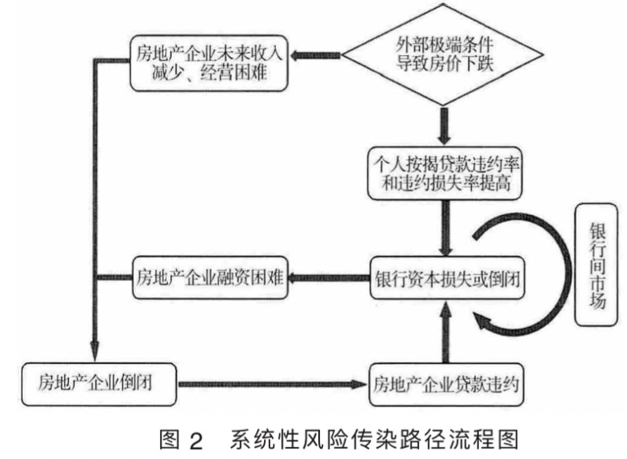

# 王辉, 李硕, 2015. 基于内部视角的中国房地产业与银行业系统性风险传染测度研究[J]. 国际金融研究, (09): 76–85.

[toc]

# 基于内部视角的中国房地产业与银行业系统性风险传染测度研究

# Metadata

* Type: [[Article]]
* Authors: [[ 王辉]], [[ 李硕]]
* Date: [[2015]]
* Date added: [[2020-05-26]]
* Publication: [[国际金融研究]]
* Cite key: WangHui_2015_JiYuNeiBuShiJiaoDeZhongGuoFangDiChanYeYuYinXingYeXiTongXingFengXianChuanRanCeDuYanJiu
* Topics: [[银行系统性风险 影响因素]], [[房地产市场]], [[系统性风险 测度]]
* Related: 
* Tags: [[Zotero Import]], [[银行间市场]], [[Interbank Market]], [[房地产信贷]], [[扩展的矩阵模型]], [[系统性风险传染]], [[Augmented Matrix Model]], [[Contagion of Systemic Risk]], [[Real Estate Credit]]
* PDF Attachments: [王辉_李硕_2015_基于内部视角的中国房地产业与银行业系统性风险传染测度研究.pdf](zotero://open-pdf/library/items/TKA4T9MC)

## Abstract

 银行业在维护整个金融系统稳定中处于举足轻重的地位,而基础信贷市场又是房地产行业与银行业紧密相连的重要渠道,因此本文将银行间同业市场与房地产行业的银行信贷市场作为一个系统建立了扩展的矩阵模型。本文采用2007-2014年银行和房地产业的公开财务数据,基于扩展的矩阵模型,对我国房地产行业与银行业系统性风险的传染性进行测度。研究结果表明,房地产行业与银行业组成的金融系统比单独的银行系统更加脆弱,风险传染速度明显加快;与房地产企业信贷相比,个人住房按揭贷款对银行业的影响更大;相对于清偿能力,银行更容易受到流动性不足的冲击。

# 综述

## 测度系统性风险传染性的方法  

### 结构化方法  

#### 矩阵模型

##### 特点  

根据银行同业拆借数据估计银行间双边风险敞口矩阵，从而确定一家或者几家银行倒闭引发其他银行倒闭的数量以及风险在系 统内的传染过程。  

##### 优缺点  

- 从银行的实际交易入手， 将传染过程与银行间市场交易的内在机理 紧密联系， 增强了对风险传染机制刻画的准确性；  

- 所需要的数据全部来自公开的财务报表， 数据相对容易获得；  

- 矩阵模型可以用来研究跨部门风险传染， 可以将银行系统与实体部门联 合起来考虑。  

#### 复杂网络模型  

##### 复杂网络模型将银行系统 抽象为一个复杂网络， 把系统内部机构看作节点， 不同机构之间的联系视为连接。  

##### 优缺点  

- 清晰描述系统性风险的传染机制；  
- 难以分析跨部门风险传染；  

### 简约化方法  

#### 特点  

主要基于市场数据估计金融机构之间的某种相关性， 然后根据相关性来评估风险的 传染性  

#### 包括  

##### GARCH

- 包括  
  - DCC-GARCH  
    - Engle （ 2002 ）  

##### CoVaR  

- Adrian & Brunnermeier （ 2011 ）  

##### Copula  

##### 或有权益分析模型CCA  

- Gray & Jobst （ 2009 ）  

- 起源  

  Gray & Jobst （ 2009 ）基于Copula方法发展提出的或有权益分析模型(CCA)  

- 用途  

  通过计算动态违约概率等指标度量系统性风险的高低。  

#### 优缺点  

忽视了风险传染渠道，对风险传染过程可划不清，依赖市场数据，限制了在金融市场尚不发达的国家的应用。  

# 模型  

基本矩阵模型  

# 研究问题  

- 我国快速发展的房地产行业是否导致银行系统更加脆弱？   
- 来自房地产行业的多大程度的冲击才能导 致风险在银行间传染？   
- 如果发生风险传染， 传染过程具有怎样的特征？  
- 2007-2014 年整个系统性风险的传染过程有何种变化？  

# 工作  

- 扩展 Sheldon & Maurer （ 1998 ） 提出的 矩阵模型， 通过信贷市场将单纯的银行系统与房地产行业联系起来；   
- 从内部视角研究房地产 行业与银行业组成的金融系统， 既考虑了风险在银行业内部的传染， 又兼顾了银行业与房地产行业 之间的相互作用；  
- 通过对比历年风险的传染性， 分析其时变规律。 

本文采用 2007-2014 年银行和房地 产业的公开财务数据， 基于扩展的矩阵模型，以信贷市场联系起银行系统与房地产产业，对我国房地产行业与银行业系统性风险的传染性进行测度。

传染路径流程图：

# 提到  

房地产行业和银行业之间存在顺周期效应， 即金融系统内部以及金融业与实体经济之间 相互作用会不断放大系统性风险；  

# 研究结论  

- 房地产行业与银行业组成的金融系统比单独的银行系统更加脆弱  

- 在所考察的历史时期，银行个体机构抵御来自房地产行业风险的能力不断增强，但是银行业与房地产行业组成的金融系统的稳定性在整个历史时期并没有增强  

- 与房地产企业相比，个人按揭贷款对银行的影响更大  

- 相对于清偿能力， 银行更容易受流动性冲击  

