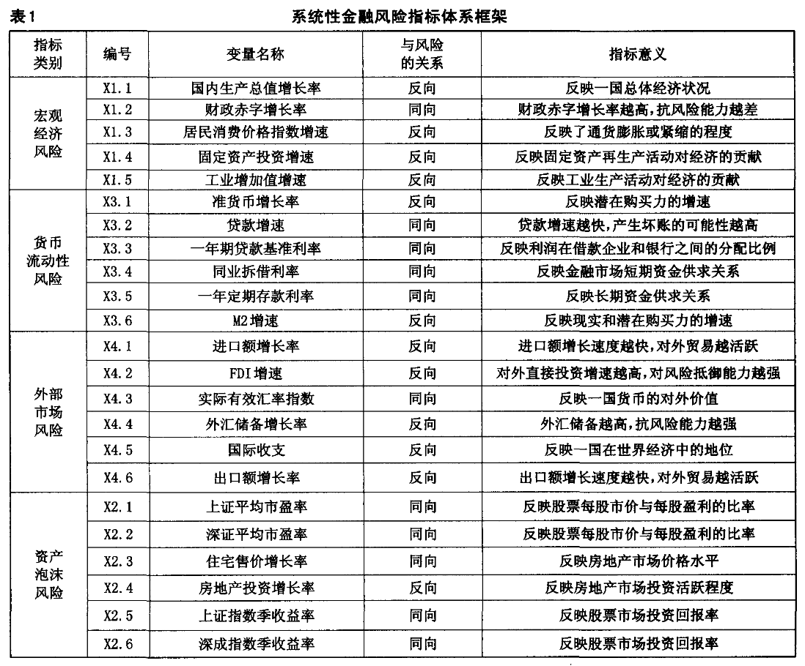

# 郭娜 et al\_2018\_我国系统性金融风险指数的度量与监测

[toc]

# 我国系统性金融风险指数的度量与监测

## Metadata

* Type: [[Article]]
* Authors: [[ 郭娜]], [[ 祁帆]], [[ 张宁]]
* Date: [[2018]]
* Date added: [[2020-06-09]]
* Publication: [[财经科学]]
* Cite key: GuoNuo_2018_WoGuoXiTongXingJinRongFengXianZhiShuDeDuLiangYuJianCe
* Topics: [[系统性风险 测度]], [[系统性风险 影响因素]], [[系统性风险 成因]]
* Related: 
* Tags: [[Zotero Import]], [[系统性金融风险]], [[度量与监测]], [[风险指数]]
* PDF Attachments: [郭娜 et al_2018_我国系统性金融风险指数的度量与监测.PDF](zotero://open-pdf/library/items/ED6V3AFC)

### Abstract

 国际金融危机以来,系统性金融风险的研究已经成为各国政府和学者关注的重要问题,系统性金融风险不仅会对一国的宏观经济稳定产生重要影响,更可能带来国家福利和社会财富的损失。党的十九大报告中明确提出,要健全金融监管体系,守住不发生系统性金融风险的底线。有鉴于此,本文从宏观层面选取了包含宏观经济、货币流动性、外部市场、资产泡沫四个层面的指标体系并运用主成分分析方法构建了分层面和我国宏观总体的系统性风险指数,以此来度量我国金融系统的总体风险水平,并给出了风险形成的原因。研究结果表明,2010年以来我国系统性金融风险一直呈现上升的趋势,目前已经达到较高水平。本文的研究结论对于监测和防范我国系统性金融风险,促进金融体系持续健康发展具有政策启示。

## 研究背景和意义

2016年9月国际清算银行(BIS)发布报告称中国私人非金融部门信贷/GDP缺口指标指数在第一季度升至 30.1%，是自追踪中国相关数据以来的最高值，意味着我国非金融企业的资产风险极大。而 2016 年我国企业债券违约规模为 496.94 亿元，大约是 2015 年的 4 倍，增加了系统性风险的发生概率。我国银行业在金融体系中占据主体地位。根据银监会的统计数据，从 2014 年到 2016 年我国银行业的不良贷款比率从 1.04%增加到 1.74%。截至 2017 年第三季度，我国商业银行不良贷款规模约为 1.67 万亿元，较上季末增加 346 亿元，不良贷款率为 1.74%。我国商业银行不良贷款余额、不良款率仍有“双升”压力，银行系统的风险在不断上升，并且银行业风险极容易传递到其他领域，从而引发系统性金融风险。我国虽然出台了一系列改革措施加强金融监管，防范和化解系统性金融风险，党的十九大报告和 2016 年 12 月中央经济工作会议也都强调要守住不发生系统性金融风险的底线，维护金融安全和稳定，但如何度量系统性金融风险目前还没有一致的结论。因此，如何建立一个宏观系统性金融风险的度量方法成为当前的重要问题。宏观审慎经济形势的发展和系统性金融风险的度量对于了解我国金融体系整体的风险程度及变化趋势有极大帮助，并且有助于金融机构找准金融风险发生点、提升风险管理能力、加强对系统性金融风险溢出的管理，促进金融机构持续健康发展。有鉴于此，本文从在充分借鉴国内外相关研究成果的基础上，同时考虑到我国经济金融系统的异质性选取了包含宏观经济、货币流动性、外部市场、资产泡沫四个层面的指标体系并运用主成分分析方法构建了分层面和我国宏观总体的系统性风险指数，以此来度量我国金融系统的总体风险水平并寻求应对风险的方法和策略，以其能够为维护我国的金融稳定提供依据。

## 基于金融风险指数的系统性金融风险测度

### 系统性金融风险指标选取

