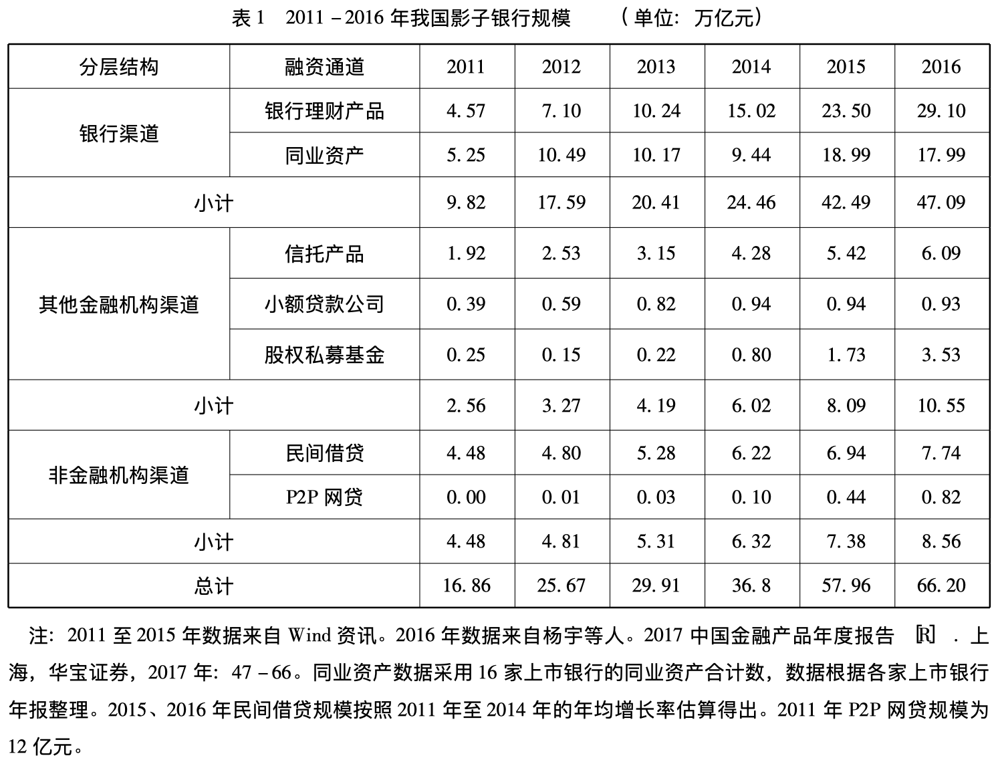
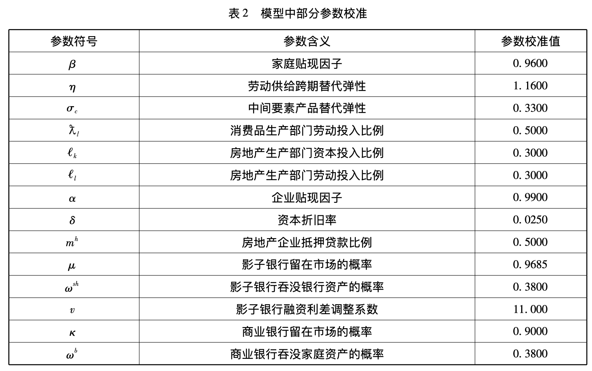
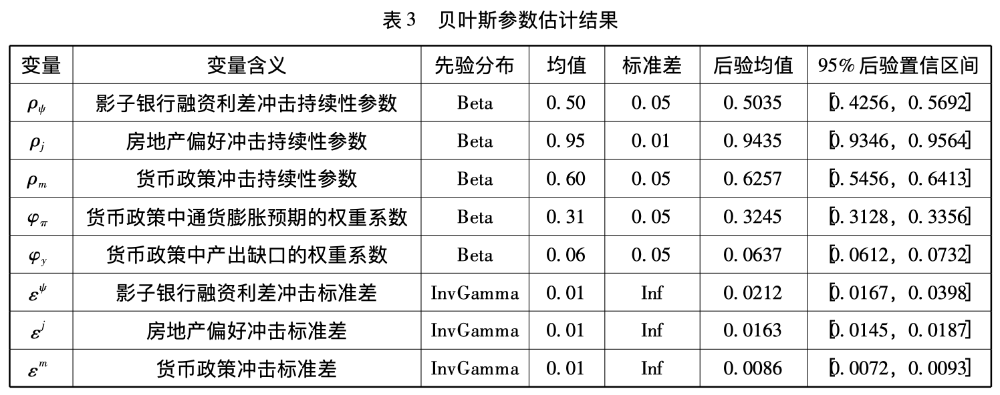

# 我国影子银行对银行业系统性风险影响研究——基于内生化房地产商的DSGE模型分析

![[GuoNuo2018a-zotero#Metadata]]

Other files:

* Mdnotes File Name: [[GuoNuo2018a]]
* Metadata File Name: [[GuoNuo2018a-zotero]]

##  Zotero links

* [Local library](zotero://select/items/1_QWTY557A)
* [Cloud library](http://zotero.org/users/6240833/items/QWTY557A)

## Notes

## 模型

> 重点在房地产商。

#### 生产部门

##### 房地产开发商

行为：
通过融资，从商业银行获得贷款和影子银行部门，采用资本、劳动、土地进行房地产开发建设。

生产函数：
$$
Y_{t}^{h}=A_{t}^{h} K_{t-1}^{h l_{k}} L_{t}^{h l_{l}} H_{t-1}^{1-l_{k}-l_{l}}
$$
其中, $Y_{t}^{h}$ 为房地产开发商的最终产出; $A_{t}^{h}$ 为技术水平; $K_{t-1}^{h}$ 和 $H_{t-1}$ 代表上一期的资本和房地产存量, $l_{k} 、 l_{l}$ 分别代表资本和家庭劳动的投入比例。

生产函数符合规模报酬不变的特性。

目标：

最大化其消费
$$
\max E_{t} \sum_{t=0}^{\infty} \alpha_{t} \ln C_{t}^{h}
$$
其中, $C_{t}^{h}$ 为房地产开发商的消费; $\alpha$ 为贴现因子, $0<\alpha<1$ 。

TODO 为什么房地产商最大化其消费而不是最大化其产出或者利润？
>  为什么房地产商最大化其消费而不是最大化其产出或者利润？

约束条件：

房地产开发企业所受现金流的约束条件如下:
$$
Y_{t}^{h}+B_{t}^{h}+S H_{t}=C_{t}^{h}+q_{t}\left(H_{t}-H_{t-1}\right)+W_{t}^{h} L_{t}^{h}+\frac{R_{t-1}^{b} B_{t-1}^{h}}{\pi_{t}}+\frac{R_{t-1}^{s h} S H_{t-1}}{\pi_{t}}+I_{t}^{h}
$$

其中, $B_{t}^{h}$ 为房地产开发商从商业银行获取的贷款; $R_{t}^{b}$ 为商业银行贷款利率; $S H_{t}$ 为房地产开发商向影子银行融资的数量; $R_{t}^{s h}$ 为影子银行提供融资的利率; $I_{t}^{h}$ 为房地产开发商的投资，房地产开发企业总体信贷规模为 $B_{t}=S H_{t}+B_{t}^{h}$。
房地产开发商的投资 $I_{t}^{h}$ 与资本存量 $K_{t}^{h}$ 之间存在如下关系:
$$
K_{t+1}^{h}=I_{t}^{h}+(1-\delta) K_{t}^{h}
$$

该式表示的是房地产开发商资本存量的积累情况, $\delta$ 表示资本折旧率。

> 本文借鉴
>
> [[Christensen I, Dib A, 2008. The Financial Accelerator in an Estimated New Keynesian Model[J]. Review of Economic Dynamics, 11(1): 155–178. DOI:[10.1016/j.red.2007.04.006](https://doi.org/10.1016/j.red.2007.04.006).]]
>
> [[Iacoviello M, 2005. House Prices, Borrowing Constraints, and Monetary Policy in the Business Cycle[J]. American Economic Review, 95(3): 739–764. DOI:[10.1257/0002828054201477](https://doi.org/10.1257/0002828054201477).]]
>
> 的研究，引入信贷约束机制。

引入信贷约束机制，在这一机制下，房地产开发商将其持有的房地产抵押给商业银行获得抵押贷款，但是其所获得的抵押贷款的数量取决于其还款期抵押品的预期价值。假设 $m^{h}$ 为房地产开发商信贷约束比例，需满足:

$$
B_{t}^{h} \leqslant m^{h} \frac{E_{t}\left(q_{t+1} H_{t} \pi_{t+1}\right)}{R^{b}}
$$

> 推导过程：
>
> 这里的$B^h_{t}$表示实际货币计量贷款额。$B_{t}^{h} \; P_t$表示名义货币计量的贷款额。$q_t=Q_t/P_t$表示实际房屋价格，$\pi_{t+1}=P_{t+1}/P_{t}$表示通货膨胀率：
> $$
> B_{t}^{h} \leqslant m^{h} \frac{E_{t}\left(q_{t+1} H_{t} \pi_{t+1}\right)}{R^{b}_t}
> $$
>
> $$
> B_{t}^{h} \; P_t \leqslant m^{h} E_{t} \left(\frac{q_{t+1} H_{t} P_{t+1} }{R^{b}_t}\right)
> $$
>
>
> $$
> B_{t}^{h} \; P_t \leqslant m^{h} E_{t} \left(\frac{Q_{t+1} H_{t} }{R^{b}_t}\right)
> $$
> 
> 

#### 影子银行

行为：

- 获得资金从商业银行提供；
- 在本期，自身留存收益积累至下一期；
- 其存在状态是暂时的。完成资金周期之后便可退出市场；

最优化目标：期望净资产最大化，当退出市场时：
$$
V_{t}^{s h}=\max E_{t} \sum_{i=0}^{\infty}(1-\mu) \mu^{i} \beta^{i+1} \Lambda_{t, t+1+i}\left[\left(R_{t+i}^{s h}-R_{t+i}^{t r}\right) S H_{t+i}+R_{t+i}^{t r} N_{t+i}^{s h}\right]
$$

其中, $\mu$ 表示影子银行留在市场的概率， $\Lambda_{t, t+1}=\frac{\lambda_{t+1}}{\lambda_{t}}$ 是定义在最优消费路径上的贴现因子。

其中：

影子银行资产负债情况：
$$
S H_{t}=N_{t}^{s h}+T R_{t}
$$
其中，影子银行净资产 $N_{t}^{s h}$ ；另一部分为商业银行提供的资金转移 $T R_{t}$；

这里，影子银行净资产积累方程：
$$
N_{t+1}^{s h}=R_{t}^{s h} S H_{t}-R_{t}^{t r} T R_{t}=\left(R_{t}^{s h}-R_{t}^{t r}\right) S H_{t}+R_{t}^{t r} N_{t}^{s h}
$$

其中，上标$\Box^{sh}$表示影子银行，上标$\Box^{tr}$表示商业银行提供的资金转移，主要以商业银行发行的理财产品；

将最优化目标改写成动态规划形式：
$$
V_{t}^{s h}=\nu_{t} S H_{t}+\theta_{t} N_{t}^{s h}
$$
其中, $\nu_{t}$ 代表影子银行增加 1 单位资产得到的边际收益， $\theta_{t}$ 代表影子银行增加 1 单位净资产
得到的边际收益，二者定义为
$$
\begin{array}{l}
\nu_{t}=E_{t}\left[(1-\mu) \beta \Lambda_{t, t+1}\left(R_{t+1}^{s h}-R_{t+1}^{t r}\right)+\beta \Lambda_{t, t+1} \mu x_{t, t+1} \nu_{t+1}\right] \\
\theta_{t}=E_{t}\left[(1-\mu)+\beta \Lambda_{t, t+1} \mu z_{t, t+1} \theta_{t+1}\right]
\end{array}
$$

#### 商业银行

商业银行向影子银行转移资产的动力：
$$
\psi_{t}^{\prime}=v\left[E\left(\log R_{t+1}^{s h}-\log R_{t+1}^{t r}\right)-\left(\log \bar{R}^{s h}-\log \bar{R}^{t r}\right)\right]+\psi_{t}
$$
其中, $\psi_{t}$ 为影子银行融资利差参数; $v$ 为影子银行融资利差调整系数; $\psi_{t}$ 为影子银行融资利差
冲击，服从 $A R(1)$ 过程: $\ln \psi_{t}=\rho_{\psi} \ln \psi_{t-1}+\varepsilon_{t}^{\psi}, \varepsilon_{t}^{\psi} \sim N\left(0, \sigma_{\psi}^{2}\right)$ 。

商业银行资产负债：
$$
B_{t}^{h}+T R_{t}=N_{t}^{b}+O_{t}=N_{t}^{b}+\left(1-R_{t}^{d}\right) D_{t}+S_{t}
$$
其中, $O_{t}$ 为外部借款, $N_{t}^{b}$ 为商业银行净资产,$R_{t}^{d}$ 为中央银行设定的存款准备金率，用以调整商业银行信贷规模；

#### 参数校准

